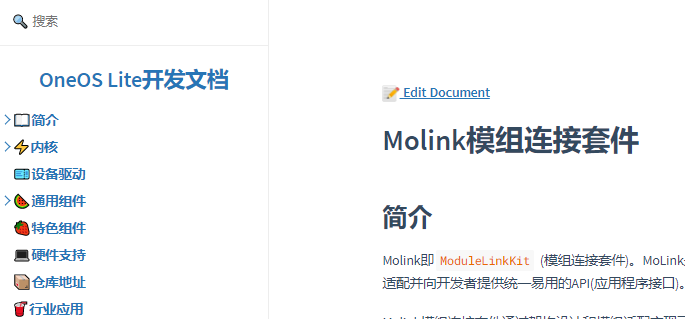
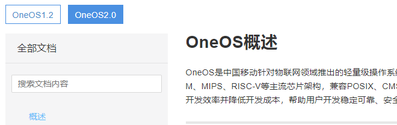
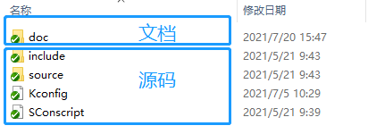
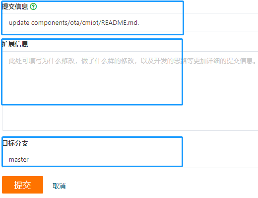

# OneOS Lite概述

## 简介

`OneOS Lite`是`OneOS2.0`的`lite`版本，针对`OneOS2.0`进行了裁剪，专用于资源受限的MCU。

**内核部分**：支持`OneOS2.0`的全部功能，针对配置进行了更小粒度的`menuconfig`配置。

**驱动部分**：支持`OneOS2.0`的全部驱动，但只提供了部分驱动的`menuconfig`配置，后续随着开发的持续进展，会不断开放。已支持的驱动列表有：`uart`、`gpio`、`onchip_flash`、`adc`、`timer`、`lpm`。

**组件部分**：针对资源受限的MCU，不提供需要丰富资源的组件。已提供的组件有：

1. `SHELL`工具
2. `Molink`模组连接套件
3. `Socket`套件
4. `ATest`测试框架
5. `DLOG` 日志系统
6. `FOTA`远程升级套件
7. `C++`支持

**行业应用**：目前主要关注于可穿戴和表计行业。

**`OneOS Lite`版本**处于迭代中，欢迎开发者提出宝贵意见，也希望点击右上角，一键三连(`fork`、`star`、`follow`)。


## 文档在线浏览

访问`OneOS Lite`网站：[文件 · comp-m · 赵娟 / OneOS-M2.0 · GitLab](http://10.12.3.86/zhaojuan/oneos-2.0/-/tree/comp-m)



访问`OneOS`官方网站：[OneOS - 中国移动物联网操作系统 (10086.cn)](https://os.iot.10086.cn/)



## 文档本地浏览

该文档和代码放在同一个仓库，开发者在下载代码的同时，已一并下载文档。我们认为，结合文档查阅代码，是更高效的开发方式。相关源码目录均放有和代码相关的文档说明。



开发者可以使用我们提供的`OneOS-Cube`工具，启动一个本地服务器，可以方便地实时预览效果。在代码根目录输入如下命令：

```bash
python -m http.server 3000
```

结果如下：

```bash
PS D:\xiaoneng\oneos-2.0> python -m http.server 3000
Serving HTTP on :: port 3000 (http://[::]:3000/) ...
::1 - - [21/Jul/2021 14:45:24] "GET / HTTP/1.1" 200 -
```

则可以访问地址：[http://localhost:3000](http://localhost:3000/) ，阅读文档。

如果你的电脑有安装`python3`，可以进入该仓库，在命令行中执行命令:

```bash
python -m http.server 3000
```

如果你的电脑有安装`npm`,可以通过运行 `docsify serve` 启动一个本地服务器。默认访问地址 [http://localhost:3000](http://localhost:3000/) 。

```bash
docsify serve oneos-2.0
```

在此之前，需要使用`npm`或者`yarn`安装`docsify-cli`。

```bash
npm i docsify-cli -g
# yarn global add docsify-cli
```


## 文档编辑

该文档和代码均开源部署到gitee仓库，若发现文档错误，可至文档左上角，点击`Edit Document`，进行编辑并提交`merge`。


点击`Edit Document`后，会进入到gitee编辑页面，点击`编辑`。


**提交信息**处注明：文档修改点，如文档错误/增加/删除/更新：×××。若有更多的修改思路，可添加至**扩展信息**。最后，选中提交的**目标分支**，点击**提交**，即可。



##  Release Note

### 2021-09-02

1. 从内核+驱动+组件出发，完成第一阶段的裁剪与布局，完成第一阶段的提测和回归测试
2. 基本完成文档工作，支持在线浏览和本地网页浏览，支持快速提交文档修改merge
3. molink支持多模组与单模组配置，功能高度可裁剪，按需求做到最小化配置
4. C++支持
5. 新增git子模块管理作为开源组件的管理方式