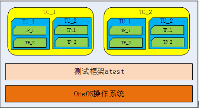

# 测试框架

---

## 简介

atest（and test）是OneOS 开发的单元测试框架。设计 atest 的初衷是方便 OneOS 开发者使用统一的框架接口编写测试程序，实现单元测试、覆盖测试以及集成测试的目的。atest的应用框图如下：



### 测试用例

测试用例（testcase，简称TC）是为实现特定测试目标而执行的单个测试，是包括测试输入、执行条件、测试过程和预期结果的规范，是一个有明确的结束条件和明确的测试结果的有限循环。atest测试框架定义用户编写的测试程序为测试用例，一个测试用例仅包含一个 testcase 函数，可包含多个测试单元函数或多个测试点。具体来说，通过 atest 测试框架提供的 API接口完成的针对某一功能的测试代码就是一个测试用例。

### 测试单元

测试单元（test unit，简称TU）是测试用例所测功能的子功能，每个测试单元可以是被测功能的最小可测功能单位。当然，不同的分类方式会细分出不同的测试单元。

### 测试点

测试点（test point，简称TP）是用tp\_assert\_xxxxx\(…\)宏验证测试结果的一个关注点，可以用在测试单元（TU）里，也可以用在测试用例（TC）里。

---

## 重要定义及数据结构

### 测试用例优先级枚举

```c
enum atest_tc_priority
{
    TC_PRIORITY_HIGH    = 0,        /* High priority testcase. */
    TC_PRIORITY_MIDDLE,             /* Middle priority testcase. */
    TC_PRIORITY_LOW,                /* Low priority testcase. */
    TC_PRIORITY_CNT_MAX
};
```

| **测试用例优先级枚举** | **说明** |
| :--- | :--- |
| TC\_PRIORITY\_HIGH | 高优先级 |
| TC\_PRIORITY\_MIDDLE | 中优先级 |
| TC\_PRIORITY\_LOW | 低优先级 |
| TC\_PRIORITY\_CNT_MAX | 优先级默认值，程序制定非前面三个优先级时修改为优先级等级为此值 |

### 测试单元对象结构体

```c
struct atest_tc_entry
{
    const char               *name;             /* Testcase name. */
    os_err_t                (*init)(void);      /* Initialization before executing the testcase function. */
    void                    (*tc)(void);        /* Execute the testcase function. */
    os_err_t                (*cleanup)(void);   /* Cleanup after executing the testcase function.  */
    enum atest_tc_priority    priority;         /* The priority of testcase */
};
typedef struct atest_tc_entry atest_tc_entry_t;
```

| **测试单元对象成员变量** | **说明** |
| :--- | :--- |
| name | 测试用例名称 |
| init | 测试用例执行前初始化函数 |
| tc   | 测试用例执行函数 |
| cleanup | 测试用例执行后回收资源函数 |
| priority | 测试用例优先级,用于过滤作用 |

## 测试框架API

### 测试用例导出宏

该宏用于将测试用例导出到测试框架，便于用户在shell命令行中运行测试用例，该宏的参数如下：

```c
ATEST_TC_EXPORT(name, testcase, init, cleanup, priority)
```

| **参数** | **说明** |
| :--- | :--- |
| name | 测试用例名称（唯一），在执行测试用例时使用 |
| testcase | 测试用例主承载函数 |
| init | 测试用例启动前的初始化函数 |
| cleanup | 测试用例结束后的清理函数 |
| priority | 测试用例的优先级，可使用以下参数：TC\_PRIORITY\_HIGH、TC\_PRIORITY\_MIDDLE、TC\_PRIORITY\_LOW |

### 测试单元运行宏

该宏用于运行指定的测试单元函数，如果该测试单元运行失败，则整个测试退出，该宏的参数如下：

```c
ATEST_UNIT_RUN(test_unit_func)
```

| **参数** | **说明** |
| :--- | :--- |
| test\_unit\_func | 测试单元函数指针，测试单元函数类型定义为：typedef void \(\*atest\_unit\_func\_t\)\(void\) |

### 测试代码中的测试判断宏

以下宏定义用于测试代码中，用于具体判断是否与预期符合（如果不一致会以 LOG\_E 打印出错的文件名、函数、行号、出错消息；如果一致，会以 LOG\_I 打印函数、行号）测试框架会记录下成功和失败的数量。

| **宏定义** | **说明** |
| :--- | :--- |
| tp\_assert\_true\(value\) | value 为 true 则测试通过，否则测试失败 |
| tp\_assert\_false\(value\) | value 为 false 则测试通过，否则测试失败 |
| tp\_assert\_null\(value\) | value 为 null 则测试通过，否则测试失败 |
| tp\_assert\_not\_null\(value\) | value 为非 null 则测试通过，否则测试失败 |
| tp\_assert\_integer\_equal\(a, b\) | a 和 b 值相等则测试通过，否则测试失败 |
| tp\_assert\_integer\_not\_equal\(a, b\) | a 和 b 值不相等则测试通过，否则测试失败 |
| tp\_assert\_str\_equal\(a, b\) | 字符串 a 和字符串 b 相同则测试通过，否则测试失败 |
| tp\_assert\_str\_not\_equal\(a, b\) | 字符串 a 和字符串 b 不相同则测试通过，否则测试失败 |
| tp\_assert\_buf\_equal\(a, b, size\) | 缓存 a 和缓存 b 相同则测试通过，否则测试失败 |
| tp\_assert\_buf\_not\_equal\(a, b, size\) | 缓存 a 和缓存 b 不相同则测试通过，否则测试失败 |
| tp\_assert\_in\_range\(value, min, max\) | value 在 min 和 max 的范围内则测试通过，否则测试失败 |
| tp\_assert\_not\_in\_range\(value, min, max\) | value 不在 min 和 max 的范围内则测试通过，否则测试失败 |

---

## 运行测试用例

在shell命令行窗口中输入help，可以看到以下两个跟atest相关的命令

### atest\_list命令

该命令用于查看当前支持的所有测试用例

```c
atest_list       - Display all atest testcases
```

### atest\_run命令

该命令用于执行测试用例，有一些参数可以设置

```c
atest_run [-n testacse name] [-l loop count] [-p priority level] [-t] [-s] [-h]
```

| **参数** | **说明** |
| :--- | :--- |
| -n | 用于指定要测试的测试用例名字，只要测试用例名字中全部字符串或者前面部分字符串与所指定的名字相同，这些用例就都会被执行。当不用-n选项指定测试用例名字时，默认执行全部测试用例。 |
| -l | 指定测试用例循环执行次数。当不用-l选项指定测试用例执行次数时，默认执行1次。 |
| -p | 用于指定所执行用例的优先级，只有待执行测试用例的优先级高于或等于所指定的优先级时，测试用例才会被执行，可用参数如下：H：指定高优先级；M：指定中优先级；L：指定低优先级。 |
| -t | 用于指定创建一个新的任务来执行测试用例，该选项没有参数。当不使用-t选项时，默认在SHELL任务上下文执行测试用例。 |
| -s | 当使用此选项时，只要有一个测试用例执行失败，后面的测试用例就停止执行，该选项没有参数。当不使用-s参数时，不管执行用例的过程中是否有失败的用例，后面的用例都会正常执行。 |
| -h | 打印atest\_run命令的帮助信息，该选项没有参数。当指定这个选项时，忽略其它选项，只打印帮助信息。 |

---

## 配置选项

   OneOS在使用atest时提供了一些功能选项和裁剪的配置，具体配置如下所示:

```
(Top) → Components→ Atest
                                              OneOS Configuration
[*] Enable atest
(4096)  The atest task stack size
(20)    The atest task priority 
```

| **配置项** | **说明** |
| :--- | :--- |
| Enable atest| OneOS使能atest功能 |
| The atest task stack size | atest内置任务栈大小 |
| The atest task priority | atest内置任务优先级 |

---

## 使用示例

### 测试框架一般用法

本例演示了测试框架的一般使用方法

```c
#include <oneos_config.h>
#include <dlog.h>
#include <os_errno.h>
#include <shell.h>
#include <string.h>
#include <atest.h>

#define TEST_TAG        "TEST"

static void test_1(void)
{
    os_uint32_t value = 0;

    tp_assert_false(value);
}

static void test_2(void)
{
    char *str1 = "it's a new pen";
    char *str2 = "it's a old pen";

    tp_assert_str_equal(str1, str2);
}

static void test_3(void)
{
    os_uint32_t value = 1;

    tp_assert_true(value);
}

static void test_sample1(void)
{
    ATEST_UNIT_RUN(test_1);
    ATEST_UNIT_RUN(test_2);
}

static void test_sample2(void)
{
    ATEST_UNIT_RUN(test_3);
}

static os_err_t test_init(void)
{    
    return OS_EOK;
}

static os_err_t test_cleanup(void)
{    
    return OS_EOK;
}

ATEST_TC_EXPORT(atest_sample1, test_sample1, test_init, test_cleanup, TC_PRIORITY_MIDDLE);
ATEST_TC_EXPORT(atest_sample2, test_sample2, test_init, test_cleanup, TC_PRIORITY_HIGH);
```

运行查看测试用例命令和运行帮助命令，运行结果如下：

```c
sh>atest_list

Testcase name                                                 Priority  
---------------------------------                             --------
atest_sample1                                                  Middle
atest_sample2                                                  High

sh>atest_run -h

Command: atest_run
   Info: Execute testcases.
 Format: atest_run [-n testacse name] [-l loop count] [-p priority level] [-t] [-s] [-h]

  Usage:
         -n     Specify a testcase name.
                If don't specify this option, run all testcases.

         -l     Specify a loop count that the testcase runs.
                If don't specify this option, the testcase only run one times.

         -p     Specify a priority level. Only testcases greater or equal than this level can be run.
                H  -- High priority level.
                M  -- Middle priority level.
                L  -- Low priority level.
                If don't specify this option, low priority level is be used by default.

         -t     Create a new task to execute the testcase(s).
                If don't specify this option, execute the testcase(s) in shell task.

         -s     If specify this option, as long as a testcase fails, the subsequent testcases are no
                longer running.
                If don't specify this option, when a testcase fails, the subsequent testcases still run.

         -h     Print help information of atest_run command.
                If specify this option, other options are ignored.
```

运行所有测试用例，测试成功提示"PASSED"，测试错误会提示错误信息，最后给出所有测试结果,运行结果如下：

```c
sh>atest_run

-----------------------------------Loop: 1-------------------------------------

I/ATEST: [   TC   ] [ ====== ] Testcase (atest_sample1) begin to run.

I/ATEST: [   TU   ] [ ====== ] Unit name (test_1).
I/ATEST: [   TP   ] [ PASSED ] File: (atest_test.c); func: (test_1:41).
I/ATEST: [   TU   ] [ PASSED ] Unit name (test_1), tp passed (1), tp failed (0).

I/ATEST: [   TU   ] [ ====== ] Unit name (test_2).
E/ATEST: [   TP   ] [ ASSERT ] File: (atest_test.c); func: (test_2:49); msg: (string not equal)
E/ATEST: [   TU   ] [ FAILED ] Unit name (test_2), tp passed (0), tp failed (1).

E/ATEST: [   TC   ] [ FAILED ] Testcase (atest_sample1), tp passed (1), tp failed (1)

-----------------------------------Loop: 1-------------------------------------

I/ATEST: [   TC   ] [ ====== ] Testcase (atest_sample2) begin to run.

I/ATEST: [   TU   ] [ ====== ] Unit name (test_3).
I/ATEST: [   TP   ] [ PASSED ] File: (atest_test.c); func: (test_3:56).
I/ATEST: [   TU   ] [ PASSED ] Unit name (test_3), tp passed (1), tp failed (0).

I/ATEST: [   TC   ] [ PASSED ] Testcase (atest_sample2), tp passed (1), tp failed (0)

-----------------------------------Loop: 1-------------------------------------


I/ATEST: [ ATEST  ] [ ====== ] Finished.

  type        total      passed      failed      pass rate 
----------    -----      ------      ------      ---------
test case        2           1           1          50% 
test unit        3           2           1          66% 
test point       3           2           1          66% 
```

通过不完全的测试用例名称运行测试用例，示例中指定测试用例名称为"atest_samp",模糊查询到所有包含"atest_samp"的用例并运行,运行结果如下：

```c
sh>atest_run -n atest_samp

-----------------------------------Loop: 1-------------------------------------

I/ATEST: [   TC   ] [ ====== ] Testcase (atest_sample1) begin to run.

I/ATEST: [   TU   ] [ ====== ] Unit name (test_1).
I/ATEST: [   TP   ] [ PASSED ] File: (atest_test.c); func: (test_1:41).
I/ATEST: [   TU   ] [ PASSED ] Unit name (test_1), tp passed (1), tp failed (0).

I/ATEST: [   TU   ] [ ====== ] Unit name (test_2).
E/ATEST: [   TP   ] [ ASSERT ] File: (atest_test.c); func: (test_2:49); msg: (string not equal)
E/ATEST: [   TU   ] [ FAILED ] Unit name (test_2), tp passed (0), tp failed (1).

E/ATEST: [   TC   ] [ FAILED ] Testcase (atest_sample1), tp passed (1), tp failed (1)

-----------------------------------Loop: 1-------------------------------------

I/ATEST: [   TC   ] [ ====== ] Testcase (atest_sample2) begin to run.

I/ATEST: [   TU   ] [ ====== ] Unit name (test_3).
I/ATEST: [   TP   ] [ PASSED ] File: (atest_test.c); func: (test_3:56).
I/ATEST: [   TU   ] [ PASSED ] Unit name (test_3), tp passed (1), tp failed (0).

I/ATEST: [   TC   ] [ PASSED ] Testcase (atest_sample2), tp passed (1), tp failed (0)

-----------------------------------Loop: 1-------------------------------------


I/ATEST: [ ATEST  ] [ ====== ] Finished.

  type        total      passed      failed      pass rate 
----------    -----      ------      ------      ---------
test case        2           1           1          50% 
test unit        3           2           1          66% 
test point       3           2           1          66% 
```

通过优先级过滤用例，示例中指定高于最高优先级用例运行,运行结果如下：

```c
sh>atest_run -p H

-----------------------------------Loop: 1-------------------------------------

I/ATEST: [   TC   ] [ ====== ] Testcase (atest_sample2) begin to run.

I/ATEST: [   TU   ] [ ====== ] Unit name (test_3).
I/ATEST: [   TP   ] [ PASSED ] File: (atest_test.c); func: (test_3:56).
I/ATEST: [   TU   ] [ PASSED ] Unit name (test_3), tp passed (1), tp failed (0).

I/ATEST: [   TC   ] [ PASSED ] Testcase (atest_sample2), tp passed (1), tp failed (0)

-----------------------------------Loop: 1-------------------------------------


I/ATEST: [ ATEST  ] [ ====== ] Finished.

  type        total      passed      failed      pass rate 
----------    -----      ------      ------      ---------
test case        1           1           0          100% 
test unit        1           1           0          100% 
test point       1           1           0          100% 

```

### 多测试点使用方法

本例演示了一个覆盖测试点用法较全的示例

```c
#include <oneos_config.h>
#include <dlog.h>
#include <os_errno.h>
#include <shell.h>
#include <string.h>
#include <atest.h>

#define TEST_TAG        "TEST"

static void test_1(void)
{
    os_uint32_t value = 0;
    char *ptr = OS_NULL;

    tp_assert_false(value);
    value = 1;
    tp_assert_true(value);
    value = 100;
    tp_assert_true(value);

    tp_assert_null(ptr);
    ptr = (char *)&value;
    tp_assert_not_null(ptr);
}

static void test_2(void)
{
    os_uint32_t value1 = 0;
    os_uint32_t value2 = 0;
    char *str1 = "it's a new day";
    char *str2 = "it's a new day";
    const os_uint8_t buf1[8];
    const os_uint8_t buf2[8];

    tp_assert_integer_equal(value1, value2);
    value2 = 2;
    tp_assert_integer_not_equal(value1, value2);

    tp_assert_str_equal(str1, str2);
    str2 = "it's a nice day";
    tp_assert_str_not_equal(str1, str2);

    memset((void *)buf1, 0, sizeof(buf1));
    memset((void *)buf2, 0, sizeof(buf2));
    tp_assert_buf_equal(buf1, buf2, sizeof(buf1));
    memset((void *)buf2, 6, sizeof(buf2));
    tp_assert_buf_not_equal(buf1, buf2, sizeof(buf1));
}

static void test_3(void)
{
    os_uint32_t value = 0;

    tp_assert_not_in_range(value, 1, 100);
    value = 10;
    tp_assert_in_range(value, 1, 100);
}

static void test_sample(void)
{
    ATEST_UNIT_RUN(test_1);
    ATEST_UNIT_RUN(test_2);
    ATEST_UNIT_RUN(test_3);
}


static os_err_t test_init(void)
{    
    LOG_I(TEST_TAG, "test_init");
    return OS_EOK;
}

static os_err_t test_cleanup(void)
{    
    LOG_I(TEST_TAG, "test_cleanup");
    return OS_EOK;
}

ATEST_TC_EXPORT(atest_sample, test_sample, test_init, test_cleanup, TC_PRIORITY_LOW);

#endif
```

运行结果如下：

```c
sh>atest_list

Testcase name                                                 Priority  
---------------------------------                             --------
atest_sample                                                   Low

sh>atest_run

-----------------------------------Loop: 1-------------------------------------

I/ATEST: [   TC   ] [ ====== ] Testcase (atest_sample) begin to run.

I/TEST: test_init
I/ATEST: [   TU   ] [ ====== ] Unit name (test_1).
I/ATEST: [   TP   ] [ PASSED ] File: (atest_test.c); func: (test_1:100).
I/ATEST: [   TP   ] [ PASSED ] File: (atest_test.c); func: (test_1:102).
I/ATEST: [   TP   ] [ PASSED ] File: (atest_test.c); func: (test_1:104).
I/ATEST: [   TP   ] [ PASSED ] File: (atest_test.c); func: (test_1:106).
I/ATEST: [   TP   ] [ PASSED ] File: (atest_test.c); func: (test_1:108).
I/ATEST: [   TU   ] [ PASSED ] Unit name (test_1), tp passed (5), tp failed (0).

I/ATEST: [   TU   ] [ ====== ] Unit name (test_2).
I/ATEST: [   TP   ] [ PASSED ] File: (atest_test.c); func: (test_2:120).
I/ATEST: [   TP   ] [ PASSED ] File: (atest_test.c); func: (test_2:122).
I/ATEST: [   TP   ] [ PASSED ] File: (atest_test.c); func: (test_2:124).
I/ATEST: [   TP   ] [ PASSED ] File: (atest_test.c); func: (test_2:126).
I/ATEST: [   TP   ] [ PASSED ] File: (atest_test.c); func: (test_2:130).
I/ATEST: [   TP   ] [ PASSED ] File: (atest_test.c); func: (test_2:132).
I/ATEST: [   TU   ] [ PASSED ] Unit name (test_2), tp passed (6), tp failed (0).

I/ATEST: [   TU   ] [ ====== ] Unit name (test_3).
I/ATEST: [   TP   ] [ PASSED ] File: (atest_test.c); func: (test_3:139).
I/ATEST: [   TP   ] [ PASSED ] File: (atest_test.c); func: (test_3:141).
I/ATEST: [   TU   ] [ PASSED ] Unit name (test_3), tp passed (2), tp failed (0).

I/ATEST: [   TC   ] [ PASSED ] Testcase (atest_sample), tp passed (13), tp failed (0)
I/TEST: test_cleanup

-----------------------------------Loop: 1-------------------------------------


I/ATEST: [ ATEST  ] [ ====== ] Finished.

  type        total      passed      failed      pass rate 
----------    -----      ------      ------      ---------
test case        1           1           0          100% 
test unit        3           3           0          100% 
test point      13          13           0          100% 
```
