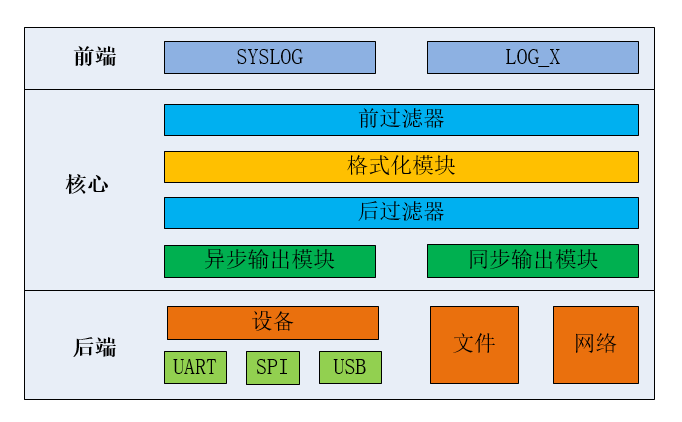

# DLOG 日志系统

---

## 简介

日志(log)是对发生某个事件的记录，并进行显示或者保存到文件。

DLOG 日志系统主要有以下特性:

- 默认支持输出到串口终端，支持添加后端实现多路日志，可支持串口、网络、文件、闪存等后端形式。
- 输出被设计为任务线程安全的方式，并支持异步输出模式。
- 支持在中断等复杂上下文环境下使用。
- 支持浮点数格式。
- 支持 4 个等级，优先级由高到低 DLOG_ERROR DLOG_WARNING DLOG_INFO DLOG_DEBUG。
- 支持按等级进行全局过滤，高于配置等级的将输出日志。
- 支持标签方式过滤，添加标签过滤器后，高于标签过滤器等级的标签相关日志将输出。使用了标签过滤器，全局过滤将不再对此标签起作用，直到删除标签过滤器。
- 支持全局标签过滤，设置了全局标签后，只有此标签的日志输出，直到删除全局标签。
- 支持全局关键字过滤，设置了全局关键字后，只有含关键字的日志输出，直到删除全局关键字。
- 支持全部编译和部分编译两种使用方式，在部分编译方式下，可以有效降低产品版本发布时对 ROM 空间的占用。
- 输出格式可进行配置，配置项包含时间、任务、函数名称，文件行号，颜色等。
- 配置支持 shell 操作，简单易用。

DLOG 日志系统整体框架如下：



#### dlog 前端

(1) dlog 前端兼容 linux syslog 接口（需包含 syslog.h 头文件），接口形式如下：
void syslog(int priority, const char \*format, ...)
注：若想兼容 linux syslog 接口，需要同时打开 dlog 的编译宏 OS_USING_DLOG 和 syslog 的编译宏 DLOG_USING_SYSLOG，否则不支持。

(2)除了兼容 linux syslog 接口，dlog 前端使用 LOG_X 接口形式实现前端输出。

#### dlog 核心

(1) 前过滤器包括标签过滤、全局过滤和全局标签过滤，当标签级别过滤器中存在本条日志的标签时，则按照此标签对应的输出级别进行日志输出控制；若不存在，则按照全局的输出级别进行输出控制，标签级别过滤优先于全局级别过滤。当日志级别过滤完成后，进行全局标签过滤，即：若设置了全局过滤标签，则只打印包含此标签的日志。

(2) 格式化模块可以控制哪些日志信息是否输出，可以控制是否支持浮点数打印、是否支持颜色输出、是否支持时间输出以及何种类型的时间、是否输出日志级别信息、是否输出标签信息、是否输出任务线程的名称。

(3) 后过滤器包含全局关键字过滤，即：若设置了全局过滤关键字，则只打印包含此关键字的日志。

(4)dlog 支持异步输出和同步输出。在异步输出模式下，会把日志先存到缓冲区中，待系统空闲时，调用专门的任务线程输出日志到后端；在同步输出模式下，不切换任务（或中断）上下文，直接把日志输出到后端。另外，不管在异步输出模式还是在同步输出模式，都支持在中断上下文打印（需要使能 DLOG_USING_ISR_LOG 编译开关）。

#### dlog 后端

dlog 可以同时支持形式多样的日志后端，如串口、文件、网络。dlog 提供了统一接口对日志后端进行管理。

目前，dlog 组件已经支持日志后端的文件系统记录功能，以文件的形式将日志信息记录在文件系统中，需要使能 DLOG_BACKEND_USING_FILESYSTEM 编译开关，添加 dlog 日志后端文件系统记录日志功能。用户也可以通过 dlog_backend_register 函数注册自己的后端。

---

## 重要定义及数据结构

### dlog后端对象结构体

```c
struct dlog_backend
{
    os_list_node_t  list_node;

    char            name[OS_NAME_MAX + 1];                      /* Name of log backend. */

    os_bool_t       support_color;                              /* Whether backend support color. */
    os_bool_t       support_isr;                                /* Whether backend support isr. */
    
    void          (*init)  (struct dlog_backend *backend);      /* Initialize backend. */
    void          (*deinit)(struct dlog_backend *backend);      /* De-initialize backend. */
    
    void          (*output)(struct dlog_backend *backend,
                            char                *log,
                            os_size_t            len);          /* Output log to backend */
                   
    void          (*flush) (struct dlog_backend *backend);      /* Flush logs in the buffer of backend */
};
typedef struct dlog_backend dlog_backend_t;
```

| **dlog后端对象成员变量**  | **说明**                           |
| :--------------------------------- | :--------------------------------- |
| list_node                          | 后端链表，用于维护与其他后端的关系 |
| name                               | 后端名称                           |
| support_color                      | 后端输出是否支持颜色               |
| support_isr                        | 后端输出是否支持在中断中使用       |
| init                               | 后端初始化函数                     |
| deinit                             | 后端反初始化函数                   |
| output                             | 后端输出函数                       |
| flush                              | 刷新缓冲区的数据并输出函数         |

### 日志等级宏定义

```c
#define DLOG_ERROR                      3           /* Error conditions */
#define DLOG_WARNING                    4           /* Warning conditions */
#define DLOG_INFO                       6           /* Informational */
#define DLOG_DEBUG                      7           /* Debug-level messages */
```

| **日志等级宏** | **说明** |
| :--- | :--- |
| DLOG\_ERROR | 错误级别(最高级别) |
| DLOG\_WARNING | 告警级别 |
| DLOG\_INFO | 信息级别 |
| DLOG\_INFO | 调试级别(最低级别) |

---

## API介绍

| **接口**                   | **说明**                               |
| :------------------------- | :------------------------------------- |
| dlog_backend_register      | 该函数用于向 dlog 日志模块注册日志后端 |
| dlog_backend_unregister    | 该函数用于向 dlog 日志模块注册日志后端 |
| dlog_flush                 | 该函数用于刷新缓冲数据到后端           |
| dlog_global_lvl_get        | 该函数用于获取全局过滤器的等级         |
| dlog_global_lvl_set        | 该函数用于配置全局过滤器的等级         |


### dlog_backend_register

该函数用于向 dlog 日志模块注册日志后端，函数原型如下：

```c
os_err_t dlog_backend_register(dlog_backend_t *backend);
```

| **参数** | **说明**                    |
| :------- | :-------------------------- |
| backend  | dlog 日志后端对象结构体指针 |
| **返回** | **说明**                    |
| OS_EOK   | 操作成功                    |
| OS_EPERM | dlog模块未初始化或初始化未成功,操作不允许|

### dlog_backend_unregister

该函数用于向 dlog 日志模块注册日志后端，函数原型如下：

```c
os_err_t dlog_backend_unregister(dlog_backend_t *backend);
```

| **参数** | **说明**                    |
| :------- | :-------------------------- |
| backend  | dlog 日志后端对象结构体指针 |
| **返回** | **说明**                    |
| OS_EOK   | 操作成功                    |
| OS_EPERM | dlog模块未初始化或初始化未成功,操作不允许|

### dlog_flush

该函数对所有后端执行刷新缓冲区操作，函数原型如下：

```c
void dlog_flush(void);
```

| **参数**  | **说明**                                                                                  |
| :-------- | :---------------------------------------------------------------------------------------- |
| 无        | 无                                                                                        |
| **返回**  | **说明**                                                                                  |
| 无        | 无                                                                                         |

### dlog_global_lvl_get

该函数用于获取全局过滤器的等级，函数原型如下：

```c
os_uint16_t dlog_global_lvl_get(void);
```

| **参数** | **说明**                                     |
| :------- | :------------------------------------------- |
| 无       | 无                                           |
| **返回** | **说明**                                     |
| os_uint16_t   | 全局过滤器的等级                             |

### dlog_global_lvl_set

该函数用于获取标签过滤器等级，函数原型如下：

```c
void dlog_global_lvl_set(os_uint16_t level);
```

| **参数** | **说明**                                     |
| :------- | :------------------------------------------- |
| level    | 过滤器等级                                   |
| **返回** | **说明**                                     |
| 无       | 无                                           |


## 宏列表

| 宏名称      | **说明**                                                                                 |
| :---------- | :--------------------------------------------------------------------------------------- |
| LOG_E       | 该宏为 DLOG_ERROR 等级日志输出                                                        |
| LOG_W       | 该宏为 LOG_LVL_WARNING 等级日志输出                                                      |
| LOG_I       | 该宏为 LOG_LVL_INFO 等级日志输出                                                         |
| LOG_D       | 该宏为 LOG_LVL_DEBUG 等级日志输出                                                        |
| LOG_RAW     | 常规日志输出                                                                             |
| LOG_HEX     | 十六进制日志输出                                                                         |

### LOG_E

该宏为 DLOG_ERROR 等级日志输出，DLOG_ERROR 等级不低于 DLOG_COMPILE_LEVEL 时添加到编译，实际定义如下：

```c
#define LOG_E(tag, fmt, ...)
```

| **参数** | **说明**         |
| :------- | :--------------- |
| tag      | 标签名称         |
| fmt      | 格式化前的字符串 |
| ...      | 可变参数         |
| **返回** | 说明             |
| 无       | 无               |

### LOG_W

该宏为 DLOG_WARNING 等级日志输出，DLOG_WARNING 等级不低于 DLOG_COMPILE_LEVEL 时添加到编译，实际定义如下：

```c
#define LOG_W(tag, fmt, ...)
```

| **参数** | **说明**         |
| :------- | :--------------- |
| tag      | 标签名称         |
| fmt      | 格式化前的字符串 |
| ...      | 可变参数         |
| **返回** | 说明             |
| 无       | 无               |

### LOG_I

该宏为 DLOG_INFO 等级日志输出，DLOG_INFO 等级不低于 DLOG_COMPILE_LEVEL 时添加到编译，实际定义如下：

```c
#define LOG_I(tag, fmt, ...)
```

| **参数** | **说明**         |
| :------- | :--------------- |
| tag      | 标签名称         |
| fmt      | 格式化前的字符串 |
| ...      | 可变参数         |
| **返回** | 说明             |
| 无       | 无               |

### LOG_D

该宏为 DLOG_DEBUG 等级日志输出，DLOG_DEBUG 等级不低于 DLOG_COMPILE_LEVEL 时添加到编译，实际定义如下：

```c
#define LOG_D(tag, fmt, ...)
```

| **参数** | **说明**         |
| :------- | :--------------- |
| tag      | 标签名称         |
| fmt      | 格式化前的字符串 |
| ...      | 可变参数         |
| **返回** | 说明             |
| 无       | 无               |

### LOG_RAW

该宏为常规日志输出，实际定义如下：

```c
#define LOG_RAW(fmt, ...)
```

| **参数** | **说明**         |
| :------- | :--------------- |
| fmt      | 格式化前的字符串 |
| ...      | 可变参数         |
| **返回** | 说明             |
| 无       | 无               |

### LOG_HEX

该宏为把数据转化为十六进制输出，实际定义如下：

```c
#define LOG_HEX(tag, width, buf, size)
```

| **参数** | **说明**     |
| :------- | :----------- |
| tag      | 标签名称     |
| width    | 每行的宽度   |
| buf      | 输出数据指针 |
| size     | 输出数据大小 |
| **返回** | 说明         |
| 无       | 无           |

## shell 列表

| 命令           | **说明**                                                                |
| :------------- | :---------------------------------------------------------------------- |
| dlog_glvl_ctrl | 用于控制调试日志全局过滤器等级的 shell 命令，包括设置，获取等操作       |
| dlog_tlvl_ctrl | 用于控制调试日志标签过滤器等级的 shell 命令，包括设置，获取，删除等操作 |
| dlog_gtag_ctrl | 用于控制内核日志全局标签过滤器等级的 shell 命令，包括设置，获取等操作   |
| dlog_gkw_ctrl  | 用于控制内核日志全局关键字过滤器的 shell 命令，包括设置，获取等操作     |
| dlog_flush     | 用于把缓冲区数据刷新到后端设备                                          |

### dlog_glvl_ctrl

该命令用于控制调试日志全局过滤器等级，包括设置，获取等操作，相对应的函数原型如下:

```c
static os_err_t sh_dlog_global_level_control(os_int32_t argc, char **argv);
```

| **参数**  | **说明**                                                                                                                                                                                                        |
| :-------- | :-------------------------------------------------------------------------------------------------------------------------------------------------------------------------------------------------------------- |
| argc      | 参数个数                                                                                                                                                                                                        |
| argv      | 参数值，可以为：-s 设置模式 -g 获取模式 -l global level 要设置的全局过滤器等级 3：DLOG_ERROR  4：DLOG_WARNING  6：DLOG_INFO  7：DLOG_DEBUG shell 格式：dlog_glvl_ctrl[-s &#124; -g ] [-l global level] |
| **返回**  | **说明**                                                                                                                                                                                                        |
| OS_EOK    | 操作成功                                                                                                                                                                                                        |
| 非 OS_EOK | 操作失败                                                                                                                                                                                                        |

### dlog_tlvl_ctrl

该函数用于控制调试日志标签过滤器等级的 shell 函数实现，包括设置，获取，删除等操作，函数原型如下:

```c
static os_err_t sh_dlog_tag_level_control(os_int32_t argc, char **argv);
```

| **参数**  | **说明**                                                                                                                                                                                                                                                       |
| :-------- | :------------------------------------------------------------------------------------------------------------------------------------------------------------------------------------------------------------------------------------------------------------- |
| argc      | 参数个数                                                                                                                                                                                                                                                       |
| argv      | 参数值，可以为：-s 设置模式 -g 获取模式 -d 删除模式 -n tag name 标签名称 -l level 要设置的标签过滤器等级 3：DLOG_ERROR  4：DLOG_WARNING  6：DLOG_INFO  7：DLOG_DEBUG  shell 格式：dlog_tlvl_ctrl [-s &#124; -g &#124; -d] [-n tag name] [-l tag level] |
| **返回**  | **说明**                                                                                                                                                                                                                                                       |
| OS_EOK    | 操作成功                                                                                                                                                                                                                                                       |
| 非 OS_EOK | 操作失败                                                                                                                                                                                                                                                       |

### dlog_gtag_ctrl

该函数用于控制内核日志全局标签过滤器等级的 shell 函数实现，包括设置，获取等操作，函数原型如下:

```c
static os_err_t sh_dlog_global_tag_control(os_int32_t argc, char **argv);
```

| **参数**  | **说明**                                                                                                                                    |
| :-------- | :------------------------------------------------------------------------------------------------------------------------------------------ |
| argc      | 参数个数                                                                                                                                    |
| argv      | 参数值，可以为：-s 设置模式 -g 获取模式 -d 删除模式 -n tag name 标签名称。 shell 格式：dlog_gtag_ctrl[-s &#124; -g &#124; -d] [-n tag name] |
| **返回**  | **说明**                                                                                                                                    |
| OS_EOK    | 操作成功                                                                                                                                    |
| 非 OS_EOK | 操作失败                                                                                                                                    |

### dlog_gkw_ctrl

该函数用于控制内核日志全局关键字过滤器的 shell 函数实现，包括设置，获取等操作，函数原型如下:

```c
static os_err_t sh_dlog_flush(os_int32_t argc, char **argv);
```

| **参数**  | **说明**                                                                                                                                |
| :-------- | :-------------------------------------------------------------------------------------------------------------------------------------- |
| argc      | 参数个数                                                                                                                                |
| argv      | 参数值 |
| **返回**  | **说明**                                                                                                                                |
| OS_EOK    | 操作成功                                                                                                                                |                                                                                                                                |

### dlog_gkw_ctrl

该函数用于把缓冲区数据刷新到后端设备的 shell 函数实现，函数原型如下:

```c
static os_err_t sh_dlog_global_keyword_control(os_int32_t argc, char **argv);
```

| **参数**  | **说明**                                                                                                                                |
| :-------- | :-------------------------------------------------------------------------------------------------------------------------------------- |
| argc      | 参数个数                                                                                                                                |
| argv      | 参数值，可以为：-s 设置模式 -g 获取模式 -d 删除模式 -k keyword 关键字 。 shell 格式：dlog_gkw_ctrl[-s &#124; -g &#124; -d] [-k keyword] |
| **返回**  | **说明**                                                                                                                                |
| OS_EOK    | 操作成功                                                                                                                                |
| 非 OS_EOK | 操作失败                            |

---

## 配置选项

   OneOS在使用dlog时提供了一些功能选项和裁剪的配置，具体配置如下所示:

```c
(Top) → Components→ Dlog
                                              OneOS Configuration
[*] Enable dlog
        The log global output level. (Warning)  --->
        The log compile level. (Debug)  --->
[*]     Enable ISR log.
[*]     Enable runtime log filter.
[*]     Enable async output mode.
(2048)      The async output buffer size.
(2048)      The async output task stack size.
(30)        The async output task stack priority.
[ ]     Enable syslog
        Log format  --->
        Dlog backend option  --->

```

| **配置项** | **说明** |
| :--- | :--- |
| Enable dlog| OneOS使能dlog功能 |
| The log global output level | 默认的全局过滤器等级,大于等于此等级的日志输出到后端 |
| The log compile level       | 编译等级,大于等于此等级的日志加入编译,未加入编译的日志输出宏定义为空 |
| Log format | 后端输出格式,包括时间戳、函数名称、文件行号、颜色等信息的配置 |
| Dlog backend option | 后端配置，可以添加文件系统作为后端 |

---

## 使用示例

### 全部编译示例代码

本示例代码使用全部编译宏打印了所有等级的日志，后续使用 shell 命令来过滤日志信息。

```c
#include <oneos_config.h>
#include <os_util.h>
#include <dlog.h>
#include <shell.h>

#define TAG_A               "TAG_A"
#define TAG_B               "TAG_B"

void sh_dlog_test(os_int32_t argc, char **argv)
{
    LOG_E(TAG_A, "TAG_A DLOG_ERROR");
    LOG_W(TAG_A, "TAG_A DLOG_WARNING");
    LOG_I(TAG_A, "TAG_A DLOG_INFO");
    LOG_D(TAG_A, "TAG_A DLOG_DEBUG");

    LOG_E(TAG_B, "TAG_B DLOG_ERROR");
    LOG_W(TAG_B, "TAG_B DLOG_WARNING");
    LOG_I(TAG_B, "TAG_B DLOG_INFO");
    LOG_D(TAG_B, "TAG_B DLOG_DEBUG");
}
SH_CMD_EXPORT(dlog_test, sh_dlog_test, "test dlog tag level");
```

### 调整全局过滤器等级示例

本示例主要演示全局过滤器等级由 DLOG_INFO 调整 DLOG_ERROR 日志，使得只有 DLOG_ERROR 以上等级的日志输出，运行结果如下：

```c
sh>dlog_glvl_ctrl
No command option, please input -s or -g.
Command format:
dlog_glvl_ctrl <-s | -g> [-l global level]
parameter Usage:
         -s     Set global level option.
         -g     Get global level option.
         -l     Specify a global level that want to be set.
                level: 0-emerg, 1-alert, 2-crit, 3-error, 4-warning, 5-notice, 6-info, 7-debug
sh>dlog_glvl_ctrl -g
Global level is: info
sh>
sh>dlog_test
E/TAG_A: TAG_A DLOG_ERROR
W/TAG_A: TAG_A DLOG_WARNING
I/TAG_A: TAG_A DLOG_INFO
E/TAG_B: TAG_B DLOG_ERROR
W/TAG_B: TAG_B DLOG_WARNING
I/TAG_B: TAG_B DLOG_INFO
sh>
sh>dlog_glvl_ctrl -s -l 3
Set global level(error) success!
sh>
sh>dlog_test
E/TAG_A: TAG_A DLOG_ERROR
E/TAG_B: TAG_B DLOG_ERROR
```

### 调整标签过滤器等级示例

本示例主要演示添加一个标签过滤器，其过滤等级 DLOG_ERROR 日志，使得这个标签只有 DLOG_ERROR 以上等级日志输出，然后删除此标签过滤器，日志输出又恢复从前样式，运行结果如下：

```c
sh>dlog_tlvl_ctrl
No command option, please input -s, -g or -d!
No tag name option!
Command format:
dlog_tlvl_ctrl <-s | -g | -d> <-t tag name> [-l tag level]
parameter Usage:
         -s     Set tag level option.
         -g     Get tag level option.
         -d     Delete tag level option.
         -t     Specify the tag name that want set level.
         -l     Specify a tag level that want to be set.
                level: 0-emerg, 1-alert, 2-crit, 3-error, 4-warning, 5-notice, 6-info, 7-debug
sh>
sh>dlog_test
E/TAG_A: TAG_A DLOG_ERROR
W/TAG_A: TAG_A DLOG_WARNING
I/TAG_A: TAG_A DLOG_INFO
E/TAG_B: TAG_B DLOG_ERROR
W/TAG_B: TAG_B DLOG_WARNING
I/TAG_B: TAG_B DLOG_INFO
sh>
sh>dlog_tlvl_ctrl -s -t TAG_A -l 3
Set tag success, tag: TAG_A, level: error
sh>
sh>dlog_tlvl_ctrl -g -t TAG_A
The tag(TAG_A) level is: error.
sh>
sh>dlog_test
E/TAG_A: TAG_A DLOG_ERROR
E/TAG_B: TAG_B DLOG_ERROR
W/TAG_B: TAG_B DLOG_WARNING
I/TAG_B: TAG_B DLOG_INFO
sh>
sh>dlog_tlvl_ctrl -d -t TAG_A
Del tag(TAG_A) success.
sh>
sh>dlog_test
E/TAG_A: TAG_A DLOG_ERROR
W/TAG_A: TAG_A DLOG_WARNING
I/TAG_A: TAG_A DLOG_INFO
E/TAG_B: TAG_B DLOG_ERROR
W/TAG_B: TAG_B DLOG_WARNING
I/TAG_B: TAG_B DLOG_INFO
```

### 全局标签过滤器示例

本示例主要演示使用全局标签过滤器，使得只有这个标签的日志输出，然后删除全局标签过滤器，其他标签日志信息恢复输出，运行结果如下：

```c
sh>dlog_gtag_ctrl
Invalid command option, please input -s, -g or -d!
Command format:
dlog_gtag_ctrl <-s | -g | -d> [-t tag name]
parameter Usage:
         -s     Set global tag option.
         -g     Get global tag option.
         -d     Delete global tag option.
         -t     Specify the global tag name.
sh>
sh>dlog_test
E/TAG_A: TAG_A DLOG_ERROR
W/TAG_A: TAG_A DLOG_WARNING
I/TAG_A: TAG_A DLOG_INFO
E/TAG_B: TAG_B DLOG_ERROR
W/TAG_B: TAG_B DLOG_WARNING
I/TAG_B: TAG_B DLOG_INFO
sh>
sh>dlog_gtag_ctrl -s -t TAG_A
Set global filter tag(TAG_A) success
sh>
sh>dlog_gtag_ctrl -g
The global filter tag is TAG_A
sh>
sh>dlog_test
E/TAG_A: TAG_A DLOG_ERROR
W/TAG_A: TAG_A DLOG_WARNING
I/TAG_A: TAG_A DLOG_INFO
sh>
sh>dlog_gtag_ctrl -d
Del global filter tag success.
sh>
sh>dlog_test
E/TAG_A: TAG_A DLOG_ERROR
W/TAG_A: TAG_A DLOG_WARNING
I/TAG_A: TAG_A DLOG_INFO
E/TAG_B: TAG_B DLOG_ERROR
W/TAG_B: TAG_B DLOG_WARNING
I/TAG_B: TAG_B DLOG_INFO
```

### 全局关键字使用示例

本示例主要演示使用关键字过滤器，使得只有带有这个关键字的日志输出，然后删除关键字过滤器，日志输出又恢复从前样式，运行结果如下：

```c
sh>dlog_gkw_ctrl
Invalid command option, please input -s, -g or -d!
Command format:
dlog_gkw_ctrl <-s | -g | -d> [-k keyword]
parameter Usage:
         -s     Set global keyword option.
         -g     Get global keyword option.
         -d     Delete global keyword option.
         -k     Specify the gobal keyword.
sh>
sh>dlog_gkw_ctrl -s -k WARNING
Set global filter keyword(WARNING) success
sh>
sh>dlog_gkw_ctrl -g
The global filter keyword is WARNING
sh>
sh>dlog_test
W/TAG_A: TAG_A DLOG_WARNING
W/TAG_B: TAG_B DLOG_WARNING
sh>
sh>dlog_gkw_ctrl -d
Del global filter keyword success.
sh>
sh>dlog_test
E/TAG_A: TAG_A DLOG_ERROR
W/TAG_A: TAG_A DLOG_WARNING
I/TAG_A: TAG_A DLOG_INFO
E/TAG_B: TAG_B DLOG_ERROR
W/TAG_B: TAG_B DLOG_WARNING
I/TAG_B: TAG_B DLOG_INFO
```

### 部分编译示例

本示例主要演示使用部分编译，默认编译的等级为 DLOG_INFO 级别，由于 DLOG_DEBUG 级别低于 DLOG_INFO 级别，DLOG_DEBUG 级别日志未加入编译。虽然调整全局过滤器为 DLOG_DEBUG 级别，DLOG_DEBUG 级别日志不会显示。运行结果如下：

```c
sh>dlog_glvl_ctrl
No command option, please input -s or -g.
Command format:
dlog_glvl_ctrl <-s | -g> [-l global level]
parameter Usage:
         -s     Set global level option.
         -g     Get global level option.
         -l     Specify a global level that want to be set.
                level: 0-emerg, 1-alert, 2-crit, 3-error, 4-warning, 5-notice, 6-info, 7-debug
sh>
sh>dlog_glvl_ctrl -g
Global level is: warning
sh>
sh>dlog_test
E/TAG_A: TAG_A DLOG_ERROR
W/TAG_A: TAG_A DLOG_WARNING
E/TAG_B: TAG_B DLOG_ERROR
W/TAG_B: TAG_B DLOG_WARNING
sh>
sh>dlog_glvl_ctrl -s -l 7
Set global level(debug) success!
sh>
sh>dlog_test
E/TAG_A: TAG_A DLOG_ERROR
W/TAG_A: TAG_A DLOG_WARNING
I/TAG_A: TAG_A DLOG_INFO
E/TAG_B: TAG_B DLOG_ERROR
W/TAG_B: TAG_B DLOG_WARNING
I/TAG_B: TAG_B DLOG_INFO
```
