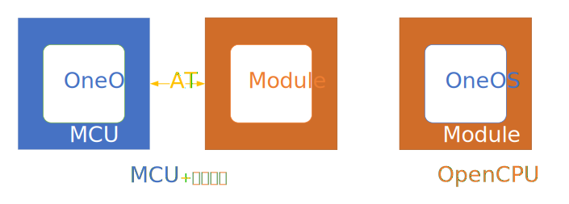
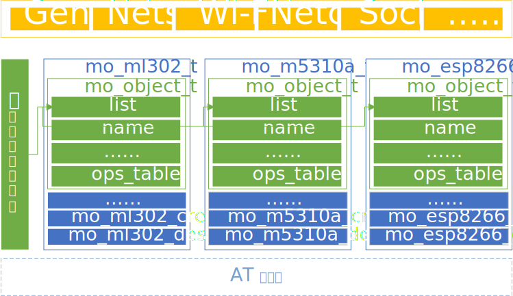

# Molink模组连接套件

## 简介

Molink即``ModuleLinkKit`` (模组连接套件)。MoLink是一整套针对嵌入式模组开发套件。MoLink提供了模组多实例管理、模组功能适配并向开发者提供统一易用的API(应用程序接口)。

Molink模组连接套件通过架构设计和模组适配实现了对不同的通信模组的统一控制，并向上层框架和应用提供统一的API接口，使开发者不必关心不同模组之间的差异即可完成网络相关应用的开发。同时MoLink组件设计兼容了通信模组的OpenCPU开发模式，极大提升了用户程序的可移植性，应用程序的无线连网功能可在AT模式和OpenCPU模式下无缝切换。后期MoLink组件将适配数量众多的无线通信模组，这样用户可以根据实际需求，便捷选择模组型号，轻松配置进行切换。

通过网络连接实现设备之间的互联互通是物联网应用的核心，当前物联网设备普遍通过通信模组连接到网络中，通信模组在物联网应用中扮演着不可或缺的角色。由于物联网应用场景的需求各异，各个通信模组厂商都推出了许多针对不同应用场景的通信模组。虽然不同的通信模组均提供AT指令集供用户调用来控制通信模组，但是不同厂商、型号的通信模组AT指令集之间仍然存在许多不兼容的地方。这些不兼容的AT指令集给物联网应用的开发者带来了不便，也让物联网终端产品的通信模组优化升级十分困难。

Molink模组连接套件通过架构设计和模组适配实现了对不同的通信模组的统一控制，并向上层框架和应用提供统一的API接口，使开发者不必关心不同模组之间的差异即可完成网络相关应用的开发。



同时，OneOS OpenCPU模组方案完全兼容Molink API接口，通过统一的API接口实现MCU+模组和模组OpenCPU方案间应用代码的无缝迁移。

### 源码目录结构

Molink源代码目录结构如下表所示：

| 目录   | 说明                           |
| ------ | ------------------------------ |
| api    | 通用控制等接口的定义及高层实现 |
| core   | 模组对象管理及其他关键部分实现 |
| doc    | 文档                           |
| module | 基于不同型号的模组适配实现     |
| parser | 与模组进行AT指令通信的解析器   |

Molink源代码按照软件架构进行层次划分，实现高内聚，低耦合，易于扩展和剪裁。

### 架构设计

Molink模组连接套件向上层框架和用户应用提供统一的API接口，同时适配了多种型号通信模组的AT指令集，架构如下图所示：



- 抽象接口层：提供通用控制、网络服务、网络连接、套接字、Wi-Fi管理等多种接口的定义及高层实现。
- 核心层：提供Molink模组对象定义、模组实例的管理及其他关键部分实现。
- 模组适配层：提供各种型号通信模组的抽象接口层各种接口的适配函数实现。
- AT解析器：可选模块，MCU架构下的模组适配通过AT解析器与通信模组进行AT指令通信。

### 模组支持

目前Molink已经适配支持的通信模组型号如下表所示：

|    厂商    |  类别   |  型号   |
| :--------: | :-----: | :-----: |
| 中移物联网 | 4G Cat1 |  ML302  |
| 中移物联网 | NB-IoT  | M5310-A |
| 中移物联网 | NB-IoT  |  M5311  |
|  移远通信  | 4G Cat1 | EC200x  |
|  移远通信  | NB-IoT  |  BC28   |
|  移远通信  | NB-IoT  |  BC95   |
|    乐鑫    |  Wi-Fi  | ESP8266 |

未来Molink计划适配支持的通信模组型号如下表所示：

|  厂商  |  类别   |   型号   |
| :----: | :-----: | :------: |
| 高新兴 | 4G Cat1 |  GM190   |
| 芯讯通 | 4G Cat1 | SIM7500X |
| 芯讯通 | NB-IoT  | SIM7020c |
| 广和通 | 4G Cat1 |  LC610   |

### 使用说明

### 图形化配置

使用Molink需要通过Menuconfig的图形化工具进行配置选择，配置的路径如下所示：

```text
Top->Components->Network->Molink->
    [*] Enable IoT modules support
        Modules --->
            4G Modules Support --->
                [ ] EC200X
                [ ] ML302
                [ ] ......
            NB-IoT modules Support --->
                [ ] M5310A
                [ ] M5311
                [ ] BC95
                [ ] BC28
                [ ] ......
            WiFi Modules Support --->
                [ ] ESP8266
                [ ] ......
        Parser --->
            [*] Enable AT Parser
            (2048) The AT Parser task stack size
            [ ]    Enable print RAW format AT command communication data
            (128)  The maximum length of AT commands buffer
```

进行Molink选项配置需要首先在Menuconfig中选中Enable IoT Modules support，然后再进行模组型号及其他的配置选择。

- Modules 子菜单下可以按模组的网络类别选择需要使用模组型号并进行配置，其中不同模组型号菜单选项略有差异，具体的选项功能可以参考菜单中显示的选项说明。
- Parser 子菜单下可以对AT解析器进行配置，若首先在Modules子菜单下选择了模组型号则AT解析器将会被自动关联选择，无需再手动配置。

下面以配置中移物联网ML302模组的选项为例进行说明，配置ML302模组的过程如下图所示：


ML302模组的配置菜单如下所示：

```text
[*] Enable ML302 Module Object Auto Create
(uart2) ML302 Interface Device Name (NEW)
(115200) ML302 Interface Device Rate (NEW)
(512)   The maximum length of AT command data accepted (NEW)
-*- Enable ML302 Module General Operates
-*- Enable ML302 Module Network Service Operates
[*] Enable ML302 Module Ping Operates
[*] Enable ML302 Module Ifconfig Operates
-*- Enable ML302 Module Network TCP/IP Operates
[*] Enable ML302 Module BSD Socket Operates
```

- 自动创建模组实例，系统初始化时将自动调用ML302模组实例创建函数，将创建的ML302模组实例加入到模组实例管理链表中。
- ML302模组接口设备名称，对应OneOS设备驱动框架中ML302与系统相连的接口设备的名称，默认为uart2。
- ML302模组接口设备速率，对应ML302与系统相连的接口设备的速率，默认为115200。
- ML302模组中接收一行AT指令数据的最大长度，默认为512。
- 使能ML302通用控制操作，包括获取IMEI号码、获取ICCID号码等功能。
- 使能ML302网络服务操作，包括附着、注网、获取信号质量等功能。
- 使能ML302 Ping操作，包括通过Ping测试网络连接等功能。
- 使能ML302 Ifconfig操作，包括打印模组IMEI、IPv4地址、信号质量等的功能。
- 使能ML302 TCP/IP操作，包括基础的TCP/UDP连接的创建、连接、发送、接收、断开连接等的功能。
- 使能ML302 Socket套接字操作，在ML302 TCP/IP操作的基础封装套接字接口，提供部分套接字编程的接口。

关于各类接口详细的说明可以参考Molink API使用说明手册。

### 注意事项

#### 1. 串口数据缓冲区大小配置

通信模组通过串口发送给系统的数据将会首先缓存在串口数据缓冲区中，因此，如果串口缓冲区大小设置过小则会导致Molink无法正确的接收通信模组发送的数据，造成AT指令执行超时或数据接收不全等问题。在OneOS操作系统中串口缓存区的大小默认为64bytes，如果使用Molink组件则建议将串口缓冲区大小设置为略大于通信所需的数据的最大值，例如：设置为1024bytes或2048bytes。

通过menuconfig设置串口缓冲区大小的过程如下图所示：


## API介绍

### 1. 模组实例管理接口

模组的管理基于模组实例管理框架，由统一管理接口控制，用户可以不必再关心冗杂的模组的AT指令收发及解析，调用MoLink API轻松实现模组管理及具体业务。

模组实例相关接口总览：

| **接口**       | **说明**             |
| :------------- | :------------------- |
| mo_create      | 创建模组对象         |
| mo_destroy     | 销毁模组对象         |
| mo_get_by_name | 根据名称获取模组对象 |
| mo_get_default | 获取默认模组对象     |
| mo_set_default | 设置默认模组对象     |

------

#### 1.2 创建销毁

MoLink提供自动创建和手动创建两种模组创建方式。用户可根据设备及具体应用场景进行选择。

**自动创建**

自动创建方式：使用oneos-cube可视化配置工具menuconfig，在``(Top) → Components→ Network→ Molink``路径下，使能物联网模组支持功能``（[*] Enable IoT modules support）``，在此目录下，选择使能模组及配置是否自动创建模组。

如图 以M5310-A为例：

1) 在menuconfig中进入具体模组配置目录``(Top) → Components→ Network→ Molink→ Enable IoT modules support → Module→ NB-IOT Modules Support→ M5310A → M5310A Config``

2) 使能自动创建功能``[*] Enable M5310A Module Object Auto Create``

3) 在使能自动创建后会出现次级配置选项，配置好模组信息如：设备接口名``Interface Device Name``、模组波特率``Interface Device Rate``和AT指令最大接收长度``The maximum length of AT command data accepted``。保存配置后编译烧录即可在OneOS运行时自动创建模组。

*) 注意：使用自动创建需关注模组在自动创建时是否正常工作，若模组未开机或工作状态不正常，不能使用自动创建功能。具体使用方法见``用户指南 Molink-模组连接套件:图形化配置``

```log
[*] Enable M5310A Module Object Auto Create            <-------使能模组自动创建功能
(uart2) M5310A Interface Device Name                   <-------接口名
(115200) M5310A Interface Device Rate                  <-------模组波特率
(512)   The maximum length of AT command data accepted <-------单条AT指令最大接收长度
-*- Enable M5310A Module General Operates              <-------使能通用控制接口
-*- Enable M5310A Module Network Service Operates      <-------使能网络服务接口
[*] Enable M5310A Module Ping Operates                 <-------使能ping功能接口
[*] Enable M5310A Module Ifconfig Operates             <-------使能ifconfig接口
[*] Enable M5310A Module Network TCP/IP Operates       <-------使能TCP/IP功能接口
[ ] Enable M5310A Module BSD Socket Operates           <-------使能BSD套接字
[*] Enable M5310A Module Onenet Nb Operates            <-------使能OneNetNB平台接口
```

**手动创建**

MoLink也提供了手动创建模组实例功能，方便更加灵活管理模组。接口如下：

##### mo_create

该函数用于创建模组对象实例，其函数原型如下：

```c
mo_object_t *mo_create(const char *name, mo_type_t type, void *parser_config);
```

| **参数**      | **说明**                                      |
| :------------ | :-------------------------------------------- |
| name          | 模组名称                                      |
| type          | 模组型号                                      |
| parser_config | AT解析器参数结构体指针，OpenCPU架构此参数为空 |
| **返回**      | **说明**                                      |
| OS_NULL       | 创建失败                                      |
| 非OS_NULL     | 模组对象指针                                  |

*) 进行手动创建请勿使能此模组的自动创建功能。

**销毁**

##### mo_destroy

该函数用于销毁模组对象实例，其函数原型如下：

```c
os_err_t mo_destroy(mo_object_t *self, mo_type_t type);
```

| **参数** | **说明**       |
| :------- | :------------- |
| self     | 模组对象       |
| type     | 支持的模组型号 |
| **返回** | **说明**       |
| OS\_EOK  | 成功           |

------

#### 1.3 模组管理

##### mo_get_by_name

该函数用于根据名称获取模组对象，函数原型如下：

```c
mo_object_t *mo_get_by_name(const char *name);
```

| **参数**  | **说明**     |
| :-------- | :----------- |
| name      | 模组对象名称 |
| **返回**  | **说明**     |
| OS_NULL   | 获取失败     |
| 非OS_NULL | 模组对象指针 |

##### mo_get_default

该函数用于获取默认模组对象，函数原型如下：

```c
mo_object_t *mo_get_default(void);
```

| **参数**  | **说明**         |
| :-------- | :--------------- |
| 无        | 无               |
| **返回**  | **说明**         |
| OS_NULL   | 获取失败         |
| 非OS_NULL | 默认模组对象指针 |

##### mo_set_defaults

该函数用于设置默认模组对象，其函数原型如下：

```c
void mo_set_default(mo_object_t *self);
```

| **参数** | **说明** |
| :------- | :------- |
| self     | 模组对象 |
| **返回** | **说明** |
| 无       | 无       |

------

### 2. 通用控制接口

通用控制接口提供模组相关基本信息及功能查询设置，模组创建后，按需调用即可。

通用控制接口总览：

| **接口**                     | **说明**                   |
| :--------------------------- | :------------------------- |
| mo_at_test                   | 测试AT指令                 |
| mo_get_imei                  | 获取IMEI                   |
| mo_get_imsi                  | 获取IMSI                   |
| mo_get_iccid                 | 获取iccid                  |
| mo_get_cfun                  | 获取射频模式               |
| mo_set_cfun                  | 设置射频模式               |
| mo_get_firmware_version      | 获取模组固件版本信息       |
| mo_get_firmware_version_free | 释放获取的模组固件版本信息 |
| mo_get_eid                   | 获取SIM eID                |

#### mo_at_test

该函数用于发送AT测试命令，其函数原型如下：

```c
os_err_t mo_at_test(mo_object_t *self);
```

| **参数**  | **说明** |
| :-------- | :------- |
| self      | 模组对象 |
| **返回**  | **说明** |
| OS\_EOK   | 成功     |
| 非OS\_EOK | 失败     |

#### mo_get_imei

该函数用于获取IMEI，该函数原型如下：

```c
os_err_t mo_get_imei(mo_object_t *self, char *value, os_size_t len);
```

| **参数**  | **说明**          |
| :-------- | :---------------- |
| self      | 模组对象          |
| value     | 存储IMEI的buf     |
| len       | 存储IMEI的buf长度 |
| **返回**  | **说明**          |
| OS\_EOK   | 成功              |
| 非OS\_EOK | 失败              |

#### mo_get_imsi

该函数用于获取IMSI，其函数原型如下：

```c
os_err_t mo_get_imsi(mo_object_t *self, char *value, os_size_t len);
```

| **参数**  | **说明**          |
| :-------- | :---------------- |
| self      | 模组对象          |
| value     | 存储IMSI的buf     |
| len       | 存储IMSI的buf长度 |
| **返回**  | **说明**          |
| OS\_EOK   | 成功              |
| 非OS\_EOK | 失败              |

#### mo_get_iccid

该函数用于获取ICCID，其函数原型如下：

```c
os_err_t mo_get_iccid(mo_object_t *self, char *value, os_size_t len);
```

| **参数**  | **说明**           |
| :-------- | :----------------- |
| self      | 模组对象           |
| value     | 存储ICCID的buf     |
| len       | 存储ICCID的buf长度 |
| **返回**  | **说明**           |
| OS\_EOK   | 成功               |
| 非OS\_EOK | 失败               |

#### mo_get_cfun

该函数用于获取射频模式，其函数原型如下：

```c
os_err_t mo_get_cfun(mo_object_t *self, os_uint8_t *fun_lvl);
```

| **参数**  | **说明**           |
| :-------- | :----------------- |
| self      | 模组对象           |
| fun_lvl   | 存储射频模式的指针 |
| **返回**  | **说明**           |
| OS\_EOK   | 成功               |
| 非OS\_EOK | 失败               |

#### mo_set_cfun

该函数用于设置射频模式，其函数原型如下：

```c
os_err_t mo_set_cfun(mo_object_t *self, os_uint8_t fun_lvl);
```

| **参数**  | **说明** |
| :-------- | :------- |
| self      | 模组对象 |
| fun_lvl   | 射频模式 |
| **返回**  | **说明** |
| OS\_EOK   | 成功     |
| 非OS\_EOK | 失败     |

*) fun_lvl的设置根据模组不同有所区别，需要具体查阅AT手册对应的值进行设置

#### mo_get_firmware_version

该函数用于获取模组的固件版本信息

```c
os_err_t mo_get_firmware_version(mo_object_t *self, mo_firmware_version_t *version);
```

| **参数**  | **说明**                     |
| :-------- | :--------------------------- |
| self      | 模组对象                     |
| version   | 存储固件版本号的结构体的指针 |
| **返回**  | **说明**                     |
| OS\_EOK   | 成功                         |
| 非OS\_EOK | 失败                         |

*) 该函数将动态申请用于存储固件版本信息的内存，调用该函数需调用mo_get_firmware_version_free函数释放内存。

#### mo_get_firmware_version_free

该函数用于释放获取的模组固件版本信息

```c
void mo_get_firmware_version_free(mo_firmware_version_t *version);
```

| **参数** | **说明**                     |
| :------- | :--------------------------- |
| version  | 存储固件版本号的结构体的指针 |

#### mo_get_eid

该函数用于获取SIM卡eID，其函数原型如下：

```c
os_err_t mo_get_eid(mo_object_t *self, char *eid, os_size_t len);
```

| **参数**  | **说明**      |
| :-------- | :------------ |
| self      | 模组对象      |
| eid       | 存储eID的指针 |
| len       | eID字符串长度 |
| **返回**  | **说明**      |
| OS\_EOK   | 成功          |
| 非OS\_EOK | 失败          |

#### mo_gm_time

该函数用于从模组获取本地分解时间，其函数原型如下：

```c
os_err_t mo_gm_time(mo_object_t *self, struct tm *l_tm);
```

| **参数**  | **说明**      |
| :-------- | :------------ |
| self      | 模组对象      |
| l_tm      | 存储分解时间结构体的指针 |
| **返回**  | **说明**      |
| OS\_EOK   | 成功          |
| 非OS\_EOK | 失败          |

#### mo_time

该函数用于获取本地UNIX时间，其函数原型如下：

```c
os_err_t mo_time(mo_object_t *self, time_t *timep);
```

| **参数**  | **说明**      |
| :-------- | :------------ |
| self      | 模组对象      |
| timep     | 存储UNIX时间的指针 |
| **返回**  | **说明**      |
| OS\_EOK   | 成功          |
| 非OS\_EOK | 失败          |

------

### 3. 网络服务接口

网络服务接口提供模组网络服务相关基本信息及功能查询设置，部分功能在模组侧有依赖关系，具体见不同模组的AT手册。

| **接口**               | **说明**                           |
| :--------------------- | :--------------------------------- |
| mo_set_attach          | 网络附着或去附着                   |
| mo_get_attach          | 获取网络附着状态                   |
| mo_set_reg             | 设置网络注册参数                   |
| mo_get_reg             | 获取网络注册状态                   |
| mo_set_cgact           | 网络激活或去激活                   |
| mo_get_cgact           | 获取网络激活状态                   |
| mo_get_csq             | 获取信号强度                       |
| mo_get_radio           | 获取无线信息                       |
| mo_get_ipaddr          | 获取IP地址                         |
| mo_set_dnsserver       | 设置DNS服务器地址                  |
| mo_get_dnsserver       | 查询DNS服务器地址                  |
| mo_get_cell_info       | 获取cell信息                       |
| mo_set_psm             | 设置PSM选项                        |
| mo_get_psm             | 查询PSM信息                        |
| mo_set_edrx_cfg        | 配置edrx参数                       |
| mo_get_edrx_cfg        | 查询edrx配置                       |
| mo_get_edrx_dynamic    | 查询edrx生效值(读取动态 eDRX 参数) |
| mo_set_band            | 多频段模块设置搜网的频段           |
| mo_set_earfcn          | 锁频                               |
| mo_get_earfcn          | 查询earfcn(锁频)信息               |
| mo_clear_stored_earfcn | 清除存储的频点信息                 |
| mo_clear_plmn          | 清除plmn等驻网记录                 |

#### mo_set_attach

该函数用于附着或去附着，其函数原型如下：

```c
os_err_t mo_set_attach(mo_object_t *self, os_uint8_t attach_stat);
```

| **参数**    | **说明**       |
| :---------- | :------------- |
| self        | 模组对象       |
| attach_stat | 欲设置附着状态 |
| **返回**    | **说明**       |
| OS\_EOK     | 成功           |
| 非OS\_EOK   | 失败           |

#### mo_get_attach

该函数用于获取附着状态，其函数原型如下：

```c
os_err_t mo_get_attach(mo_object_t *self, os_uint8_t *attach_stat);
```

| **参数**    | **说明**          |
| :---------- | :---------------- |
| self        | 模组对象          |
| attach_stat | 存储附着状态的buf |
| **返回**    | **说明**          |
| OS\_EOK     | 成功              |
| 非OS\_EOK   | 失败              |

#### mo_set_reg

该函数用于设置注册参数，其函数原型如下：

```c
os_err_t mo_set_reg(mo_object_t *self, os_uint8_t reg_n);
```

| **参数**  | **说明** |
| :-------- | :------- |
| self      | 模组对象 |
| reg_n     | 注册参数 |
| **返回**  | **说明** |
| OS\_EOK   | 成功     |
| 非OS\_EOK | 失败     |

#### mo_get_reg

该函数用于获取注册状态，其函数原型如下：

```c
os_err_t mo_get_reg(mo_object_t *self, eps_reg_info_t *info);
```

| **参数**  | **说明**          |
| :-------- | :---------------- |
| self      | 模组对象          |
| info      | 存储注册状态的结构体指针 |
| **返回**  | **说明**          |
| OS\_EOK   | 成功              |
| 非OS\_EOK | 失败              |

#### mo_set_cgact

该函数用于激活或去激活，其函数原型如下：

```c
os_err_t mo_set_cgact(mo_object_t *self, os_uint8_t cid, os_uint8_t act_n);
```

| **参数**  | **说明**       |
| :-------- | :------------- |
| self      | 模组对象       |
| cid       | CID参数        |
| act_n     | 激活参数，0或1 |
| **返回**  | **说明**       |
| OS\_EOK   | 成功           |
| 非OS\_EOK | 失败           |

#### mo_get_cgact

该函数用于获取激活状态，其函数原型如下：

```c
os_err_t mo_get_cgact(mo_object_t *self, os_uint8_t *cid, os_uint8_t *act_stat);
```

| **参数**  | **说明**          |
| :-------- | :---------------- |
| self      | 模组对象          |
| cid       | 存储CID参数的buf  |
| act_stat  | 存储激活参数的buf |
| **返回**  | **说明**          |
| OS\_EOK   | 成功              |
| 非OS\_EOK | 失败              |

#### mo_get_csq

该函数用于获取信号强度，其函数原型如下：

```c
os_err_t mo_get_csq(mo_object_t *self, os_uint8_t *rssi, os_uint8_t *ber);
```

| **参数**  | **说明**      |
| :-------- | :------------ |
| self      | 模组对象      |
| rssi      | 存储RSSI的buf |
| act_stat  | 存储BER的buf  |
| **返回**  | **说明**      |
| OS\_EOK   | 成功          |
| 非OS\_EOK | 失败          |

#### mo_get_radio

该函数用于获取无线信息，其函数原型如下：

```c
os_err_t mo_get_radio(mo_object_t *self, radio_info_t *radio_info);
```

| **参数**   | **说明**          |
| :--------- | :---------------- |
| self       | 模组对象          |
| radio_info | 存储无线信息的buf |
| **返回**   | **说明**          |
| OS\_EOK    | 成功              |
| 非OS\_EOK  | 失败              |

#### mo_get_ipaddr

该函数用于获取ip地址，其函数原型如下：

```c
os_err_t mo_get_ipaddr(mo_object_t *self, char ip[]);
```

| **参数**  | **说明**    |
| :-------- | :---------- |
| self      | 模组对象    |
| ip        | 存储IP的buf |
| **返回**  | **说明**    |
| OS\_EOK   | 成功        |
| 非OS\_EOK | 失败        |

#### mo_set_dnsserver

该函数用于设置DNS服务器地址信息，其函数原型如下：

```c
os_err_t mo_set_dnsserver(mo_object_t *self, dns_server_t dns);
```

| **参数**  | **说明**                   |
| :-------- | :------------------------- |
| self      | 模组对象                   |
| dns       | 设置DNS服务器地址信息的buf |
| **返回**  | **说明**                   |
| OS\_EOK   | 成功                       |
| 非OS\_EOK | 失败                       |

#### mo_get_dnsserver

该函数用于查询DNS服务器地址信息，其函数原型如下：

```c
os_err_t mo_get_dnsserver(mo_object_t *self, dns_server_t *dns);
```

| **参数**  | **说明**                   |
| :-------- | :------------------------- |
| self      | 模组对象                   |
| dns       | 存储DNS服务器地址信息的buf |
| **返回**  | **说明**                   |
| OS\_EOK   | 成功                       |
| 非OS\_EOK | 失败                       |

#### mo_get_cell_info

该函数用于获取cell信息，其函数原型如下：

```c
os_err_t mo_get_cell_info(mo_object_t *self, onepos_cell_info_t* onepos_cell_info);
```

| **参数**         | **说明**          |
| :--------------- | :---------------- |
| self             | 模组对象          |
| onepos_cell_info | 存储cell信息的buf |
| **返回**         | **说明**          |
| OS\_EOK          | 成功              |
| 非OS\_EOK        | 失败              |

#### mo_set_psm

该函数用于设置PSM选项，其函数原型如下：

```c
os_err_t mo_set_psm(mo_object_t *self, mo_psm_info_t info);
```

| **参数**  | **说明**         |
| :-------- | :--------------- |
| self      | 模组对象         |
| info      | 设置PSM选项的buf |
| **返回**  | **说明**         |
| OS\_EOK   | 成功             |
| 非OS\_EOK | 失败             |

#### mo_get_psm

该函数用于获取PSM选项，其函数原型如下：

```c
os_err_t mo_get_psm(mo_object_t *self, mo_psm_info_t *info);
```

| **参数**  | **说明**         |
| :-------- | :--------------- |
| self      | 模组对象         |
| info      | 存储PSM选项的buf |
| **返回**  | **说明**         |
| OS\_EOK   | 成功             |
| 非OS\_EOK | 失败             |

#### mo_set_edrx_cfg

该函数用于配置edrx参数信息，其函数原型如下：

```c
os_err_t mo_set_edrx_cfg(mo_object_t *self, mo_edrx_cfg_t cfg);
```

| **参数**  | **说明**          |
| :-------- | :---------------- |
| self      | 模组对象          |
| cfg       | 配置edrx参数的buf |
| **返回**  | **说明**          |
| OS\_EOK   | 成功              |
| 非OS\_EOK | 失败              |

#### mo_get_edrx_cfg

该函数用于查询edrx配置信息，其函数原型如下：

```c
os_err_t mo_get_edrx_cfg(mo_object_t *self, mo_edrx_t *edrx_local);
```

| **参数**  | **说明**          |
| :-------- | :---------------- |
| self      | 模组对象          |
| info      | 存储edrx配置的buf |
| **返回**  | **说明**          |
| OS\_EOK   | 成功              |
| 非OS\_EOK | 失败              |

#### mo_get_edrx_dynamic

该函数用于获取查询edrx生效值(读取动态 eDRX 参数)信息，其函数原型如下：

```c
os_err_t mo_get_edrx_dynamic(mo_object_t *self, mo_edrx_t *edrx_dynamic);
```

| **参数**  | **说明**            |
| :-------- | :------------------ |
| self      | 模组对象            |
| param     | 存储edrx生效值的buf |
| **返回**  | **说明**            |
| OS\_EOK   | 成功                |
| 非OS\_EOK | 失败                |

#### mo_set_band

该函数用于配置多频段模块设置搜网的频段信息，其函数原型如下：

```c
os_err_t mo_set_band(mo_object_t *self, char band_list[], os_uint8_t num);
```

| **参数**  | **说明**            |
| :-------- | :------------------ |
| self      | 模组对象            |
| band_list | 存储频段信息的buf   |
| num       | 存储band_list的长度 |
| **返回**  | **说明**            |
| OS\_EOK   | 成功                |
| 非OS\_EOK | 失败                |

#### mo_set_earfcn

该函数用于设置锁频选项，其函数原型如下：

```c
os_err_t mo_set_earfcn(mo_object_t *self, mo_earfcn_t earfcn);
```

| **参数**  | **说明**          |
| :-------- | :---------------- |
| self      | 模组对象          |
| earfcn    | 设置锁频选项的buf |
| **返回**  | **说明**          |
| OS\_EOK   | 成功              |
| 非OS\_EOK | 失败              |

#### mo_get_earfcn

该函数用于查询earfcn(锁频)信息 ，其函数原型如下：

```c
os_err_t mo_get_earfcn(mo_object_t *self, mo_earfcn_t *earfcn);
```

| **参数**  | **说明**                  |
| :-------- | :------------------------ |
| self      | 模组对象                  |
| earfcn    | 存储锁频配置相关信息的buf |
| **返回**  | **说明**                  |
| OS\_EOK   | 成功                      |
| 非OS\_EOK | 失败                      |

#### mo_clear_stored_earfcn

该函数用于清除存储的频点信息，其函数原型如下：

```c
os_err_t mo_clear_stored_earfcn(mo_object_t *self);
```

| **参数**  | **说明** |
| :-------- | :------- |
| self      | 模组对象 |
| **返回**  | **说明** |
| OS\_EOK   | 成功     |
| 非OS\_EOK | 失败     |

#### mo_clear_plmn

该函数用于清除plmn等信息，其函数原型如下：

```c
os_err_t mo_clear_plmn(mo_object_t *self);
```

| **参数**  | **说明** |
| :-------- | :------- |
| self      | 模组对象 |
| **返回**  | **说明** |
| OS\_EOK   | 成功     |
| 非OS\_EOK | 失败     |


### 4. 套接字接口

MoLink提供套接字接口，区分于普通套接字接口，以``mo_``作标志，使用方式与普通套接字接口基本无异，区别在于某些接口需要传入模组实例。详见
``components\net\molink\api\include\mo_socket.h``

另``OneOS socket组件``为用户提供了一套兼容BSD的标准接口，用户可在``自动创建``时选择使能BSD套接字服务，即可使用。

## 应用示例

### 模组实例管理接口使用示例

```c
#define RECV_BUF_LEN     (512)
#define TEST_MODULE_NAME "gm190"

/* manually create module */
mo_object_t *test_module = OS_NULL;
mo_object_t *temp_module = OS_NULL;
os_err_t     result      = OS_ERROR;

mo_parser_config_t parser_config = {.parser_name   = TEST_MODULE_NAME,
                                    .parser_device = test_device,
                                    .recv_buff_len = RECV_BUF_LEN};

test_module = mo_create("gm190", MODULE_TYPE_GM190, &parser_config);
OS_ASSERT(OS_NULL != test_module);

/* set default module instance */
#if 0
/* auto set default when create, but also you can call this func */
result = mo_set_default(test_module);
OS_ASSERT(OS_ERROR != result);
#endif

/* get default module instance */
temp_module = mo_get_default();
OS_ASSERT(OS_NULL == temp_module);

/* get module instance by name */
temp_module = mo_get_by_name(TEST_MODULE_NAME);
OS_ASSERT(test_module == temp_module);

/* destroy module */
result = mo_destroy(test_module, MODULE_TYPE_GM190);
OS_ASSERT(OS_EOK == result);
```

### 通用控制接口使用示例

```c
#define IMEI_LEN    (15)
#define IMSI_LEN    (15)
#define ICCID_LEN   (20)
#define EID_LEN     (20)

os_err_t   result         = OS_ERROR;
os_uint8_t get_cfun_lvl   = 0;
os_uint8_t set_cfun_lvl   = 1;
time_t     time           = 0;
struct     tm l_tm;

char imei[IMEI_LEN + 1]         = {0};
char imsi[IMSI_LEN + 1]         = {0};
char iccid[ICCID_LEN + 1]       = {0};
char eid[EID_LEN + 1]           = {0};
mo_firmware_version_t version   = {0};


mo_object_t *test_module = mo_get_default();
OS_ASSERT(OS_NULL != test_module);

/* test AT & test connection */
result = mo_at_test(test_module);
OS_ASSERT(OS_EOK == result);

/* get IMEI */
result = mo_get_imei(test_module, imei, sizeof(imei));
OS_ASSERT(OS_EOK == result);
os_kprintf("module imei:%s\r\n", imei);

/* get IMSI */
result = mo_get_imsi(test_module, imsi, sizeof(imsi));
OS_ASSERT(OS_EOK == result);
os_kprintf("module imsi:%s\r\n", imsi);

/* get ICCID */
result = mo_get_iccid(test_module, iccid, sizeof(iccid));
OS_ASSERT(OS_EOK == result);
os_kprintf("module iccid:%s\r\n", iccid);

/* set function level */
result = mo_set_cfun(test_module, set_cfun_lvl);
OS_ASSERT(OS_EOK == result);

/* get function level */
result = mo_get_cfun(test_module, &get_cfun_lvl);
OS_ASSERT(OS_EOK == result);
os_kprintf("module cfun:%u\r\n", cfun_lvl);

/* get module firmware version */
os_err_t result = mo_get_firmware_version(test_module, &version);
OS_ASSERT(OS_EOK == result);

for (int i = 0; i < version.line_counts; i++)
{
    os_kprintf("%s\n", version.ver_info[i]);
}

mo_get_firmware_version_free(&version);

/* get eID */
result = mo_get_eid(test_module, eid, EID_LEN);
OS_ASSERT(OS_EOK == result);
os_kprintf("module eid:%s\r\n", eid);

/* get broken-down time */
result = mo_gm_time(test_module, &l_tm);
OS_ASSERT(OS_EOK == result);

/* get UNIX time */
result = mo_time(test_module, &time);
OS_ASSERT(OS_EOK == result);
```

### 网络服务接口使用示例

```c
#include <mo_api.h>

#define INIT_DFT       (0)
#define INIT_BER_DFT   (99)
#define TEST_CID       (1)

/* for example */
#typedef enum test_attach_stat
{
    DETACHED = 0,
    ATTACHED,
    ATTACH_RESERVED,
} test_attach_stat_t;

/* for example */
#typedef enum test_reg_stat
{
    DISABLE_REG_URC = 0,
    ENABLE_REG_URC,
    ENABLE_REG_LO_URC,
    ENABLE_REG_LO_EMM_URC,
    PSM_ENABLE_REG_LO_URC,
    PSM_ENABLE_REG_LO_EMM_URC,
} test_reg_stat_t;

/* for example */
#typedef enum test_act_stat
{
    DEACTIVATED = 0,
    ACTIVATED,
    ACTIVATE_RESERVED,

} test_act_stat_t;

os_err_t   result          = OS_ERROR;
os_uint8_t attach_stat_set = TEST_ATTACHED;
os_uint8_t attach_stat_get = INIT_DFT;
os_uint8_t reg_n           = ENABLE_REG_URC;
os_uint8_t cid_set         = TEST_CID;
os_uint8_t cid_get         = INIT_DFT;
os_uint8_t act_stat_set    = DEACTIVATED;
os_uint8_t act_stat_get    = INIT_DFT;
os_uint8_t rssi            = INIT_DFT;
os_uint8_t ber             = INIT_BER_DFT;

radio_info_t radio_info              = {0};
char ip_addr[IPADDR_MAX_STR_LEN + 1] = {0};

mo_psm_info_t psm_enable  = {MO_PSM_ENABLE, "", "", "00100011", "00100010"};
mo_psm_info_t psm_disable = {MO_PSM_DISABLE, "", "", "00100011", "00100010"};

eps_reg_info_t reg_info;
memset(&reg_info, 0, sizeof(eps_reg_info_t));
onepos_cell_info_t cell_info;
memset(&cell_info, 0, sizeof(onepos_cell_info_t));
mo_psm_info_t psm_info_get;
memset(&psm_info_get, 0, sizeof(mo_psm_info_t));

mo_object_t *test_module = mo_get_default();
OS_ASSERT(OS_NULL != test_module);

/* set module attach state */
mo_set_attach(est_module, attach_stat_set);
OS_ASSERT(OS_EOK == result);

/* get module attach state */
result = mo_get_attach(test_module, &attach_stat_get);
OS_ASSERT(OS_EOK == result);
os_kprintf("module attach state:%u\r\n", attach_stat_get);


/* set the presentation of an network registration urc data */
result = mo_set_reg(test_module, reg_n);
OS_ASSERT(OS_EOK == result);

/*
 * get the presentation of an network registration urc data
 * and the network registration status
 */
result = mo_get_reg(test_module, &reg_info);
OS_ASSERT(OS_EOK == result);
os_kprintf("module register n:%u"\r\n,     reg_info.reg_n);
os_kprintf("module register state:%u\r\n", reg_info.reg_stat);

/* set activate or deactivate PDP Context */
result = mo_set_cgact(test_module, cid_set, act_stat_set);
OS_ASSERT(OS_EOK == result);

/* get the state of PDP context activation */
result = mo_get_cgact(test_module, &cid_get, &act_stat_get);
OS_ASSERT(OS_EOK == result);
os_kprintf("module PDP context cid:%u,act stat:%u\r\n", cid_get, act_stat_get);

/* get the csq info */
result = result = mo_get_csq(test_module, &rssi, &ber);
OS_ASSERT(OS_EOK == result);
os_kprintf("module csq rssi:%u\r\n", rssi);
os_kprintf("module csq ber:%u\r\n", ber);

/* get module radio info */
result = mo_get_radio(test_module, &radio_info);
OS_ASSERT(OS_EOK == result);
os_kprintf("module cell id:%s\r\n", radio_info.cell_id);
os_kprintf("module ecl:%d\r\n",     radio_info.ecl);
os_kprintf("module snr:%d\r\n",     radio_info.snr);
os_kprintf("module earfcn:%d\r\n",  radio_info.earfcn);
os_kprintf("module rsrq:%d\r\n",    radio_info.rsrq);

/* get module ip address */
result = mo_get_ipaddr(test_module, ip_addr);
OS_ASSERT(OS_EOK == result);
os_kprintf("get_ipaddr IP:%s\r\n", ip_addr);

/* get cell info */
result = mo_get_cell_info(test_module, &cell_info);
OS_ASSERT(OS_EOK == result);
os_kprintf("module cell_info cell_num:%d\r\n", cell_info.cell_num);
os_kprintf("module cell_info net_type:%d\r\n", cell_info.net_type);
os_kprintf("module cell_info mnc:%d\r\n",      cell_info.cell_info->mnc);
os_kprintf("module cell_info mcc:%d\r\n",      cell_info.cell_info->mcc);
os_kprintf("module cell_info lac:%d\r\n",      cell_info.cell_info->lac);
os_kprintf("module cell_info cid:%d\r\n",      cell_info.cell_info->cid);
os_kprintf("module cell_info ss:%d\r\n",       cell_info.cell_info->ss);

/* set PSM(power saving mode) enable & other configuration */
result = mo_set_psm(test_module, psm_enable);
OS_ASSERT(OS_EOK == result);

/* get get module PSM(power saving mode) info */
result = mo_get_psm(test_module, &psm_info_get);
OS_ASSERT(OS_EOK == result);
os_kprintf("module psm_mode:%d\r\n",         psm_info_get.psm_mode);
os_kprintf("module periodic_rau:%s\r\n",     psm_info_get.periodic_rau);
os_kprintf("module gprs_ready_timer:%s\r\n", psm_info_get.gprs_ready_timer);
os_kprintf("module periodic_tau:%s\r\n",     psm_info_get.periodic_tau);
os_kprintf("module active_time:%s\r\n",      psm_info_get.active_time);
```

## FAQ

Q): 为何发送/接收较长数据时返回超时或错误，且很难返回成功？

A): 对于NB类型模组，因网络因素受限，收发较大长度的数据常会有严重丢包重传等现象发生，不建议大量数据收发。
