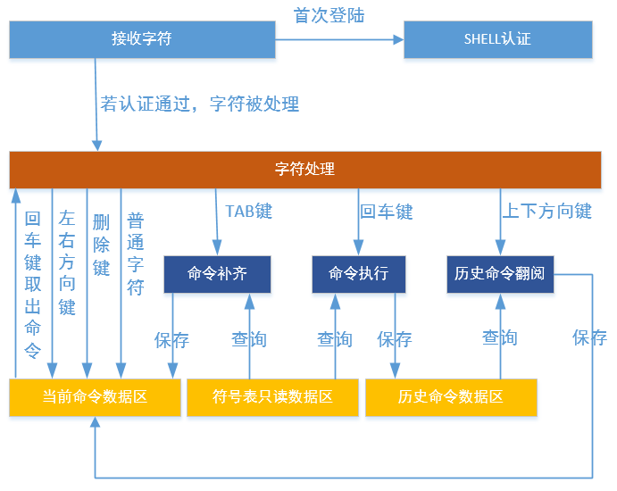

# SHELL工具

---

## 简介

shell命令行工具，提供了一套供用户在命令行调用的操作接口，主要用于调试或查看系统信息。在控制终端输入命令，控制终端通过某个通道(例如串口)将命令传给设备里的shell，shell会读取设备输入命令，解析并自动扫描内部函数表，寻找对应函数名，执行函数后输出回应，回应通过原路返回，将结果显示在控制终端上。

### shell实现原理

SHELL模块系统结构包含3个数据区和6个逻辑处理单元。3个数据区分别为符号表只读数据区、当前命令数据区、历史命令数据区；6个逻辑处理单元分别为字符接收、SHELL认证、字符处理、命令补齐、命令执行、历史命令翻阅，如下图：



### shell字符处理

字符处理模块收到字符后，根据字符的类型，会执行不同的操作，即：非控制字符，进行保存，并回显；控制字符，进行不同的操作。

控制字符功能描述，见下表：

| **命令** | **功能** |
| :--- | :--- |
| Up key | 向前查询历史命令 |
| Down key | 向后查询历史命令 |
| Left key | 向左移动光标 |
| Right key | 向右移动光标 |
| Backspace key | 删除光标左侧字符 |
| Tab key | 自动补全命令 |
| Enter key | 提交命令执行 |

### 系统内置shell命令

本操作系统内置了一些shell命令，在控制终端中输入help，就可以看到当前系统支持的所有命令。下面我们列出一些比较有用的命令：

```c
sh>help
OneOS shell commands:
atest_run        - atest_run [-n testacse name] [-l loop count] [-p priority level] [-t] [-s] [-h]
atest_list       - Display all atest testcases
dlog_glvl_ctrl   - Dlog global level control
dlog_tlvl_ctrl   - Dlog tag level control
dlog_gtag_ctrl   - Dlog global tag control
dlog_gkw_ctrl    - Dlog global keyword control
dlog_flush       - Flush dlog cache
reboot           - reboot
device           - show device information
pinMode          - set hardware pin mode
pinWrite         - write value to hardware pin
pinRead          - read status from hardware pin
show_event       - show event information
show_mb          - Show mailbox information
show_mempool     - Show mempool information
show_heap        - show memheap information
show_mem         - show memory usage information
check_mem        - check memory data
show_mq          - Show message queue information
show_mutex       - Show mutex information
show_sem         - show semaphore information
show_task        - Show task information
version          - show oneos version
set_prompt       - Set shell prompt
help             - Obtain help of commands
```

---

## 重要定义及数据结构

### SHELL命令对象数据结构

```c
struct sh_cmd_entry
{
    const char*     name;

#if defined(SHELL_USING_DESCRIPTION)
    const char*     desc;
#endif

    sh_cmd_func_t   func;
};
typedef struct sh_cmd_entry sh_cmd_entry_t;
```

| **SHELL命令对象成员变量** | **说明** |
| :--- | :--- |
| name | 命令名字 |
| desc | 命令描述 |
| func | 命令执行对应的函数 |

---

## API列表

| **接口** | **说明** |
| :--- | :--- |
| SH\_CMD\_EXPORT | 注册shell命令 |
| sh\_exec | 该接口把SHELL命令及相关参数的字符串传入此接口，执行命令 |
| sh\_disconnect\_console | 断开SHELL与控制台设备的连接 |
| sh\_reconnect\_console | 重新建立SHELL与控制台设备的连接 |

### SH\_CMD\_EXPORT

该接口用于注册shell命令，原型如下：

```c
SH_CMD_EXPORT(cmd, func, desc);
```

| **参数** | **说明** |
| :--- | :--- |
| cmd | SHELL命令 |
| func | 回调函数 |
| desc | 命令描述 |
| **返回** | **说明** |
| 无 | 无 |

### sh\_exec

通过该接口把SHELL命令及相关参数的字符串传入此接口，执行命令，函数原型如下：

```c
os_err_t sh_exec(const char *cmd);
```

| **参数** | **说明** |
| :--- | :--- |
| cmd | SHELL命令及相关参数的字符串 |
| **返回** | **说明** |
| 无 | 无 |

### sh\_disconnect\_console

该接口用于断开SHELL与控制台设备的连接，函数原型如下：

```c
void sh_disconnect_console(void);
```

| **参数** | **说明** |
| :--- | :--- |
| 无 | 无 |
| **返回** | **说明** |
| 无 | 无 |

### sh\_reconnect\_console

该接口用于重新建立SHELL与控制台设备的连接，函数原型如下：

```c
void sh_reconnect_console(void);
```

| **参数** | **说明** |
| :--- | :--- |
| 无 | 无 |
| **返回** | **说明** |
| 无 | 无 |

---

## 配置选项

OneOS在使用shell时提供了功能和裁剪的配置，具体配置如下图所示:

```
(Top) → Components→ Shell
                                                           OneOS Configuration
[*] Enable shell
(tshell) The shell task name
(20)    The priority level value of shell task
(2048)  The stack size for shell task
[*]     Enable command history feature
(5)         The command history line number
[*]     Keep description in symbol table
[ ]     Disable the echo mode in default
(80)    The command line size for shell
(256)   The prompt line size for shell
(10)    The command arg num for shell
[ ]     Shell support authentication
```

| **配置项** | **说明** |
| :--- | :--- |
| Enable shell | 使能shell功能，如果不使能该功能，shell相关的源代码就不会编译，默认使能 |
| The shell task name | shell任务名字 |
| The priority level value of shell task | shell任务优先级，默认为20 |
| The stack size for shell task | shell任务栈大小，默认为2048 |
| Enable command history feature | 使能shell命令缓存功能，默认使能 |
| The command line size for shell | shell命令的最大长度，默认80 |
| The command arg num for shell | shell命令的最大参数个数，默认10 |

---

## 使用示例

### 不带参数的shell命令使用示例

本例演示如何自定义最简单的不带参数的shell命令，代码如下：

```c
#include <oneos_config.h>
#include <dlog.h>
#include <shell.h>

#define TEST_TAG        "TEST"

void helloworld_sample(void)
{
    LOG_W(TEST_TAG, "hello, world!!!");
}

SH_CMD_EXPORT(helloworld, helloworld_sample, "test for shell cmd");
```

编译并下载程序后，在控制终端输入help然后回车，可以看到该命令：

```c
sh>help
OneOS shell commands:
...
helloworld       - test for shell cmd
...
```

运行该命令，结果如下：

```c
sh>helloworld
W/TEST: hello, world!!!
```

### 带参数的shell命令使用示例

本例演示如何自定义带参数的shell命令，代码如下：

```c
#include <oneos_config.h>
#include <dlog.h>
#include <shell.h>
#include <string.h>

#define TEST_TAG        "TEST"

static void multi_param_sample(os_int32_t argc, char **argv)
{
    if (argc != 2)
    {
        LOG_W(TEST_TAG, "usage: multi_param_cmd <action1|action2>");
        return;
    }

    if (!strcmp(argv[1], "action1"))
    {
        LOG_W(TEST_TAG, "do action1");
    }
    else if (!strcmp(argv[1], "action2"))
    {
        LOG_W(TEST_TAG, "do action2");
    }
    else
    {
        LOG_W(TEST_TAG, "invalid action");
    }
}

SH_CMD_EXPORT(multi_param_cmd, multi_param_sample, "test for multi parameter shell cmd");
```

编译并下载程序后，在控制终端输入help然后回车，可以看到该命令：

```c
sh>help           
OneOS shell commands:
...
multi_param_cmd  - test for multi parameter shell cmd
...
```

运行该命令，结果如下：

```c
sh>multi_param_cmd action1
W/TEST: do action1
sh>multi_param_cmd action2
W/TEST: do action2
sh>multi_param_cmd action3
W/TEST: invalid action
```
