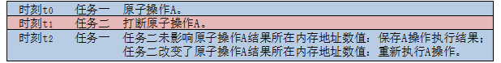

# 原子操作

---

##简介
原子操作（Atomic Operation）是指在操作系统层面看，不能被分割或者不会因为任务调度等原因被打断从而影响执行结果的操作命令。

OneOS操作系统提供一系列的原子操作API，用户调用这些操作命令时无需考虑任务调度等原因产生的影响。

---
## 原子操作实现原理



原子操作实现取决于硬件架构的内存互斥访问实现方式，因此是跟架构相关的。

时刻t0：起始时刻，任务一读取某内存地址数据执行某原子操作A;

时刻t1：由于任务调度发生，任务二打断任务一运算;

时刻t2：任务二执行完毕，任务一继续执行，原子操作A执行结束前检查之前读取内存地址数值是否已被更改：如已被更改则重新执行A操作；如未被更改则保存操作结果并退出。

因此，当原子操作完成时，总是保证其操作到结果保存期间对应内存地址内容未被其他操作改变。

### 支持架构

OneOS原子操作支持ARM v6m，v7m，v8m三种架构的所有单板。

---

## 重要定义及数据结构

### 原子类型定义

内核通过结构体定义原子类型如下，所有原子操作的操作对象都需要定义为原子类型。

```c
struct os_atomic
{
    volatile os_int32_t counter;
};
typedef struct os_atomic os_atomic_t;
```

### 原子类型变量初始化宏定义

内核提供一个初始化宏用于原子类型变量的初始化，建议用户使用该宏初始化原子类型变量。

```c
#define OS_ATOMIC_INIT(val)    {(val)}
例：
定义原子类型变量并初始化：os_atomic_t mem = OS_ATOMIC_INIT(0);
```
---

## API介绍

| **接口** | **说明** |
| :--- | :--- |
| os_atomic_read | 原子读操作 |
| os_atomic_set | 原子写操作 |
| os_atomic_add | 原子加操作 |
| os_atomic_sub | 原子减操作 |
| os_atomic_inc | 原子加1操作 |
| os_atomic_dec | 原子减1操作 |
| os_atomic_add_return | 带返回的原子加操作 |
| os_atomic_sub_return | 带返回的原子减操作 |
| os_atomic_inc_return | 带返回的原子加1操作 |
| os_atomic_dec_return | 带返回的原子减1操作 |
| os_atomic_xchg | 原子交换操作 |
| os_atomic_cmpxchg | 原子比较后交换操作 |
| os_atomic_and | 原子与操作 |
| os_atomic_or | 原子或操作 |
| os_atomic_nand | 原子与非操作 |
| os_atomic_xor | 原子异或操作 |
| os_atomic_test_bit | 原子位测试操作 |
| os_atomic_set_bit | 原子位设置操作 |
| os_atomic_clear_bit | 原子位清除操作 |
| os_atomic_change_bit | 原子位反转操作 |

### os_atomic_read

原子读操作，由宏定义实现，读取原子类型变量的数值，宏定义如下：

```c
#define os_atomic_read(ptr)    ((ptr)->counter)
```

| **宏参数** | **说明** |
| :--- | :--- |
| ptr | 要读取的原子类型变量的指针 |

### os_atomic_set

原子写操作，由宏定义实现，写入原子类型变量的数值，宏定义如下：

```c
#define os_atomic_set(ptr, value)    (((ptr)->counter) = (value))
```

| **宏参数** | **说明** |
| :--- | :--- |
| ptr | 要写入的原子类型变量的指针 |
| value | 写入值 |

### os_atomic_add

原子加，该函数实现原子类型变量的加法操作，函数原型如下：

```c
void os_atomic_add(os_atomic_t *mem, os_int32_t value);
```

| **参数** | **说明** |
| :--- | :--- |
| mem | 被加操作原子类型变量的指针 |
| value | 加的数值 |
| **返回** | **说明** |
| 无 | 无 |

### os_atomic_sub

原子减，该函数实现原子类型变量的减法操作，函数原型如下：

```c
void os_atomic_sub(os_atomic_t *mem, os_int32_t value);
```

| **参数** | **说明** |
| :--- | :--- |
| mem | 被减操作原子类型变量的指针 |
| value | 减的数值 |
| **返回** | **说明** |
| 无 | 无 |

### os_atomic_inc

原子加1，该函数实现原子类型变量的加1操作，函数原型如下：

```c
void os_atomic_inc(os_atomic_t *mem);
```

| **参数** | **说明** |
| :--- | :--- |
| mem | 被加1操作原子类型变量的指针 |
| **返回** | **说明** |
| 无 | 无 |

### os_atomic_dec

原子减1，该函数实现原子类型变量的减1操作，函数原型如下：

```c
void os_atomic_dec(os_atomic_t *mem);
```

| **参数** | **说明** |
| :--- | :--- |
| mem | 被减1操作原子类型变量的指针 |
| **返回** | **说明** |
| 无 | 无 |

### os_atomic_add_return

带返回的原子加，该函数实现原子类型变量的加法操作并返回结果，函数原型如下：

```c
os_int32_t os_atomic_add_return(os_atomic_t *mem, os_int32_t value);
```

| **参数** | **说明** |
| :--- | :--- |
| mem | 被加操作原子类型变量的指针 |
| value | 加的数值 |
| **返回** | **说明** |
| os_int32_t | 加运算后的结果 |

### os_atomic_sub_return

带返回的原子减，该函数实现原子类型变量的减法操作并返回结果，函数原型如下：

```c
os_int32_t os_atomic_sub_return(os_atomic_t *mem, os_int32_t value);
```

| **参数** | **说明** |
| :--- | :--- |
| mem | 被减操作原子类型变量的指针 |
| value | 减的数值 |
| **返回** | **说明** |
| os_int32_t | 减运算后的结果 |

### os_atomic_inc_return

带返回的原子加1，该函数实现原子类型变量的加1操作并返回结果，函数原型如下：

```c
os_int32_t os_atomic_inc_return(os_atomic_t *mem);
```

| **参数** | **说明** |
| :--- | :--- |
| mem | 被加1操作原子类型变量的指针 |
| **返回** | **说明** |
| os_int32_t | 加1运算后的结果 |

### os_atomic_dec_return

带返回的原子减1，该函数实现原子类型变量的减1操作并返回结果，函数原型如下：

```c
os_int32_t os_atomic_dec_return(os_atomic_t *mem);
```

| **参数** | **说明** |
| :--- | :--- |
| mem | 被减1操作原子类型变量的指针 |
| **返回** | **说明** |
| os_int32_t | 减1运算后的结果 |

### os_atomic_xchg

原子交换，该函数实现原子类型变量的交换操作并返回换出值，函数原型如下：

```c
os_int32_t os_atomic_xchg(os_atomic_t* mem, os_int32_t value);
```

| **参数** | **说明** |
| :--- | :--- |
| mem | 被交换操作原子类型变量的指针 |
| value | 换入值 |
| **返回** | **说明** |
| os_int32_t | 换出值 |

### os_atomic_cmpxchg

原子比较后交换，该函数实现原子类型变量的比较后交换操作，如与指定值相同则交换，如不同则不交换，并返回执行结果，函数原型如下：

```c
os_bool_t os_atomic_cmpxchg(os_atomic_t* mem, os_int32_t old, os_int32_t new);
```

| **参数** | **说明** |
| :--- | :--- |
| mem | 被比较交换操作原子类型变量的指针 |
| old | 比较值 |
| new | 换入值 |
| **返回** | **说明** |
| 0 | 交换不成功 |
| 1 | 交换成功 |

### os_atomic_and

原子与，该函数实现原子类型变量的按位与操作，函数原型如下：

```c
void os_atomic_and(os_atomic_t *mem, os_int32_t value);
```

| **参数** | **说明** |
| :--- | :--- |
| mem | 被与操作原子类型变量的指针 |
| value | 与值 |
| **返回** | **说明** |
| 无 | 无 |

### os_atomic_or

原子或，该函数实现原子类型变量的按位或操作，函数原型如下：

```c
void os_atomic_or(os_atomic_t *mem, os_int32_t value);
```

| **参数** | **说明** |
| :--- | :--- |
| mem | 被或操作原子类型变量的指针 |
| value | 或值 |
| **返回** | **说明** |
| 无 | 无 |

### os_atomic_nand

原子与非，该函数实现原子类型变量的按与非操作，函数原型如下：

```c
void os_atomic_nand(os_atomic_t *mem, os_int32_t value);
```

| **参数** | **说明** |
| :--- | :--- |
| mem | 被与非操作原子类型变量的指针 |
| value | 与非值 |
| **返回** | **说明** |
| 无 | 无 |

### os_atomic_xor

原子异或，该函数实现原子类型变量的按位异或操作，函数原型如下：

```c
void os_atomic_xor(os_atomic_t *mem, os_int32_t value);
```

| **参数** | **说明** |
| :--- | :--- |
| mem | 被异或操作原子类型变量的指针 |
| value | 异或值 |
| **返回** | **说明** |
| 无 | 无 |

### os_atomic_test_bit

原子位测试，该函数实现原子类型变量的位测试操作，函数原型如下：

```c
os_bool_t os_atomic_test_bit(os_atomic_t* mem, os_int32_t nr);
```

| **参数** | **说明** |
| :--- | :--- |
| mem | 被测试操作原子类型变量的指针 |
| nr | “mem”中需测试的位，取值范围为0～31 |
| **返回** | **说明** |
| 0 | nr位对应值为0 |
| 1 | nr位对应值为1 |

### os_atomic_set_bit

原子位设置，该函数实现原子类型变量的位设置操作，函数原型如下：

```c
void os_atomic_set_bit(os_atomic_t* mem, os_int32_t nr);
```

| **参数** | **说明** |
| :--- | :--- |
| mem | 被设置操作原子类型变量的指针 |
| nr | “mem”中需设置的位，取值范围为0～31 |
| **返回** | **说明** |
| 无 | 无 |

### os_atomic_clear_bit

原子位清除，该函数实现原子类型变量的位清除操作，函数原型如下：

```c
void os_atomic_clear_bit(os_atomic_t* mem, os_int32_t nr);
```

| **参数** | **说明** |
| :--- | :--- |
| mem | 被清除操作原子类型变量的指针 |
| nr | “mem”中需清除的位，取值范围为0～31 |
| **返回** | **说明** |
| 无 | 无 |

### os_atomic_change_bit

原子位反转，该函数实现原子类型变量的位反转操作，函数原型如下：

```c
void os_atomic_change_bit(os_atomic_t* mem, os_int32_t nr);
```

| **参数** | **说明** |
| :--- | :--- |
| mem | 被反转操作原子类型变量的指针 |
| nr | “mem”中需反转的位，如该位旧值为0则操作后为1，如旧值为1则操作后为0，取值范围为0～31 |
| **返回** | **说明** |
| 无 | 无 |

---

## 配置选项

OneOS的原子操作无需配置，对于所使用的具体硬件架构如提供API接口则支持原子操作，API接口声明在:  
“arch/...（对应硬件架构目录）.../include/arch_atomic.h”  
使用时请引用“arch_atomic.h”头文件。

---

## 应用示例

### 原子比较后交换操作应用示例

本例在main函数里初始化了一个原子类型变量为0，再通过原子比较后交换操作该变量，比较旧值为0，换入新值为0xff，最后打印出操作返回值和操作后变量值。

```c
#include <board.h>
#include <dlog.h>
#include "arch_atomic.h"

int main(void)
{
    #define TEST_TAG        "TEST"

	os_atomic_t mem = OS_ATOMIC_INIT(0);
	os_int32_t old = 0x0;
	os_int32_t new = 0xff;
    os_bool_t ret;
	ret = os_atomic_cmpxchg(&mem, old, new);
  	LOG_W(TEST_TAG, "exchange return:%d, mem = 0x%x", ret, (os_atomic_read(&mem)));

    return 0;
}
```

运行结果如下：

```c
sh>
W/TEST: exchange return:1, mem = 0xff
sh>
```
