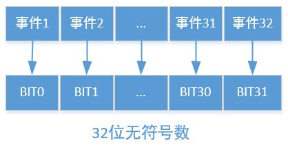
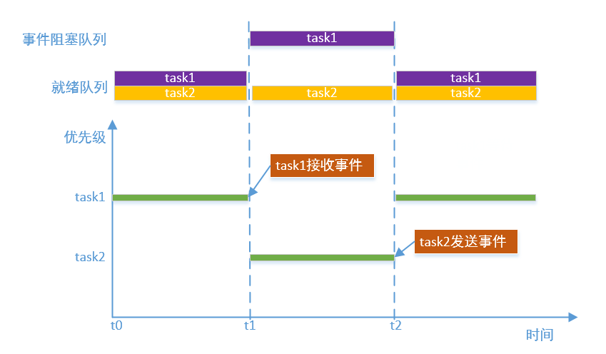
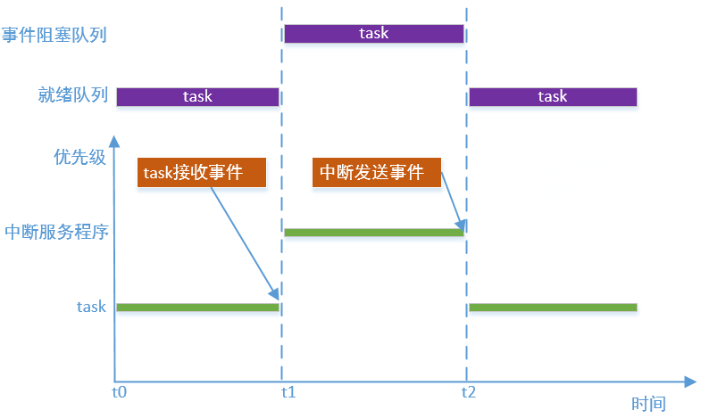

# 事件

---

## 简介

事件也是任务间同步的一种机制，如果任务需要等待某种特定的条件才能继续往下执行，就可以用事件实现。和信号量不同的是，事件可以通过“逻辑或”或者“逻辑与”将多个事件关联起来，形成事件集合，任务等待该事件集合满足条件之后，才会被唤醒，“逻辑或”指任务等到集合中的任意一个事件即可被唤醒，而“逻辑与”需要等到集合中的所有事件才会被唤醒；事件发送无法累积，如果多次向任务发送同一事件，且任务还没有清除该事件，则该事件只被视作发送1次，而信号量释放可以累积，每次释放资源数就会加1。

事件是通过一个32位无符号整形数据表示，其中每一个bit代表一个事件，1代表事件发生，0代表事件未发生，如下图



---

## 事件实现原理

事件也是基于阻塞队列实现，任务接收事件，事件未发生并且超时参数不为0，就会导致任务阻塞，并且任务被放到阻塞队列，当另一个任务发送阻塞任务需要的事件时，阻塞任务被唤醒，并被放到就绪队列，如下图:



## 事件实现中断和任务的同步

事件不仅可可以用于任务间的同步，还可以用于中断和任务间的同步。例如，某个任务需要等待某个特定的条件，而这个条件需要中断程序触发，就可以采用事件的方法，下图描述了任务等待事件，中断发送事件的过程：



---

## 重要定义及数据结构

### 事件宏定义

宏定义了阻塞任务的唤醒顺序和事件选项配置。

```c
#define OS_EVENT_WAKE_TYPE_PRIO     0x55
#define OS_EVENT_WAKE_TYPE_FIFO     0xAA

#define OS_EVENT_OPTION_AND         0x00000001
#define OS_EVENT_OPTION_OR          0x00000002
#define OS_EVENT_OPTION_CLEAR       0x00000004
#define OS_EVENT_OPTION_MASK        0x00000007
```

| **事件宏** | **说明** |
| :--- | :--- |
| OS_EVENT_WAKE_TYPE_PRIO | 按优先级唤醒 |
| OS_EVENT_WAKE_TYPE_FIFO | 按FIFO唤醒 |
| OS_EVENT_OPTION_AND | 任务在接收到所有的事件时才会被唤醒 |
| OS_EVENT_OPTION_OR | 任务在接收到任一事件就会被唤醒 |
| OS_EVENT_OPTION_CLEAR | 任务接收到事件后会清除相应事件 |
| OS_EVENT_OPTION_MASK | 选项掩码 |

### 事件控制块结构体

```c
struct os_event
{
    os_list_node_t  task_list_head;         /* Block task list head */
    os_list_node_t  resource_node;          /* Node in resource list */

    os_uint32_t     set;                    /* Event set. */
    os_uint8_t      object_inited;          /* If event object is inited, value is OS_KOBJ_INITED */
    os_uint8_t      object_alloc_type;      /* Indicates whether memory is allocated dynamically or statically,
                                               value is OS_KOBJ_ALLOC_TYPE_STATIC or OS_KOBJ_ALLOC_TYPE_DYNAMIC */
    os_uint8_t      wake_type;              /* The type to wake up blocking tasks, value is OS_EVENT_WAKE_TYPE_PRIO
                                               or OS_EVENT_WAKE_TYPE_FIFO */
    char            name[OS_NAME_MAX + 1];  /* Event name */
};
```

| **事件控制块成员变量** | **说明** |
| :--- | :--- |
| task_list_head | 任务阻塞队列头，任务监听事件未发生时将其阻塞在该队列上 |
| resource_node | 资源管理节点，通过该节点将创建的事件挂载到gs_os_event_resource_list_head上 |
| set | 已发生事件集 |
| object_inited | 初始化状态，0x55表示已经初始化，0xAA表示已经去初始化，其他值为未初始化 |
| object_alloc_type | 事件类型，0为静态事件，1为动态事件 |
| wake_type | 阻塞任务唤醒方式，0x55表示按优先级唤醒，0xAA表示按FIFO唤醒。可以通过属性设置接口进行设置 |
| name | 事件名字，名字长度不能大于OS_NAME_MAX |

---

## API介绍

| **接口** | **说明** |
| :--- | :--- |
| os\_event\_init | 以静态方式初始化事件，事件对象的内存空间由使用者提供 |
| os\_event\_deinit | 去初始化事件，与os\_event\_init\(\)配合使用 |
| os\_event\_create | 以动态方式创建并初始化事件，事件对象的内存空间采用动态申请的方式获得 |
| os\_event\_destroy | 销毁事件，与os\_event\_create\(\)配合使用 |
| os\_event\_send | 发送事件 |
| os\_event\_recv | 接收事件，若暂时没有满足条件的事件，且设定了超时时间，则当前任务会阻塞 |
| os\_event\_clear | 清除事件控制块中特定的事件集 |
| os_event_get | 查询事件控制块中已发生的事件集 |
| os_event_set_wake_type | 设置阻塞任务的唤醒类型 |

### os\_event\_init

该函数以静态方式初始化事件，事件对象的内存空间由使用者提供，函数原型如下：

```c
os_err_t os_event_init(os_event_t *event, const char *name);
```

| **参数** | **说明** |
| :--- | :--- |
| event | 事件控制块，由用户提供，并指向对应的事件控制块内存地址 |
| name | 事件名字，其最大长度由OS_NAME_MAX 宏指定，多余部分会被自动截掉 |
| **返回** | **说明** |
| OS\_EOK | 初始化事件成功 |
| OS\_EINVAL | 无效参数 |

### os\_event\_deinit

该函数用于去初始化事件，与os\_event\_init\(\)配合使用，函数原型如下：

```c
os_err_t os_event_deinit(os_event_t *event);
```

| **参数** | **说明** |
| :--- | :--- |
| event | 事件控制块 |
| **返回** | **说明** |
| OS\_EOK | 去初始化事件成功 |

### os\_event\_create

该函数以动态方式创建并初始化事件，事件对象的内存空间采用动态申请的方式获得，函数原型如下：

```c
os_event_t *os_event_create(const char *name);
```

| **参数** | **说明** |
| :--- | :--- |
| name | 事件名字，其最大长度由OS_NAME_MAX 宏指定，多余部分会被自动截掉 |
| **返回** | **说明** |
| 非OS\_NULL | 事件创建成功 |
| OS\_NULL | 事件创建失败 |

### os\_event\_destroy

该函数用于销毁事件，与os\_event\_create\(\)配合使用，函数原型如下：

```c
os_err_t os_event_destroy(os_event_t *event);
```

| **参数** | **说明** |
| :--- | :--- |
| event | 事件控制块 |
| **返回** | **说明** |
| OS\_EOK | 事件销毁成功 |

### os\_event\_send

该函数用于发送事件，函数原型如下：

```c
os_err_t os_event_send(os_event_t *event, os_uint32_t set);
```

| **参数** | **说明** |
| :--- | :--- |
| event | 事件控制块 |
| set | 待发送的事件集，事件集不为0 |
| **返回** | **说明** |
| OS\_EOK | 事件发送成功 |

### os\_event\_recv

该函数用于接收事件，若暂时没有满足条件的事件，且设定了超时时间，则当前任务会阻塞，函数原型如下：

```c
os_err_t os_event_recv(os_event_t  *event,
                       os_uint32_t  interested_set,
                       os_uint32_t  option,
                       os_tick_t    timeout,
                       os_uint32_t *recved_set);
```

| **参数** | **说明** |
| :--- | :--- |
| event | 事件控制块 |
| interested\_set | 接收感兴趣事件集合 |
| option | 选项，可取值OS_EVENT_OPTION_AND和OS_EVENT_OPTION_OR；若取值OS_EVENT_OPTION_AND，任务在接收到所有的事件时才会被唤醒；若取值OS_EVENT_OPTION_OR，任务在接收到任一事件就会被唤醒；OS_EVENT_OPTION_AND或者OS_EVENT_OPTION_OR可与OS_EVENT_OPTION_CLEAR取“逻辑或”，表明接收到事件后会清除相应事件 |
| timeout | 事件暂时获取不到时的等待超时时间。若为OS_NO_WAIT，则等待时间为0；若为OS_WAIT_FOREVER，则永久等待直到获取到事件；若为其它值，则等待timeout时间或者获取到事件为止，并且其他值时timeout必须小于OS_TICK_MAX / 2 |
| recved\_set | 接收到的事件集合 |
| **返回** | **说明** |
| OS\_EOK | 事件接收成功 |
| OS\_EEMPTY | 不等待且未接收到事件 |
| OS\_ETIMEOUT | 等待超时未接收到事件 |
| OS\_EINVAL | option参数错误 |
| OS\_ERROR | 其它错误 |

### os\_event\_clear

该函数用于清除事件控制块中特定的事件集，函数原型如下：

```c
os_err_t os_event_clear(os_event_t *event, os_uint32_t interested_clear);
```

| **参数** | **说明** |
| :--- | :--- |
| event | 事件控制块 |
| interested_clear | 待清除的事件集 |
| **返回** | **说明** |
| OS\_EOK | 清除事件集成功 |

### os\_event\_get

该函数用于查询事件控制块中已发生的事件集，函数原型如下：

```c
os_int32_t os_event_get(os_event_t *event);
```

| **参数** | **说明** |
| :--- | :--- |
| event | 事件控制块 |
| **返回** | **说明** |
| os\_int32\_t | 已发生的事件集 |

### os\_event\_set\_wake\_type

该函数用于设置阻塞任务的唤醒类型，函数原型如下：

```c
os_err_t os_event_set_wake_type(os_event_t *event, os_uint8_t wake_type);
```

| **参数** | **说明** |
| :--- | :--- |
| event | 事件控制块 |
| wake_type | OS_EVENT_WAKE_TYPE_PRIO为设置唤醒阻塞任务的类型为按优先级唤醒(事件创建后默认为使用此方式)，OS_EVENT_WAKE_TYPE_FIFO 为设置唤醒阻塞任务的类型为先进先出唤醒 |
| **返回** | **说明** |
| OS\_EOK | 设置唤醒阻塞任务类型成功 |
| OS\_EBUSY | 设置唤醒阻塞任务类型失败 |

---

## 配置选项

OneOS在使用事件时提供了功能裁剪的配置，具体配置如下所示:

```
(Top) → Kernel→ Inter-task communication and synchronization
                                              OneOS Configuration
-*- Enable mutex
[ ] Enable spinlock check
[*] Enable semaphore
[*] Enable event flag
[*] Enable message queue
[*] Enable mailbox
```

| **配置项** | **说明** |
| :--- | :--- |
| Enable event flag | 使能事件功能，如果不使能该功能，事件相关的源代码就不会编译，默认使能 |

---

## 应用示例

### 静态事件应用示例

本例用静态的方式初始化了一个事件对象，接收事件的任务采用“逻辑或”的方式接收多个事件，只要接收到一个事件，就会被唤醒

```c
#include <oneos_config.h>
#include <dlog.h>
#include <os_errno.h>
#include <os_task.h>
#include <shell.h>
#include <os_event.h>

#define TEST_TAG        "TEST"
#define TASK_STACK_SIZE 1024
#define TASK_PRIORITY   15

#define EVENT_FLAG_0 (1 << 0)
#define EVENT_FLAG_1 (1 << 1)
#define EVENT_FLAG_2 (1 << 2)

static os_event_t event_static;

void task_entry(void *para)
{
    os_uint32_t recv_event;

    while (1)
    {
        if (os_event_recv(&event_static, (EVENT_FLAG_0 | EVENT_FLAG_1 | EVENT_FLAG_2),
                          OS_EVENT_OPTION_OR | OS_EVENT_OPTION_CLEAR,
                          OS_WAIT_FOREVER, &recv_event) == OS_EOK)
        {
            LOG_W(TEST_TAG, "task: OR recv event:0x%x", recv_event);
        }
    }
}

void event_static_sample(void)
{
    os_task_t *task = OS_NULL;

    os_event_init(&event_static, "event_static");

    task = os_task_create("task_event",
                           task_entry,
                           OS_NULL,
                           TASK_STACK_SIZE,
                           TASK_PRIORITY);
    if (task)
    {
        os_task_startup(task);
    }

    LOG_W(TEST_TAG, "event_static_sample: send event:0x%x", EVENT_FLAG_0);
    os_event_send(&event_static, EVENT_FLAG_0);
    os_task_msleep(400);

    LOG_W(TEST_TAG, "event_static_sample: send event:0x%x", EVENT_FLAG_1);
    os_event_send(&event_static, EVENT_FLAG_1);
    os_task_msleep(400);

    LOG_W(TEST_TAG, "event_static_sample: send event:0x%x", EVENT_FLAG_2);
    os_event_send(&event_static, EVENT_FLAG_2);
    os_task_msleep(400);

    LOG_W(TEST_TAG, "event_static_sample: send event:0x%x", EVENT_FLAG_0);
    os_event_send(&event_static, EVENT_FLAG_0);
    os_task_msleep(400);

    LOG_W(TEST_TAG, "event_static_sample: send event:0x%x", EVENT_FLAG_1);
    os_event_send(&event_static, EVENT_FLAG_1);
    os_task_msleep(400);

    LOG_W(TEST_TAG, "event_static_sample: send event:0x%x", EVENT_FLAG_2);
    os_event_send(&event_static, EVENT_FLAG_2);
    os_task_msleep(400);
}

SH_CMD_EXPORT(static_event, event_static_sample, "test staitc event");
```

运行结果如下：

```c
sh>static_event
W/TEST: event_static_sample: send event:0x1
W/TEST: task: OR recv event:0x1
W/TEST: event_static_sample: send event:0x2
W/TEST: task: OR recv event:0x2
W/TEST: event_static_sample: send event:0x4
W/TEST: task: OR recv event:0x4
W/TEST: event_static_sample: send event:0x1
W/TEST: task: OR recv event:0x1
W/TEST: event_static_sample: send event:0x2
W/TEST: task: OR recv event:0x2
W/TEST: event_static_sample: send event:0x4
W/TEST: task: OR recv event:0x4
```

### 动态事件应用示例

本例用动态的方式创建并初始化了一个事件对象，接收事件的任务采用“逻辑与”的方式接收多个事件，在多个事件都接收到之后，才会被唤醒

```c
#include <oneos_config.h>
#include <dlog.h>
#include <os_errno.h>
#include <os_task.h>
#include <shell.h>
#include <os_event.h>

#define TEST_TAG        "TEST"
#define TASK_STACK_SIZE 1024
#define TASK_PRIORITY   15

#define EVENT_FLAG_0 (1 << 0)
#define EVENT_FLAG_1 (1 << 1)
#define EVENT_FLAG_2 (1 << 2)

static os_event_t *event_dynamic = OS_NULL;

void task_entry(void *para)
{
    os_uint32_t recv_event;

    while (1)
    {
        if (os_event_recv(event_dynamic, (EVENT_FLAG_0 | EVENT_FLAG_1 | EVENT_FLAG_2),
                          OS_EVENT_OPTION_AND | OS_EVENT_OPTION_CLEAR,
                          OS_WAIT_FOREVER, &recv_event) == OS_EOK)
        {
            LOG_W(TEST_TAG, "task: AND recv event:0x%x", recv_event);
        }
    }
}

void event_dynamic_sample(void)
{
    os_task_t *task = OS_NULL;

    event_dynamic = os_event_create("event_dynamic");
    if (!event_dynamic)
    {
        LOG_E(TEST_TAG, "event_dynamic_sample: event create err");
        return;
    }

    task = os_task_create("task_event",
                           task_entry,
                           OS_NULL,
                           TASK_STACK_SIZE,
                           TASK_PRIORITY);

    if (task)
    {
        os_task_startup(task);
    }

    LOG_W(TEST_TAG, "event_dynamic_sample: send event:0x%x", EVENT_FLAG_0);
    os_event_send(event_dynamic, EVENT_FLAG_0);
    os_task_msleep(400);

    LOG_W(TEST_TAG, "event_dynamic_sample: send event:0x%x", EVENT_FLAG_1);
    os_event_send(event_dynamic, EVENT_FLAG_1);
    os_task_msleep(400);

    LOG_W(TEST_TAG, "event_dynamic_sample: send event:0x%x", EVENT_FLAG_2);
    os_event_send(event_dynamic, EVENT_FLAG_2);
    os_task_msleep(400);

    LOG_W(TEST_TAG, "event_dynamic_sample: send event:0x%x", EVENT_FLAG_0);
    os_event_send(event_dynamic, EVENT_FLAG_0);
    os_task_msleep(400);

    LOG_W(TEST_TAG, "event_dynamic_sample: send event:0x%x", EVENT_FLAG_1);
    os_event_send(event_dynamic, EVENT_FLAG_1);
    os_task_msleep(400);

    LOG_W(TEST_TAG, "event_dynamic_sample: send event:0x%x", EVENT_FLAG_2);
    os_event_send(event_dynamic, EVENT_FLAG_2);
    os_task_msleep(400);
}

SH_CMD_EXPORT(dynamic_event, event_dynamic_sample, "test dynamic event");
```

运行结果如下：

```c
sh>dynamic_event
W/TEST: event_dynamic_sample: send event:0x1
W/TEST: event_dynamic_sample: send event:0x2
W/TEST: event_dynamic_sample: send event:0x4
W/TEST: task: AND recv event:0x7
W/TEST: event_dynamic_sample: send event:0x1
W/TEST: event_dynamic_sample: send event:0x2
W/TEST: event_dynamic_sample: send event:0x4
W/TEST: task: AND recv event:0x7
```
