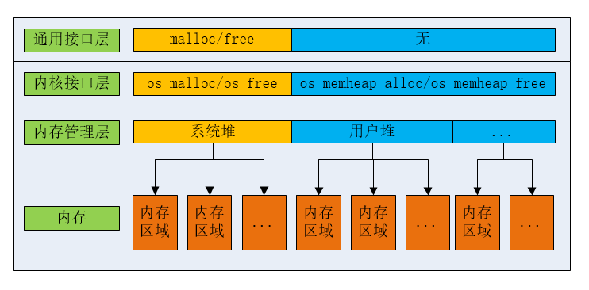
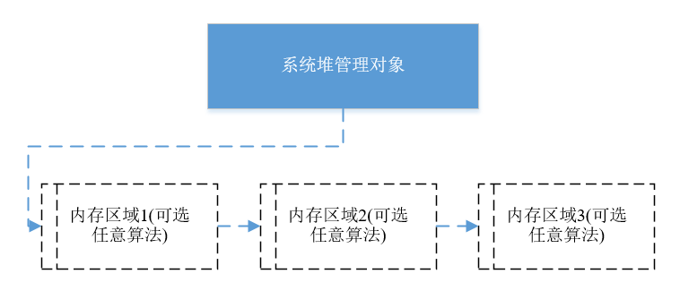

# 内存堆管理

## 简介

OneOS内存堆管理主要包含以下功能:
- 支持系统堆功能;
- 支持应用程序单独创建自己的内存堆;
- 每个内存堆支持管理多个内存区域；
- 支持多种内存算法。

内存堆管理整体框架如下：

---

## 系统堆功能说明
OneOS把程序链接后剩余的内存空间放置于系统堆中,应用程序可以直接使用os_malloc/os_free来申请内存和释放内存，对于链接了标准的C库的系统可以直接使用malloc/free实现内存堆管理。
创建系统堆主要包含以下步骤:  
1.首先使用os_sys_heap_init初始化系统堆管理对象；  
2.然后通过os_sys_heap_add指定管理内存的起始地址，长度和算法；  
3.如果还有另外一段内存(和之前的添加的空间不连续)，用户可以再次使用os_sys_heap_add把这段内存加入到系统内存堆中，这样实现了管理不连续内存空间。  
需要说明的是第一次添加的内存区域和第二次添加的内存可以使用不同的内存堆管理算法。在用户申请内存时总是先从第一个内存区域查找,如果没有可用区域，再从第二个内存区域查找。多个内存区域的系统堆如下图所示：




## 应用程序创建自己的堆
应用程序在某些场景下需要有自己的堆（后续简称用户堆）。应用程序通过以下步骤实现用户堆的创建:  
1.使用os_memheap_init初始化用户堆管理对象；  
2.找寻一块没有使用的内存区域。内存区域的来源有以下几种:  
+ 静态区域(例如一个全局数组)  
+ 使用动态分配(使用os_malloc申请一片内存区域)；  
+ 程序链接后未使用的内存区域。  

3.通过os_memheap_add指定管理内存的起始地址，长度和算法。  

通过以上操作后可以直接使用os_memheap_alloc/os_memheap_free来申请内存和释放内存。如果用户堆需要管理不连续的内存区域，再次调用os_memheap_add即可完成内存区域的添加。

## 内存堆管理算法

OneOS提供了两种内存堆管理算法，包括first-fit管理算法、buddy管理算法。

first-fit管理算法,主要由以下特点:
- 将内存以chunk的形式进行管理,而chunk的基本单位是8字节;
- 申请内存的最小单位为8字节，有效的减少内存碎片问题;
- 内部查找空闲区基于位图和哈希桶算法，有效提高内存空闲区查找速度；
- 适用于各类场景，由于此算法浪费空间比较少，内存资源匮乏的系统推荐使用此算法。

buddy算法是为了内存管理能够快速响应请求，尽可能地在提高内存利用率的同时减少内存碎片的一种算法，主要有以下特点：
- 伙伴算法是按2的幂次方大小进行分配内存块，避免把大的内存块拆的太碎，更重要的是使分配和释放过程迅速；
- 分配的内存(包含内存块头信息)总是为2的幂次方，会有部分页面浪费；
- 适用于不太在意内存浪费而又需要内存申请释放效率敏感的内存较大的系统。

**注意事项：**
因为内存堆管理接口可能引起当前上下文被挂起等待，所以中断服务例程中不能使用分配或释放动态内存块。

---

## 重要定义及数据结构

### 内存算法枚举
```c
enum os_mem_alg
{
#ifdef OS_USING_ALG_FIRSTFIT
    OS_MEM_ALG_FIRSTFIT,
#endif
#ifdef OS_USING_ALG_BUDDY
    OS_MEM_ALG_BUDDY,
#endif
    OS_MEM_ALG_DEFAULT          /*Use default memory algorithm */
};
```
| **内存算法枚举** | **说明** |
| :--- | :--- |
| OS\_MEM\_ALG\_FIRSTFIT | first-fit管理算法 |
| OS\_MEM\_ALG\_BUDDY | buddy管理算法 |
| OS\_MEM\_ALG\_DEFAULT | 默认算法，系统支持的第一个算法 |

### 内存堆结构体
```c
struct os_memheap
{
    struct heap_mem            *h_mem;
    os_uint8_t                  object_inited;
    char                        name[OS_NAME_MAX + 1];
    os_list_node_t              resource_node;          /* Node in resource list */
};
```
| **内存堆对象成员变量** | **说明** |
| :--- | :--- |
| h\_mem | 该内存堆的第一个内存区域控制块的指针 |
| object\_inited | 标记该内存堆对象是否已初始化 |
| name | 内存堆的名字，最大字符长度不超过OS_NAME_MAX |
| resource\_node | 资源节点，用于将该内存堆对象挂到内存堆的全局资源链表头 |

```c
struct os_meminfo 
{
    os_size_t                   mem_total;
    os_size_t                   mem_used;
    os_size_t                   mem_maxused;
};
typedef struct os_meminfo os_meminfo_t;
```
| **内存堆信息成员变量** | **说明** |
| :--- | :--- |
| mem\_total | 内存堆对象总空间大小 |
| mem\_used | 内存堆对象已分配空间大小 |
| mem\_maxused | 内存堆对象最大分配空间大小 |

---
## API介绍

| **接口** | **说明** |
| :--- | :--- |
| os\_sys\_heap\_init | 系统堆初始化接口，系统初始化时调用 |
| os\_sys\_heap\_add | 添加一个内存区域到系统堆，系统初始化时调用 |
| os\_malloc | 从系统堆上分配指定大小的内存 |
| os\_aligned\_malloc | 从系统堆上分配指定对齐长度、指定大小的内存 |
| os\_realloc | 更改已经分配的内存空间 |
| os\_calloc | 分配连续的多个内存块,分配成功后初始化内存为0 |
| os\_free | 释放内存 |
| os\_memory\_info | 返回系统堆对象信息 |
| os\_memory\_check | 校验系统堆对象 |
| os\_memory\_trace | 追踪系统堆被每个任务分配的内存|
| os\_memheap\_init | 初始化一个内存堆对象 |
| os\_memheap\_add | 向内存堆对象添加一个内存区域，可指定管理算法 |
| os\_memheap\_alloc | 在os\_memheap\_init\(\)初始化的内存堆上分配一块内存 |
| os\_memheap\_aligned\_alloc | 在os\_memheap\_init\(\)初始化的内存堆上分配指定对齐长度、指定大小的内存 |
| os\_memheap\_realloc | 调整通过os\_memheap\_alloc\(\)分配的内存 |
| os\_memheap\_free | 释放通过os\_memheap\_alloc\(\)分配的内存 |
| os\_memheap\_info | 返回内存堆对象信息 |
| os\_memheap\_check | 校验内存堆对象 |
| os\_memheap\_trace | 追踪内存堆被每个任务分配的内存 |

### os\_sys\_heap\_init 

该函数为初始化系统堆，必须在系统初始化时调用此接口，函数原型如下：

```c
void os_sys_heap_init(void);
```

| **参数** | **说明** |
| :--- | :--- |
| 无       | 无       |
| **返回** | **说明** |
| 无 | 无 |

### os\_sys\_heap\_add

该函数添加一个内存区域到系统堆，系统初始化时调用，函数原型如下：

```c
os_err_t os_sys_heap_add(void *start_addr, os_size_t size, enum os_mem_alg alg);
```

| **参数** | **说明** |
| :--- | :--- |
| start_addr | 内存区域首地址 |
| size | 内存区域空间大小 |
| alg | 此内存区域管理算法，可选OS\_MEM\_ALG\_FIRSTFIT(first-fit管理算法)、OS\_MEM\_ALG\_BUDDY(buddy管理算法) |
| **返回** | **说明** |
| OS\_EOK | 添加成功 |
| OS_EINVAL | 指定的内存区域和其他内存堆管理的区域重叠                     |
| OS_ENOMEM | 指定的内存区域太小，不能满足内存堆使用最小空间 |

### os\_malloc

该函数从系统堆上分配指定大小的内存，函数原型如下：

```c
void *os_malloc(os_size_t size);
```

| **参数** | **说明** |
| :--- | :--- |
| size | 分配内存的大小 |
| **返回** | **说明** |
| 非OS\_NULL | 分配成功，返回分配的内存地址 |
| OS\_NULL | 分配失败 |

### os\_aligned\_malloc

该函数分配由allign指定的字节对齐的内存，allign的大小为2的幂，函数原型如下：

```c
void *os_aligned_malloc(os_size_t align, os_size_t size);
```

| **参数** | **说明** |
| :--- | :--- |
| align | 对齐的大小，allign的大小必须为2的幂 |
| size | 分配内存的大小 |
| **返回** | **说明** |
| 非OS\_NULL | 分配成功，返回分配的内存地址 |
| OS\_NULL | 分配失败 |

### os\_realloc

该函数重新分配内存，并保留原有数据（若缩小内存，会截断数据），函数原型如下：

```c
void *os_realloc(void *ptr, os_size_t size);
```

| **参数** | **说明** |
| :--- | :--- |
| ptr | 原有已分配内存的地址 |
| size | 新内存大小 |
| **返回** | **说明** |
| 非OS\_NULL | 重新分配成功，返回调整之后的内存地址，此地址可能与原有地址不同 |
| OS\_NULL | 重新分配失败 |

### os\_calloc

该函数分配连续的多个内存块，并初始化为0，函数原型如下：

```c
void *os_calloc(os_size_t count, os_size_t size);
```

| **参数** | **说明** |
| :--- | :--- |
| count | 元素的个数 |
| size | 每个元素的字节数 |
| **返回** | **说明** |
| 非OS\_NULL | 分配成功，且内存区域初始化为0 |
| OS\_NULL | 分配失败 |

### os\_free

该函数释放由os\_malloc/os\_realloc/os\_calloc等分配的内存，函数原型如下：

```c
void  os_free(void *ptr);
```

| **参数** | **说明** |
| :--- | :--- |
| ptr | 待释放内存的地址 |
| **返回** | **说明** |
| 无 | 无 |

### os\_memory\_info

该函数返回系统堆对象信息，包括内存大小、内存使用大小、最大使用大小，函数原型如下：

```c
void os_memory_info(os_meminfo_t *info);
```

| **参数** | **说明** |
| :--- | :--- |
| info | 返回系统堆对象信息 |
| **返回** | **说明** |
| 无 | 无 |

### os\_memory\_check

该函数校验系统堆对象，主要校验已分配内存和空闲内存的组织关系时候正确，函数原型如下：

```c
os_err_t os_memory_check(void);
```

| **参数** | **说明** |
| :--- | :--- |
| 无 | 无 |
| **返回** | **说明** |
| OS_EOK | 校验成功 |
| OS_ERROR | 校验失败 |

### os\_memory\_trace

该函数追踪系统堆被每个任务分配的内存的情况，提示的信息包括任务名称，任务分配的内存起始地址和大小，函数原型如下：

```c
os_err_t os_memory_trace(void);
```

| **参数** | **说明** |
| :--- | :--- |
| 无 | 无 |
| **返回** | **说明** |
| OS_EOK | 追踪成功 |
| OS_ERROR | 追踪失败 |

### os\_memheap\_init

该函数初始化一个内存堆对象，函数原型如下:

```c
os_err_t os_memheap_init(os_memheap_t *heap, const char *name);
```

| **参数** | **说明** |
| :--- | :--- |
| heap | 内存堆对象句柄 |
| name | 名字 |
| **返回** | **说明** |
| OS\_EOK | 初始化成功 |
| OS\_EINVAL | 内存对象重复初始化 |

### os\_memheap\_add 

该函数添加一个内存区域到一个已经被初始化的内存堆对象中，添加的内存区域需要指定管理算法，函数原型如下：

```c
os_err_t os_memheap_add(os_memheap_t *heap, void *start_addr, os_size_t size, enum os_mem_alg alg);
```

| **参数** | **说明** |
| :--- | :--- |
| heap | 内存堆对象句柄 |
| start_addr | 内存区域首地址 |
| size | 内存区域空间大小 |
| alg | 此内存区域管理算法，可选OS\_MEM\_ALG\_FIRSTFIT(first-fit管理算法)、OS\_MEM\_ALG\_BUDDY(buddy管理算法) |
| **返回** | **说明** |
| OS\_EOK | 添加成功 |
| OS_EINVAL | 指定的内存区域和其他内存堆管理的区域重叠       |
| OS_ENOMEM | 指定的内存区域太小，不能满足内存堆使用最小空间 |

### os\_memheap\_alloc

该函数在指定内存对象上分配内存，函数原型如下：

```c
void *os_memheap_alloc(struct os_memheap *heap, os_size_t size);
```

| **参数** | **说明** |
| :--- | :--- |
| heap | 内存堆对象句柄 |
| size | 分配内存的大小 |
| **返回** | **说明** |
| 非OS\_NULL | 分配成功，返回分配的内存地址 |
| OS\_NULL | 分配失败 |

### os\_memheap\_aligned\_alloc

该函数在指定内存对象上分配由allign指定的字节对齐的内存，allign的大小为2的幂，函数原型如下：

```c
void *os_memheap_aligned_alloc(os_memheap_t *heap, os_size_t align, os_size_t size);
```

| **参数** | **说明** |
| :--- | :--- |
| heap | 内存堆对象句柄 |
| align | 对齐的大小，allign的大小必须为2的幂 |
| size | 分配内存的大小 |
| **返回** | **说明** |
| 非OS\_NULL | 分配成功，返回分配的内存地址 |
| OS\_NULL | 分配失败 |

### os\_memheap\_realloc

该函数在指定内存对象上重新分配内存，并保留原有数据（若缩小内存，会截断数据），函数原型如下：

```c
void *os_memheap_realloc(os_memheap_t *heap, void *ptr, os_size_t size);
```

| **参数** | **说明** |
| :--- | :--- |
| heap | 内存堆对象句柄 |
| ptr | 待调整的内存地址 |
| size | 待重新分配的新大小 |
| **返回** | **说明** |
| 非OS\_NULL | 调整成功，返回分配的内存地址 |
| OS\_NULL | 调整失败 |

### os\_memheap\_free

该函数释放由os\_memheap\_alloc\(\)或os\_memheap\_realloc\(\)申请的内存，函数原型如下：

```c
void os_memheap_free(os_memheap_t *heap, void *ptr);
```

| **参数** | **说明** |
| :--- | :--- |
| heap | 内存堆对象句柄 |
| ptr | 待释放内存的地址 |
| **返回** | **说明** |
| 无 | 无 |

### os\_memheap\_info

该函数返回内存堆对象信息，包括内存大小、内存使用大小、最大使用大小，函数原型如下：

```c
void os_memheap_info(os_memheap_t *heap, os_meminfo_t *info);
```

| **参数** | **说明** |
| :--- | :--- |
| heap | 内存堆对象句柄 |
| info | 返回系统堆对象信息 |
| **返回** | **说明** |
| 无 | 无 |

### os\_memheap\_trace

该函数追踪内存堆被每个任务分配的内存的情况，提示的信号包括任务名称，任务分配的内存起始地址和大小，函数原型如下：

```c
os_err_t os_memheap_trace(os_memheap_t *heap);
```

| **参数** | **说明** |
| :--- | :--- |
| heap | 内存堆对象句柄 |
| **返回** | **说明** |
| OS_EOK | 追踪成功 |
| OS_ERROR | 追踪失败 |

### os\_memheap\_check

该函数校验内存堆对象，主要校验已分配内存和空闲内存的组织关系时候正确，函数原型如下：

```c
os_err_t os_memheap_check(os_memheap_t *heap);
```

| **参数** | **说明** |
| :--- | :--- |
| 无 | 无 |
| **返回** | **说明** |
| OS_EOK | 校验成功 |
| OS_ERROR | 校验失败 |

---
## 配置选项
   OneOS在使用内存堆时提供了一些功能选项和裁剪的配置，具体配置如下所示:

```
(Top) → Kernel→ Memory management
                                              OneOS Configuration
[*] Enable System-Memory-Heap
-*- Enable Memory-Heap
[*] Enable FIRSTFIT memory algorithm
[ ] Enable BUDDY memory algorithm
[ ] Enable memory trace
[*] Enable Memory-Pool
[ ]     Enable Memory-Pool check tag
```

| **配置项** | **说明** |
| :--- | :--- |
| Enable System-Memory-Heap| OneOS使能系统堆功能 |
| Enable FIRSTFIT memory algorithm | OneOS支持firstfit管理算法 |
| Enable BUDDY memory algorithm | OneOS支持buddy管理算法 |

---

## 使用示例

### 内存堆管理使用示例

本例配置为使能系统堆并采用firstfit管理算法。展示了使用os\_malloc和os\_free申请和释放内存，使用os\_realloc重新分配内存，注意os\_realloc重新分配内存的地址可能与原始地址不同

```c
#include <oneos_config.h>
#include <dlog.h>
#include <os_errno.h>
#include <shell.h>
#include <os_memory.h>

#define TEST_TAG        "TEST"

#define TEST_MALLOC_TIMES   20

void sys_heap_sample(void)
{
    os_uint32_t i = 0;    
    os_uint32_t size = 0;    
    void *ptr = OS_NULL;    
    void *ptr_new = OS_NULL;
    void *ptr_old = OS_NULL;

    for (i = 0; i < TEST_MALLOC_TIMES; i++)
    {
        size = (1 << i);
        ptr = os_malloc(size);

        if (ptr)
        {
            LOG_W(TEST_TAG, "malloc memory:%p size:%d", ptr, size);
            os_free(ptr);
            LOG_W(TEST_TAG, "free memory  :%p size:%d", ptr, size);
            ptr = OS_NULL;
        }
        else
        {
            LOG_W(TEST_TAG, "try to get %d byte memory failed!", size);
            break;
        }
    }

    ptr_new = os_malloc(100);
    if (ptr_new)
    {
        LOG_W(TEST_TAG, "malloc memory:%p size:%d", ptr_new, 100);
    }
    else
    {
        LOG_W(TEST_TAG, "try to get %d byte memory failed!", 100);
    }
    
    for (i = 0; i < TEST_MALLOC_TIMES; i++)
    {        
        size = (1 << i);
        ptr_old = ptr_new;
        ptr_new = os_realloc(ptr_old, size);
        if (ptr_new)
        {
            LOG_W(TEST_TAG, "realloc memory:%p size:%d", ptr_new, size);
        }
        else
        {
            LOG_W(TEST_TAG, "try to realloc %d byte memory failed!", size);
            os_free(ptr_old);
            break;
        }
    }
    
    if (ptr_new)
    {
        os_free(ptr_new);
    }
}

SH_CMD_EXPORT(sys_heap_sample, sys_heap_sample, "test sys heap");
```

运行结果如下：

```c
sh>sys_heap_sample
W/TEST: malloc memory:2000351c size:1
W/TEST: free memory  :2000351c size:1
W/TEST: malloc memory:2000351c size:2
W/TEST: free memory  :2000351c size:2
W/TEST: malloc memory:2000351c size:4
W/TEST: free memory  :2000351c size:4
W/TEST: malloc memory:2000351c size:8
W/TEST: free memory  :2000351c size:8
W/TEST: malloc memory:2000351c size:16
W/TEST: free memory  :2000351c size:16
W/TEST: malloc memory:2000351c size:32
W/TEST: free memory  :2000351c size:32
W/TEST: malloc memory:2000351c size:64
W/TEST: free memory  :2000351c size:64
W/TEST: malloc memory:2000351c size:128
W/TEST: free memory  :2000351c size:128
W/TEST: malloc memory:2000351c size:256
W/TEST: free memory  :2000351c size:256
W/TEST: malloc memory:2000351c size:512
W/TEST: free memory  :2000351c size:512
W/TEST: malloc memory:2000351c size:1024
W/TEST: free memory  :2000351c size:1024
W/TEST: malloc memory:2000351c size:2048
W/TEST: free memory  :2000351c size:2048
W/TEST: malloc memory:20004b44 size:4096
W/TEST: free memory  :20004b44 size:4096
W/TEST: malloc memory:20004b44 size:8192
W/TEST: free memory  :20004b44 size:8192
W/TEST: malloc memory:20004b44 size:16384
W/TEST: free memory  :20004b44 size:16384
W/TEST: malloc memory:20004b44 size:32768
W/TEST: free memory  :20004b44 size:32768
W/TEST: malloc memory:20004b44 size:65536
W/TEST: free memory  :20004b44 size:65536
W/TEST: try to get 131072 byte memory failed!
W/TEST: malloc memory:2000351c size:100
W/TEST: realloc memory:2000351c size:1
W/TEST: realloc memory:2000351c size:2
W/TEST: realloc memory:2000351c size:4
W/TEST: realloc memory:20003524 size:8
W/TEST: realloc memory:20003534 size:16
W/TEST: realloc memory:2000354c size:32
W/TEST: realloc memory:20003574 size:64
W/TEST: realloc memory:200035bc size:128
W/TEST: realloc memory:20003644 size:256
W/TEST: realloc memory:2000374c size:512
W/TEST: realloc memory:20003954 size:1024
W/TEST: realloc memory:20004b44 size:2048
W/TEST: realloc memory:2000534c size:4096
W/TEST: realloc memory:20006354 size:8192
W/TEST: realloc memory:2000835c size:16384
W/TEST: realloc memory:2000c364 size:32768
W/TEST: try to realloc 65536 byte memory failed!
```

### memheap管理算法接口使用示例

本例配置为使能系统堆并采用firstfit管理算法。开始时使用标准的堆管理接口分配出一块内存，然后使用初始化一个内存堆对象，使用firstfit管理算法来管理这段内存区域 ，之后就可以使用memheap的接口来分配和释放这块内存。

```c
#include <oneos_config.h>
#include <dlog.h>
#include <os_errno.h>
#include <shell.h>
#include <os_memory.h>

#define TEST_TAG        "TEST"

#define TEST_MALLOC_TIMES   20

static struct os_memheap memheap_test;

void user_heap_sample(void)
{
    void *ptr = OS_NULL;
    void *ptr_new = OS_NULL;
    void *ptr_old = OS_NULL;
    void *start_addr = OS_NULL;
    os_uint32_t size = 2048;
    os_err_t err;
    os_uint32_t i = 0;

    start_addr = os_malloc(size);
    if (!start_addr)
    {
        return;
    }
    
    err = os_memheap_init(&memheap_test, "memheap1");
    if (err == OS_EOK)
    {
        LOG_W(TEST_TAG, "init memheap_test successfully");
    }
    else
    {
        LOG_W(TEST_TAG, "failed to init memheap_test");
        return;
    }

    err = os_memheap_add(&memheap_test, start_addr, size, OS_MEM_ALG_FIRSTFIT);
    if (err == OS_EOK)
    {
        LOG_W(TEST_TAG, "add memory zone to memheap_test, start_addr:%p size:%d", start_addr, size);
    }
    else
    {
        LOG_W(TEST_TAG, "failed to add memory zone.");
        return;
    }

    for (i = 0; i < TEST_MALLOC_TIMES; i++)
    {
        size = (1 << i);
        ptr = os_memheap_alloc(&memheap_test, size);

        if (ptr)
        {
            LOG_W(TEST_TAG, "memheap_alloc:%p size:%d", ptr, size);
            os_memheap_free(&memheap_test, ptr);
            LOG_W(TEST_TAG, "memheap_free :%p size:%d", ptr, size);
            ptr = OS_NULL;
        }
        else
        {
            LOG_W(TEST_TAG, "try to memheap_alloc %d byte failed", size);
            break;
        }
    }

    size = 64;
    ptr_new = os_memheap_alloc(&memheap_test, size);
    if (ptr_new)
    {
        LOG_W(TEST_TAG, "memheap_realloc memory:%p size:%d", ptr_new, size);
    }
    else
    {
        LOG_W(TEST_TAG, "try to memheap_alloc %d byte memory failed!", size);
        return;
    }
    
  
    size = 68;
    ptr_old = ptr_new;
    ptr_new = os_memheap_realloc(&memheap_test, ptr_old, size);
    if (ptr_new)
    {
        LOG_W(TEST_TAG, "memheap_realloc memory:%p size:%d", ptr_new, size);
    }
    else
    {
        LOG_W(TEST_TAG, "try to memheap_realloc %d byte memory failed!", size);
        os_memheap_free(&memheap_test, ptr_old);
    }

    size = 60;
    ptr_old = ptr_new;
    ptr_new = os_memheap_realloc(&memheap_test, ptr_old, size);
    if (ptr_new)
    {
        LOG_W(TEST_TAG, "memheap_realloc memory:%p size:%d", ptr_new, size);
    }
    else
    {
        LOG_W(TEST_TAG, "try to memheap_realloc %d byte memory failed!", size);
        os_memheap_free(&memheap_test, ptr_old);
    }

    
    if(ptr_new)
    {
        os_memheap_free(&memheap_test, ptr_new);
    }

    os_free(start_addr);
}

SH_CMD_EXPORT(user_heap_sample, user_heap_sample, "test user heap");
```

运行结果如下：

```c
sh>user_heap_sample
W/TEST: init memheap_test successfully
W/TEST: add memory zone to memheap_test, start_addr:2000353c size:2048
W/TEST: memheap_alloc:200035dc size:1
W/TEST: memheap_free :200035dc size:1
W/TEST: memheap_alloc:200035dc size:2
W/TEST: memheap_free :200035dc size:2
W/TEST: memheap_alloc:200035dc size:4
W/TEST: memheap_free :200035dc size:4
W/TEST: memheap_alloc:200035dc size:8
W/TEST: memheap_free :200035dc size:8
W/TEST: memheap_alloc:200035dc size:16
W/TEST: memheap_free :200035dc size:16
W/TEST: memheap_alloc:200035dc size:32
W/TEST: memheap_free :200035dc size:32
W/TEST: memheap_alloc:200035dc size:64
W/TEST: memheap_free :200035dc size:64
W/TEST: memheap_alloc:200035dc size:128
W/TEST: memheap_free :200035dc size:128
W/TEST: memheap_alloc:200035dc size:256
W/TEST: memheap_free :200035dc size:256
W/TEST: memheap_alloc:200035dc size:512
W/TEST: memheap_free :200035dc size:512
W/TEST: memheap_alloc:200035dc size:1024
W/TEST: memheap_free :200035dc size:1024
W/TEST: try to memheap_alloc 2048 byte failed
W/TEST: memheap_realloc memory:200035dc size:64
W/TEST: memheap_realloc memory:200035dc size:68
W/TEST: memheap_realloc memory:200035dc size:60
```


