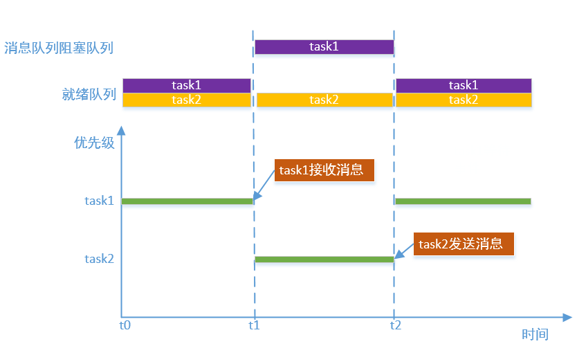

# 消息队列

---

## 简介

消息队列是一种任务间通信的机制，它可以用于发送不定长消息的场合。消息队列也有缓冲区(消息队列资源池)，可以缓存一定数量的消息。消息队列没满的情况下，可以一直往消息队列里面发送消息，消息队列满了可以选择超时等待；消息队列有消息的情况下，可以从消息队列里面接收消息，如果没有消息，可以选择超时等待。消息队列发送的消息内容长度可以是任意的（其最大长度可以在消息队列初始化时设置），消息队列在发送时会将整个消息内容复制到消息队列的缓冲区中，接收消息时会把消息队列缓冲区中的消息内容复制到接收端指定的地址。消息队列和邮箱类似，但是也有不同，消息队列可以发送不定长的数据，但是邮箱发送的数据长度固定且长度较小，邮箱效率更高。

---

## 消息队列实现原理

消息队列有两个任务阻塞队列，因为消息发送和接收都有可能导致阻塞。当没有消息时，就会导致接收消息任务阻塞，任务被放到阻塞队列，等待另一个任务发送消息，阻塞任务被唤醒，并放到就绪队列；当消息队列满了，就会导致发送消息任务阻塞，后续的处理过程和接收消息类似。另外，消息队列还有两个资源池相关的队列，一个是缓存消息队列，这个队列用于管理缓存的消息块(这些消息块包含的消息还没有被读取)，有效消息头指针和尾指针记录第一个缓存消息和最后一个缓存消息，便于找到读取和写入消息的位置，一个是空闲消息队列，这个队列用于管理空闲的消息块，空闲消息块指针记录第一个空闲消息块，便于找到保存新消息的位置。

下图描述了任务接收消息被阻塞，然后等待另一个任务发送消息的处理过程。



## 消息队列实现中断和任务的通信

消息队列也可以用于中断和任务间的通信，下图描述了任务接收消息，中断发送消息的过程。


---

## 重要定义及数据结构

### 消息队列宏定义

宏定义了阻塞任务的唤醒顺序。

```c
#define OS_MQ_WAKE_TYPE_PRIO                0x55
#define OS_MQ_WAKE_TYPE_FIFO                0xAA
```

| **消息队列宏** | **说明** |
| :--- | :--- |
| OS_MQ_WAKE_TYPE_PRIO | 按优先级唤醒 |
| OS_MQ_WAKE_TYPE_FIFO | 按FIFO唤醒 |

### 消息队列控制块结构体

```c
struct os_mq
{
    void          *msg_pool;                /* Point to message pool. */
    os_mq_msg_t   *msg_queue_head;          /* Point to first entry of message queue. */
    os_mq_msg_t   *msg_queue_tail;          /* Point to last entry of message queue. */
    os_mq_msg_t   *msg_queue_free;          /* Point to first entry of free message resource. */    

    os_list_node_t send_task_list_head;     /* Sender tasks blocked on this messages queue. */
    os_list_node_t recv_task_list_head;     /* Receiver tasks blocked on this messages queue. */

    os_list_node_t resource_node;           /* Node in resource list */

    os_size_t      max_msg_size;            /* Max message size of each message. */
    os_uint16_t    queue_depth;             /* Maximum number of messages that can be put into message queue. */
    os_uint16_t    entry_count;             /* Number of messages queued. */

    os_uint8_t     object_inited;           /* Indicates whether object is inited or deinited, value is
                                               OS_KOBJ_INITED or OS_KOBJ_DEINITED */
    os_uint8_t     object_alloc_type;       /* Indicates whether object is allocated dynamically or statically, 
                                               value is OS_KOBJ_ALLOC_TYPE_STATIC or OS_KOBJ_ALLOC_TYPE_DYNAMIC */
    os_uint8_t     wake_type;               /* The type to wake up blocking tasks, value is OS_MQ_WAKE_TYPE_PRIO
                                               or OS_MQ_WAKE_TYPE_FIFO */
    
    char           name[OS_NAME_MAX + 1];   /* Message queue name. */
};
```

| **消息队列控制块成员变量** | **说明** |
| :--- | :--- |
| msg\_pool | 消息队列资源池指针，指向消息队列资源池起始地址 |
| msg\_queue\_head | 消息头指针，指向消息队列第一条消息 |
| msg\_queue\_tail | 消息尾指针，指向消息队列最后一条消息 |
| msg\_queue\_free | 空闲消息块指针，指向第一条空闲消息块 |
| send\_task\_list\_head | 消息发送任务阻塞队列头，发送消息时消息队列没有空闲消息块时将发送任务阻塞在该队列上 |
| recv\_task\_list\_head | 消息接收任务阻塞队列头，接收消息时消息队列没有消息时将接收任务阻塞在该队列上 |
| resource\_node | 资源管理节点，通过该节点将创建的消息队列挂载到gs_os_mq_resource_list_head上 |
| max\_msg\_size | 最大消息大小 |
| queue\_depth | 消息队列深度 |
| entry\_count | 消息队列中消息数 |
| object\_inited | 初始化状态，0x55表示已经初始化，0xAA表示已经去初始化，其他值为未初始化 |
| object\_alloc\_type | 消息队列类型，0为静态消息队列，1为动态消息队列 |
| wake\_type | 阻塞任务唤醒方式，0x55表示按优先级唤醒，0xAA表示按FIFO唤醒。可以通过属性设置接口进行设置 |
| name | 消息队列名字，名字长度不能大于OS_NAME_MAX |

---

## API介绍

| **接口** | **说明** |
| :--- | :--- |
| os\_mq\_init | 以静态方式创建消息队列，消息队列对象的内存空间和消息队列缓冲区的内存空间都由使用者提供 |
| os\_mq\_deinit | 对消息队列去初始化，与os\_mq\_init\(\)匹配使用 |
| os\_mq\_create | 以动态方式创建并初始化消息队列，消息队列对象的内存空间和消息队列缓冲区的内存空间都是通过动态申请内存的方式获得 |
| os\_mq\_destroy | 销毁消息队列，唤醒所有等待任务，释放消息对象的空间和消息缓冲区的空间，与os\_mq\_create\(\)匹配使用 |
| os\_mq\_send | 发送消息，消息内容会被复制到消息队列缓冲区中，当消息队列已满且需要等待时，会阻塞当前发送任务 |
| os\_mq\_send\_urgent | 发送紧急消息，会把当前消息加入到消息队列头以便尽快处理，消息内容被复制到消息队列缓冲区中，当消息队列已满且需要等待时，会阻塞当前发送任务 |
| os\_mq\_recv | 接收消息，当前消息队列为空且需要等待时，会阻塞当前接收任务 |
| os\_mq\_set\_wake\_type | 对于阻塞在消息队列下的任务，设置唤醒阻塞任务的类型 |
| os\_mq\_reset | 复位消息队列，使消息队列达到初始状态 |
| os\_mq\_is\_empty | 查询消息队列是否为空 |
| os\_mq\_is\_full | 查询消息队列是否为满 |
| os\_mq\_get\_queue\_depth | 获取消息队列深度 |
| os\_mq\_get\_used\_entry\_count | 获取消息队列中消息数量 |
| os\_mq\_get\_unused\_entry\_count | 获取消息队列中空闲资源数量 |

### os\_mq\_init

该函数以静态方式创建消息队列，消息队列对象的内存空间和消息队列缓冲区的内存空间都由使用者提供，函数原型如下：

```c
os_err_t os_mq_init(os_mq_t        *mq,
                    const char     *name,
                    void           *msg_pool,
                    os_size_t       msg_pool_size,
                    os_size_t       msg_size);
```

| **参数** | **说明** |
| :--- | :--- |
| mq | 消息队列控制块，由用户提供，并指向对应的消息队列控制块内存地址 |
| name | 消息队列名字，其最大长度由OS_NAME_MAX 宏指定，多余部分会被自动截掉 |
| msg\_pool | 消息队列缓冲区的起始地址 |
| msg\_pool\_size | 消息队列缓冲区的大小，以byte为单位 |
| msg\_size | 每个消息的最大长度 |

### os\_mq\_deinit

该函数用于对消息队列去初始化，与os\_mq\_init\(\)匹配使用，函数原型如下：

```c
os_err_t os_mq_deinit(os_mq_t *mq);
```

| **参数** | **说明** |
| :--- | :--- |
| mq | 消息队列控制块 |
| **返回** | **说明** |
| OS\_EOK | 去初始化消息队列成功 |

### os\_mq\_create

该函数以动态方式创建并初始化消息队列，消息队列对象的内存空间和消息队列缓冲区的内存空间都是通过动态申请内存的方式获得，函数原型如下：

```c
os_mq_t *os_mq_create(const char *name, os_size_t msg_size, os_size_t max_msgs);
```

| **参数** | **说明** |
| :--- | :--- |
| name | 消息队列名字，其最大长度由OS_NAME_MAX 宏指定，多余部分会被自动截掉 |
| msg\_size | 每个消息的最大长度 |
| max\_msgs | 最大消息个数 |
| **返回** | **说明** |
| 非OS\_NULL | 消息队列创建成功 |
| OS\_NULL | 消息队列创建失败 |

### os\_mq\_destroy

该函数用于销毁消息队列，唤醒所有等待任务，释放消息对象的空间和消息缓冲区的空间，与os\_mq\_create\(\)匹配使用，函数原型如下：

```c
os_err_t os_mq_destroy(os_mq_t *mq);
```

| **参数** | **说明** |
| :--- | :--- |
| mq | 消息队列控制块 |
| **返回** | **说明** |
| OS\_EOK | 销毁消息队列成功 |

### os\_mq\_send

该函数用于发送消息，消息内容会被复制到消息队列缓冲区中，当消息队列已满且需要等待时，会阻塞当前发送任务，函数原型如下：

```c
os_err_t os_mq_send(os_mq_t *mq, void *buffer, os_size_t buff_size, os_tick_t timeout);
```

| **参数** | **说明** |
| :--- | :--- |
| mq | 消息队列控制块 |
| buffer | 待发送的消息的地址 |
| buff\_size | 此消息的长度 |
| timeout | 消息暂时不能发送的等待超时时间。若为OS_NO_WAIT，则等待时间为0；若为OS_WAIT_FOREVER，则永久等待直到消息发送；若为其它值，则等待timeout时间或者消息发送为止，并且其他值时timeout必须小于OS_TICK_MAX / 2 |
| **返回** | **说明** |
| OS\_EOK | 消息发送成功 |
| OS\_EFULL | 不等待且消息未发送 |
| OS\_ETIMEOUT | 等待超时且消息未发送 |
| OS\_ERROR | 其他错误 |

### os\_mq\_send\_urgent

该函数用于发送紧急消息，会把当前消息加入到消息队列头以便尽快处理，消息内容被复制到消息队列缓冲区中，当消息队列已满且需要等待时，会阻塞当前发送任务，函数原型如下：

```c
os_err_t os_mq_send_urgent(os_mq_t *mq, void *buffer, os_size_t buff_size, os_tick_t timeout);
```

| **参数** | **说明** |
| :--- | :--- |
| mq | 消息队列控制块 |
| buffer | 待发送的消息的地址 |
| buff\_size | 此消息的长度 |
| timeout | 消息暂时不能发送的等待超时时间。若为OS_NO_WAIT，则等待时间为0；若为OS_WAIT_FOREVER，则永久等待直到消息发送；若为其它值，则等待timeout时间或者消息发送为止，并且其他值时timeout必须小于OS_TICK_MAX / 2 |
| **返回** | **说明** |
| OS\_EOK | 消息发送成功 |
| OS\_EFULL | 不等待且消息未发送 |
| OS\_ETIMEOUT | 等待超时且消息未发送 |
| OS\_ERROR | 其他错误 |

### os\_mq\_recv

该函数用于接收消息，当前消息队列为空且需要等待时，会阻塞当前接收任务，函数原型如下：

```c
os_err_t os_mq_recv(os_mq_t    *mq,
                    void       *buffer,
                    os_size_t   buff_size,
                    os_tick_t   timeout,
                    os_size_t  *recv_msg_size);
```

| **参数** | **说明** |
| :--- | :--- |
| mq | 消息队列控制块 |
| buffer | 保存接收消息的地址 |
| buff\_size | 保存接收消息的空间大小 |
| timeout | 消息暂时接收不到时的等待超时时间。若为OS_NO_WAIT，则等待时间为0；若为OS_WAIT_FOREVER，则永久等待直到接收到消息；若为其它值，则等待timeout时间或者接收到消息为止，并且其他值时timeout必须小于OS_TICK_MAX / 2 |
| recved\_set | 接收到的消息的实际长度 |
| **返回** | **说明** |
| OS\_EOK | 接收消息成功 |
| OS\_EEMPTY | 不等待且未接收到消息 |
| OS\_ETIMEOUT | 等待超时未接收到消息 |
| OS\_ERROR | 其他错误 |

### os\_mq\_set\_wake\_type

该函数对于阻塞在消息队列下的任务，设置唤醒阻塞任务的类型，函数原型如下：

```c
os_err_t os_mq_set_wake_type(os_mq_t *mq, os_uint8_t wake_type);
```

| **参数** | **说明** |
| :--- | :--- |
| mq | 消息队列控制块 |
| wake\_type | OS_MQ_WAKE_TYPE_PRIO 设置唤醒阻塞任务的类型为按优先级唤醒(消息队列创建后默认为使用此方式)，OS_MQ_WAKE_TYPE_FIFO 设置唤醒阻塞任务的类型为先进先出唤醒 |
| **返回** | **说明** |
| OS\_EOK | 设置唤醒阻塞任务类型成功 |
| OS\_EBUSY | 设置唤醒阻塞任务类型失败 |

### os\_mq\_reset

复位消息队列，使消息队列达到初始状态，函数原型如下：

```c
void os_mq_reset(os_mq_t *mq);
```

| **参数** | **说明** |
| :--- | :--- |
| mq | 消息队列控制块 |
| **返回** | **说明** |
| 无| 无 |

### os\_mq\_is\_empty

该函数用于查询消息队列是否为空，函数原型如下：

```c
os_bool_t os_mq_is_empty(os_mq_t *mq);
```

| **参数** | **说明** |
| :--- | :--- |
| mq | 消息队列控制块 |
| **返回** | **说明** |
| OS\_TRUE | 消息队列为空 |
| OS\_FALSE | 消息队列不为空 |

### os\_mq\_is\_full

该函数用于查询消息队列是否为满，函数原型如下：

```c
os_bool_t os_mq_is_full(os_mq_t *mq);
```

| **参数** | **说明** |
| :--- | :--- |
| mq | 消息队列控制块 |
| **返回** | **说明** |
| OS\_TRUE | 消息队列为满 |
| OS\_FALSE | 消息队列不为满 |

### os\_mq\_get\_queue\_depth

该函数用于获取消息队列深度，函数原型如下：

```c
os_uint16_t os_mq_get_queue_depth(os_mq_t *mq);
```

| **参数** | **说明** |
| :--- | :--- |
| mq | 消息队列控制块 |
| **返回** | **说明** |
| os\_uint16\_t | 消息队列深度 |

### os\_mq\_get\_used\_entry\_count

该函数用于获取消息队列中消息数量，函数原型如下：

```c
os_uint16_t os_mq_get_used_entry_count(os_mq_t *mq);
```

| **参数** | **说明** |
| :--- | :--- |
| mq | 消息队列控制块 |
| **返回** | **说明** |
| os\_uint16\_t | 消息队列中消息数量 |

### os\_mq\_get\_unused\_entry\_count

该函数用于获取消息队列中空闲资源数量，函数原型如下：

```c
os_uint16_t os_mq_get_unused_entry_count(os_mq_t *mq);
```

| **参数** | **说明** |
| :--- | :--- |
| mq | 消息队列控制块 |
| **返回** | **说明** |
| os\_uint16\_t | 消息队列中空闲资源数量 |

---

## 配置选项

OneOS在使用消息队列时提供了功能裁剪的配置，具体配置如下图所示:


```
(Top) → Kernel→ Inter-task communication and synchronization
                                              OneOS Configuration
-*- Enable mutex
[ ] Enable spinlock check
[*] Enable semaphore
[*] Enable event flag
[*] Enable message queue
[*] Enable mailbox
```


| **配置项** | **说明** |
| :--- | :--- |
| Enable message queue | 使能消息队列功能，如果不使能该功能，消息队列相关的源代码就不会编译，默认使能 |

---

## 使用示例

### 静态消息队列使用示例

本例使用静态方式初始化消息队列，然后创建一个任务发送消息，另外一个任务接收消息

```c
#include <oneos_config.h>
#include <dlog.h>
#include <os_errno.h>
#include <os_task.h>
#include <shell.h>
#include <string.h>
#include <os_mq.h>

#define TEST_TAG        "TEST"
#define TASK_STACK_SIZE 1024
#define TASK1_PRIORITY  15
#define TASK2_PRIORITY  16


#define MQ_MAX_MSG      5
#define MSG_SIZE        24
#define MQ_POLL_SIZE    (MQ_MAX_MSG * (MSG_SIZE + sizeof(os_mq_msg_hdr_t)))

#define STR_NUM         4

static char mq_pool[MQ_POLL_SIZE];
static os_mq_t mq_static;

char *str[STR_NUM] = {
    "hello, world",
    "it's a new day",
    "it's a nice day",
    "it's a wonderful day"
    };

void task1_entry(void *para)
{
    os_uint32_t i = 0;

    for (i = 0; i < STR_NUM; i++)
    {
        LOG_W(TEST_TAG, "task1 send str:%s, len:%d", str[i], strlen(str[i]) + 1);
        if(OS_EOK == os_mq_send(&mq_static, str[i], strlen(str[i]) + 1, OS_WAIT_FOREVER))
        {
            LOG_W(TEST_TAG, "task1 send OK");
        }
        else
        {
            LOG_W(TEST_TAG, "task1 send err");
        }
        os_task_msleep(100);
    }
}

void task2_entry(void *para)
{
    os_size_t recv_size = 0;
    char recv_str[MSG_SIZE];

    while (1)
    {
        if (OS_EOK == os_mq_recv(&mq_static, &recv_str[0], MSG_SIZE, OS_WAIT_FOREVER, &recv_size))
        {
            LOG_W(TEST_TAG, "task2 recv str:%s, len:%d", recv_str, recv_size);
        }
    }
}

void msgqueue_static_sample(void)
{
    os_task_t *task1 = OS_NULL;
    os_task_t *task2 = OS_NULL;

    if(OS_EOK != os_mq_init(&mq_static, "msgqueue_static", &mq_pool[0], MQ_POLL_SIZE, MSG_SIZE))
    {
        LOG_W(TEST_TAG, "msgqueue_static_sample msgqueue init ERR");
        return;
    }

    task1 = os_task_create("task1",
                           task1_entry,
                           OS_NULL,
                           TASK_STACK_SIZE,
                           TASK1_PRIORITY);
    if (task1)
    {
        LOG_W(TEST_TAG, "msgqueue_static_sample startup task1");
        os_task_startup(task1);
    }

    task2 = os_task_create("task2",
                           task2_entry,
                           OS_NULL,
                           TASK_STACK_SIZE,
                           TASK2_PRIORITY);
    if (task2)
    {
        LOG_W(TEST_TAG, "msgqueue_static_sample startup task2");
        os_task_startup(task2);
    }
}

SH_CMD_EXPORT(static_msgqueue, msgqueue_static_sample, "test staitc msgqueue");
```

运行结果如下：

```c
sh>static_msgqueue
W/TEST: msgqueue_static_sample startup task1
W/TEST: task1 send str:hello, world, len:13
W/TEST: task1 send OK
W/TEST: msgqueue_static_sample startup task2
W/TEST: task2 recv str:hello, world, len:13
sh>W/TEST: task1 send str:it's a new day, len:15
W/TEST: task1 send OK
W/TEST: task2 recv str:it's a new day, len:15
W/TEST: task1 send str:it's a nice day, len:16
W/TEST: task1 send OK
W/TEST: task2 recv str:it's a nice day, len:16
W/TEST: task1 send str:it's a wonderful day, len:21
W/TEST: task1 send OK
W/TEST: task2 recv str:it's a wonderful day, len:21
```

### 动态消息队列使用示例

本例使用动态方式创建并初始化了消息队列，然后创建一个任务发送消息，另外一个任务接收消息

```c
#include <oneos_config.h>
#include <dlog.h>
#include <os_errno.h>
#include <os_task.h>
#include <shell.h>
#include <string.h>
#include <os_memory.h>
#include <os_mq.h>

#define TEST_TAG        "TEST"
#define TASK_STACK_SIZE 1024
#define TASK1_PRIORITY  15
#define TASK2_PRIORITY  16

#define MQ_MAX_MSG      10
#define TEST_NAME_MAX   16
#define STUDENT_NUM     5

static os_mq_t *mq_dynamic;

struct student_score
{
    char                name[TEST_NAME_MAX];
    os_uint32_t         score;
};

void task1_entry(void *para)
{
    os_uint32_t i = 0;
    struct student_score student_data;
    char *name[STUDENT_NUM] = {"xiaoming", "xiaohua", "xiaoqiang", "xiaoli", "xiaofang"};
    os_uint32_t score[STUDENT_NUM] = {80, 85, 90, 95, 96};

    for (i = 0; i < STUDENT_NUM; i++)
    {
        memset(student_data.name, 0, TEST_NAME_MAX);
        strncpy(student_data.name, name[i], TEST_NAME_MAX);
        student_data.score = score[i];
        if(OS_EOK == os_mq_send(mq_dynamic, &student_data, sizeof(struct student_score), OS_WAIT_FOREVER))
        {
            LOG_W(TEST_TAG, "task1 send -- name:%s score:%d", student_data.name, student_data.score);
        }

        os_task_msleep(100);
    }
}

void task2_entry(void *para)
{
    struct student_score student_data;
    os_size_t recv_size = 0;

    while (1)
    {
        if (OS_EOK == os_mq_recv(mq_dynamic, &student_data, sizeof(struct student_score), OS_WAIT_FOREVER, &recv_size))
        {
            LOG_W(TEST_TAG, "task2 recv -- name:%s score:%d", student_data.name, student_data.score);
        }
    }
}

void msgqueue_dynamic_sample(void)
{
    os_task_t *task1 = OS_NULL;
    os_task_t *task2 = OS_NULL;

    mq_dynamic = os_mq_create("mailbox_dynamic", sizeof(struct student_score), MQ_MAX_MSG);
    if (!mq_dynamic)
    {
        LOG_W(TEST_TAG, "msgqueue_dynamic_sample msgqueue create ERR");
    }

    task1 = os_task_create("task1",
                           task1_entry,
                           OS_NULL,
                           TASK_STACK_SIZE,
                           TASK1_PRIORITY);
    if (task1)
    {
        LOG_W(TEST_TAG, "msgqueue_dynamic_sample startup task1");
        os_task_startup(task1);
    }

    os_task_msleep(200);
    task2 = os_task_create("task2",
                           task2_entry,
                           OS_NULL,
                           TASK_STACK_SIZE,
                           TASK2_PRIORITY);
    if (task2)
    {
        LOG_W(TEST_TAG, "msgqueue_dynamic_sample startup task2");
        os_task_startup(task2);
    }
}

SH_CMD_EXPORT(dynamic_msgqueue, msgqueue_dynamic_sample, "test dynamic msgqueue");
```

运行结果如下：

```c
sh>dynamic_msgqueue
W/TEST: msgqueue_dynamic_sample startup task1
W/TEST: task1 send -- name:xiaoming score:80
W/TEST: task1 send -- name:xiaohua score:85
W/TEST: task1 send -- name:xiaoqiang score:90
W/TEST: msgqueue_dynamic_sample startup task2
W/TEST: task2 recv -- name:xiaoming score:80
W/TEST: task2 recv -- name:xiaohua score:85
W/TEST: task2 recv -- name:xiaoqiang score:90
sh>W/TEST: task1 send -- name:xiaoli score:95
W/TEST: task2 recv -- name:xiaoli score:95
W/TEST: task1 send -- name:xiaofang score:96
W/TEST: task2 recv -- name:xiaofang score:96
```
