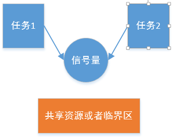
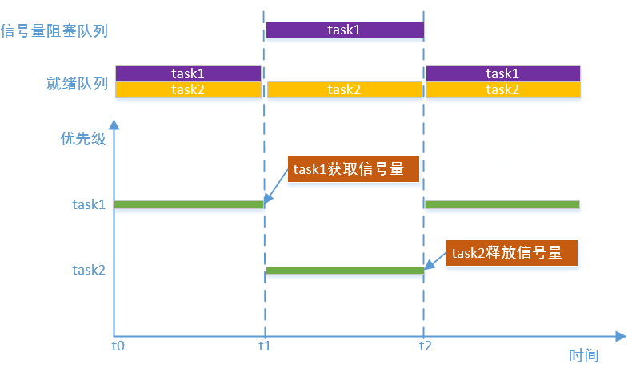
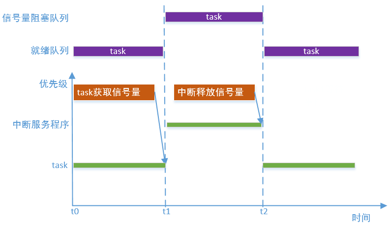

# 信号量

---

## 简介

介绍信号量之前，先想象一种场景，假如某停车场车位个数是有限的，当车位全部停满以后，如果有新的车进来，看门人就会将车停在外面，等待有一辆车让出车位，多任务操作系统中看门人就类似信号量，车位的个数类似信号量计数值，车就类似任务。

信号量是一种解决同步问题的机制，可以实现对共享资源的有序访问，即一个任务完成了某个动作后，别的任务接下来才可以做其它事情。信号量的申请者和释放者可以不是同一个任务。



当信号量的取值只有0和1（即为二值信号量）时，如果参考互斥锁的使用方式，也可以用于对资源的互斥访问，不过采用这种用法时不能解决可能存在的优先级反转问题，也不能递归获取。

## 信号量实现原理

信号量也是基于阻塞队列实现，每个信号量都对应有一个资源数，当信号量的资源数为0时，任务成功获取信号量就会导致任务阻塞，并且任务被放到阻塞队列，当另一个任务释放信号量时，资源数加1，将阻塞任务唤醒，并放到就绪队列放到，如下图:



## 信号量实现中断和任务的同步

信号量不仅可以用于任务间的同步，还可以用于中断和任务间的同步。例如，某个任务负责处理数据，而中断程序负责收集数据，任务必须在数据收集完成之后，才能进行下面的工作。下图描述了中断和任务通过信号量同步的过程：



---

## 重要定义及数据结构

### 信号量宏定义

宏定义了阻塞任务的唤醒顺序和信号量资源数最大值。

```c
#define OS_SEM_WAKE_TYPE_PRIO               0x55
#define OS_SEM_WAKE_TYPE_FIFO               0xAA

#define OS_SEM_MAX_VALUE    OS_UINT32_MAX
```

| **信号量宏** | **说明** |
| :--- | :--- |
| OS_SEM_WAKE_TYPE_PRIO | 按优先级唤醒 |
| OS_SEM_WAKE_TYPE_FIFO | 按FIFO唤醒 |
| OS_SEM_MAX_VALUE | 信号量资源数最大值 |

### 信号量控制块结构体

```c
struct os_semaphore
{
    os_list_node_t task_list_head;         /* Block task list head  */
    os_list_node_t resource_node;          /* Node in resource list */
    
    os_uint32_t    count;                  /* Current count */
    os_uint32_t    max_count;              /* Semaphore support maximum value */
    os_uint8_t     object_inited;          /* If semaphore object is inited, value is OS_KOBJ_INITED */
    os_uint8_t     object_alloc_type;      /* Indicates whether memory is allocated dynamically or statically,
                                              value is OS_KOBJ_ALLOC_TYPE_STATIC or OS_KOBJ_ALLOC_TYPE_DYNAMIC */
    os_uint8_t     wake_type;              /* The type to wake up blocking tasks, value is OS_SEM_WAKE_TYPE_PRIO
                                              or OS_SEM_WAKE_TYPE_FIFO */

    char           name[OS_NAME_MAX + 1];  /* Semaphore name */
};
```

| **信号量控制块成员变量** | **说明** |
| :--- | :--- |
| task_list_head | 任务阻塞队列头，任务获取信号量失败时将其阻塞在该队列上 |
| resource_node | 资源管理节点，通过该节点将创建的信号量挂载到gs_os_sem_resource_list_head上|
| count | 资源数 |
| max_count | 最大资源数 |
| object_inited | 初始化状态，0x55表示已经初始化，0xAA表示已经去初始化，其他值为未初始化 |
| object_alloc_type | 信号量类型，0为静态信号量，1为动态信号量 |
| wake_type | 阻塞任务唤醒方式，0x55表示按优先级唤醒，0xAA表示按FIFO唤醒。可以通过属性设置接口进行设置 |
| name | 信号量名字，名字长度不能大于OS_NAME_MAX |

---

## API介绍

| **接口** | **说明** |
| :--- | :--- |
| os\_sem\_init | 以静态方式初始化信号量，信号量对象所使用的内存空间是由使用者提供的 |
| os\_sem\_deinit | 去初始化不再使用的信号量，与os\_sem\_init\(\)配合使用 |
| os\_sem\_create | 创建信号量并初始化，信号量对象使用的内存采用动态申请的方式获取 |
| os\_sem\_destroy | 销毁不再使用的信号量，然后释放信号量对象占用的空间，与`os_sem_create()`匹配使用 |
| os\_sem\_wait | 获取信号量，当信号量的值大于等于1时，该任务将获得信号量；若信号量的值为0，则申请该信号量的任务将会根据timeout的设置来决定等待的时间，直到其它任务/中断释放该信号量，或者超时（注意该接口可能会导致上下文挂起，不能在中断服务程序中使用） |
| os\_sem\_post | 释放信号量，如果有任务等待在该信号量则唤醒等待列表的第一个任务，否则信号量计数值加1 |
| os\_sem\_set\_wake\_type | 设置阻塞在信号量下的任务的唤醒类型 |
| os\_sem\_get\_count | 获取信号量当前的资源数 |

### os\_sem\_init

该函数用于以静态方式初始化信号量，信号量对象所使用的内存空间是由使用者提供的，其函数原型如下：

```c
os_err_t os_sem_init(os_sem_t *sem, const char *name, os_uint32_t value, os_uint32_t max_value);
```

| **参数** | **说明** |
| :--- | :--- |
| sem | 信号量控制块，由用户提供，并指向对应的信号量控制块内存地址 |
| name | 信号量名字，其最大长度由OS_NAME_MAX 宏指定，多余部分会被自动截掉 |
| value | 信号量的初始值 |
| max_value | 信号量最大值，设置范围[信号量的初始值, OS_SEM_MAX_VALUE] |
| **返回** | **说明** |
| OS\_EOK | 初始化信号量成功 |
| OS\_EINVAL | 初始化信号量失败，无效参数 |

### os\_sem\_deinit

该函数用于去初始化不再使用的信号量，其函数原型如下：

```c
os_err_t os_sem_deinit(os_sem_t *sem);
```

| **参数** | **说明** |
| :--- | :--- |
| sem | 信号量控制块 |
| **返回** | **说明** |
| OS\_EOK | 去初始化信号量成功 |

### os\_sem\_create

该函数用于创建信号量并初始化，信号量对象使用的内存采用动态申请的方式获取，其函数原型如下：

```c
os_sem_t *os_sem_create(const char *name, os_uint32_t value, os_uint32_t max_value);
```

| **参数** | **说明** |
| :--- | :--- |
| name | 信号量名字，其最大长度由OS_NAME_MAX 宏指定，多余部分会被自动截掉 |
| value | 信号量的初始值|
| max_value | 信号量最大值，设置范围[信号量的初始值, OS_SEM_MAX_VALUE] |
| **返回** | **说明** |
| 非OS\_NULL | 信号量创建成功 |
| OS\_NULL | 信号量创建失败 |

### os\_sem\_destroy

该函数用于销毁不再使用的信号量，然后释放信号量对象占用的空间，与`os_sem_create()`匹配使用，其函数原型如下：

```c
os_err_t os_sem_destroy(os_sem_t *sem);
```

| **参数** | **说明** |
| :--- | :--- |
| sem | 信号量控制块 |
| **返回** | **说明** |
| OS\_EOK | 销毁信号量成功 |

### os\_sem\_wait

该函数用于获取信号量，当信号量的值大于等于1时，该任务将获得信号量；若信号量的值为0，则申请该信号量的任务将会根据timeout的设置来决定等待的时间，直到其它任务/中断释放该信号量，或者超时（注意该接口可能会导致上下文挂起，不能在中断服务程序中使用）。其函数原型如下：

```c
os_err_t os_sem_wait(os_sem_t *sem, os_tick_t timeout);
```

| **参数** | **说明** |
| :--- | :--- |
| sem | 信号量控制块 |
| timeout | 信号量暂时获取不到时的等待超时时间。若为OS_NO_WAIT，则等待时间为0；若为OS_WAIT_FOREVER，则永久等待直到获取到信号量；若为其它值，则等待timeout时间或者获取到信号量为止，并且其他值时timeout必须小于OS_TICK_MAX / 2 |
| **返回** | **说明** |
| OS\_EOK | 信号量获取成功 |
| OS\_EBUSY | 不等待且未获取到信号量 |
| OS\_ETIMEOUT | 等待超时未获取到信号量 |
| OS\_ERROR | 其它错误 |

### os\_sem\_post

该函数用于释放信号量，如果有任务等待在该信号量则唤醒等待列表的第一个任务，否则信号量计数值加1，其函数原型如下：

```c
os_err_t os_sem_post(os_sem_t *sem);
```

| **参数** | **说明** |
| :--- | :--- |
| sem | 信号量控制块 |
| **返回** | **说明** |
| OS\_EOK | 释放信号量成功 |
| OS\_EFULL | 信号量资源数超过设定的最大值 |

### os\_sem\_set\_wake\_type

该函数用于设置阻塞在信号量下的任务的唤醒类型，其函数原型如下：

```c
os_err_t os_sem_set_wake_type(os_sem_t *sem, os_uint8_t wake_type);
```

| **参数** | **说明** |
| :--- | :--- |
| sem | 信号量控制块 |
| wake\_type | OS_SEM_WAKE_TYPE_PRIO为设置唤醒阻塞任务的类型为按优先级唤醒(信号量创建后默认为使用此方式)，OS_SEM_WAKE_TYPE_FIFO为设置唤醒阻塞任务的类型为先进先出唤醒 |
| **返回** | **说明** |
| OS\_EOK | 设置唤醒阻塞任务类型成功 |
| OS\_EBUSY | 设置唤醒阻塞任务类型失败 |

### os\_sem\_get\_count

该函数用于获取信号量当前的资源数，其函数原型如下：

```c
os_uint32_t os_sem_get_count(os_sem_t *sem);
```

| **参数** | **说明** |
| :--- | :--- |
| sem | 信号量控制块 |
| **返回** | **说明** |
| os\_uint32\_t | 返回信号量资源数 |

---

## 配置选项

OneOS在使用信号量时提供了功能裁剪的配置，具体配置如下所示:

```
(Top) → Kernel→ Inter-task communication and synchronization
                                              OneOS Configuration
-*- Enable mutex
[ ] Enable spinlock check
[*] Enable semaphore
[*] Enable event flag
[*] Enable message queue
[*] Enable mailbox
```

| **配置项** | **说明** |
| :--- | :--- |
| Enable semaphore | 使能信号量功能，如果不使能该功能，信号量相关的源代码就不会编译，默认使能 |

---

## 应用示例

### 静态信号量应用示例

本例以静态方式初始化了信号量，并且创建了两个任务，在一个任务中申请信号量，在另外一个任务中释放信号量，只有当信号量被释放后，申请信号量的任务才能拿到信号量并往下执行

```c
#include <oneos_config.h>
#include <dlog.h>
#include <os_errno.h>
#include <os_task.h>
#include <shell.h>
#include <os_sem.h>

#define TEST_TAG        "TEST"
#define TASK_STACK_SIZE 1024
#define TASK1_PRIORITY  15
#define TASK2_PRIORITY  16

static os_uint32_t count = 0;
static os_sem_t sem_static;

void task1_entry(void *para)
{
    while (1)
    {
        LOG_W(TEST_TAG, "task1_entry semaphore wait");
        if (OS_EOK == os_sem_wait(&sem_static, OS_WAIT_FOREVER))
        {
            LOG_W(TEST_TAG, "task1_entry semaphore wait done, count:%d", count);
        }
        else
        {
            LOG_W(TEST_TAG, "task1_entry semaphore wait fail");
        }
    }
}

void task2_entry(void *para)
{
    while (1)
    {
        count++;
        LOG_W(TEST_TAG, "task2_entry semaphore post");
        if (OS_EOK != os_sem_post(&sem_static))
        {
            LOG_W(TEST_TAG, "task2_entry semaphore post fail");
        }

        LOG_W(TEST_TAG, "task2_entry sleep");
        os_task_msleep(500);
    }
}

void semaphore_static_sample(void)
{
    os_task_t *task1 = OS_NULL;
    os_task_t *task2 = OS_NULL;

    os_sem_init(&sem_static, "sem_static", 0, OS_SEM_MAX_VALUE);

    task1 = os_task_create("task1",
                           task1_entry,
                           OS_NULL,
                           TASK_STACK_SIZE,
                           TASK1_PRIORITY);
    if (task1)
    {
        os_task_startup(task1);
    }

    task2 = os_task_create("task2",
                           task2_entry,
                           OS_NULL,
                           TASK_STACK_SIZE,
                           TASK2_PRIORITY);
    if (task2)
    {
        os_task_startup(task2);
    }
}

SH_CMD_EXPORT(static_sem, semaphore_static_sample, "test staitc semaphore");
```

运行结果如下：

```c
sh>static_sem
W/TEST: task1_entry semaphore wait
W/TEST: task2_entry semaphore post
W/TEST: task1_entry semaphore wait done, count:1
W/TEST: task1_entry semaphore wait
W/TEST: task2_entry sleep
W/TEST: task2_entry semaphore post
W/TEST: task1_entry semaphore wait done, count:2
W/TEST: task1_entry semaphore wait
W/TEST: task2_entry sleep
W/TEST: task2_entry semaphore post
W/TEST: task1_entry semaphore wait done, count:3
W/TEST: task1_entry semaphore wait
W/TEST: task2_entry sleep
W/TEST: task2_entry semaphore post
W/TEST: task1_entry semaphore wait done, count:4
W/TEST: task1_entry semaphore wait
W/TEST: task2_entry sleep
W/TEST: task2_entry semaphore post
W/TEST: task1_entry semaphore wait done, count:5
W/TEST: task1_entry semaphore wait
W/TEST: task2_entry sleep
W/TEST: task2_entry semaphore post
W/TEST: task1_entry semaphore wait done, count:6
W/TEST: task1_entry semaphore wait
W/TEST: task2_entry sleep
W/TEST: task2_entry semaphore post
W/TEST: task1_entry semaphore wait done, count:7
W/TEST: task1_entry semaphore wait
```

### 动态信号量应用示例

本例与静态信号量使用示例类似，只是信号量是以动态方式创建的

```c
#include <oneos_config.h>
#include <dlog.h>
#include <os_errno.h>
#include <os_task.h>
#include <shell.h>
#include <os_sem.h>

#define TEST_TAG        "TEST"
#define TASK_STACK_SIZE 1024
#define TASK1_PRIORITY  15
#define TASK2_PRIORITY  16

static os_uint32_t count = 0;
static os_sem_t* sem_dynamic;

void task1_entry(void *para)
{
    while (1)
    {
        LOG_W(TEST_TAG, "task1_entry semaphore wait");
        if (OS_EOK == os_sem_wait(sem_dynamic, OS_WAIT_FOREVER))
        {
            LOG_W(TEST_TAG, "task1_entry semaphore wait done, count:%d", count);
        }
        else
        {
            LOG_W(TEST_TAG, "task1_entry semaphore wait fail");
        }
    }
}

void task2_entry(void *para)
{
    while (1)
    {
        count++;
        LOG_W(TEST_TAG, "task2_entry semaphore post");
        if (OS_EOK != os_sem_post(sem_dynamic))
        {
            LOG_W(TEST_TAG, "task2_entry semaphore post fail");
        }

        LOG_W(TEST_TAG, "task2_entry sleep");
        os_task_msleep(500);
    }
}

void semaphore_dynamic_sample(void)
{
    os_task_t *task1 = OS_NULL;
    os_task_t *task2 = OS_NULL;

    sem_dynamic = os_sem_create("sem_dynamic", 0, OS_SEM_MAX_VALUE);

    task1 = os_task_create("task1",
                           task1_entry,
                           OS_NULL,
                           TASK_STACK_SIZE,
                           TASK1_PRIORITY);
    if (task1)
    {
        os_task_startup(task1);
    }

    task2 = os_task_create("task2",
                           task2_entry,
                           OS_NULL,
                           TASK_STACK_SIZE,
                           TASK2_PRIORITY);
    if (task2)
    {
        os_task_startup(task2);
    }
}

SH_CMD_EXPORT(dynamic_sem, semaphore_dynamic_sample, "test dynamic semaphore");
```

运行结果如下：

```c
sh>dynamic_sem
W/TEST: task1_entry semaphore wait
W/TEST: task2_entry semaphore post
W/TEST: task1_entry semaphore wait done, count:1
W/TEST: task1_entry semaphore wait
W/TEST: task2_entry sleep
W/TEST: task2_entry semaphore post
W/TEST: task1_entry semaphore wait done, count:2
W/TEST: task1_entry semaphore wait
W/TEST: task2_entry sleep
W/TEST: task2_entry semaphore post
W/TEST: task1_entry semaphore wait done, count:3
W/TEST: task1_entry semaphore wait
W/TEST: task2_entry sleep
W/TEST: task2_entry semaphore post
W/TEST: task1_entry semaphore wait done, count:4
W/TEST: task1_entry semaphore wait
W/TEST: task2_entry sleep
W/TEST: task2_entry semaphore post
W/TEST: task1_entry semaphore wait done, count:5
W/TEST: task1_entry semaphore wait
W/TEST: task2_entry sleep
W/TEST: task2_entry semaphore post
W/TEST: task1_entry semaphore wait done, count:6
W/TEST: task1_entry semaphore wait
W/TEST: task2_entry sleep
W/TEST: task2_entry semaphore post
W/TEST: task1_entry semaphore wait done, count:7
W/TEST: task1_entry semaphore wait
```
