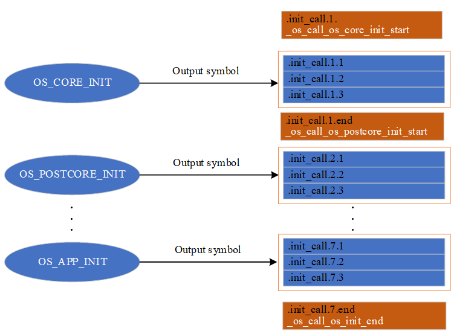
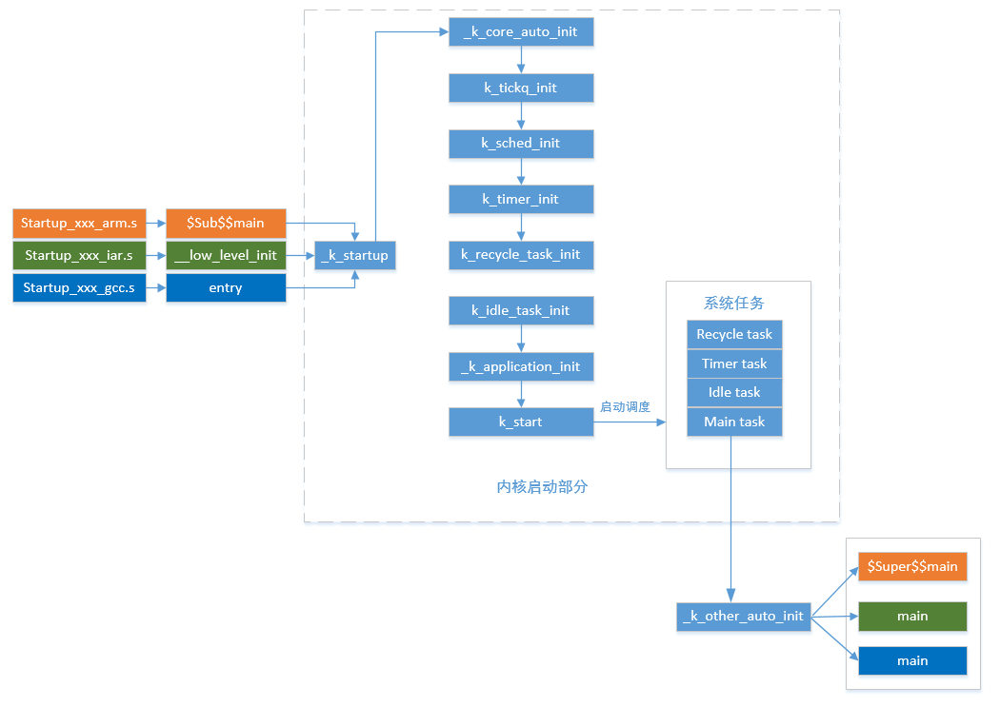

# 内核启动

---
## 简介

内核启动介绍了整个系统从硬件上电如何一步步进入用户程序的过程。一般情况下，启动过程分为硬件上电，首先运行和体系架构相关的启动汇编文件，进行一些最基本硬件的初始化(例如CPU配置，时钟，栈地址，RAM等)，为内核运行铺垫好环境，然后初始化内核各模块(例如调度器，定时器等)，接着创建系统任务(例如空闲任务)和用户任务，最后启动调度和运行用户程序。

---

## 自动初始化

在介绍内核启动之前，有必要介绍自动初始化的实现机制。

自动初始化的实现是利用编译器的段和段排序的特性，以GCC编译器为例具体如下：

1.通过GCC的关键字__attribute__((section(x)))，可以把定义的符号（函数地址或变量地址）放到段名为x的段中，段名x由用户指定。在自动初始化应用中，段名都包含.init_call字符串，若采用通配符的表示方法，段名为.init_call*，*表示任何一串其它一串字符串；

2.在GCC的链接脚本中，关键字KEEP(*(SORT(.init_call*)))可以对段名符合.init_call*形式的段进行排序；

3.若把自动初始化函数的符号（即函数地址）放到符合.init_call*形式的段中，就可以间接实现函数符号排序，从而可以提供有顺序的执行自动初始化函数的方法。

自动初始化通过宏定义提供了注册初始化函数的接口，根据初始化优先级的不同，有如下宏定义：

| **注册宏** | **说明** |
| :--- | :--- |
| OS_CORE_INIT(fn, sublevel) | 内核启动前的硬件初始化 |
| OS_POSTCORE_INIT(fn, sublevel) | 内核启动后的硬件初始化 |
| OS_PREV_INIT(fn, sublevel) | 软件前初始化，通常作为其它软件模块初始化的依赖，如纯软件的加密算法初始化 |
| OS_DEVICE_INIT(fn, sublevel) | 设备初始化 |
| OS_CMPOENT_INIT(fn, sublevel) | 组件初始化 |
| OS_ENV_INIT(fn, sublevel) | 环境初始化 |
| OS_APP_INIT(fn, sublevel) | 应用程序初始化 |

编译之后，初始化宏对应的段结构如下：

在上图中，_os_call_os_core_init_start，_os_call_os_postcore_init_start，_os_call_os_init_end 符号用于定位段的起始地址和结束地址。

---

## 内核启动流程

下图展示了整个系统启动过程和内核启动过程，本节主要介绍内核启动部分。

可见，内核启动主要有下面几个步骤：

1.系统先从启动文件开始运行，然后进入 OneOS 的启动函数 _k_startup() 

2.调用_k_core_auto_init函数依次执行自动化宏OS_CORE_INIT(fn, sublevel)宏注册的函数，初始化最基本的硬件资源，为内核运行铺垫好环境

3.初始化内核各模块，如tick队列，调度器，定时器等

4.创建recycle，idle，timer，main系统任务

5.启动调度器，最后会运行main任务，main任务调用_k_other_auto_init函数依次执行其他自动化宏注册的函数，最后调用main函数进入用户程序入口
