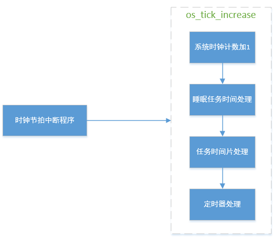
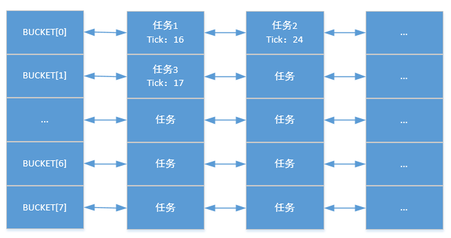

# 时钟管理

---

## 简介

时钟节拍是操作系统的心跳，任何操作系统都需要时钟节拍。时钟节拍是基于硬件定时器实现的，定时器的周期性中断到来时，就会处理一些和时间有关的事情，比如系统时钟计数，任务睡眠时间处理、任务的时间片轮转调度、定时器处理等。

---

### 时钟节拍需要处理的事务

时钟节拍(tick)是周期性的中断，每来一次中断，内核就需要处理一些事务，主要在os_tick_increase函数实现，该函数一般在时钟节拍中断程序中被调用，如下图



1. 系统时钟计数值加1，系统时钟计数是启动以来系统运行的总tick数

2. 任务睡眠时间处理，检查系统中的处于睡眠状态任务的唤醒时间是否已经到期，如果到期了，就唤醒相应的任务

3. 任务时间片处理，将当前任务时间片减1，如果时间片减到了0，代表该任务已经用完时间片，需要切换任务

4. 定时器处理，检查定时器时间是否到期

### 任务睡眠时间处理

任务睡眠时间处理基于tick queue实现，而为了提高插入效率，tick queue又采用了循环桶的方式实现，桶的大小设置为8，桶的每个位置都代表了一个队列。插入任务时，先用任务的唤醒时间对桶大小取余，找到在桶中的位置，将任务按照唤醒时间插入到该位置的队列上，并且最先唤醒的任务排在最前面。tick queue每次收到最新的系统时钟时，使用收到的最新系统时钟对桶大小取余，得到当前需要处理的桶的位置，检查该位置的队列上是否有任务超时需要被唤醒即可。



图中任务1和任务2的唤醒tick分别是16和24，对8取余都是0，所以这两个任务在一个队列bucket[0]上，但是任务1唤醒时间更早，所有排在任务2之前，任务3唤醒tick是17，则放在另一个队列bucket[1]上。

---

## API介绍

| **接口** | **说明** |
| :--- | :--- |
| os\_tick\_get | 获取操作系统从启动以来到目前为止的系统时钟节拍计数值 |
| os\_tick\_set | 设置系统时钟节拍计数值 |
| os\_tickless\_update | 系统从非激活态唤醒之后需要更新系统tick时间和定时器时间 |
| os\_tick\_from\_ms | 将毫秒时间转换为tick时间，tick时间向上取整 |
| os\_tickless\_get\_sleep\_ticks | 获取系统睡眠后，下一次被唤醒的tick时间 |
| os\_tick\_increase | 处理tick中断到来时的业务 |

### os\_tick\_get

该函数用于获取操作系统从启动以来到目前为止的系统时钟节拍计数值，函数原型如下：

```c
os_tick_t os_tick_get(void);
```

| **参数** | **说明** |
| :--- | :--- |
| 无 | 无 |
| **返回** | **说明** |
| os\_tick\_t | 当前tick时间 |

### os\_tick\_set

该函数用于设置系统时钟节拍计数值，函数原型如下：

```c
void os_tick_set(os_tick_t tick);
```

| **参数** | **说明** |
| :--- | :--- |
| tick | 设置的系统时钟节拍计数值 |
| **返回** | **说明** |
| 无 | 无 |

### os\_tickless\_update

系统从非激活态唤醒之后需要更新系统tick时间和定时器时间，函数原型如下：

```c
void os_tickless_update(os_tick_t sleep_ticks);
```

| **参数** | **说明** |
| :--- | :--- |
| sleep_ticks | 系统睡眠tick时间 |
| **返回** | **说明** |
| 无 | 无 |

### os\_tick\_from\_ms

该函数用于将毫秒时间转换为tick时间，tick时间向上取整，函数原型如下：

```c
os_tick_t os_tick_from_ms(os_uint32_t ms);
```

| **参数** | **说明** |
| :--- | :--- |
| ms | 毫秒时间 |
| **返回** | **说明** |
| os\_tick\_t | tick时间 |

### os\_tickless\_get\_sleep\_ticks

该函数用于获取系统睡眠后，下一次被唤醒的tick时间，函数原型如下：

```c
os_tick_t os_tickless_get_sleep_ticks(void);
```

| **参数** | **说明** |
| :--- | :--- |
| 无 | 无 |
| **返回** | **说明** |
| os\_tick\_t | 下一次被唤醒的tick时间 |

### os\_tick\_increase

该函数用于处理tick中断到来时的业务，包括系统时钟节拍计数值+1、检查睡眠任务是否到期、任务时间片检查、检查定时器是否到期，函数原型如下：

```c
void os_tick_increase(void);
```

| **参数** | **说明** |
| :--- | :--- |
| 无 | 无 |
| **返回** | **说明** |
| 无 | 无 |

---

## 配置选项

OneOS在使用时钟管理时提供了一些功能选项配置，具体配置如下所示:

```
(Top) → Kernel
                                              OneOS Configuration
    The max size of kernel object name (15)  --->
    The max level value of priority of task (32)  --->
(100) Tick frequency(Hz)
(10) Task time slice(unit: tick)
[ ] Using stack overflow checking
[ ] Using task hook
[ ] Enable global assert
[ ] Enable kernel lock check
[ ] Enable function safety mechanism
[ ] Enable kernel debug
(2048) The stack size of main task
(1024) The stack size of idle task
(512) The stack size of recycle task
[*] Enable software timer with a timer task
(512)   The stack size of timer task
[ ]     Software timers in each hash bucket are sorted
[*]     Enable workqueue
[*]         Enable system workqueue
(2048)          System workqueue task stack size
(8)             System workqueue task priority level
    Inter-task communication and synchronization  --->
    Memory management  --->
```

| **配置项** | **说明** |
| :--- | :--- |
| Tick frequency(Hz) | 系统节拍频率，默认100Hz，对应每10ms触发一次节拍中断 |

---

## 应用示例

### 读取系统时钟计数值示例

本例创建了一个任务，每延时100个tick之后，去获取当前tick

```c
#include <oneos_config.h>
#include <dlog.h>
#include <os_task.h>
#include <shell.h>
#include <os_clock.h>

#define TEST_TAG        "TEST"
#define TASK_STACK_SIZE 1024
#define TASK_PRIORITY   15

void task_entry(void *para)
{
    os_uint32_t count = 0;
    os_uint32_t tick;

    while (1)
    {
        count ++;
        tick = os_tick_get();
        LOG_E(TEST_TAG, "task_entry count:%d tick:%d", count, tick);
        os_task_tsleep(100);
    }
}

void tick_sample(void)
{
    os_task_t *task = OS_NULL;

    task = os_task_create("task",
                           task_entry,
                           OS_NULL,
                           TASK_STACK_SIZE,
                           TASK_PRIORITY);
    if (task)
        os_task_startup(task);
}

SH_CMD_EXPORT(tick_sample, tick_sample, "test get tick");
```

运行结果如下：

```c
sh>tick_sample
E/TEST: task_entry count:1 tick:1248
sh>E/TEST: task_entry count:2 tick:1349
E/TEST: task_entry count:3 tick:1449
E/TEST: task_entry count:4 tick:1549
E/TEST: task_entry count:5 tick:1649
E/TEST: task_entry count:6 tick:1749
E/TEST: task_entry count:7 tick:1849
E/TEST: task_entry count:8 tick:1949
E/TEST: task_entry count:9 tick:2049
E/TEST: task_entry count:10 tick:2149
```
