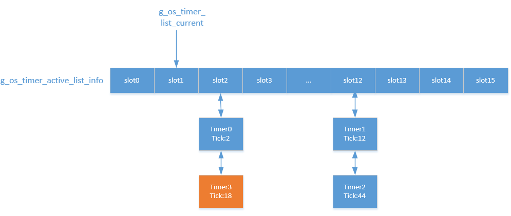

# 定时器管理

---

## 简介

定时器提供了延迟一段时间执行某个用户操作的接口，分为2种，第1种是单次性定时器，即触发一次后停止，第2种是周期性定时器，即周期性地循环触发，需要手动停止。目前内核只提供软件定时器，回调函数运行在任务上下文，不支持硬件定时器，如果要使用硬件定时器，需要调用BSP相关接口。

---

### 定时器实现原理

定时器实现主要是对激活状态定时器的管理，基于队列实现，如下图，gs_os_timer_active_list_info用于管理所有已经启动的定时器，gs_os_timer_active_list_info默认包含16个slot，每个启动的定时器都挂在一个slot上(一个slot对应一个队列)。启动定时器时，定时器超时时间对slot个数取余得到一个数值mod ticks，gs_os_timer_list_current向后移动mod ticks - 1所在的slot就是定时器应该插入的slot。如下图所示，当gs_os_timer_list_current指向slot1时，启动一个超时时间为18 ticks的timer 3，18对16取余得2，gs_os_timer_list_current向前移动1（2 - 1）个slot即slot2就是timer 3应该插入的slot。每次系统时钟到达时，处理挂在gs_os_timer_list_current指向的slot上的定时器，并向后移动一个slot，如果gs_os_timer_list_current已经到达active list最后一个slot，则移动到slot0。



---

## 重要定义及数据结构

### 定时器宏定义

```c
#define OS_TIMER_FLAG_ONE_SHOT      0x0U   /* Oneshot timer. */
#define OS_TIMER_FLAG_PERIODIC      0x1U   /* Periodic timer. */
```

| **定时器宏** | **说明** |
| :--- | :--- |
| OS\_TIMER\_FLAG\_ONE\_SHOT | 一次性定时器 |
| OS\_TIMER\_FLAG\_PERIODIC | 周期性定时器 |

### 定时器控制块结构体

```c
struct os_timer
{
    void                 (*timeout_func)(void *timeout_param);    /* Timeout function. */
    void                  *parameter;                             /* Timeout function's parameter. */
    os_tick_t              init_ticks;                            /* Timer timeout tick. */
    os_tick_t              round_ticks;                           /* Timeout tick remaining. */
    os_uint32_t            index;
    os_list_node_t         list;
    os_timer_active_node_t active_node;
    char                   name[OS_NAME_MAX + 1];
};
```

| **定时器控制块成员变量** | **说明** |
| :--- | :--- |
| timeout\_func | 定时器超时处理函数 |
| parameter | 定时器超时处理函数的参数 |
| init\_ticks | 定时器初始超时ticks |
| round\_ticks | 定时器剩余ticks |
| index | 定时器在激活定时器链表中的位置，即对应gs_os_timer_active_list_info中的数组下标 |
| list | 资源管理节点，通过该节点将创建的定时器挂载到gs_os_timer_list上 |
| active\_node | 激活定时器管理节点，通过该节点将定时器挂在到gs_os_timer_active_list_info上 |
| name | 定时器名字，名字长度不能大于OS_NAME_MAX |

---

## API介绍

| **接口** | **说明** |
| :--- | :--- |
| os\_timer\_init | 以静态方式初始化定时器，即定时器对象由使用者提供 |
| os\_timer\_deinit | 去初始化静态定时器，和os\_timer\_init(\)配套使用 |
| os\_timer\_create | 以动态方式创建定时器，会为定时器控制块分配内存并初始化 |
| os\_timer\_destroy | 销毁动态创建的定时器，并释放定时器控制块的内存，和os\_timer\_create(\)配套使用 |
| os\_timer\_start | 启动定时器 |
| os\_timer\_stop | 停止定时器 |
| os\_timer\_set\_timeout\_ticks | 重新设置定时器超时时间 |
| os\_timer\_get\_timeout\_ticks | 获取定时器超时时间 |
| os\_timer\_is\_active | 获取定时器是否处于激活状态 |
| os\_timer\_set\_oneshot | 设置定时器为oneshot类型 |
| os\_timer\_set\_periodic | 设置定时器为periodic类型 |
| os\_timer\_is\_periodic | 获取定时器是否是periodic类型 |

### os\_timer\_init

该函数用于以静态方式初始化定时器，即定时器对象由使用者提供，其函数原型如下：

```c
void os_timer_init(os_timer_t *timer,
                   const char *name,
                   void      (*function)(void *parameter),
                   void       *parameter,
                   os_tick_t  timeout,
                   os_uint8_t flag);
```

| **参数** | **说明** |
| :--- | :--- |
| timer | 定时器控制块，由用户提供，并指向对应的定时器控制块内存地址 |
| name | 定时器名字，其最大长度由OS_NAME_MAX宏指定，多余部分会被自动截掉 |
| function | 超时函数，时间达到时此函数被调用 |
| parameter | 超时函数的参数 |
| timeout | 超时时间 |
| flag | 参数，可配置定时器属性：单次定时器OS_TIMER_FLAG_ONE_SHOT或周期定时器OS_TIMER_FLAG_PERIODIC |
| **返回** | **说明** |
| 无 | 无 |

### os\_timer\_deinit

该函数用于去初始化静态定时器，其函数原型如下：

```c
void os_timer_deinit(os_timer_t *timer);
```

| **参数** | **说明** |
| :--- | :--- |
| timer | 要去初始化的定时器控制块 |
| **返回** | **说明** |
| 无 | 无 |

### os\_timer\_create

该函数用于以动态方式创建定时器，会为定时器控制块分配内存并初始化，与os\_timer\_init\(\)达到的效果一样，函数原型如下：

```c
os_timer_t *os_timer_create(const char *name,
                            void      (*function)(void *parameter),
                            void       *parameter,
                            os_tick_t   timeout,
                            os_uint8_t  flag);
```

| **参数** | **说明** |
| :--- | :--- |
| name | 定时器名字，其最大长度由OS_NAME_MAX 宏指定，多余部分会被自动截掉 |
| function | 超时函数，时间达到时此函数被调用 |
| parameter | 超时函数的参数 |
| timeout | 超时时间 |
| flag | 参数，可配置定时器属性：单次定时器OS_TIMER_FLAG_ONE_SHOT或周期定时器OS_TIMER_FLAG_PERIODIC |
| **返回** | **说明** |
| 非OS\_NULL | 定时器创建成功 |
| OS\_NULL | 定时器创建失败 |

### os\_timer\_destroy

该函数用于销毁动态创建的定时器，并释放定时器控制块的内存，其函数原型如下：

```c
os_err_t os_timer_destroy(os_timer_t *timer);
```

| **参数** | **说明** |
| :--- | :--- |
| timer | 要销毁的定时器控制块 |
| **返回** | **说明** |
| OS\_EOK | 销毁定时器成功 |

### os\_timer\_start

该函数用于启动定时器，函数原型如下：

```c
os_err_t os_timer_start(os_timer_t *timer);
```

| **参数** | **说明** |
| :--- | :--- |
| timer | 定时器控制块 |
| **返回** | **说明** |
| OS\_EOK | 定时器启动成功 |

### os\_timer\_stop

该函数用于停止定时器，函数原型如下：

```c
os_err_t os_timer_stop(os_timer_t *timer);
```

| **参数** | **说明** |
| :--- | :--- |
| timer | 定时器控制块 |
| **返回** | **说明** |
| OS\_EOK | 定时器停止成功 |
| OS\_ERROR | 定时器停止成功 |

### os\_timer\_set\_timeout\_ticks

重新设置定时器超时时间，其函数原型如下：

```c
os_err_t os_timer_set_timeout_ticks(os_timer_t *timer, os_tick_t timeout);
```

| **参数** | **说明** |
| :--- | :--- |
| timer | 定时器控制块 |
| timeout | 设置定时器超时时间成功 |
| **返回** | **说明** |
| OS\_EOK | 设置定时器超时时间成功 |

### os\_timer\_get\_timeout\_ticks

获取定时器超时时间，其函数原型如下：

```c
os_err_t os_timer_get_timeout_ticks(os_timer_t *timer);
```

| **参数** | **说明** |
| :--- | :--- |
| timer | 定时器控制块 |
| **返回** | **说明** |
| os\_tick\_t | 定时器超时时间，以tick为单位 |

### os\_timer\_is\_active

获取定时器是否处于激活状态，其函数原型如下：

```c
os_bool_t os_timer_is_active(os_timer_t *timer);
```

| **参数** | **说明** |
| :--- | :--- |
| timer | 定时器控制块 |
| **返回** | **说明** |
| OS\_TRUE | 定时器处于激活状态 |
| OS\_FALSE | 定时器处于非激活状态 |

### os\_timer\_set\_oneshot

设置定时器为oneshot类型，其函数原型如下：

```c
os_err_t os_timer_set_oneshot(os_timer_t *timer);
```

| **参数** | **说明** |
| :--- | :--- |
| timer | 定时器控制块 |
| **返回** | **说明** |
| OS\_TRUE | 设置定时器为oneshot类型成功 |

### os\_timer\_set\_periodic

设置定时器为periodic类型，其函数原型如下：

```c
os_err_t os_timer_set_periodic(os_timer_t *timer);
```

| **参数** | **说明** |
| :--- | :--- |
| timer | 定时器控制块 |
| **返回** | **说明** |
| OS\_TRUE | 设置定时器为periodic类型成功 |

### os\_timer\_is\_periodic

获取定时器是否是periodic类型，其函数原型如下：

```c
os_bool_t os_timer_is_periodic(os_timer_t *timer);
```

| **参数** | **说明** |
| :--- | :--- |
| timer | 定时器控制块 |
| **返回** | **说明** |
| OS\_TRUE | 定时器是periodic类型 |
| OS\_FALSE | 定时器不是periodic类型 |

---

## 配置选项

OneOS在使用定时器时提供了功能选项和裁剪的配置，具体配置如下所示:

```
(Top) → Kernel
                                              OneOS Configuration
    The max size of kernel object name (15)  --->
    The max level value of priority of task (32)  --->
(100) Tick frequency(Hz)
(10) Task time slice(unit: tick)
[ ] Using stack overflow checking
[ ] Using task hook
[ ] Enable global assert
[ ] Enable kernel lock check
[ ] Enable function safety mechanism
[ ] Enable kernel debug
(2048) The stack size of main task
(1024) The stack size of idle task
(512) The stack size of recycle task
[*] Enable software timer with a timer task
(512)   The stack size of timer task
[ ]     Software timers in each hash bucket are sorted
[*]     Enable workqueue
[*]         Enable system workqueue
(2048)          System workqueue task stack size
(8)             System workqueue task priority level
    Inter-task communication and synchronization  --->
    Memory management  --->
```

| **配置项** | **说明** |
| :--- | :--- |
| Enable software timer with a timer task | 使能定时器功能，如果不使能该功能，定时器相关的源代码就不会编译，默认使能 |
| The stack size of timer task | 定时器任务栈大小，以字节为单位，默认512 |
| Software timers in each hash bucket are sorted | 使能定时器队列按到期时间排序功能，使能该功能时，定时器队列就会按照到期时间从小到大排序，默认不使能 |

---

## 应用示例

### 静态定时器应用示例

本例利用静态方式分别初始化了一个周期性定时器和一次性定时器，过一段时间后去初始化
由于timer回调函数运行在timer任务中，timer任务栈空间比较小，LOG_W消耗的栈空间较大，无法使用LOG_W打印log，所以使用os_kprintf代替，用户可以自己实现打印log接口

```c
#include <oneos_config.h>
#include <dlog.h>
#include <os_assert.h>
#include <shell.h>
#include <os_timer.h>

#define TEST_TAG  "TEST"

static os_timer_t timer_s1;
static os_timer_t timer_s2;

void timer_s1_timeout(void *parameter)
{
    os_kprintf("timer_s1 PERIODIC\r\n");
}

void timer_s2_timeout(void *parameter)
{
    os_kprintf("timer_s2 ONE_SHOT\r\n");
}

void static_timer_sample(void)
{
    os_timer_init(&timer_s1, "timer_s1", timer_s1_timeout, OS_NULL, 100, OS_TIMER_FLAG_PERIODIC);

    LOG_W(TEST_TAG, "===timer_s1 start===");
    os_timer_start(&timer_s1);
    os_task_tsleep(550);

    LOG_W(TEST_TAG, "===timer_s1 deinit===");
    os_timer_deinit(&timer_s1);

    os_timer_init(&timer_s2, "timer_s2", timer_s2_timeout, OS_NULL, 100, OS_TIMER_FLAG_ONE_SHOT);

    LOG_W(TEST_TAG, "===timer_s2 start===");
    os_timer_start(&timer_s2);
    os_task_tsleep(550);

    LOG_W(TEST_TAG, "===timer_s2 deinit===");
    os_timer_deinit(&timer_s2);
}

SH_CMD_EXPORT(static_timer, static_timer_sample, "test static timer");
```

运行结果如下:

```c
sh>static_timer
W/TEST: ===timer_s1 start===
timer_s1 PERIODIC
timer_s1 PERIODIC
timer_s1 PERIODIC
timer_s1 PERIODIC
timer_s1 PERIODIC
W/TEST: ===timer_s1 deinit===
W/TEST: ===timer_s2 start===
timer_s2 ONE_SHOT
W/TEST: ===timer_s2 deinit===
```

### 动态定时器应用示例

本例用动态方式分别创建了一个周期性定时器和一次性定时器，过一段时间后再销毁定时器

```c
#include <oneos_config.h>
#include <dlog.h>
#include <os_assert.h>
#include <shell.h>
#include <os_timer.h>

#define TEST_TAG  "TEST"

void timer_d1_timeout(void *parameter)
{
    os_kprintf("timer_d1 PERIODIC\r\n");
}

void timer_d2_timeout(void *parameter)
{
    os_kprintf("timer_d2 ONE_SHOT\r\n");
}

void dynamic_timer_sample(void)
{
    static os_timer_t *timer_d1;
    static os_timer_t *timer_d2;

    timer_d1 = os_timer_create("timer_d1", timer_d1_timeout, OS_NULL, 100, OS_TIMER_FLAG_PERIODIC);
    if (!timer_d1)
    {
        LOG_W(TEST_TAG, "===timer_d1 create err===");
        return;
    }

    LOG_W(TEST_TAG, "===timer_d1 start===");
    os_timer_start(timer_d1);
    os_task_tsleep(550);

    LOG_W(TEST_TAG, "===timer_d1 destroy===");
    os_timer_destroy(timer_d1);

    timer_d2 = os_timer_create("timer_d2", timer_d2_timeout, OS_NULL, 100, OS_TIMER_FLAG_ONE_SHOT);
    if (!timer_d2)
    {
        LOG_W(TEST_TAG, "===timer_d2 create err===");
        return;
    }

    LOG_W(TEST_TAG, "===timer_d2 start===");
    os_timer_start(timer_d2);
    os_task_tsleep(550);

    LOG_W(TEST_TAG, "===timer_d2 destroy===");
    os_timer_destroy(timer_d2);
}

SH_CMD_EXPORT(dynamic_timer, dynamic_timer_sample, "test dynamic timer");
```

运行结果如下：

```c
sh>dynamic_timer
W/TEST: ===timer_d1 start===
timer_d1 PERIODIC
timer_d1 PERIODIC
timer_d1 PERIODIC
timer_d1 PERIODIC
timer_d1 PERIODIC
W/TEST: ===timer_d1 destroy===
W/TEST: ===timer_d2 start===
timer_d2 ONE_SHOT
W/TEST: ===timer_d2 destroy===
```
