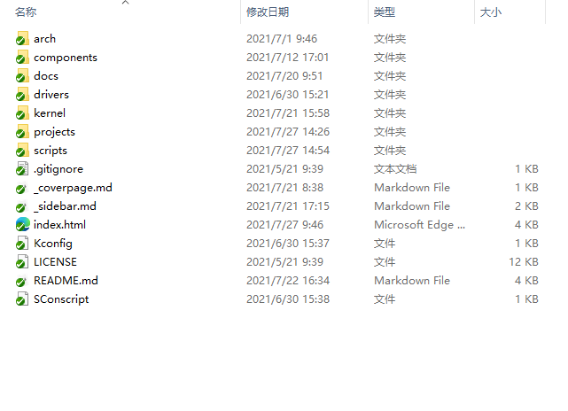
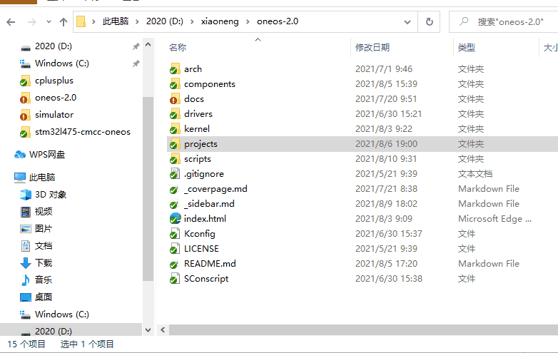

# 快速上手

## 概述

总是会被问道，得到源码了，我该如何上手？我想使用某某组件，我该如何快速把它给用起来？我没有板子，想先熟悉下代码，我该怎么办？我想在某块板子上把系统跑起来，我又该怎么办？等等，各种各种的问题。

当第一次面对不熟悉的东西，也许我们都会有着些许迷惑。而**快速上手篇**就是因解惑而生的，目的就是为了第一次拿到我们的`OneOS-Lite`时，开发者们心中能多一份从容与淡定。

## 初见OneOS-Lite

在用`Keil`模拟器运行 `STM32F103` 示例工程代码时，我们有必要先初步了解一下`OneOS-Lite`操作系统。进入到`OneOS-Lite`操作系统代码根目录下，我们可以看到有多个文件夹和文件，如下图：

各个目录或文件的作用描述见下表。

| **目录或文件名称** | **描述**                                                                                                                                                |
| :----------------- | :------------------------------------------------------------------------------------------------------------------------------------------------------ |
| arch               | 存放和 MCU（或 CPU ）架构体系相关的代码。                                                                                                               |
| components         | 存放组件代码，可进行裁剪。                                                                                                                              |
| docs               | 存放一些文档，如快速上手、开发工具使用等。                                                                                                              |
| drivers            | 存放驱动的抽象层代码和具体外设的驱动代码。                                                                                                              |
| kernel             | 存放内核代码，如任务管理及调度、任务间同步以及通信、内存管理等代码。                                                                                    |
| projects           | 各种开发板的示例工程                                                                                                                                    |
| scripts            | 存放OneOS-Cube工具在编译构造时所需要的脚本文件。                                                                                                        |
| _sidebar.md        | Lite版本文档索引                                                                                                                                        |
| index.html         | 本地文档网页浏览                                                                                                                                        |
| Kconfig            | Menuconfig配置文件，代码工程（如projects目录下的示例工程）中的Kconfig文件会引用此文件                                                                   |
| SConscript         | OneOS-Lite操作系统使用Scons构建工具时的根编译脚本，该脚本会引用其它目录的SConscript脚本，若在OneOS-Lite操作系统根目录增加新的代码目录，需要修改此文件。 |
| LICENSE            | License 授权说明。                                                                                                                                      |

## 代码&&文档

`OneOS-Lite`仓库，不仅仅是代码仓库，同时也是一份文档仓库。`docs`目录存放着快速上手、开发工具使用等文档。而在代码的目录下，也均放有相关的帮助手册`README.md`。这样放置的好处在于，在拉取代码的同时，文档也一并被拉取。阅读代码的同时，可以查阅文档，辅助代码开发，事半功倍有奇效。

根目录下的`_coverpage.md`、`_sidebar.md`、`index.html`则是帮助我们用于生成网页。使用方法可以查看根目录的`README.md`。

## 开发第一步

拿到代码，开发的第一步就是，编译运行！这时，我们需要进入`projects`目录，这里存放着各种开发板的工程项目。如果你有开发板，你可以在里面选择对应的开发板工程项目，进入其中。这里以我们的万耦开发板`stm32l475-cmcc-oneos`为例。

使用[OneOS cube](/docs/tools/cube/OneOS-Cube)（在使用该工具时，记得先安装好噢），输入命令[menuconfig](/docs/tools/menuconfig/menuconfig_use)进行配置（如果对配置不熟悉，可以先使用默认配置），最后输入命令[scons](/docs/tools/scons/scons_cmd)进行编译。

如果你使用`gcc`，将编译生成`elf`文件，你可以在根目录下的`out`文件夹中找到她。

如果你使用`mdk`，你可以使用命令`scons --ide=mdk5`来生成`mdk`的项目工程，然后使用`mdk`进行编译。

如果你没有开发板，建议使用`stm32f103rc`，来让Keil模拟STM32F103，以此来熟悉我们的`rtos`物联网系统。详情可见[Keil模拟STM32F103体验](/docs/quick_guide/simulator/keilsimulator?id=keil模拟stm32f103体验)。

