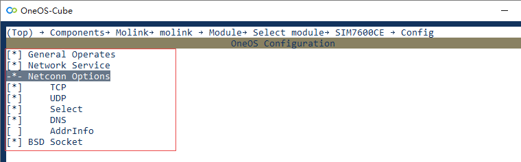
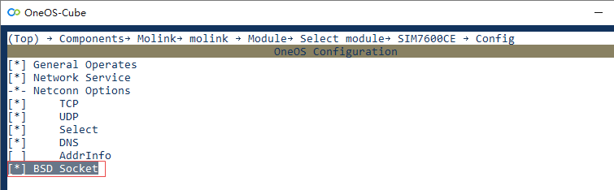
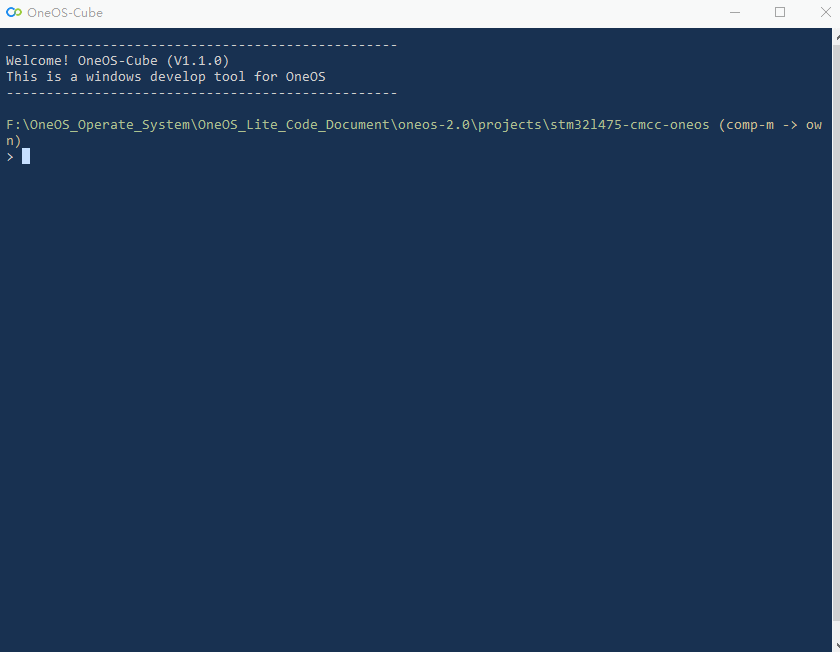
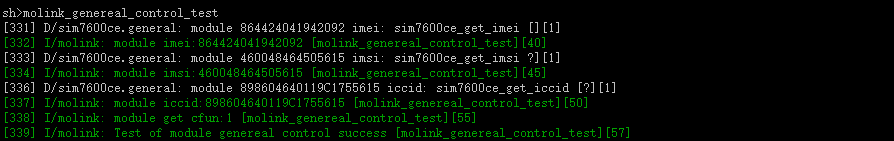

# 模组连接骚操作

> ✨有了它，不用熟悉模组，不用查看AT手册，无线通信就是那么轻而易举！！！

## 概述

模组连接套件，即`Molink(Module Link Kit)` 。通信模组提供`AT`指令集供用户调用来控制通信模组，但是不同厂商、型号的通信模组`AT`指令集不兼容，导致用户程序的可移植性差，产品的通信模组优化升级困难。模组连接套件通过架构设计和模组适配，实现了对不同通信模组的统一控制，并向上层框架或应用提供统一接口，用户无需熟悉通信模组就可以实现高效开发。


OneOS团队已经为开发者适配了几十款通信模组，涵盖`WiFi`、`NB`、`4G Cat1`、`4G Cat4`等模组，详见[模组支持](https://os.iot.10086.cn/doc/user_guide/components/ug_molink.html)。（程序猿们仍在努力搬砖，着急使用未适配的模组请看下文学习适配新模组，也欢迎开发者贡献力量。）

#### 方案支持


`MoLink`套件的设计兼容`MCU+模组`和`模组OpenCPU`方案，通过统一的`API`接口实现应用程序在`AT`模式和`OpenCPU`模式的无缝切换，极大提升了用户程序的可移植性。

#### 通用接口类型

- **模组实例管理接口** 基于模组实例管理框架，调用`MoLink API`轻松实现模组管理及具体业务，包括模组对象的创建、销毁、获取、设置。
- **通用控制接口** 提供模组相关基本信息及功能查询设置，模组创建后，按需调用即可，支持测试`AT`指令、获取`IMEI`、获取`IMSI`、获取`ICCID`、获取/设置射频模式、获取模组固件信息、获取`SIM eID`。
- **网络服务接口** 提供模组网络服务相关基本信息及功能查询设置，包括获取网络注册状态、获取信号强度、获取`IP`地址、查询/设置`DNS`服务器地址、获取`cell`信息等功能。
- **套接字接口** 提供套接字接口，命名上区分于通用套接字接口，以`mo_`作标志，使用方式与通用套接字接口基本无异，区别在于某些接口需要传入模组实例。特殊的是：当配置为单模组情形，`Molink`即可兼容`BSD Socket`接口；当配置为多模组情形，要[Socket套件](https://os.iot.10086.cn/doc/user_guide/components/ug_socket.html)来支持`BSD Socket`接口。
- **云接入接口** 提供云接入相关的接口，前提是模组本身支持上云功能。

本节目标是让开发者快速熟悉`OneOS Molink`组件的配置方法，根据通用接口类型进行不同示例的演示，并最后提供新模组的适配方法。

## 准备工作

1. 中移万耦开发板`（MCU: STM32L475）`；
2. `4G Cat4`模组`SIM7600CE`开发板；
3. `TCP`测试服务器；
4. 杜邦线`3`根；
5. `USB`线一根；
6. `J-Link`仿真器一个。

**实验搭建图**


## 工程配置

演示实验采用`MCU+4G通信模组`的技术方案，选择演示工程，在该工程文件夹下右键启动`OneOS-Cube`工具，通过`Menuconfig`的图形化工具进行工程配置。

#### **工程配置内容**

1. **模组选择与配置**

   该演示工程选择的是`4G Cat4`模组`SIM7600CE`。由于是单模组通信，选择`Single/Multi module` 中的`single`（若配置为`Multi`，则允许同时配置多个通信模组）。在`Select module`配置项中进行模组型号的选择与功能配置。

   

   进入到`Select module`配置项，可以看到已经适配了的`4G Cat4`、`4G Cat1`、`NB`、`WiFi`类型的模组。

   

   选择`SIM7600CE`，在`Config`中进行功能配置。

   

   `General Operates`：使能通用控制，提供模组基本信息相关查询功能，如获取`IMEI`、获取`IMSI`、获取`ICCID`等。

   `Network Service`：使能网络服务控制，提供网络服务相关信息查询及设置功能，包括获取网络注册状态、获取信号强度等。

   `Netconn option`：使能网络连接与通信，提供`mo_netconn api`，是偏底层的一套API接口，通信效率更高，资源占用更少，但易用性相比`Socket`接口稍差。`Netconn option`中的功能项用户按需配置即可。

   ​        `TCP`：提供`TCP`通信功能。

   ​        `UDP`：提供`UDP`通信功能。

   ​        `Select`：提供`select`接口，如未配置，也可以采用类`setsockopt`接口。

   ​        `DNS`：提供域名解析功能。

   ​        `AddrInfo`：提供独立于协议的名称解析，包括处理名字到地址以及服务到端口的转换。

   `BSD Socket`：使能套接字功能，提供一套`mo_socket`接口，详见`components\molink\api\include\mo_socket.h`，在单模组情形可以兼容了`BSD Socket`接口，在多模组情形如需使用`BSD Socket`，还需另外配置`Socket`套件。

2. **串口驱动配置**

   串口的`RX buffer`是接收数据的缓存区，需要调大，默认为`64KB`，这里设置为`1024KB`。发送`TX buffer`可以不调大，实际没有利用发送缓存区，而是直接从应用的发送数据`buffer`获取数据直接发送。

   

3. **socket配置**

   若用户使用`mo_socket`，或者单模组情形使用`BSD Socket`，则只需进行下面这个选项的配置。

   

   只有在多模组情形，用户需要采用`BSD Socket`，除在 ` Components → Molink → molink → Modu→ Select module→ SIM7600CE → Config`设置项中要勾选`BSD Socket`选项，在`Components → Socket`下的`BSD Socket`选项也要勾选。演示实验为单模组情形，则`molink`套件就可以兼容`BSD Socket`，这里无需配置。

   

#### **工程配置过程**



## 编程入门

这里按模块化提供本次实验演示所用的模组实例管理代码、通用控制代码、网络服务代码、套接字代码、云接入代码。如需对`Molink API`做详细了解，详见 [Molink API 手册](https://os.iot.10086.cn/oneos-doc-2.0/components/basic_net/molink/) 。

#### 模组实例管理

在数据通信前，首先要完成模组实例创建。在单模组情形，可以不需要设置默认模组，直接获取默认模组即为已经创建的模组 。

`Demo`流程：添加模组实例：`创建模组 → (多模组情形)设置默认模组 → 获取默认模组对象 → 通过命名获取模组对象`。

​                     销毁模组实例：`获取默认模组对象 → 销毁模组`。

```c
#include <stdlib.h>
#include <string.h>
#include <os_errno.h>
#include <dlog.h>
#include <serial.h>
#include "mo_factory.h"
#include "mo_common.h"

#define MOLINK_LOG_TAG "molink"

#define MODULE_NAME "sim7600ce"
#define MODULE_AT_PARSER_RECV_BUF_LEN (1500)
#define MODULE_AT_DEVICE_NAME "uart2"
#define MODULE_AT_DEVICE_RATE (115200)


static struct serial_configure uart_config = OS_SERIAL_CONFIG_DEFAULT;

/* create module */
static int molink_module_management_create(void)
{
    mo_object_t *test_module = OS_NULL;
    mo_object_t *temp_module = OS_NULL;
    mo_parser_config_t parser_config = {0};

    os_device_t *device = os_device_find(MODULE_AT_DEVICE_NAME);
    if (OS_NULL == device)
    {
        LOG_E(MOLINK_LOG_TAG, "Can not find %s device!", MODULE_AT_DEVICE_NAME);
        return OS_ERROR;
    }

    uart_config.baud_rate = MODULE_AT_DEVICE_RATE;
    os_device_control(device, OS_DEVICE_CTRL_CONFIG, &uart_config);

    parser_config.parser_name = MODULE_NAME;
    parser_config.parser_device = device;
    parser_config.recv_buff_len = MODULE_AT_PARSER_RECV_BUF_LEN;

    test_module = mo_create(MODULE_NAME, MODULE_TYPE_SIM7600CE, &parser_config);
    if (OS_NULL == test_module)
    {
        LOG_E(MOLINK_LOG_TAG, "Can not find %s interface device!", MODULE_AT_DEVICE_NAME);
        return OS_ERROR;
    }

#ifdef MOLINK_USING_MULTI_MODULES
    /* set default module instance */
    mo_set_default(test_module);
#endif

    /* get default module instance */
    temp_module = mo_get_default();
    if (OS_NULL == temp_module)
    {
        LOG_E(MOLINK_LOG_TAG, "Get default module failed!");
        mo_destroy(test_module, MODULE_TYPE_SIM7600CE);
        return OS_ERROR;
    }

    /* get module instance by name */
    temp_module = mo_get_by_name(MODULE_NAME);
    if (OS_NULL == temp_module)
    {
        LOG_E(MOLINK_LOG_TAG, "Get module by name: %s failed!", MODULE_NAME);
        mo_destroy(test_module, MODULE_TYPE_SIM7600CE);
        return OS_ERROR;
    }
    
    LOG_I(MOLINK_LOG_TAG, "Test of create module success");

    return OS_EOK;
}

/* destroy module */
static int  molink_module_management_destroy(void)
{
    mo_object_t *test_module = OS_NULL;
    int result;
    
    test_module = mo_get_default();
    if (OS_NULL == test_module)
    {
        LOG_E(MOLINK_LOG_TAG, "Get default module failed!");
        return OS_ERROR;
    }
    
    result = mo_destroy(test_module, MODULE_TYPE_SIM7600CE);
    if (OS_ERROR == result)
    {
        LOG_E(MOLINK_LOG_TAG, "Destroy module %s failed!", MODULE_NAME);
        return OS_ERROR;
    }

    LOG_I(MOLINK_LOG_TAG, "Test of destroy module success");
    
    return OS_EOK;
}

#ifdef OS_USING_SHELL
#include <shell.h>
SH_CMD_EXPORT(molink_module_management_create, molink_module_management_create, "molink module management create");
SH_CMD_EXPORT(molink_module_management_destroy, molink_module_management_destroy, "molink module management destroy");
#endif
```

#### 通用控制

运行`Demo`前完成模组实例的创建。

`Demo`流程：`获取默认模组对象 → AT测试 → 获取IMEI → 获取IMSI → 获取ICCID → 获取CFUN`。

```c
#include <stdlib.h>
#include <string.h>
#include <os_errno.h>
#include <dlog.h>
#include <serial.h>
#include "mo_general.h"
#include "mo_common.h"

#define MOLINK_LOG_TAG "molink"

#define IMEI_LEN    (15)
#define IMSI_LEN    (15)
#define ICCID_LEN   (20)

/* molink genereal control test */
int molink_genereal_control_test(void)
{   
    os_err_t     result       = OS_ERROR;
    mo_object_t *test_module  = OS_NULL;
    os_uint8_t   get_cfun_lvl = 0;
    char imei[IMEI_LEN + 1]   = {0};
    char imsi[IMSI_LEN + 1]   = {0};
    char iccid[ICCID_LEN + 1] = {0};
    
    /* get default module instance */
    test_module = mo_get_default();
    if (OS_NULL == test_module)
    {
        LOG_E(MOLINK_LOG_TAG, "Get default module failed!");
        return OS_ERROR;
    }

    /* test AT & test connection */
    result = mo_at_test(test_module);
    OS_ASSERT(OS_EOK == result);

    /* get IMEI */
    result = mo_get_imei(test_module, imei, sizeof(imei));
    OS_ASSERT(OS_EOK == result);
    LOG_I(MOLINK_LOG_TAG, "module imei:%s", imei);

    /* get IMSI */
    result = mo_get_imsi(test_module, imsi, sizeof(imsi));
    OS_ASSERT(OS_EOK == result);
    LOG_I(MOLINK_LOG_TAG, "module imsi:%s", imsi);

    /* get ICCID */
    result = mo_get_iccid(test_module, iccid, sizeof(iccid));
    OS_ASSERT(OS_EOK == result);
    LOG_I(MOLINK_LOG_TAG, "module iccid:%s", iccid);

    /* get function level */
    result = mo_get_cfun(test_module, &get_cfun_lvl);
    OS_ASSERT(OS_EOK == result);
    LOG_I(MOLINK_LOG_TAG, "module get cfun:%u", get_cfun_lvl);

    LOG_I(MOLINK_LOG_TAG, "Test of module genereal control success");

    return OS_EOK;
}

#ifdef OS_USING_SHELL
#include <shell.h>
SH_CMD_EXPORT(molink_genereal_control_test, molink_genereal_control_test, "molink genereal control test");
#endif
```

#### 网络服务

运行`Demo`前完成模组实例的创建。

`Demo`流程：`获取默认模组对象 → AT测试 → 获取网络注册状态 → 获取网络激活状态 → 获取信号强度 → 网络异常处理（设置CFUN）`。

```c
#include <mo_api.h>
#include <mo_netserv.h>
#include <dlog.h>

#define MOLINK_LOG_TAG "molink"

#define INIT_DFT       (0)
#define INIT_BER_DFT   (99)

/* molink net service test */
int molink_net_service_test(void)
{
    os_err_t result         = OS_ERROR;
    os_uint8_t cid_get      = INIT_DFT;
    os_uint8_t act_stat_get = INIT_DFT;
    os_uint8_t rssi         = INIT_DFT;
    os_uint8_t ber          = INIT_BER_DFT;
    eps_reg_info_t reg_info = {0};
    os_uint8_t set_cfun_lvl = 0;

    /* get default module instance */
    mo_object_t *test_module = mo_get_default();
    if(NULL == test_module)
    {
        return OS_ERROR;
    }

    /* test AT & test connection */
    result = mo_at_test(test_module);
    if(OS_EOK != result)
    {
        return OS_ERROR;
    }

    /*
     * get the presentation of an network registration urc data
     * and the network registration status
     */
    result = mo_get_reg(test_module, &reg_info);
    if(OS_EOK != result)
    {
        return OS_ERROR;
    }
    LOG_I(MOLINK_LOG_TAG, "module register n:%u, state:%u", reg_info.reg_n, reg_info.reg_stat);
    if (1 != reg_info.reg_stat && 5 != reg_info.reg_stat)
    {
        LOG_E(MOLINK_LOG_TAG, "module register fail");
        goto __neterr;
    }

    /* get the state of PDP context activation */
    result = mo_get_cgact(test_module, &cid_get, &act_stat_get);
    if(OS_EOK != result)
    {
        return OS_ERROR;
    }
    LOG_I(MOLINK_LOG_TAG, "module PDP context cid:%u, act stat:%u", cid_get, act_stat_get);
    if (1 != act_stat_get)
    {
        LOG_E(MOLINK_LOG_TAG, "module PDP context deactive");
        goto __neterr;
    }

    /* get the csq info */
    result = mo_get_csq(test_module, &rssi, &ber);
    if(OS_EOK != result)
    {
        return OS_ERROR;
    }
    LOG_I(MOLINK_LOG_TAG, "module csq rssi:%u, ber:%u", rssi, ber);

    return OS_EOK;

__neterr:
    set_cfun_lvl = 0;
    result = mo_set_cfun(test_module, set_cfun_lvl);
    set_cfun_lvl = 1;
    result = mo_set_cfun(test_module, set_cfun_lvl);
    LOG_I(MOLINK_LOG_TAG, "module set cfun 0 to 1");

    return OS_ERROR;
}

#ifdef OS_USING_SHELL
#include <shell.h>
SH_CMD_EXPORT(molink_net_service_test, molink_net_service_test, "molink net service test");
#endif
```

#### 套接字

运行`Demo`前完成模组实例的创建。

`Demo`流程：`获取默认模组对象 → 获取IP → 创建Socket → 连接TCP服务器 → 发送数据 → 接收数据 → 关闭Socket`。这里采用的是`mo_socket`接口，单模组情形也可以用`BSD Socket`接口。

```c
#include "mo_socket.h"
#include "mo_api.h"

#include <stdio.h>
#include <stdlib.h>
#include <string.h>
#include <dlog.h>
#include <sys/errno.h>
#include <oneos_config.h>

#define MOLINK_LOG_TAG "mo_socket"

#define TEST_SERVER_ADDR  "121.89.166.244"
#define TEST_TCP_PORT (6588)

#define TEST_SEND_BUFF_LEN (64)
#define TEST_RECV_BUFF_LEN (64)


void molink_mosocket_tcp_test(void)
{
    struct sockaddr_in server_addr;
    struct hostent *host;
    os_uint32_t port;
    int socket_id;
    char send_buf[TEST_SEND_BUFF_LEN]={0};
    char recv_buf[TEST_RECV_BUFF_LEN]={0};
    fd_set readfds;
    int sent_size;
    int recv_size;
    int str_len;
    struct timeval tv;
    int err;
    
     /* get default module instance */
    mo_object_t *test_module = mo_get_default();
    if(NULL == test_module)
    {
        LOG_E(MOLINK_LOG_TAG, "get default module failed");
        return;
    }

    /* server domain name convert to ip */
    if ((host = mo_gethostbyname(test_module, TEST_SERVER_ADDR)) == NULL)
    {
        LOG_E(MOLINK_LOG_TAG, "dns parse error");
        return;
    }

    port = TEST_TCP_PORT;
    memset(&server_addr, 0, sizeof(struct sockaddr_in));
    server_addr.sin_family = AF_INET;
    server_addr.sin_port   = htons(port);
    server_addr.sin_addr   = *((struct in_addr *)host->h_addr);

    /* create a socket */
    socket_id = mo_socket(test_module, AF_INET, SOCK_STREAM, 0);
    if (socket_id < 0)
    {
        LOG_E(MOLINK_LOG_TAG, "molink tcp socket=%d create failed", socket_id);
        return;
    }

    /* connect to server */
    err = mo_connect(test_module, socket_id, (struct sockaddr *)&server_addr, sizeof(struct sockaddr));
    if (err != 0)
    {
        LOG_E(MOLINK_LOG_TAG, "molink tcp socket=%d connect failed", socket_id);
        mo_closesocket(test_module, socket_id);
        return;
    }

    for (int i = 0; i < 30; i++)
    {
        /* send data to server */
        memset(send_buf, 0, sizeof(send_buf));
        snprintf(send_buf, sizeof(send_buf), "This is molink socket tcp test");
        str_len = strlen(send_buf);
        sent_size = mo_send(test_module, socket_id, send_buf, str_len, 0);
        if (sent_size > 0)
        {
            if (sent_size != str_len)
            {
                LOG_E(MOLINK_LOG_TAG, "molink tcp socket=%d send data error", socket_id);
                break;
            }
        }
        else if (0 == sent_size)
        {
            LOG_E(MOLINK_LOG_TAG, "no data be sent");
        }
        else
        {
            if (EINTR == errno)
            {
                LOG_E(MOLINK_LOG_TAG, "EINTR be caught");
                continue;
            }

            LOG_E(MOLINK_LOG_TAG, "molink tcp socket=%d send fail", socket_id);
            break;
        }
        
        /* wait server echo data */
        FD_ZERO(&readfds);
        FD_SET(socket_id, &readfds);

        tv.tv_sec = 60;
        tv.tv_usec = 0;
        /* judge if data has arrived within timeout */
        err = mo_select(socket_id + 1, &readfds, OS_NULL, OS_NULL, &tv);
        if (err > 0)
        {
            if (FD_ISSET(socket_id, &readfds))
            {
                memset(recv_buf, 0, sizeof(recv_buf));
                /* receive server data */
                recv_size = mo_recv(test_module, socket_id, recv_buf, str_len, 0);
                if (recv_size > 0)
                {
                    LOG_I(MOLINK_LOG_TAG, "molink tcp socket=%d recv data: %s", socket_id, recv_buf);
                    if (recv_size != sent_size)
                    {
                        LOG_E(MOLINK_LOG_TAG, "molink tcp socket=%d recv not equal to sent");
                    }
                }
                else if (0 == recv_size)
                {
                    LOG_E(MOLINK_LOG_TAG, "molink tcp socket=%d connection close", socket_id);
                    break;
                }
                else
                {
                    if (EINTR == errno)
                    {
                        LOG_E(MOLINK_LOG_TAG, "molink tcp socket=%d EINTR be caught", socket_id);
                        continue;
                    }

                    LOG_E(MOLINK_LOG_TAG, "molink tcp socket=%d recv fail", socket_id);
                    break;
                }
            }
        }
        else if (err == 0)
        {
            LOG_E(MOLINK_LOG_TAG, "molink tcp socket=%d select timeout happen", socket_id);
            continue;
        }
        else
        {
            if (errno != EINTR)
            {
            	LOG_E(MOLINK_LOG_TAG, "molink tcp socket=%d error in select", socket_id);
                break;
            }
        }

        os_task_msleep(1000);
    }

    mo_closesocket(test_module, socket_id);
    LOG_I(MOLINK_LOG_TAG, "End of molink socket tcp test");
}

#ifdef OS_USING_SHELL
#include <shell.h>
SH_CMD_EXPORT(molink_mosocket_tcp_test, molink_mosocket_tcp_test, "molink socket tcp test");
#endif
```

#### 云接入

`SIM7600CE`不支持云接入功能。

## RUN起来

#### 模组实例管理

**测试命令**

`molink_module_management_create`

该命令用于在设备端跑编程入门中的模组实例管理演示代码，执行流程：`创建模组 → 获取默认模组对象 → 通过命名获取模组对象`。

`molink_module_management_destroy`

该命令用于在设备端跑编程入门中的模组实例管理演示代码，执行流程：`获取默认模组对象 → 销毁模组`。

**效果展示**


#### 通用控制

**测试命令**

`molink_genereal_control_test`

该命令用于在设备端跑编程入门中的通用控制演示代码，执行流程：`获取默认模组对象 → AT测试 → 获取IMEI → 获取IMSI → 获取ICCID → 获取CFUN`。

**效果展示**



#### 网络服务

**测试命令**

`molink_net_service_test`

该命令用于在设备端跑编程入门中的网络服务演示代码，执行流程：`获取默认模组对象 → AT测试 → 获取网络注册状态 → 获取网络激活状态 → 获取信号强度`。

**效果展示**


#### 套接字

**测试命令**

`molink_mosocket_tcp_test`

该命令用于在设备端跑编程入门中的套接字演示代码，执行流程：`获取默认模组对象 → 获取IP → 创建Socket → 连接TCP服务器 → 发送数据 → 接收数据 → 关闭Socket`。

**效果展示**


## 适配新模组

在这里手把手教学如何适配一款新的模组，后续补充。

## 注意事项

1. `Molink`提供的通用控制和网络服务相关接口需要模组支持，部分接口失败的原因是模组本身不支持该功能。
2. 如遇到模组实例创建失败，查看模组工作状态是否正常，串口设置是否正确。
3. 支持`mo_socket`网络接口，也支持用`AT`的方式，如用`BSD Socket`，在多模组情形需要`Socket`套件。
4.  对于`NB`类型模组，因网络因素受限，收发较大长度的数据常会有严重丢包重传等现象发生，造成发送/接收较返回超时或错误，不建议大量数据收发。
5. 通信模组通过串口发送给系统的数据将会首先缓存在串口数据缓冲区中，因此，如果串口缓冲区大小设置过小则会导致`Molink `无法正确的接收通信模组发送的数据，造成`AT`指令执行超时或数据接收不全等问题。建议将串口缓冲区大小设置为略大于通信所需的数据的最大值。

