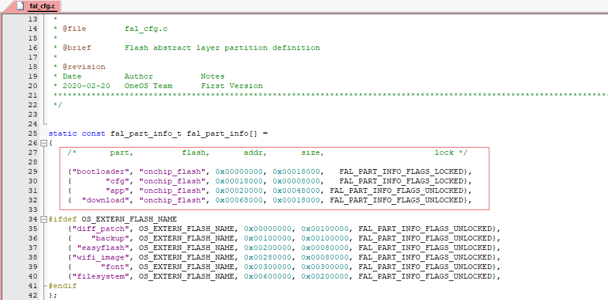
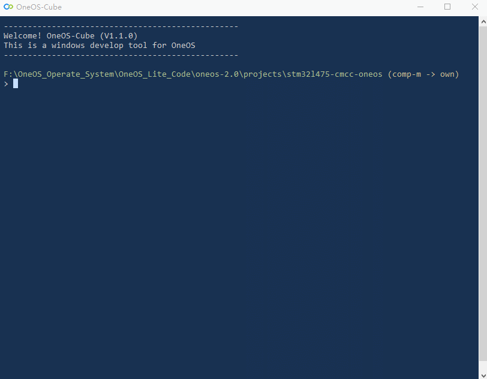

# 远程升级飒不飒？

> ✨资源吃紧、流量限制、网络拥塞、异常复位，OTA升级有它不用怕！！！

## 概述

远程升级组件是`OneOS`提供的端到端完整且免费的`OTA`解决方案，包含端侧的系统组件和云端`OTA`服务。`OneOS-OTA`提供版本检测、升级包下载、安全校验、差分还原、写入升级等功能，同时客户可以通过云端管理平台，对用户、版本、差分算法、升级策略等进行管理和数据统计分析，在完善的安全体系和灾备体系下实现对整个`OTA`业务的运营和监管。

#### **技术架构**


#### **技术优势**

* **海量数据** 面对巨量设备升级时，具备智能纠错能力、断点续传机制

* **灵活配置** 多策略的配置管理，允许客户根据不同的分组、时间、地点、设备号和升级方式来实现针对性升级配置

* **使用便捷** 丰富的平台适配，精准的编译链，让客户使用更安心、更便捷

* **自动高效** 全自动的打包、做包、签名、上传、下载、还原、升级的过程，最大限度的提高效率

* **差分算法** 优异的差分算法，最大差分效率可以实现差分包仅为整包的1%

本节目标是让开发者快速熟悉`OneOS OTA`组件的端侧配置方法、云端管理平台配置方法、差分升级包生成方法， 并运行示例代码，通过无线网络实现固件升级。

## 准备工作

1. 中移万耦开发板`（MCU: STM32L475）`；

2. `ESP8266WiFi`模组；

3. `OneOS OTA`升级云平台账户；

4. 启动加载程序（[STM32L475bootloader.bin](https://gitee.com/cmcc-oneos/bootloader)）；

5. `J-Flash`烧录工具；

6. `J-LINK`仿真器一个；

7. `USB`线一根。

   **实验搭建图**

 

## 工程配置

选择演示工程，在该工程文件夹下右键启动`OneOS-Cube`工具，通过`Menuconfig`的图形化工具进行工程配置。

#### **工程配置内容**

1. ##### **OTA组件配置**

   

   **下载协议**：

   差分包下载协议支持`CoAP`和`HTTP`，这里的`CoAP`实际是`CoAP/LwM2M`协议。

   **差分算法：**

   支持`LUSUN`、`WOSUN LOW`、`WOSUN HIGH`，不同算法对板子的资源需求不同；

   板子`RAM < 200KB`，推荐使用`Lusun`；

   板子`RAM > 200KB`，可以考虑使用`Wosun low`；

   板子`RAM > 512KB`，可以考虑使用`Wosun high`；

   `App`的算法选择需要与`BootLoader`的差分还原算法保持一致。

   **下载包大小：**

   设置范围为`0-5`。

   `3：128Byte`

   `5：512Byte`

   **与平台相关配置：**

   与`OTA`平台侧项目信息保持一致，`Firmware version`是制作出软件包的版本，打包命令会将此信息写入到软件包，用于后续在`OTA`差分平台上制作差分包。

2. ##### **模组选择与配置**

   

   `OTA`演示工程选择的是`ESP8266 WiFi`模组，勾选`Object Auto Create`，正确设置串口号和波特率，让模组在`OneOS`操作系统启动时自动完成初始化，使`Molink`组件与模组之间建连，当然用户也可以采用手动初始化方式，即在应用初始阶段调用模组的初始化接口。

   `AP` 的`SSID`和`Password`根据实际的无线接入点设置。

   `TCP/IP`选项可以根据`OTA`的下载协议来选择，采用`CoAP`则须配置`UDP`、采用`HTTP`须配置`TCP`，在这里板子硬件资源充足都配置上了。

   勾选`BSD Socket`选项，`OTA`组件采用`BSD`的标准接口进行网络的连接和数据收发。

3. ##### **串口驱动配置**

   串口的`RX buffer`是接收数据的缓存区，需要调大，默认为`64KB`，这里设置为`1024KB`，当然也可以根据`OTA`升级过程的下载包大小来设置（下载包大小在`OTA`选项中配置），发送`TX buffer`可以保持默认`64KB`。

   

4. ##### **Board boot配置**

   

   `OTA`组件需要`Bootloader`支持，所以这里还需要进行芯片启动相关设置。

   存在`Bootloader`文件，`APP`的起始地址`text section addr`进行偏移、`APP`的大小`text section size`更改后才能跳转成功。`data section addr`为`RAM`起始地址，`data section size`为`RAM`大小，也要做相应的配置。

   `APP`与`Bootloader`分区信息需要一致，不然会跳转失败，附上`STM32L475 Bootloader`中的分区信息。

   

5. ##### **FAL配置**

   打开工程文件`fal_cfg.c`，对其中的分区信息进行配置，须根据`Bootloader`中的分区信息来修改，以`STM32L475`为例，修改结果如下：

   

6. ##### **打包固件**

   压缩软件支持：`WinRAR.exe`、`7z.exe`。

   打包命令：

   ```
   只生成axf文件的打包命令：..\..\components\ota\cmiot\cmiot_axf.bat fromelf程序路径 压缩软件路径 oneos_config.h axf文件路径
   已生成bin文件的打包命令：..\..\components\ota\cmiot\cmiot_bin.bat 压缩软件路径 oneos_config.h bin文件路径
   
   例如：
   只生成axf文件：..\..\components\ota\cmiot\cmiot_axf.bat "D:\Keil_v5\ARM\ARMCC\bin\fromelf.exe" "C:\Program Files\WinRAR\WinRAR.exe" oneos_config.h build\keil\Obj\oneos.axf
   已生成bin文件：..\..\components\ota\cmiot\cmiot_bin.bat "C:\Program Files\WinRAR\WinRAR.exe" oneos_config.h oneos.bin
   ```

   `WinRAR.exe`和`fromelf.exe`是绝对路径，需要根据个人电脑相应安装路径进行修改。打包命令可以在`scons`或`cmd`命令行打包，也可以加到`Keil`软件里。

   打包后的软件包路径为`oneos-2.0\projects\stm32l475-cmcc-oneos-fota`。

7. ##### **差分包制作**

   `OTA`云平台制作差分包

   

   差分对比块大小：配置为和驱动`Flash`块大小一样，`STM32L475VGT6`的`Flash`块大小为`2KB`。

   目标版本：这里上传`Firmware version`为`1.1`的`bin`文件打包后的软件包。

   前置版本：这里上传板子当前运行的固件的打包文件，其`Firmware version`为`1.0`。

   接下来进行：解析升级包`→ `生成升级包` → `部署升级包，直到部署成功。

8. ##### **发布升级包**

   进入`OTA`升级平台，依次进行：版本管理`→ `配置差分`→ `测试通过`→ `发布。

   

   

   

#### 工程配置过程



## 编程入门

这里提供了本次实验所用的设备端`OTA`升级演示代码。如需对`OTA API`做详细了解，详见 [OTA API 手册](http://localhost:3000/#/components/ota/cmiot/README) 。

升级更新、上报升级结果的代码

```c
#include <cmiot_user.h>
#include <driver.h>
#include <dlog.h>
#include <oneos_config.h>

#define OTA_LOG_TAG "ota"

OS_WEAK void os_hw_cpu_reset(void){}

void ota_test(void)
{
    cmiot_int8 result = E_CMIOT_FAILURE;

    for (int i=0; i<5; i++)
    {
        result = cmiot_report_upgrade();
        if (E_CMIOT_SUCCESS == result)
        {
            LOG_I(OTA_LOG_TAG, "upgrade success and reported");
            break;
        }
        else if(E_CMIOT_NO_UPGRADE == result)
        {
            LOG_I(OTA_LOG_TAG, "no new upgrade");
            break;
        }
    }
    
    for (int i=0; i<5; i++)
    {
        result = cmiot_upgrade();
        if (E_CMIOT_SUCCESS == result)
        {
            LOG_I(OTA_LOG_TAG, "get a new version and start cpu reset");
            os_hw_cpu_reset();
        }
        else if(E_CMIOT_LAST_VERSION == result)
        {
            LOG_E(OTA_LOG_TAG, "not a new version");
            break;
        }
    }
}

#ifdef OS_USING_SHELL
#include <shell.h>
SH_CMD_EXPORT(ota_test, ota_test, "ota test");
#endif
```

## RUN起来

#### **测试命令**

`ota_test`

该命令用于在设备端跑编程入门中的`OTA`升级演示代码，会做升级包下载和升级结果上报。

#### 效果展示

**设备侧**

在`shell`输入`ota_test`，进行固件包的查询，若存在较本地更新的固件包则进行下载，下载完成后会自动重启，`Log`见下图。


等待设备重启完成，在`shell`再次输入`ota_test`，进行升级结果的上报，`Log`见下图。


**平台侧**

平台侧可以看到设备的升级状态，如检测成功、下载成功、升级成功、升级失败等。


## 注意事项

1. 如果使用串口通信，串口的`RX buffer`推荐设置成`512`或更大，以免下载升级包出错；
2. `OTA`的算法选择需要与`BootLoader`的差分还原算法保持一致；
3. `APP`的`Flash`分区信息须与`Bootloader`中的`Flash`分区信息保持一致；
4. 平台建项目时`OTA`类型选择精简版，目前的板子只支持精简版。 

