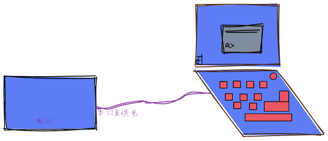

# 玩转shell

## 概述

人想要和操作系统进行交互，传送指令给操作系统，就需要使用到`shell`。宏义的`shell`是人与机器交互的页面，它分为两种，一种是有界面的，比如`GUI`，另外一种是没有界面的，完全是指令操作的(`CLI`)。我们一般说的shell指的就是命令行界面。

最早`Ken Thompson`设计`Unix`的时候，使用的是命令解释器shell，命令解释器接受用户的命令，然后解释他们并执行。`shell`是一个C语言编写的，可以嵌入在程序中的嵌入式命令行，通俗一点说就是一个命令行，可以通过命令行调用、运行程序中的函数。

在`OneOS-Lite`中，运行的设备往往是低成本的开发板，常常需要与 PC 机连接起来通讯，常见的连接方式有：串口、网络、USB等。因此，我们支持`shell`，在PC上敲入命令，通过串口的方式输入到开发板中，以辅助开发者便捷快速的获取系统的各种信息，并且可以通过`shell`输入各种命令用以控制嵌入式设备运行。

## 源码目录

```
├─doc
├─include
│      shell.h
└─source
        shell_buildin_cmd.c
        shell_internal.h
        shell_main.c
        shell_process.c
        shell_symbol.c
```

## 配置shell组件

```
(Top) → Components→ Shell
                                            One-Os Configuration
[*] shell
(1024)  shell task stack size (NEW)
(80)    command line size (NEW)
(256)   prompt line size (NEW)
```

通过`menuconfig`进行配置，可见和`OneOS2.0`主线版本相比，`OneOS-Lite`版本提供给用户的选择更加精简。部分功能选择了默认提供：

1. `shell`组件的任务名默认为：`shell`。
2. `shell`任务的优先级默认为：当总优先级==8，shell优先级==5；当总优先级==32，shell优先级==20。
3. 默认保存`shell`命令描述到符号表中。
4. `shell`命令默认最大参数为10。

部分功能选择了默认不提供：

1. `shell`历史命令保存，默认不提供
2. `shell`的`echo`模式，默认不提供。
3. `shell`登录验证，默认不提供。

而，用户可选择的功能则有：

1. `shell`任务的栈大小，可根据硬件以及命令所需大小，进行配置。
2. `shell`的命令大小，可根据最大的命令长度来决定。
3. `shell`的提示行大小，可根据命令的返回信息长度来决定。

## 配置依赖

shell组件依赖于串口和控制台。确保配置的时候，它们都是被使能的。以下面配置为例：

```
(Top) → Drivers→ Console
                                            OneOS Configuration
[*] console
(uart3) name
(256)   os_kprintf buffer size
```

表明了使用`uart3`，且`os_kprintf`最大可打印字符为256。

## 简单使用

使能并配置好`shell`组件以后，使用`keil`或`gnu`编译链接生成可执行文件，并固化到开发板中，使用串口和PC相连。



```bash
test>help
OneOS shell commands:
atest_run        - atest_run [-n testacse name] [-l loop count] [-p priority level] [-t] [-s] [-h]
atest_list       - Display all atest testcases
reboot           - reboot
device           - show device information
list_clocksource - list_clocksource
list_clockevent  - list_clockevent
reset            - Reset the mcu
show_event       - show event information
show_mb          - Show mailbox information
show_mempool     - Show mempool information
show_heap        - show memheap information
show_mem         - show memory usage information
check_mem        - check memory data
trace_mem        - trace memory used by task
show_mq          - Show message queue information
show_mutex       - Show mutex information
show_sem         - show semaphore information
show_task        - Show task information
version          - show oneos version
set_prompt       - Set shell prompt
help             - Obtain help of commands
```


