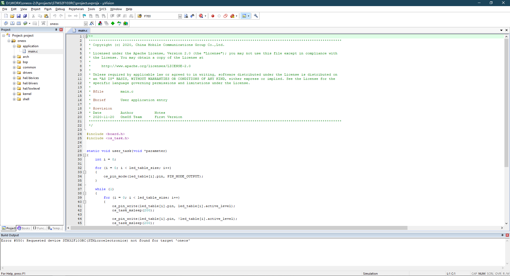
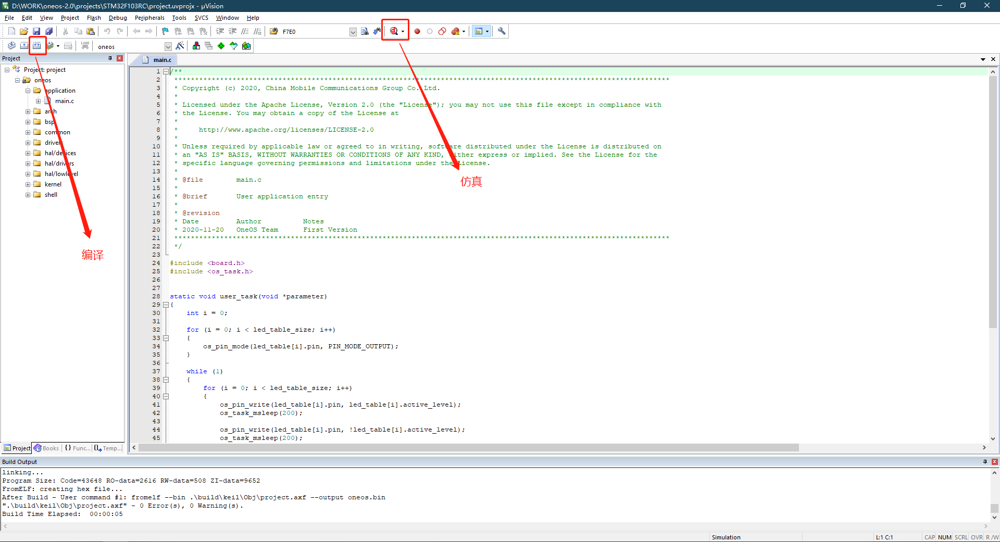
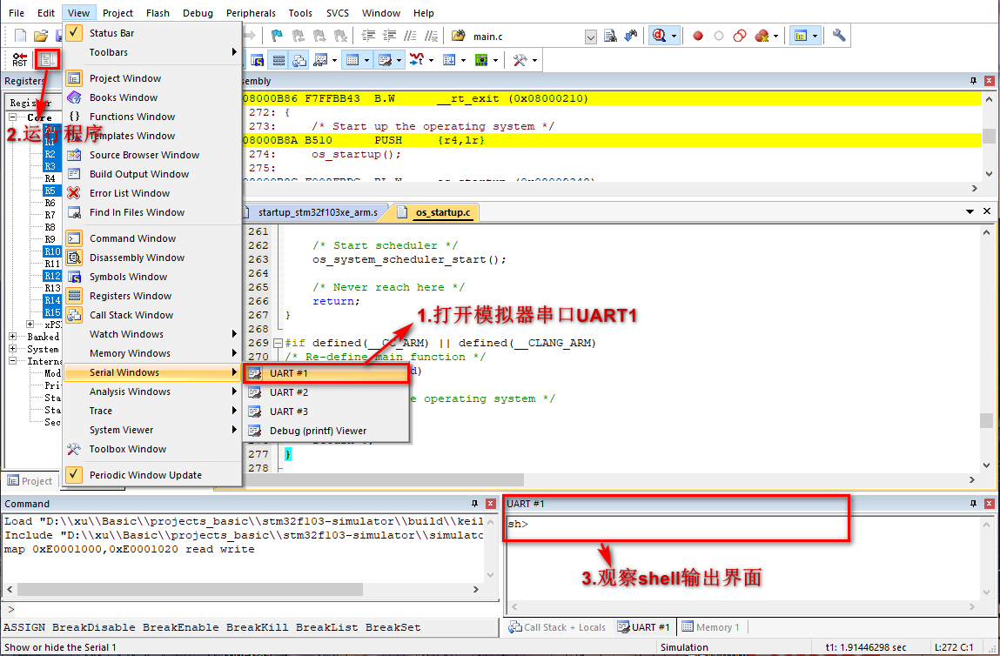
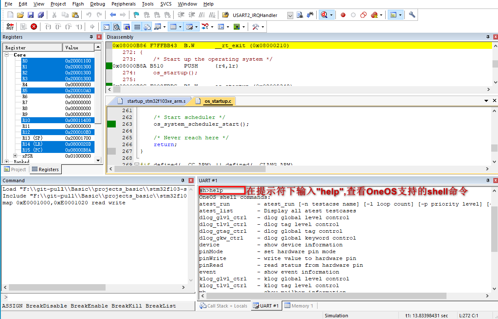
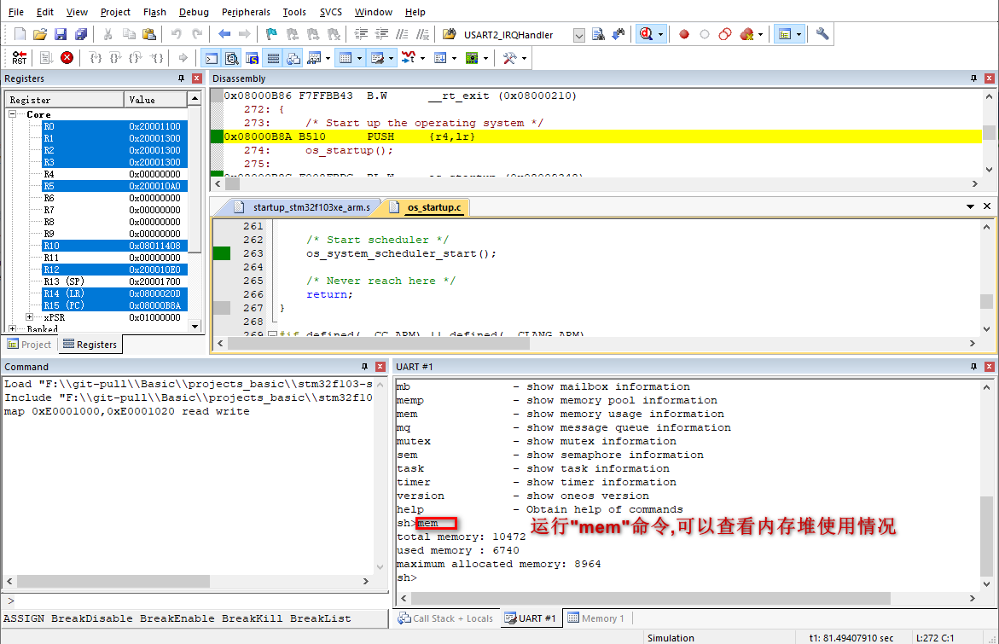

# Keil模拟STM32F103体验

一般嵌入式操作系统因为它的特殊性，往往和硬件平台密切相关连，具体的嵌入式操作系统往往只能在特定的硬件上运行。对于刚接触 `OneOS Lite`操作系统的读者要想马上获得一个和 `OneOS Lite`操作系统相配套的硬件模块并不容易，但随着计算机技术的发展，我们可以采用软件方式来模拟一个能够运行 `OneOS Lite`操作系统的硬件模块，这就是 `ARM` 公司的 `MDK-ARM（Keil）`仿真模拟环境。

`MDK-ARM（MDK-ARM Microcontroller Development Kit，也称为Keil）`软件是一套完整的集成开发环境（IDE），它出自 `ARM `公司，包括了针对 `ARM` 芯片（`ARM7`、`ARM9`、`Cortex-M `系列、`Cortex-R` 系列等）的高效` C/C++ `编译器；针对各类 `ARM` 设备、评估板的工程向导和工程管理；用于软件模拟运行硬件平台的模拟器；以及与市面上常见的如` ST-Link`，`JLink` 等在线仿真器相连接以配合调试目标板的调试器。`MDK-ARM `软件中的软件仿真模拟器，采用完全软件模拟方式解释执行 ARM 的机器指令，并实现外围的一些外设逻辑，从而构成一套完整的虚拟硬件环境，使得用户能够不借助真实的硬件平台就能够在电脑上执行相应的目标程序。

`MDK-ARM` 集成开发环境因为其完备的 `STM32F103` 软件仿真环境，也让我们有机会在不使用真实硬件环境的情况下直接在电脑上运行目标代码。这套软件仿真模拟器能够完整地虚拟出 `ARM Cortex-M3` 的各种运行模式、外设，如中断异常、时钟定时器、串口等，这几乎和真实的硬件环境完全一致。实践也证明，本文使用到的这份 `OneOS Lite`入门例程，在编译成二进制代码后，不仅能够在模拟器上运行，也能够在不加任何修改的情况下在真实硬件平台上正常运行。

下面我们将选择 `MDK-ARM` 集成开发环境作为目标硬件平台来观察` OneOS Lite`操作系统是如何运行的。

## 准备工作

准备工程如下：

* 安装 5.14 版本及以上的 `MDK-ARM （Keil）`集成开发环境（具体安装过程参见[MDK环境搭建](/docs/tools/mdk/mdk-install.md)），在安装好 `MDK-ARM` 集成开发环境后，再安装 `STM32F1xx\_DFP PACK`包；

* 下载一份完整的`OneOS Lite`代码；

## 打开使用Keil模拟器的示例工程

进入到`oneos-2.0\projects\stm32f103rc`目录中，双击`“project.uvprojx”`文件，打开`stm32f103rc`的`Keil`工程文件，见下图：

## 编译和仿真

见下图：

## 打开模拟器串口、运行程序并观察SHELL界面

见下图：

## 运行help命令

通过`help`命令可以查看当前系统支持的命令：

## 查看内存堆使用情况

其中 `mem` 是查看内存堆使用的情况，执行此命令，结果见下图：

