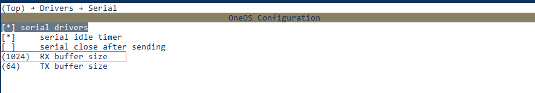
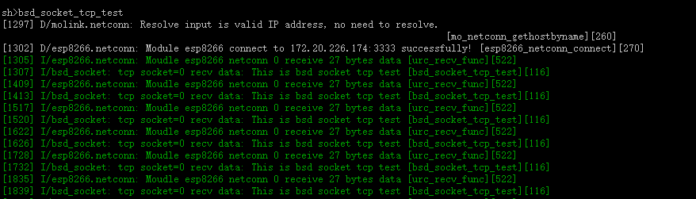

# Socket很酷

> ✨管你什么lwip、什么通信模组，我只管我的socket！！！

## 概述

通常小型物联网设备会基于`MCU+模组`或`模组OpenCPU`的方案来设计，为了方便开发者移植用户程序，屏蔽网络硬件方案的差异，`OneOS`为开发者提供了`Socket`组件。`Socket`套件是在`Molink`组件之上的适配层，给用户提供了一套兼容`BSD`的标准接口，用来实现网络连接及数据传输。`Molink`组件与模组之间又是采用`AT`指令进行拨号连接和数据收发。`Molink`组件支持搭载蜂窝模组、`wifi`模组、`4G`模组等不同制式的通信模块。在单模组情形下，`Molink`就可以兼容`BSD Socket`，不需要本节所介绍的`Socket`套件，在多模组情形下，例如`ESP8266` + ` SIM7600CE`的多模组连接下，需要`Socket`套件才能套兼容`BSD`的标准接口。


本节目标是让开发者熟悉`Socket`套件的配置方法，并运行较为简单的代码示例，完成开发板与服务器之间的数据交互，其中包括`TCP`通信与`UDP`通信。

## 准备工作

1. 具备数据回环功能的`TCP/UDP`测试服务器；

2. 中移万耦开发板`（MCU: STM32L475）`；

3. `ESP8266WiFi`模组；

4. `USB`线一根。

   **实验搭建图**

   


## 工程配置

选择演示工程，在该工程文件夹下右键启动`OneOS-Cube`工具，通过`Menuconfig`的图形化工具进行工程配置。

#### **工程配置内容**

1. **串口驱动配置**

   串口的`RX buffer`是接收数据的缓存区，需要调大，默认为`64KB`，这里设置为`1024KB`。发送`TX buffer`可以不调大，实际没有利用发送缓存区，而是直接从应用的发送数据`buffer`获取数据直接发送。

   

2. **模组选择与配置**

   

   多模组情形，在`Molink`的`Single/Multi Module`配置项中选择`Multi`，然后在`WiFi`中选择`ESP8266`并进行配置。这里演示的是多模组情形，但是另一个模组仍然可以不进行配置，当然在实际应用中若是单模组情形，建议在`Molink`的`Single/Multi Module`配置项中选择`Single`，使用`Molink`提供的`BSD Socket`接口，这样资源更节约，效率也更高。

   

   万耦开发板的`uart1`上自带一个`ESP8266 WiFi`模组，对`ESP8266`进行配置。

   `AP` 的`SSID`和`Password`根据实际的无线接入点设置。

   `Netconn Option`提供网络通信功能，`TCP`、`UDP`、`Select`、`DNS`、`AddrInfo`功能用户可以按需配置。

   勾选`BSD Socket`选项，`Molink`对上层提供`mo_socket`网络接口，`Socket`套件的`BSD`标准接口需要依赖该配置。

3. **socket套件配置**

   

   多模组情形使用`BSD`标准接口，除在 `Molink→ molink → Module→ WiFi→ ESP8266 → Config`设置项中要勾选`BSD Socket`选项，在`Components→ Socket`下的`BSD Socket`选项也要勾选。

#### **工程配置过程**


## 编程入门

这里提供了本次实验所用的`TCP/UDP`客户端代码和`TCP/UDP`服务端代码。如需对`Socket API`做详细了解，详见 [Socket API 手册](http://localhost:3000/#/components/socket/README) 。

等等......，在进行`TCP`、`UDP`通信演示前不能忘了完成模组实例的创建，即完成`Molink`的初始化工作。

#### 模组实例创建

```c
#include <stdlib.h>
#include <string.h>
#include <os_errno.h>
#include <dlog.h>
#include <serial.h>
#include "mo_factory.h"
#include "mo_common.h"
#include "esp8266.h"

#define MOLINK_LOG_TAG "molink"

#define MODULE_NAME "esp8266"
#define MODULE_AT_PARSER_RECV_BUF_LEN (512)
#define MODULE_AT_DEVICE_NAME "uart1"
#define MODULE_AT_DEVICE_RATE (115200)


static struct serial_configure uart_config = OS_SERIAL_CONFIG_DEFAULT;

/* create module */
static int molink_module_management_create(void)
{
    mo_object_t *temp_module = OS_NULL;
    mo_object_t *test_module = OS_NULL;
    mo_parser_config_t parser_config = {0};
    os_err_t result;

    os_device_t *device = os_device_find(MODULE_AT_DEVICE_NAME);
    if (OS_NULL == device)
    {
        LOG_E(MOLINK_LOG_TAG, "Auto create failed, Can not find ESP8266 interface device %s!", MODULE_AT_DEVICE_NAME);
        return OS_ERROR;
    }

    uart_config.baud_rate = MODULE_AT_DEVICE_RATE;
    os_device_control(device, OS_DEVICE_CTRL_CONFIG, &uart_config);

#ifdef ESP8266_USING_HW_CONTROL
    esp8266_hw_rst(ESP8266_RST_PIN_NUM);
#endif

    parser_config.parser_name   = MODULE_NAME;
    parser_config.parser_device = device;
    parser_config.recv_buff_len = MODULE_AT_PARSER_RECV_BUF_LEN;

    test_module = module_esp8266_create(MODULE_NAME, &parser_config);
    if (OS_NULL == test_module)
    {
        LOG_E(MOLINK_LOG_TAG, "Auto create failed, Can not create %s module object!", MODULE_NAME);
        return OS_ERROR;
    }

#ifdef MOLINK_USING_MULTI_MODULES
    /* set default module instance */
    mo_set_default(test_module);
#endif

    result = mo_wifi_connect_ap(test_module, ESP8266_CONNECT_SSID, ESP8266_CONNECT_PASSWORD);
		if (OS_EOK != result)
		{
        LOG_E(MOLINK_LOG_TAG, "ESP8266 connect to ap failed!");
        mo_destroy(test_module, MODULE_TYPE_ESP8266);
        return OS_ERROR;
		}

    /* get default module instance */
    temp_module = mo_get_default();
    if (OS_NULL == temp_module)
    {
        LOG_E(MOLINK_LOG_TAG, "Get default module failed!");
        mo_destroy(test_module, MODULE_TYPE_ESP8266);
        return OS_ERROR;
    }

    /* get module instance by name */
    temp_module = mo_get_by_name(MODULE_NAME);
    if (OS_NULL == temp_module)
    {
        LOG_E(MOLINK_LOG_TAG, "Get module by name: %s failed!", MODULE_NAME);
        mo_destroy(test_module, MODULE_TYPE_ESP8266);
        return OS_ERROR;
    }
    
    LOG_I(MOLINK_LOG_TAG, "Test of create module success");

    return OS_EOK;
}

#ifdef OS_USING_SHELL
#include <shell.h>
SH_CMD_EXPORT(molink_module_management_create, molink_module_management_create, "molink module management create");
#endif
```

#### 客户端代码

1. **TCP Client测试代码**

   ```c
   #include <stdio.h>
   #include <stdlib.h>
   #include <string.h>
   #include <os_assert.h>
   #include <os_errno.h>
   #include <sys/errno.h>
   #include <sys/socket.h>
   #include <dlog.h>
   #include <oneos_config.h>
   
   
   #define BSD_LOG_TAG "bsd_socket"
   
   #define TEST_SERVER_ADDR  "172.20.226.174"
   #define TEST_TCP_PORT (3333)
   
   #define TEST_SEND_BUFF_LEN (64)
   #define TEST_RECV_BUFF_LEN (64)
   
   
   void bsd_socket_tcp_test(void)
   {
       struct sockaddr_in server_addr;
       struct hostent *host;
       os_uint32_t port;
       int socket_id;
       char send_buf[TEST_SEND_BUFF_LEN]={0};
       char recv_buf[TEST_RECV_BUFF_LEN]={0};
       fd_set readfds;
       int sent_size;
       int recv_size;
       int str_len;
       struct timeval tv;
       int err;
       
       /* server domain name convert to ip */
       if ((host = gethostbyname(TEST_SERVER_ADDR)) == NULL)
       {
           LOG_E(BSD_LOG_TAG, "dns parse error");
           return;
       }
   
       port = TEST_TCP_PORT;
       memset(&server_addr, 0, sizeof(struct sockaddr_in));
       server_addr.sin_family = AF_INET;
       server_addr.sin_port   = htons(port);
       server_addr.sin_addr   = *((struct in_addr *)host->h_addr);
   
       /* create a socket */
       socket_id = socket(AF_INET, SOCK_STREAM, 0);
       if (socket_id < 0)
       {
           LOG_E(BSD_LOG_TAG, "tcp socket=%d create failed", socket_id);
           return;
       }
   
       /* connect to server */
       err = connect(socket_id, (struct sockaddr *)&server_addr, sizeof(struct sockaddr));
       if (err != 0)
       {
           LOG_E(BSD_LOG_TAG, "tcp socket=%d connect failed", socket_id);
           closesocket(socket_id);
           return;
       }
   
       for (int i = 0; i < 30; i++)
       {
           /* send data to server */
           memset(send_buf, 0, sizeof(send_buf));
           snprintf(send_buf, sizeof(send_buf), "This is bsd socket tcp test");
           str_len = strlen(send_buf);
           sent_size = send(socket_id, send_buf, str_len, 0);
           if (sent_size > 0)
           {
               if (sent_size != str_len)
               {
                   LOG_E(BSD_LOG_TAG, "tcp socket=%d send data error", socket_id);
                   break;
               }
           }
           else if (0 == sent_size)
           {
               LOG_E(BSD_LOG_TAG, "no data be sent");
           }
           else
           {
               if (EINTR == errno)
               {
                   LOG_E(BSD_LOG_TAG, "EINTR be caught");
                   continue;
               }
   
               LOG_E(BSD_LOG_TAG, "tcp socket=%d send fail", socket_id);
               break;
           }
           
           /* wait server echo data */
           FD_ZERO(&readfds);
           FD_SET(socket_id, &readfds);
   
           tv.tv_sec = 60;
           tv.tv_usec = 0;
           /* judge if data has arrived within timeout */
           err = select(socket_id + 1, &readfds, OS_NULL, OS_NULL, &tv);
           if (err > 0)
           {
               if (FD_ISSET(socket_id, &readfds))
               {
                   memset(recv_buf, 0, sizeof(recv_buf));
                   /* receive server data */
                   recv_size = recv(socket_id, recv_buf, str_len, 0);
                   if (recv_size > 0)
                   {
                       LOG_I(BSD_LOG_TAG, "tcp socket=%d recv data: %s", socket_id, recv_buf);
                       if (recv_size != sent_size)
                       {
                           LOG_E(BSD_LOG_TAG, "tcp socket=%d recv not equal to sent");
                       }
                   }
                   else if (0 == recv_size)
                   {
                       LOG_E(BSD_LOG_TAG, "tcp socket=%d connection close", socket_id);
                       break;
                   }
                   else
                   {
                       if (EINTR == errno)
                       {
                           LOG_E(BSD_LOG_TAG, "tcp socket=%d EINTR be caught", socket_id);
                           continue;
                       }
   
                       LOG_E(BSD_LOG_TAG, "tcp socket=%d recv fail", socket_id);
                       break;
                   }
               }
           }
           else if (err == 0)
           {
               LOG_E(BSD_LOG_TAG, "tcp socket=%d select timeout happen", socket_id);
               continue;
           }
           else
           {
               if (errno != EINTR)
               {
               	LOG_E(BSD_LOG_TAG, "tcp socket=%d error in select", socket_id);
                   break;
               }
           }
   
           os_task_msleep(1000);
       }
   
       closesocket(socket_id);
       LOG_I(BSD_LOG_TAG, "End of bsd socket tcp test");
   }
   
   #ifdef OS_USING_SHELL
   #include <shell.h>
   SH_CMD_EXPORT(bsd_socket_tcp_test, bsd_socket_tcp_test, "bsd socket tcp test");
   #endif
   ```
   
2. **UDP Client测试代码**

   ```c
   #include <stdio.h>
   #include <stdlib.h>
   #include <string.h>
   #include <os_assert.h>
   #include <os_errno.h>
   #include <sys/errno.h>
   #include <sys/socket.h>
   #include <dlog.h>
   #include <oneos_config.h>
   
   
   #define BSD_LOG_TAG "bsd_socket"
   
   #define TEST_SERVER_ADDR  "172.20.226.174"
   #define TEST_UDP_PORT (4444)
   
   #define TEST_SEND_BUFF_LEN (64)
   #define TEST_RECV_BUFF_LEN (64)
   
   void bsd_socket_udp_test(void)
   {
       int                ret;
       int                sock = -1;
       struct hostent*    host = OS_NULL;
       struct sockaddr_in server_addr;
       os_uint32_t        port;
       fd_set readfds;
       char send_buf[TEST_SEND_BUFF_LEN]={0};
       char recv_buf[TEST_RECV_BUFF_LEN]={0};
       int sent_size;
       int recv_size;
       int str_len;
       struct timeval tv;
       
       /* server domain name convert to ip */
       if ((host = gethostbyname(TEST_SERVER_ADDR)) == NULL)
       {
           LOG_E(BSD_LOG_TAG, "dns parse error");
           return;
       }
   
       port = TEST_UDP_PORT;
       memset(&server_addr, 0, sizeof(struct sockaddr_in));
       server_addr.sin_family = AF_INET;
       server_addr.sin_port   = htons(port);
       server_addr.sin_addr   = *((struct in_addr *)host->h_addr);
   
       /* create a udp socket */
       if ((sock = socket(AF_INET, SOCK_DGRAM, IPPROTO_UDP)) == -1)
       {
           LOG_E(BSD_LOG_TAG, "Create socket fail");
   		return;
       }
   
       memset(send_buf, 0, sizeof(send_buf));
       snprintf(send_buf, sizeof(send_buf), "This is bsd socket udp test");
   
       /* udp socket send and recv data*/
       for (int i = 0; i < 30; i++)
       {
           str_len = strlen(send_buf);
           /* send data to server */
           sent_size = sendto(sock, send_buf, str_len, 0, (struct sockaddr*)&server_addr, sizeof(struct sockaddr));
           if (-1 == sent_size)
           {
               LOG_E(BSD_LOG_TAG, "udp socket=%d send data error", sock);
               break;
           }
   
           /* wait server echo data */
           FD_ZERO(&readfds);
           FD_SET(sock, &readfds);
   
           tv.tv_sec = 60;
           tv.tv_usec = 0;
           /* judge if data has arrived with tiomeout */
           ret = select(sock + 1, &readfds, OS_NULL, OS_NULL, &tv);
           if (ret > 0)
           {
               if (FD_ISSET(sock, &readfds))
               {
                   struct sockaddr_storage addr;
                   socklen_t addr_len;
                   addr_len = sizeof(addr);
                   memset(recv_buf, 0, sizeof(recv_buf));
                   /* receive server data */
                   recv_size = recvfrom(sock, recv_buf, sizeof(recv_buf), 0, (struct sockaddr *)&addr, &addr_len);
                   if (recv_size > 0)
                   {
                       LOG_I(BSD_LOG_TAG, "udp socket=%d recv data: %s", sock, recv_buf);
                       if (recv_size != sent_size)
                       {
                           LOG_E(BSD_LOG_TAG, "udp socket=%d recv not equal to sent");
                       }
                   }
                   else
                   {
                       LOG_E(BSD_LOG_TAG, "udp socket=%d recv fail", sock);
                       break;
                   }
               }
           }
           else if (ret == 0)
           {
               LOG_E(BSD_LOG_TAG, "udp socket=%d select timeout happen", sock);
               continue;
           }
           else
           {
               if (errno != EINTR)
               {
               	LOG_E(BSD_LOG_TAG, "udp socket=%d error in select", sock);
                   break;
               }
           }
   
           os_task_msleep(1000);
       }
   
       closesocket(sock);
       LOG_I(BSD_LOG_TAG, "End of bsd socket udp test");
   }
   
   #ifdef OS_USING_SHELL
   #include <shell.h>
   SH_CMD_EXPORT(bsd_socket_udp_test, bsd_socket_udp_test, "bsd socket udp test");
   #endif
   ```

#### 服务端代码

1. **TCP Server回环测试代码**

   ```c
   #include <stdio.h>
   #include <stdlib.h>
   #include <string.h>
   #include <unistd.h>
   #include <sys/types.h>
   #include <sys/socket.h>
   #include <netinet/in.h>
   
   #define MAXLINE 80
   #define SERV_PORT 3333
   
   int do_echo(int listenfd)
   {
       int  recvlen;
       char msg[MAXLINE];
       int  clifd;
       struct sockaddr_in cliaddr;
       socklen_t cliaddrlen = sizeof(cliaddr);
       
       for(;;)
       {	
       	printf("accepting\n");
           clifd = accept(listenfd, (struct sockaddr*)&cliaddr, &cliaddrlen);
           if (clifd == -1)
           {
               perror("accpet error");
               return -1;
           }
           printf("accepted\n");
           
           while(1)
           {
               memset(msg, 0, MAXLINE);
               /* waiting for receive data */
               recvlen = recv(clifd, msg, MAXLINE, 0);
               if(recvlen <= 0) 
               {
                   close(clifd);
                   break;
               }
               printf("receieve: %s\n", msg);
   
               /* sent data back to client */
               if(recvlen > 0)
               {
                   send(clifd, msg, recvlen, 0);
               }
           }
       }
    }
    
   int main(void)
   {
       int listenfd;
       struct sockaddr_in servaddr, cliaddr; 
   	
       /* create a socket */
       listenfd = socket(AF_INET, SOCK_STREAM, 0); 
       if (listenfd == -1)
       {
           perror("socket error");
           exit(-1);
       }
    
       int reuse_addr = 1;
       if (setsockopt(listenfd, SOL_SOCKET, SO_REUSEADDR, &reuse_addr, sizeof(reuse_addr)) == -1)
       {
           close(listenfd);
           exit(-1);
       }
   
       /* init servaddr */
       bzero(&servaddr, sizeof(servaddr));
       servaddr.sin_family = AF_INET;
       servaddr.sin_addr.s_addr = htonl(INADDR_ANY);
       servaddr.sin_port = htons(SERV_PORT);
    
       /* bind address and port to socket */
       if(bind(listenfd, (struct sockaddr *)&servaddr, sizeof(servaddr)) == -1)
       {
           perror("bind error");
           close(listenfd);
           exit(-1);
       }
        
       if(listen(listenfd, 5) == -1)
       {
           perror("listen failed");
           close(listenfd);
           exit(-1);
       }
       
       do_echo(listenfd);
       
       close(listenfd);
       return 0;
    }
   ```

2. **UDP Server回环测试代码**

   ```c
   #include <stdio.h>
   #include <stdlib.h>
   #include <string.h>
   #include <sys/types.h>
   #include <sys/socket.h>
   #include <netinet/in.h>
     
   #define MAXLINE 80
   #define SERV_PORT 4444
 
   void do_echo(int sockfd, struct sockaddr *pcliaddr, socklen_t clilen)
   {
       int recvlen;
       socklen_t len;
       char msg[MAXLINE];
    	
       printf("wait client data\n");
       for(;;)
       {
           len = clilen;
           memset(msg, 0, MAXLINE);
           /* waiting for receive data */
           recvlen = recvfrom(sockfd, msg, MAXLINE, 0, pcliaddr, &len);
           printf("receieve: %s\n", msg);
           fflush(stdout);
           /* sent data back to client */
           sendto(sockfd, msg, recvlen, 0, pcliaddr, len);
       }
   }
   
   int main(void)
   {
       int sockfd;
       struct sockaddr_in servaddr, cliaddr;
    	
       /* create a socket */
       sockfd = socket(AF_INET, SOCK_DGRAM, 0); 
    
       /* init servaddr */
       bzero(&servaddr, sizeof(servaddr));
       servaddr.sin_family = AF_INET;
       servaddr.sin_addr.s_addr = htonl(INADDR_ANY);
       servaddr.sin_port = htons(SERV_PORT);
    
       /* bind address and port to socket */
       if(bind(sockfd, (struct sockaddr *)&servaddr, sizeof(servaddr)) == -1)
       {
           perror("bind error");
           exit(-1);
       }
    
       do_echo(sockfd, (struct sockaddr *)&cliaddr, sizeof(cliaddr));
    
       return 0;
    }
   ```


## RUN起来

#### **测试命令**

`bsd_socket_tcp_test`

该命令用于在设备端跑编程入门中的`TCP`回环测试演示代码，数据发送到`TCP`测试服务器，`TCP`测试服务器将收到的数据发送回设备。

`bsd_socket_udp_test`

该命令用于在设备端跑编程入门中的`UDP`回环测试演示代码，数据发送到`UDP`测试服务器，`UDP`测试服务器将收到的数据发送回设备。

#### 效果展示

**TCP回环测试：**



**UDP回环测试：**


**TCP服务器：**


**UDP服务器:**


## 注意事项

1. `Lite`版本的`OneOS`不支持`lwip`，因此`Socket`套件是通过`molink`实现数据收发，标准版本才提供`lwip`和`molink`的选择。
2. 若不需要`BSD Socket`套件，可以采用`mo_socket`网络接口，也支持用`AT`的方式。
3. 多模组情形`BSD Socket`数据收发采用的是默认模组，因此需要在创建完模组实例后设置一个默认模组用于`BSD Socket`通信。
