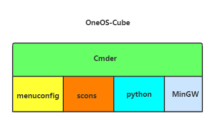

# OneOS-Cube

## 简介

OneOS-Cube是针对物联网操作系统OneOS开发的一套windows辅助开发环境。它以开源编译构造工具为基础构建，以简单易用为设计宗旨，尽可能的缩短普通用户的工具学习时间。通过简单的几条命令，用户即可完成：系统配置，代码编译，第三方集成开发环境（如KEIL等）工程生成等任务。

OneOS-Cube具备如下特点：

1. **去环境依赖**，用户只需要下载完整的工具包后，解压即可直接使用，而不需要对本机环境进行特殊配置；

2. **使用简单**，OneOS-Cube将各个开源资源有机整合，使用户简单输入指令即可完成系统配置、编译、项目构造等任务，而不需要费时了解各个组件的内部实现；

3. **风格通用**，在命令设计与操作习惯上尽量保持与开源社区常用的风格一致；

4. **易于维护**，本方案充分利用已有的开源资源进行搭建，实现简单，也方便后期的升级维护；

OneOS-Cube是独立于OneOS源码之外的，为OneOS服务的开发套件。它独立于OneOS的源码管理，二者之间不存在路径依赖关系。

## 基本构成

OneOS-Cube以已有的开源免费工具为基础搭建。以Cmder为用户命令行，有机的整合了Kconfig、scons、MinGW及python脚本等构建起来的。主要组成部件如下图所示：

1. 命令行环境**Cmder**: Cmder是一款免费的DOS系统仿真器，体积小巧，界面清爽，支持多标签操作，兼容dos原有的指令。

2. 系统配置工具**menuconfig**: 即linux menuconfig的python实现版本，使用方法与linux menuconfig基本一致。遵循兼容LINUX的Kconfig语法，用户可以方便的沿用以前的kconfig配置文件对代码进行宏管理。

3. 开源软件**scons**:**scons**是一个Python写的自动化构建工具，从构建这个角度说，它跟GNU make是同一类的工具，是一种改进，并跨平台的gnu make替代工具，其集成功能类似于autoconf/automake。scons是一个更简便，更可靠，更高效的编译软件。

4. **Python**环境与.py文件: 主要目的是将scons, menuconfig, MinGW等有机的整合到Cmder中，以及添加scons的扩展选项，支持生成KEIL等可直接使用的项目文件。

5. 交叉编译工具链**MinGW**:**MinGW**是Minimalist [GNU](https://baike.baidu.com/item/GNU)for Windows的缩写。它是一个可自由使用和自由发布的Windows特定[头文件](https://baike.baidu.com/item/头文件/10978258)和使用GNU工具集导入库的集合，允许你在[GNU](https://baike.baidu.com/item/GNU)/[Linux](https://baike.baidu.com/item/Linux)和[Windows](https://baike.baidu.com/item/Windows)平台生成本地的Windows程序而不需要第三方C运行时（C Runtime）库。

OneOS-Cube将上面的组件有机的整合在了一起，用户只需要在命令行输入简单的指令，即可方便的进行系统配置，代码编译与第三方IDE工程制作。

## 常用指令

OneOS-Cube常用的用户指令非常简单，命令行支持命令自动补全功能，常用指令简单介绍如下：

| 命令 | 说明 |
| :--- | :--- |
| menuconfig | 系统配置命令，提供菜单交互环境对系统功能宏进行控制，宏配置结果自动保存到oneos\_config.h文件中。与输入menuconfig.bat的运行效果是等价的 |
| scons | 代码编译命令，将根据SConstruct、SConscript脚本的描述进行代码编译 |
| scons --ide=XXX | 制作IDE工程命令，其中"XXX"代表目标IDE环境，具体支持的IDE参考scons --help命令说明。例如生成KEIL工程：                scons --ide=MDK |
| scons --help | 查看scons命令扩展选项说明 |

OneOS-Cube对scons命令支持的选项进行了丰富的扩展，可以通过scons --help具体了解所有的扩展选项与使用方法。

