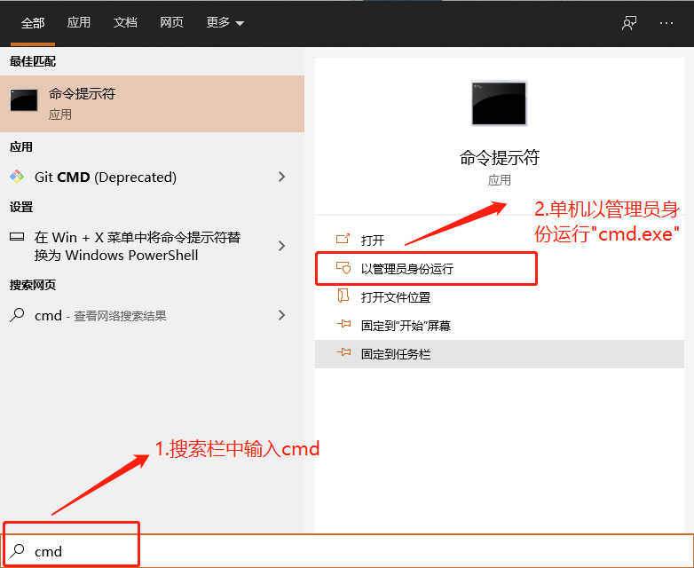
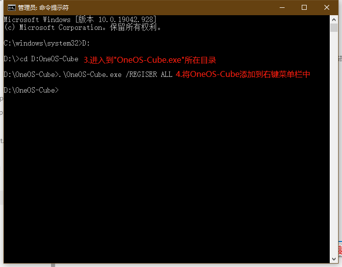
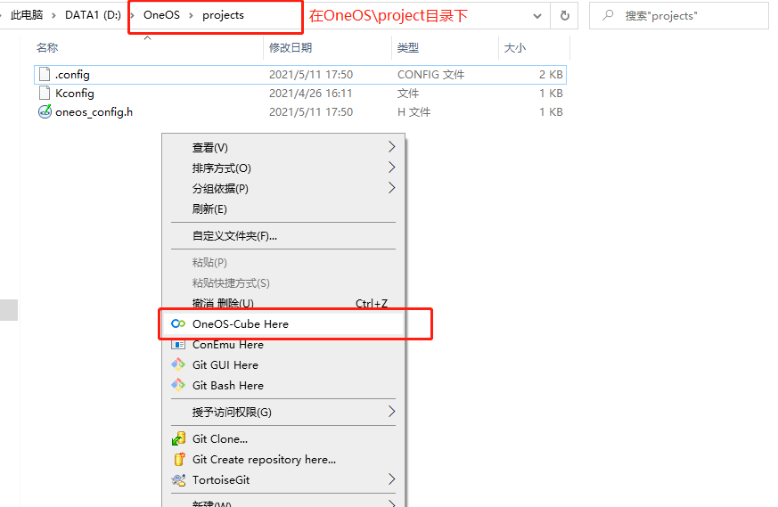
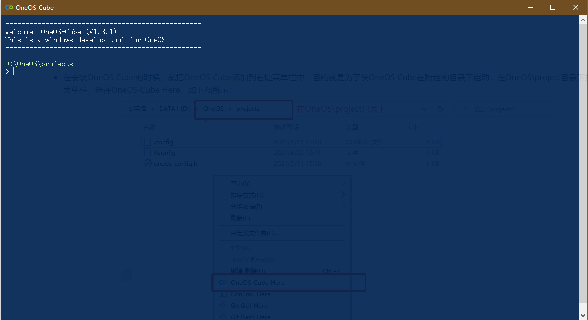

# OneOS-Cube搭建

OneOS-Cube是OneOS操作系统基于命令行的开发工具，提供系统配置、项目编译构造、包贡献下载等功能。OneOS-Cube工具为免安装压缩包，具体过程如下。

## OneOS-Cube下载

下载工具请点击[OneOS-Cube下载](https://os.iot.10086.cn/download/)

## 解压

把下载的OneOS-Cube工具用WinRAR解压到一个不存在任何中文字符的任意目录中。  

**说明：OneOS-Cube工具不支持含有中文字符的路径。**

## 添加右键打开功能

当我们双击"OneOS-Cube.exe"打开工具时，命令行工具的工作目录为当前"OneOS-Cube.exe"目录，为了配置和编译实际项目工程，需要切换到工程目录下。为了简化操作，我们可以把OneOS-Cube工具界面的操作加到右键功能中，这样可以在项目工程中直接打开OneOS-Cube工具。

添加右键功能的步骤如下：

1. 以管理员身份运行"cmd.exe"：
   
    
   
2. 将OneOS-Cube添加到右键菜单中：

    

## OneOS-Cube工具使用

进入到代码工程目录（顶层Kconfig文件和SConstruct文件所在目录），任意空白处点击右键，再找到“OneOS-Cube Here”执行，即可打开OneOS-Cube的命令行操作界面。

这样OneOS-Cube成功启动了

