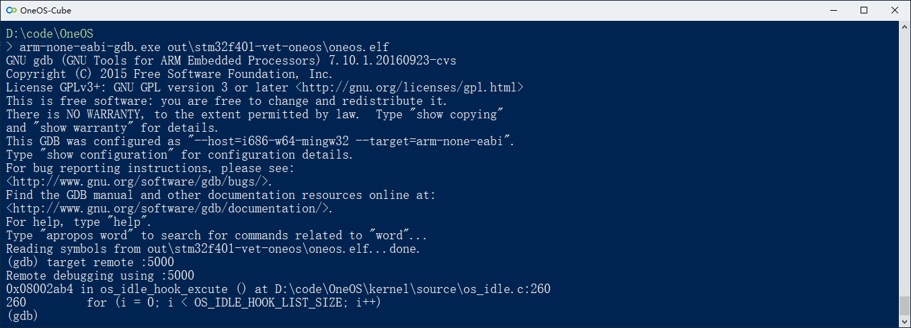

# GDB调试

GDB，全称GNU Project debugger，是UNIX及UNIX-like下的强大调试工具，同时也支持对嵌入式系统进行调试。对嵌入式系统进行调试时，是以远程调试的方式进行的，调试环境的软硬件连接如下


在上图的结构中，支持嵌入式芯片调试的GDB Server有多款，这里主要介绍OpenOCD和J-Link GDB Server。

* J-Link GDB Server由SEGGER公司推出，仅支持使用Jlink作为调试适配器进行调试，

* OpenOCD，全称Open On-Chip Debugger，是一款针对嵌入式芯片调试的开源软件，支持市面上大多数的调试适配器，例如stlink、DAPlink、Jlink等。OpenOCD支持GDB查看RTOS线程，OneOS已对其进行了适配。使用OpenOCD作为GDB Server，可以查看OneOS所有线程的调用栈和栈上的临时变量，对于调试，能提供更多的信息。

## Windows下使用命令行调试工程

这里以万耦开发板stm32f401-vet-oneos为例演示调试过程，由于OpenOCD配合Jlink使用时，需要将Jlink的驱动切换成通用usb驱动（OpenOCD不支持Jlink的原生驱动，如果需要，可以使用zadig这款开源软件将Jlink驱动切换成WinUSB或libusb），为了方便起见，在使用OpenOCD调试时，调试适配器选择stlink。

### 1. 运行GDB Server

#### 1.1 使用OpenOCD作为GDB Server

##### 1) 获取OpenOCD

下载预编译的Windows版本请点击[OpenOCD下载](https://gitee.com/cmcc-oneos/openOCD/releases)。

##### 2) 运行OpenOCD

OpenOCD编译后的二进制文件目录结构如下


* 添加环境变量

```
OPENOCD_BIN_PATH="D:\Program\openocd\bin"
OPENOCD_SCRIPT_PATH="D:\Program\openocd\share\openocd\scripts"
```

* 在stm32f401-vet-oneos工程目录下创建配置文件oneos.cfg，文件内容如下

```tcl
# this need match your debug adaptor and target device
source [find interface/stlink-v2.cfg]
source [find target/stm32f4x.cfg]

# config openocd support OneOS
$_TARGETNAME configure -rtos oneos

# halt target after gdb attached
$_TARGETNAME configure -event gdb-attach { halt }
```

* 在OneOS代码根目录运行OneOS-Cube，执行如下命令

```
%OPENOCD_BIN_PATH%\openocd.exe -c "gdb_port 5000" -s %OPENOCD_SCRIPT_PATH% -f .\projects\stm32f401-vet-oneos\oneos.cfg
```

运行成功后的界面如下，此时OpenOCD已配置完成


#### 1.2 使用J-Link GDB Server

打开J-Link GDB Server，根据实际情况选择目标设备和调试接口


点击`OK`运行GDB Server


### 2. 运行GDB

在OneOS代码根目录下运行OneOS-Cube，执行如下命令运行GDB
```
arm-none-eabi-gdb.exe .\out\stm32f401-vet-oneos\oneos.elf
```

在GDB命令行交互界面中执行如下命令连接GDB Server，其中:5000是GDB Server的tcp端口号，对应上面OpenOCD运行时指定的gdb_port（如果使用J-Link GDB Server，则端口选择上面显示的2331）

```
target remote localhost:5000
```

连接成功后，GDB命令行交互界面如下



### 3. 调试OneOS工程

* 查看当前线程调用栈和临时变量


* 查看所有正在运行的线程（J-Link GDB Server不支持此命令）


* 切换到其他线程并查看调用栈与临时变量（J-Link GDB Server不支持此命令）


更多的GDB用法，请查看官方文档。

## Windows下使用VSCODE调试工程

Visual Studio Code 是微软推出的轻量级但功能强大的代码编辑工具，通过安装插件可以扩展其各种功能，这里主要介绍使用Cortex-Debug插件来对嵌入式系统进行调试。

### 1. 打开OneOS工程目录

在`File`菜单下点击`Open Folder`，选择OneOS代码根目录并打开


### 2. 安装Cortex-Debug插件

选择左侧Extensions标签，搜索Cortex-Debug插件并安装


### 3. 设置应用程序路径

`Ctrl+Shift+P`打开命令窗口，输入`User Settings`打开用户配置界面，在Extensions下找到`Cortex-Debug Configuration`，配置`Arm Toolchain Path`、`Openocd Path`和`JLinkGDBServerPath`。


JSON格式的配置示例如下
```json
{
    "cortex-debug.armToolchainPrefix": "arm-none-eabi",
    // 以系统中实际路径为准
    "cortex-debug.openocdPath": "D:\\Program\\openocd\\bin\\openocd.exe",
    "cortex-debug.armToolchainPath": "D:\\Program\\gcc-arm-none-eabi-8-2018-q4-major-win32\\bin",
    "cortex-debug.JLinkGDBServerPath": "D:\\Program\\SEGGER\\JLink_V632i\\JLinkGDBServerCL.exe"
}
```

### 4. 配置调试选项

在`Run`菜单下选择`Add Configuration`添加配置，使用OpenOCD和J-Link GDB Server调试的配置示例如下


```json
{
    "version": "0.2.0",
    "configurations": [
        {
            "name": "OpenOCD Debug",
            "cwd": "${workspaceRoot}",
            "executable": "${workspaceRoot}\\out\\stm32f401-vet-oneos\\oneos.elf",
            /* request 可选项为attach和launch */
            /* 当选择attach时，GDB直接附着到正在运行的程序上，不会重启程序 */
            /* 当选择launch时，GDB会执行重启，烧录，运行的流程 */
            "request": "attach",
            "type": "cortex-debug",
            "servertype": "openocd",
            /* configFiles 为OpenOCD启动时加载的脚本文件，可以为多项 */
            "configFiles": [
                "${workspaceRoot}\\projects\\stm32f401-vet-oneos\\oneos.cfg"
            ],
            /* searchDir 为OpenOCD启动时脚本的搜索路径，可以为多项 */
            "searchDir": ["D:\\Program\\openocd\\share\\openocd\\scripts"],
            /* 可选项 */
            "svdFile": "${workspaceRoot}\\STM32F401.svd"
        },
        {
            "cwd": "${workspaceRoot}",
            "executable": "${workspaceRoot}\\out\\stm32f401-vet-oneos\\oneos.elf",
            "name": "JLink Debug",
            "request": "launch",
            "type": "cortex-debug",
            "servertype": "jlink",
            "device" : "Cortex-M4",
            "interface": "swd",
            "serialNumber": ""
        }
    ]
}
```

### 4. 开始调试

完成以上配置后，选择左侧`Run`标签，打开运行窗口，选择调试配置


接下来使用快捷键`F5`启动调试，调试界面如下，可以在`CALL STACK`面板中查看所有线程的调用栈


当前运行在tidle线程下，这里可以切换到user线程设置断点，再次点击`F5`继续运行


触发断点后程序暂停


如果在配置中添加了`svdFile`, 可以在`CORTEX PERIPHERALS`中查看芯片外设寄存器的值，关于svd文件，可以参考文档[System View Description](https://www.keil.com/pack/doc/CMSIS/SVD/html/index.html)。


更多VSCODE调试功能，请参考[vsode-docs-debugging](https://vscode-docs.readthedocs.io/en/latest/editor/debugging/)。
