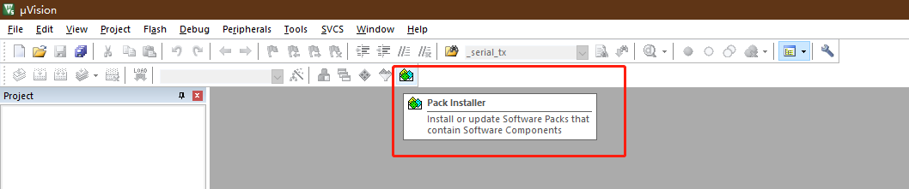

# MDK安装

MDK-ARM（MDK-ARM Microcontroller Development Kit）软件是一套完整的集成开发环境（IDE），它出自 ARM 公司，包括了针对 ARM 芯片（ARM7、ARM9、Cortex-M 系列、Cortex-R 系列等）的高效 C/C++ 编译器；针对各类 ARM 设备、评估板的工程向导，工程管理；用于软件模拟运行硬件平台的模拟器；以及与市面上常见的如 ST-Link，JLink 等在线仿真器相连接以配合调试目标板的调试器。

OneOS支持的MDK开发工具版本为v5.14以上的版本。

下面操作指导中所使用的版本为MDK-ARM评估版v5.31，它能够提供相对比较完善的调试功能。评估版有16K编译代码限制，如果要解除 16K 编译代码限制，请购买 MDK-ARM 正式版。

---

## MDK开发环境

- 在安装前，先从 www.keil.com 官方网站下载 MDK-ARM 评估版： [http://www.keil.com/download/](http://www.keil.com/download/) 

  本文档中使用的MDK5.31版本，开发者可以根据需求自行下载合适的版本。

- 双击安装程序，进入MDK5安装界面，点击"Next"进行下一步操作，如下图所示：

- 进入License Agreement窗口，勾选"I agree to all the terms of the preceding License Agreement",并点击"Next"进行下一步操作，如下图所示：

- 进入安装路径选择窗口，直接使用默认的路径"C:\Keil_v5"和"C:\Users\MDK"即可，并点击"Next"进行下一步操作，如下图所示：

- 填写开发者的用户名和邮箱等信息，这里按照开发者的真实信息填写即可，点击"Next"进行下一步操作，如下图所示：

- 开始MDK5的安装过程，等待安装完成即可，安装过程如下图所示：

- 安装完成之后，点击"Finish"结束整个安装过程，到此为止MDK5安装结束。

## 安装pack包

MDK5安装完成之后，并不能直接进行芯片的开发，还需要安装芯片相关的pack包。

在开发过程中，不同系列的芯片，所使用的pack包不同，本文档使用的是万耦创世L475系列的开发板，此开发板使用的MCU为STM32L475VGT6，所以在正式开发之前，必须安装STM32L4系列的PACK包。

- 打开MDK5，并双击菜单栏上的"Pack Installer"功能板，如下图所示：

- 在Pack Installer的左侧选项栏中，依次找到:All Devices->STMicroeletronics->STM32L4 Series->STM32L475,如下图所示：

  

  由于STM32L4系列所有芯片共用1个PACK，所以任意点击选中栏内蓝色字体的链接，都可以跳转STM32L4系列的芯片的pack包的官方下载地址。

- 点击"Download"下载官方网站上的pack包，如下图所示:

- STM32L4系列的Pack包下载完成之后，放在任意的路径下都可以（建议存放到 C:\Keil_v5\ARM\PACK\.Download目录下方便管理），找到C:\Keil_v5\UV4（如果在安装MDK5时没有选择默认路径，那么去找自定义的安装路径）下的"Pack Installer.exe",并且右击"以管理员身份运行",这样可以保证在安装Pack包时不会因为权限不够无法安装。

  找到左上角的菜单栏，依次点击"File"->"Import",选择相应的PACK包，操作过程如下图所示：

  

  

  到此为止，以STM32L475VGT6为MCU的例程的MDK环境全部安装完成。