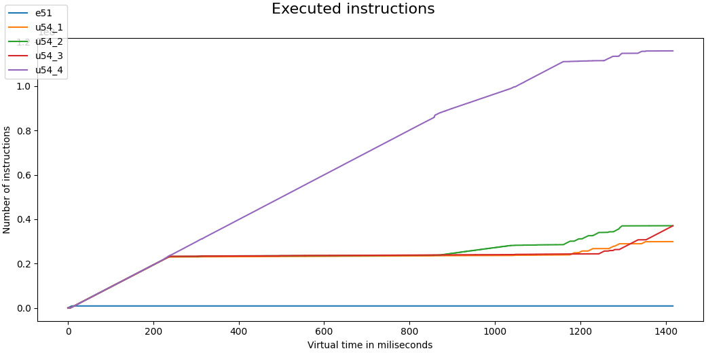

# renode基本用法

## 1.使用machines

Renode 允许轻松处理跨多台机器的仿真。

### 1.1 创建machines

开始时，仿真是空的，没有机器可以运行。要添加一个`machine`，执行:

```powershell
(monitor) mach create
(machine-0)
```

这将创建第一个`machine`，如果您没有给它一个自定义名称，它将从 0(因此称为 `machine-0`)开始编
制索引。该命令还将监视器的上下文切换到这台新机器。

再次执行相同的命令将创建另一台`machine`，称为`machine-1`:

```
(machine-0) mach create
(machine-1)
```

也可以通过提供自定义名称作为参数来创建机器:

```
(monitor) mach create "OneOS-Lite"
(OneOS-Lite) 
```

要列出所有创建的`machine`及其名称和索引，请键入:

```powershell
(OneOS-Lite) help mach
mach
list and manipulate machines available in the environment.
Current machine: OneOS-Lite
Available machines:
 0: OneOS-Lite 
You can use the following commands:
'mach set ["name"|number]' to enable the given machine
'mach add "name"' to create a new machine with the specified name
'mach rem "name"' to remove a machine
'mach create' to create a new machine with generic name and switch to it
'mach clear' to clear the current selection
```


### 1.2 切换machines

当你想要切换`machine`到另一个`machine`：

```
(machine-1) mach set "machine-0"
(machine-0)
```

除了`machine`的名称，您还可以使用它的索引:

```
(machine-1) mach set 0
(machine-0)
```


### 1.3 加载platforms

一旦`machine`被`create`出来，它就只包含一个外围设备——系统总线，简称 sysbus。没有内存或
cpu，所以它还没有准备好执行任何代码。
要列出所有外围设备，请执行:

```
(machine-0) peripherals
Available peripherals:

  sysbus (SystemBus)
```

要加载预定义的平台，请执行：

```
(machine-0) machine LoadPlatformDescription @platforms/boards/stm32f4_discovery.repl
(machine-0) peripherals
```


### 1.4 访问和操作外围设备

当您处于显示器中的机器环境中时，您可以通过名称来引用外围设备。您可以读写外围设备的
属性，也可以对其执行一些操作。可用属性和操作的集合取决于外围设备的类型。

例如，要检查内存大小，请执行:

```
(machine-0) sysbus.sram Size
```

要获得可用属性或操作的完整列表，只需输入外围设备的名称:

```
(OneOS-Lite) sysbus.sram
The following methods are available:
 - Void DebugLog (String message)
 - Void Dispose ()
 - IEnumerable<Tuple<String,IGPIO>> GetGPIOs ()
 - Machine GetMachine ()
 - IntPtr GetSegment (Int32 segmentNo)
 - Boolean HasGPIO ()
 - Void InitWithRandomData ()
 - Boolean IsTouched (Int32 segmentNo)
 - Void Log (LogLevel type, String message)
 ......
```


### 1.5 加载二进制文件

一旦`platform`被创建和配置，你就可以在上面上传程序。Renode 允许您运行与真实硬件上完全相
同的可执行文件——不需要更改二进制文件或重新编译源代码。这太酷了！

要将 ELF 文件加载到内存中，请执行：

```
(machine-0) sysbus LoadELF @my-project.elf
```

Renode 还支持其他可执行格式，如原始二进制和 UImage。要加载它们，请相应地使用
LoadBinary 或 LoadUImage。

### 1.6 清除仿真

如果您想切换到另一个项目，您可以放弃整个模拟:

```
(machine-0) Clear
```

所有`machine`、外围设备和加载的二进制文件都将被删除，Renode 将返回其初始状态。


## 2.描述平台platforms

Renode使用基于文本的格式来描述`platforms`。平台描述文件通常具有.repl扩展，但这不是必需的。

`platforms`描述格式部分提供了格式及其语法的广泛描述。这里我们介绍基本用法和最常见的场景。


### 2.1 定义外围设备

要添加外设，您需要知道它的类型，选择它的名称和注册点。大多数外设将在 sysbus 上注册，
这是一种始终可用的外设，无需明确定义。

类型名称必须指示外围设备模型的类别。这必须是一个带有名称空间的全名，但默认名称空间
是 `Antmicro.Renode.Peripherals`，可以省略。

例如，创建一个类型为`Antmicro.Renode.Peripherals.UART.MiV_CoreUART`的UART对象，并把它连接到系统总线的`0x80000000`地址，使用：

```
uart0: UART.MiV_CoreUART @ sysbus 0x80000000
```

有些外设，比如上面提到的UART，需要构造参数。REPL格式允许你设置外设模型的构造函数参数和属性。它们为声明的下方，有四个空格缩进：

```
uart0: UART.MiV_CoreUART @ sysbus 0x80000000
    clockFrequency: 66000000
```

构造函数参数以小写字母开头，属性大写字母开头。


### 2.2 连接外围设备

在上例中，uart0外设连接到系统总线的特定地址。然而，也可以将外设连接到其它总线，如I2C或SPI，连接到GPIO控制器等。

例如，要将温度传感器连接到位于 0x80 的名为 i2c0 的 I2C 控制器，请键入:

```
sensor: Sensors.SI70xx @ i2c0 0x80
```

外设也可以通过 GPIOs或中断连接。Renode以类似的方式处理这些信号，并允许您使用->运算
符创建连接。

要将定时器连接到 plic 中断控制器上的第 31 个中断，请运行:

```
timer: Timers.MiV_CoreTimer @ sysbus 0x1000000
    -> plic @ 31
```


### 2.3 包含文件

你可以使用`using`关键字包含在在一个已存在的REPL文件中：

```
using "platforms/cpus/miv.repl"
```

提供的文件名可以是完整路径，也可以是相对于 Renode 根目录的路径。

## 3.基本执行控制

Renode 允许您精确控制仿真的执行。

### 3.1 开始和暂停执行

开始时，仿真处于暂停状态，这意味着没有机器在运行，并且`cirtual time`没有进展。

要开始仿真，执行：

```
(machine-0) start
Starting emulation...
```

要暂停仿真，执行：

```
(machine-0) pause
Pausing emulation...
```


### 3.2 逐指令执行

当您需要详细分析二进制文件的执行如何影响硬件状态时，您可以切换到step单步执行模式：

```
(machine-0) sysbus.cpu ExecutionMode SingleStepBlocking
```

这将在每个指令执行后停止仿真。要转到下一步，则输入:

```
(machine-0) sysbus.cpu Step
```

当您想要返回正常执行模式时，则输入：

```
(machine-0) sysbus.cpu ExecutionMode Continuous
```

当然，通过连接外部 GDB 可以获得更有效的控制。


### 3.3 阻塞和非阻塞单步

当您使用单步阻塞模式时，仿真不会在步骤之间进行。这可能会导致在逐个指令执行多核时阻
塞仿真的问题，在这种情况下，单步非阻塞模式是首选选项。非阻塞模式的缺点是虚拟时间将
在步骤之间进行，这可能会引入去同步和超时相关的问题。

在逐指令流程中，Step 命令将保留当前模式，否则使用默认值(单步阻塞)。可以通过显式选择
非阻塞模式来覆盖此行为:

```
(machine-0) sysbus.cpu Step false
```


### 3.4 检查当前位置

Renode 允许您轻松检查应用程序的当前状态:

```
(machine-0) sysbus.cpu PC
0xC01890A8
```

因此，您将获得当前执行的指令的十六进制地址。

如果您想知道当前正在执行的函数的名称(假设您的二进制文件已经用其中的符号进行了编译)，
请键入:

```
(machine-0) sysbus FindSymbolAt `sysbus.cpu PC` 
# equivalent of 0xC01890A8 uart_console_write
```

这将打印符号的名称。


## 4. 使用日志

启动 Renode 后出现的第一个窗口专用于记录器。

您可以使用许多日志选项来改善您对所呈现信息的体验。

### 4.1 日志级别

有五种可用的日志记录级别:

- NOISY (-1)
- DEBUG (0)
- INFO (1)
- WARNING (2)
- ERROR (3)

您可以使用日志级别命令选择记录哪些消息。每个仿真对象都可以单独配置。每个记录器后端
(例如：日志文件)可以有自己的配置。

默认情况下，除了`NOISY`级别，其它级别都会被记录。

要将全局日志级别设置为`NOISY`,键入：

```
(machine-0) logLevel -1
```

要仅更改选定外设(在本例中为 UART 设备)的日志级别，请键入:

```
(machine-0) logLevel -1 sysbus.uart
```

请注意，增加记录的消息数量可能会影响仿真的性能。

当前日志级别可以通过运行不带参数的日志级别来验证。

这是经过一些配置后该命令的输出:

```
(machine-0) logLevel
Currently set levels:
Backend           | Emulation element                   | Level
=================================================================
console           :                                     : DEBUG
                  : machine-0:sysbus.plic               : ERROR
                  : machine-0:sysbus.uart               : NOISY
-----------------------------------------------------------------
```


### 4.2 记录到文件

要分析长期运行的仿真的输出，最好将日志重定向到文件。

要实现这一点，请使用日志文件命令:

```
(machine-0) logFile @some_file_name
```

这不会禁用控制台记录器，但会添加一个新的接收器，单独配置。从性能的角度来看，根据场
景的不同，增加最低控制台日志级别并在日志文件中保留更详细的数据可能会有好处。

要设置文件后端的错误日志级别，请键入:

```
(machine-0) logLevel 2 file
```

外设在不同的后端也可以有不同的日志级别:

```
(machine-0) logLevel 1 file sysbus.uart
```


### 4.3 记录对外围设备的访问

除了常规的记录器配置，您还可以记录对特定外设的访问。此功能仅针对系统总线上注册的外
设启用。

要启用它，请运行:

```
(machine-0) sysbus LogPeripheralAccess sysbus.uart
```

现在，每当中央处理器试图读取或写入此外设时，您都会看到类似以下的消息:

```
14:32:28.6083 [INFO] uart: ReadByte from 0x0 (TransmitData), returned 0x0.
```

要启用对所有外围设备的日志访问，请运行:

```
(machine-0) sysbus LogAllPeripheralsAccesses true
```

### 4.4 创建对执行代码的追踪

我们还可以创建二进制文件执行的每个函数的跟踪:

```
(machine-0) sysbus.cpu LogFunctionNames True
```

因此，函数名称将在信息级别打印到日志中:

```
17:05:23.8834 [INFO] cpu: Entering function kobject_uevent_env at 0xC014CD9C
17:05:23.8834 [INFO] cpu: Entering function dev_uevent_name (entry) at 0xC018FA5C
17:05:23.8834 [INFO] cpu: Entering function dev_uevent_name at 0xC018FA70
17:05:23.8834 [INFO] cpu: Entering function kobject_uevent_env at 0xC014CDA8
17:05:23.8835 [INFO] cpu: Entering function kobject_uevent_env at 0xC014CDB8
17:05:23.8835 [INFO] cpu: Entering function kmem_cache_alloc (entry) at 0xC0085610
17:05:23.8835 [INFO] cpu: Entering function kmem_cache_alloc at 0xC0085630
```

如果您只对部分函数感兴趣，可以通过提供空间分离名称前缀来限制结果:

```
(machine-0) sysbus.cpu LogFunctionNames True "dev kobject"
```

## 5.状态保存和加载

Renode 提供了将仿真状态保存到文件中的功能。

这样的文件可以传输给另一个用户，然后加载以完全重建原始设置。不需要额外的二进制文件
或配置文件。

要将仿真状态保存到名为 `statefile.dat` 的文件中，请运行:

```
(monitor) Save @statefile.dat
```

该文件可以与加载命令一起使用:

```
(monitor) Load @statefile.dat
```

请务必记住，在 Renode 的一个版本上创建的状态文件可能与另一个版本不兼容。

请注意，加载状态文件会清除当前仿真，相当于:

```
(monitor) Clear
(monitor) Load @statefile.dat
```

**注意:**加载状态后，您必须手动设置监视器的上下文并重新打开 UART 窗口:

```
(monitor) mach set 0
(machine-0) showAnalyzer sysbus.uart
```

## 6.环境

在 Renode 中，环境是一种抽象的介质，代表一个具有物理属性的空间。它允许我们对应该观察
相同环境条件的传感器进行分组和管理。

### 6.1 创建环境

要创建名为 env 的环境，请执行:

```
(monitor) emulation CreateEnvironment "env"
```

你可以根据需要创建多个环境。目前，环境支持两个参数:温度和压力。

```
monitor) env Temperature 36.6
```

要检查当前设置:

```
(monitor) env Temperature
36.6
```

### 6.2 向环境中添加传感器

向环境中添加传感器有两种方式:

1. 从机器中添加单个传感器
2. 将机器添加到环境中

您必须在`machine`环境中才能执行以下命令。

#### 6.2.1 增加一个传感器

要添加通过 i2c 总线连接的`temperatureSensor`温度传感器外设，运行:

```
machine-0) sysbus.i2c.temperatureSensor SetEnvironment env
```

只有指定的传感器将被添加到`env`中，我们才可以观察该`env`的温度值。

####  6.2.2 增加一个`machine`

要将当前`machine`添加到环境中，请运行:

```
(machine-0) machine SetEnvironment env
```

该命令将机器及其所有传感器连接到环境`env`。它们将具有与环境相同的温度值。

>  **注意:**
>
> 将`machine`连接到环境时，先前连接到其他环境的所有传感器也将重新连接。

添加到环境中的传感器将在每次环境变化时更新，但是您仍然可以在特定的传感器上设置自己
的值，并且该值不会传播到其他传感器(直到环境变化覆盖此值)。

### 6.3 获取传感器读数

要检查传感器的读数，请执行:

```
(machine-0) sysbus.i2c.temperatureSensor Temperature
36.60
```

要更改传感器的读数，请执行:

```
(machine-0) sysbus.i2c.temperatureSensor Temperature 37
```

## 7.指标分析

Renode 支持从模拟中收集执行数据，并允许对执行本身进行分析。当前支持的执行指标:

1. 执行的指令
2. 存储器访问
3. 外设访问
4. `exceptions`异常

### 7.1 分析

要在 Renode 中启用分析，请键入:

```
(monitor) machine EnableProfiler "path_to_dump_file"
```

运行该模拟，分析器现在正在从指标中收集数据。完成此步骤后，关闭 Renode。将获
得一个包含收集的指标的转储文件。

可以使用 `metrics_parser` Python 库分析该转储，或者使用提供的帮助脚本可视化转储。

### 7.2 可视化

要通过与 Renode 捆绑在一起的可视化工具显示所收集数据的图形表示，请执行以下步骤:

#### 7.2.1 先决条件

为了安装可视化工具，请先从 Renode 根目录运行以下命令：

```
python3 -m pip install --user -r tools/metrics_analyzer/metrics_visualizer/requirements.txt
```

#### 7.2.2 运行脚本

运行以下脚本：

```
python3 tools/metrics_analyzer/metrics_visualizer/metrics-visualizer.py path_to_dump_file
```

结果：应该会出现一个带有图形的窗口，类似于下面显示的窗口。



## 8.不同模式下运行renode

默认情况下，Renode运行在GUI图形用户界面模式下运行。启动后，她会为监视器打开一个新窗口，并为不同的分析器analyzers打开额外的窗口（比如：UART）。

然而，也可以用其他模式启动 Renode。下面我们介绍运行和与 Renode 交互的替代方式。

### 8.1 telnet远程登陆模式

Renode 可以通过网络socket上的监视器接口而不是窗口启动。在这种模式下，它仍然会在本地
打开其他窗口，但模拟可以远程控制。

要在远程登录模式下启动 Renode，请使用`-P` 开关运行它:

```
$ renode -P 1234
17:01:20.6362 [INFO] Loaded monitor commands from: /home/antmicro/renode/scripts/monitor.py
17:01:20.6800 [INFO] Monitor available in telnet mode on port 1234
17:02:17.2373 [INFO] Script: hello
```

之后，您可以通过以下方式连接到它:

```
$ telnet 127.0.0.1 1234
Trying 127.0.0.1...
Connected to 127.0.0.1.
Escape character is '^]'.
Renode, version 1.12.0.33182 (0cd6e174-202108311750)

(monitor) log "hello"
(monitor)
```

你可以断开 telnet 会话，Renode 实例将继续在后台运行。

为了关闭以 telnet 模式打开的 Renode，您必须连接到它并发出退出命令`quit`。

### 8.2 headless模式

Renode 可以在不需要任何图形环境的headless模式下构建/运行(例如:X11。在CI环境中运行模拟时，此模式尤其有用。

#### 8.2.1 构建headless

要在headless环境中构建 Renode，请使用`-no-gui` 切换:

```
$ ./build.sh --no-gui
```


#### 8.2.2 运行在headless环境

即使您拥有支持编译的图形用户界面(默认配置)的 Renode，您也可以通过以下方式在headless模式
下启动它:

```
$ renode --disable-xwt
```

它类似于远程登录模式，因为监视器默认情况下在端口 1234 上可用(端口号可以用`-P`切换来进行更改)。
不同之处在于，在headless模式下，不会为分析器创建图形窗口。默认情况下，UART 分析器将
输出到日志。

### 8.3 console控制台模式

可以在启动 Renode 的同一控制台窗口中启动监视器。在这种模式下，提示将与日志消息交织
在一起:

```
$ renode --console
16:54:37.2215 [INFO] Loaded monitor commands from: /home/antmicro/renode/scripts/monitor.py
Renode, version 1.12.0.33182 (0cd6e174-202108311750)

(monitor) log "hello"
16:54:41.0966 [INFO] Script: hello
(monitor)
```

> **注意:**
>
> 通过传递`- console` 和`--disable-xwt`，控制台模式可以与无头模式混合在一起。


### 8.4 监视器中的UART交互

使用 `uart_connect` 命令，可以在监视器和交互式 uart 会话之间切换:

```shell
[...]
(machine-0) uart_connect sysbus.uart0
Redirecting the input to sysbus.uart0, press <ESC> to quit...

Welcome to buildroot!
master login: root
# ls
# ls /
bin      etc      lib      media    opt      root     sbin     tmp      var
dev      home     linuxrc  mnt      proc     run      sys      usr
# Disconnected from sysbus.uart0
(machine-0)
```

在这种模式下，用户的所有输入都指向UART，UART的所有输出都显示在
监视器提示符处。

这适用于所有监视器模式(窗口、远程登录、控制台)。


