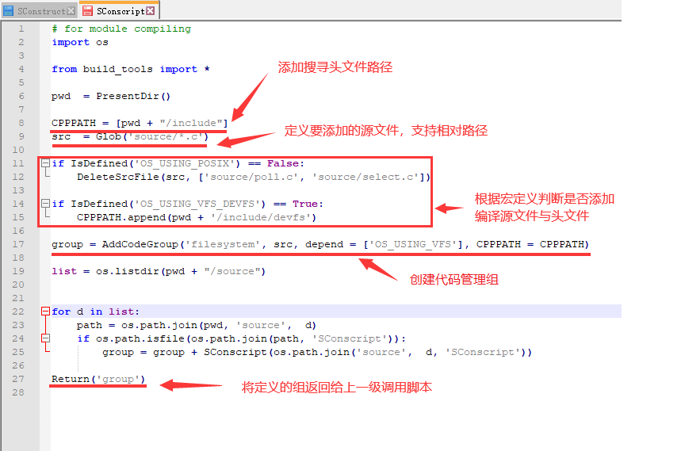

# scons脚本编写

---

### OneOS SCons脚本结构

OneOS Scons的脚本基本结构与调用流程如下图所示：


1. SConstruct是scons默认自动寻找并执行的第一个配置脚本，其中对环境进行基本的信息处理，然后创建构造环境对象，并调用扩展的osconfig.py，build_tools.py等脚本，并通过SConscript\(\)调用一次递归调用各需要编译的源码路径中的SConscript脚本。

2. osconfig.py主要进行跟各项目硬件相关性较大的配置设置。如架构，交叉编译工具链选择，最终编译结果的格式等。

3. build_tools.py中定义了各项目公用的操作，以及对scons的扩展功能进行定义与实现。

4. 通过SConscript\(\)方法，递归调用各级子目录中的SConscript脚本文件，实现对所有源码的管理。每个子SConscript文件根据具体所处的不同目录代码特性，进行相应的脚本配置。

通过这些扩展的.py脚本以及scons特有的配置脚本，从而实现根据不同项目特点定义相应的代码组织、编译行为。

按功能划分，OneOS的SCons脚本可以分为三种类型：**环境配置类脚本、中间加载类脚本、代码组织类脚本**。

---

### OneOS SCons**环境配置类脚本**

这类脚本主要是指SConstuct与osconfig.py。SConstruct文件是SCons默认解析的第一个脚本，因此scons命令必须在它所在的路径下执行。一般建议将SConstruct脚本与osconfig.py脚本置于用户工程目录中。下面以一个SConstruct为例进行简单分析：


由上示例可以看出，SConstruct与osconfig.py与用户的具体应用环境和编译配置紧密相关，用户可以参照示例项目，根据自己的需求进行配置。

---

### OneOS SCons中间**加载类脚本**

这类脚本通常位于某些主干目录中，主用功能就是加载每个子目录中可能存在的sconscript脚本。如果完成同样的功能，用户完全可以搬用下面的示例脚本：

```
import os
from build_tools import *

pwd = PresentDir()r
objs = []
list = os.listdir(pwd)

for d in list:
    path = os.path.join(pwd, d)
    if os.path.isfile(os.path.join(path, 'SConscript')):
        objs = objs + SConscript(os.path.join(d, 'SConscript'))

Return('objs')
```

如上所示，脚本获取了当前目录下的子目录列表，然后依次判断子目录下是否存在SConscript脚本，如果存在则通过SConscript（）方法加载该脚本。

当然，加载类脚本的功能也不仅仅只局限于此，用户可以根据自己需要按照python语法进行修改。

---

### OneOS SCons**代码组织类脚本**

代码组织类脚本就是具体负责组织目录中源代码是否编译，头文件路径指定等基本功能的。使用AddCodeGroup\(\)按组的概念来组织代码的。下图示例说明一个典型的OneOS SCons代码组织脚本的内容：



如上，通过IsDefined\(\)可以方便的判断Kconfig中或者SCons脚本中是否定义了某个宏。从而根据宏配置情况组织工程编译行为。

AddCodeGroup\(\)中的名字参数必须指定，如果该名字的组已经存在，则会进行追加合并。键值参数不是必选的，可以缺省。

**值得指出的是，SCons脚本本质就是python脚本，以上的脚本分类只是为了方便读者快速的理解OneOS的代码组织逻辑而提出的，不是完全固定的。读者完全可以熟悉了scons机制之后根据自己的需要灵活调整**。

