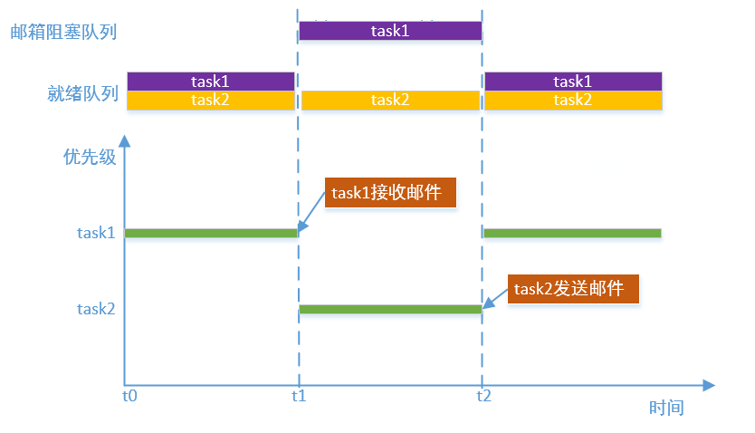
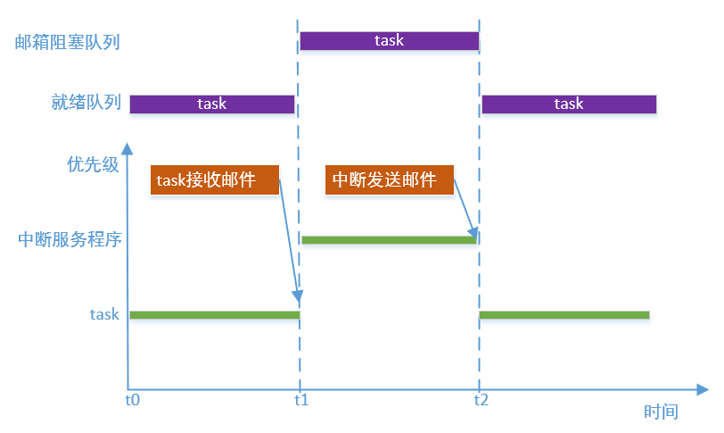

# 邮箱

---

## 简介

邮箱是一种任务间通信机制。邮箱每次可以传递固定字节大小的邮件，邮箱有缓冲区(邮箱资源池)，可以缓存一定数量的邮件。邮箱没满的情况下，可以一直往邮箱里面发送邮件，邮箱满了可以选择超时等待；邮箱有邮件的情况下，可以从邮箱里面接收邮件，如果没有邮件，可以选择超时等待。在本操作系统中，一封邮件的大小固定为机器字长（比如32位机器，邮件大小就是4字节），邮箱可以用来发送指针，而收发双方都按照相同的方式去解析指针指向的内容，就可以达到传送各种类型数据的功能。

---

## 邮箱实现原理

邮箱有两个任务阻塞队列，因为邮箱发送和接收都有可能导致阻塞。当邮箱内没有邮件时，就会导致接收邮件任务阻塞，任务被放到阻塞队列，等待另一个任务发送邮件，阻塞任务被唤醒，并放到就绪队列；当邮箱内邮件满了，就会导致发送邮件任务阻塞，后续的处理过程和接收邮件类似。下图描述了任务接收邮件被阻塞，然后等待另一个任务发送邮件的处理过程。任务发送邮件被阻塞，然后等待另一个任务接收邮件的处理过程类似。



## 邮箱实现中断和任务的通信

邮箱也可以用于中断和任务间的通信。例如，任务接收邮件，而中断程序发送邮件，但是需要注意的是中断中只能用非阻塞式的方式，即timeout参数需要设置为0，因为不为0的话，在邮件满了的情况下，就会导致阻塞，中断上下文不允许阻塞方式的。下图描述了任务接收邮件，中断发送邮件的过程。



---

## 重要定义及数据结构

### 邮箱宏定义

宏定义了阻塞任务的唤醒顺序。

```c
#define OS_MB_WAKE_TYPE_PRIO                0x55
#define OS_MB_WAKE_TYPE_FIFO                0xAA
```

| **邮箱宏** | **说明** |
| :--- | :--- |
| OS_MB_WAKE_TYPE_PRIO | 按优先级唤醒 |
| OS_MB_WAKE_TYPE_FIFO | 按FIFO唤醒 |

### 邮箱控制块结构体

```c
struct os_mb
{
    void          *mail_pool;                   /* The address that doesn't do alignment for mail pool */
    void          *mail_pool_align;             /* Aligned address of mail pool. */

    os_list_node_t send_task_list_head;         /* Sender tasks blocked on this mailbox. */
    os_list_node_t recv_task_list_head;         /* Receiver tasks blocked on this mailbox. */
    
    os_list_node_t resource_node;               /* Node in resource list */

    os_uint16_t    capacity;                    /* Max number of mails for this mailbox. */
    os_uint16_t    entry_count;                 /* Numbers of mails into mailbox. */
    os_uint16_t    read_index;                  /* Read index of mail pool. */
    os_uint16_t    write_index;                 /* Write index of mail pool. */

    os_uint8_t     object_inited;               /* Indicates whether object is inited or deinited, value is
                                                   OS_KOBJ_INITED or OS_KOBJ_DEINITED */
    os_uint8_t     object_alloc_type;           /* Indicates whether object is allocated dynamically or statically, 
                                                   value is OS_KOBJ_ALLOC_TYPE_STATIC or OS_KOBJ_ALLOC_TYPE_DYNAMIC */
    os_uint8_t     wake_type;                   /* The type to wake up blocking tasks, value is OS_MB_WAKE_TYPE_PRIO
                                                   or OS_MB_WAKE_TYPE_FIFO */

    char           name[OS_NAME_MAX + 1];       /* Mailbox name. */
};
```

| **邮箱控制块成员变量** | **说明** |
| :--- | :--- |
| mail\_pool | 邮箱资源池指针，指向邮箱资源池起始地址 |
| mail\_pool\_alig | 邮箱资源池指针，指向邮箱资源池对齐后的起始地址 |
| send\_task\_list\_head | 邮件发送任务阻塞队列头，发送邮件时邮箱没有空闲消息块时将发送任务阻塞在该队列上 |
| recv\_task\_list\_head | 邮件接收任务阻塞队列头，接收邮件时邮箱没有邮件时将接收任务阻塞在该队列上 |
| resource\_node | 资源管理节点，通过该节点将创建的邮箱挂载到gs_os_mb_resource_list_head上 |
| capacity | 邮件支持的最大邮件数量 |
| entry\_count | 邮箱中邮件数量 |
| read\_index | 邮件读索引，指示下次读取邮件时读取位置 |
| write\_index | 邮件写索引，指示下次发送邮件时写入位置 |
| object\_inited | 初始化状态，0x55表示已经初始化，0xAA表示已经去初始化，其他值为未初始化 |
| object\_alloc\_type | 邮箱类型，0为静态邮箱，1为动态邮箱 |
| wakt\_type | 阻塞任务唤醒方式，0x55表示按优先级唤醒，0xAA表示按FIFO唤醒。可以通过属性设置接口进行设置 |
| name | 邮箱名字，名字长度不能大于OS_NAME_MAX |

---

## API介绍

| **接口** | **说明** |
| :--- | :--- |
| os\_mb\_init | 以静态的方式初始化邮箱，邮箱对象的内存空间和邮箱缓冲区都由使用者提供 |
| os\_mb\_deinit | 去初始化邮箱，与os\_mb\_init\(\)匹配使用 |
| os\_mb\_create | 以动态的方式创建并初始化邮箱，其邮箱对象的内存空间和邮箱缓冲区都是通过动态申请内存获得 |
| os\_mb\_destroy | 销毁邮箱，并释放邮箱对象的内存空间和邮箱缓冲区的空间，与os\_mb\_create\(\)匹配使用 |
| os\_mb\_send | 发送邮件，若邮箱已满且设定了等待时间，则当前发送任务阻塞 |
| os\_mb\_recv | 接收邮件，若邮箱为空且设定了等待时间，则当前接收任务阻塞 |
| os\_mb\_set\_wake\_type | 对于阻塞在邮箱下的任务，设置唤醒阻塞任务的类型 |
| os\_mb\_reset| 复位邮箱，使邮箱达到初始状态 |
| os_mb_is_empty | 查询邮箱是否为空 |
| os\_mb\_is\_full | 查询邮箱是否为满 |
| os\_mb\_get\_capacity | 获取邮箱容量 |
| os\_mb\_get\_used\_entry\_count | 获取邮箱中邮件数量 |
| os\_mb\_get\_unused\_entry\_count | 获取邮箱中空闲资源数量 |

### os\_mb\_init

该函数以静态的方式初始化邮箱，邮箱对象的内存空间和邮箱缓冲区都由使用者提供，函数原型如下：

```c
os_err_t os_mb_init(os_mb_t *mb, const char *name, void *mail_pool, os_size_t mail_pool_size);
```

| **参数** | **说明** |
| :--- | :--- |
| mb | 邮箱控制块，由用户提供，并指向对应的邮箱控制块内存地址 |
| name | 邮箱名字，其最大长度由OS_NAME_MAX 宏指定，多余部分会被自动截掉 |
| mail\_pool | 邮箱缓冲区的起始地址 |
| mail\_pool\_size | 邮邮箱缓冲区的大小，以byte为单位 |
| **返回** | **说明** |
| OS\_EOK | 初始化消息队列成功 |
| OS\_EINVAL | 无效参数 |

### os\_mb\_deinit

该函数用于去初始化邮箱，与os\_mb\_init\(\)匹配使用，函数原型如下：

```c
os_err_t os_mb_deinit(os_mb_t *mb);
```

| **参数** | **说明** |
| :--- | :--- |
| mb | 邮箱控制块 |
| **返回** | **说明** |
| OS\_EOK | 去初始化邮箱成功 |

### os\_mb\_create

该函数以动态的方式创建并初始化邮箱，其邮箱对象的内存空间和邮箱缓冲区都是通过动态申请内存获得，函数原型如下：

```c
os_mb_t *os_mb_create(const char *name, os_size_t max_mails);
```

| **参数** | **说明** |
| :--- | :--- |
| name | 邮箱名字，其最大长度由OS_NAME_MAX 宏指定，多余部分会被自动截掉 |
| max\_mails | 此邮箱支持的最大邮件个数 |
| **返回** | **说明** |
| 非OS\_NULL | 消息队列创建成功 |
| OS\_NULL | 消息队列创建失败 |

### os\_mb\_destroy

该函数用于销毁邮箱，并释放邮箱对象的内存空间和邮箱缓冲区的空间，函数原型如下：

```c
os_err_t os_mb_destroy(os_mb_t *mb);
```

| **参数** | **说明** |
| :--- | :--- |
| mb | 邮箱控制块 |
| **返回** | **说明** |
| OS\_EOK | 销毁邮箱成功 |

### os\_mb\_send

该函数用于发送邮件，若邮箱已满且设定了等待时间，则当前发送任务阻塞，函数原型如下：

```c
os_err_t os_mb_send(os_mb_t *mb, os_ubase_t value, os_tick_t timeout);
```

| **参数** | **说明** |
| :--- | :--- |
| mb | 邮箱控制块 |
| value | 邮件内容 |
| timeout | 邮件暂时不能发送的等待超时时间。若为OS_NO_WAIT，则等待时间为0；若为OS_WAIT_FOREVER，则永久等待直到邮件发送；若为其它值，则等待timeout时间或者邮件发送为止，并且其他值时timeout必须小于OS_TICK_MAX / 2 |
| **返回** | **说明** |
| OS\_EOK | 邮件发送成功 |
| OS\_EFULL | 不等待且邮件未发送 |
| OS\_ETIMEOUT | 等待超时且邮件未发送 |
| OS\_ERROR | 其他错误 |

### os\_mb\_recv

该函数用于接收邮件，若邮箱为空且设定了等待时间，则当前接收任务阻塞，函数原型如下：

```c
os_err_t os_mb_recv(os_mb_t *mb, os_ubase_t *value, os_tick_t timeout);
```

| **参数** | **说明** |
| :--- | :--- |
| mb | 邮箱控制块 |
| value | 接收的邮件内容 |
| timeout | 消息暂时接收不到时的等待超时时间。若为OS_NO_WAIT，则等待时间为0；若为OS_WAIT_FOREVER，则永久等待直到接收到消息；若为其它值，则等待timeout时间或者接收到消息为止，并且其他值时timeout必须小于OS_TICK_MAX / 2 |
| **返回** | **说明** |
| OS\_EOK | 邮件接收成功 |
| OS\_EEMPTY | 不等待且未接收到邮件 |
| OS\_ETIMEOUT | 等待超时未接收到邮件 |
| OS\_ERROR | 其他错误 |

### os\_mb\_set\_wake\_type

该函数用于，对于阻塞在邮箱下的任务，设置唤醒阻塞任务的类型，函数原型如下：

```c
os_err_t os_mb_set_wake_type(os_mb_t *mb, os_uint8_t wake_type);
```

| **参数** | **说明** |
| :--- | :--- |
| mb | 邮箱控制块 |
| wake\_type | OS_MB_WAKE_TYPE_PRIO 设置唤醒阻塞任务的类型为按优先级唤醒(邮箱创建后默认为使用此方式)，OS_MB_WAKE_TYPE_FIFO 设置唤醒阻塞任务的类型为先进先出唤醒 |
| **返回** | **说明** |
| OS\_EOK | 设置唤醒阻塞任务类型成功 |
| OS\_EBUSY | 设置唤醒阻塞任务类型失败 |

### os\_mb\_reset

复位邮箱，使邮箱达到初始状态，函数原型如下：

```c
void os_mb_reset(os_mb_t *mb);
```

| **参数** | **说明** |
| :--- | :--- |
| mb | 邮箱控制块 |
| **返回** | **说明** |
| 无 | 无 |

### os\_mb\_is\_empty

该函数用于查询邮箱是否为空，函数原型如下：

```c
os_bool_t os_mb_is_empty(os_mb_t *mb);
```

| **参数** | **说明** |
| :--- | :--- |
| mb | 邮箱控制块 |
| **返回** | **说明** |
| OS\_TRUE | 邮箱为空 |
| OS\_FALSE | 邮箱不为空 |

### os\_mb\_is\_full

该函数用于查询邮箱是否为满，函数原型如下：

```c
os_bool_t os_mb_is_full(os_mb_t *mb);
```

| **参数** | **说明** |
| :--- | :--- |
| mb | 邮箱控制块 |
| **返回** | **说明** |
| OS\_TRUE | 邮箱为满 |
| OS\_FALSE | 邮箱不为满 |

### os\_mb\_get\_capacity

该函数用于获取邮箱容量，函数原型如下：

```c
os_uint16_t os_mb_get_capacity(os_mb_t *mb);
```

| **参数** | **说明** |
| :--- | :--- |
| mb | 邮箱控制块 |
| **返回** | **说明** |
| os\_uint16\_t | 邮箱容量 |

### os\_mb\_get\_used\_entry\_count

该函数用于获取邮箱中邮件数量，函数原型如下：

```c
os_uint16_t os_mb_get_used_entry_count(os_mb_t *mb);
```

| **参数** | **说明** |
| :--- | :--- |
| mb | 邮箱控制块 |
| **返回** | **说明** |
| os\_uint16\_t | 邮箱中的邮件数量 |

### os\_mb\_get\_unused\_entry\_count

该函数用于获取邮箱中空闲资源数量，函数原型如下：

```c
os_uint16_t os_mb_get_unused_entry_count(os_mb_t *mb);
```

| **参数** | **说明** |
| :--- | :--- |
| mb | 邮箱控制块 |
| **返回** | **说明** |
| os\_uint16\_t | 邮箱中空闲资源数量 |

---

## 配置选项

OneOS在使用邮箱时提供了功能裁剪的配置，具体配置如下所示:

```
(Top) → Kernel→ Inter-task communication and synchronization
                                              OneOS Configuration
-*- Enable mutex
[ ] Enable spinlock check
[*] Enable semaphore
[*] Enable event flag
[*] Enable message queue
[*] Enable mailbox
```

| **配置项** | **说明** |
| :--- | :--- |
| Enable mailbox | 使能邮箱功能，如果不使能该功能，邮箱相关的源代码就不会编译，默认使能 |

---

## 应用示例

### 静态邮箱应用示例

本例采用静态方式初始化了一个邮箱。然后创建了任务1，每隔一段时间发送一封邮件（32位整型数据），当邮箱满了之后，发送任务阻塞；之后创建任务2接收邮件，当读取邮件后，发送任务被唤醒可以继续发送邮件；当邮件被全部接收完成后，再次接收邮件时，接收任务会阻塞；后续发送任务每发送一封邮件，接收任务就被唤醒一次。

```c
#include <oneos_config.h>
#include <dlog.h>
#include <os_errno.h>
#include <os_task.h>
#include <shell.h>
#include <os_mb.h>

#define TEST_TAG        "TEST"
#define TASK_STACK_SIZE 1024
#define TASK1_PRIORITY  15
#define TASK2_PRIORITY  16

#define MB_MAX_MAILS    10
#define MB_POLL_SIZE    (MB_MAX_MAILS * sizeof(os_uint32_t))

static char mb_pool[MB_POLL_SIZE];
static os_mb_t mb_static;

void task1_entry(void *para)
{
    os_uint32_t send_data = 0;

    while (1)
    {
        send_data++;
        LOG_W(TEST_TAG, "task1 send_data:%d", send_data);
        if(OS_EOK == os_mb_send(&mb_static, send_data, OS_WAIT_FOREVER))
        {
            LOG_W(TEST_TAG, "task1 send OK");
        }
        else
        {
            LOG_W(TEST_TAG, "task1 send err");
        }
        os_task_msleep(100);
    }
}

void task2_entry(void *para)
{
    os_uint32_t recv_data = 0;

    while (1)
    {
        if (OS_EOK == os_mb_recv(&mb_static, &recv_data, OS_WAIT_FOREVER))
        {
            LOG_W(TEST_TAG, "task2 recv_data:%d", recv_data);
        }
    }
}

void mailbox_static_sample(void)
{
    os_task_t *task1 = OS_NULL;
    os_task_t *task2 = OS_NULL;

    os_mb_init(&mb_static, "mailbox_static", &mb_pool[0], MB_POLL_SIZE);

    task1 = os_task_create("task1",
                           task1_entry,
                           OS_NULL,
                           TASK_STACK_SIZE,
                           TASK1_PRIORITY);
    if (task1)
    {
        LOG_W(TEST_TAG, "mailbox_static_sample startup task1");
        os_task_startup(task1);
    }

    os_task_msleep(1200);
    task2 = os_task_create("task2",
                           task2_entry,
                           OS_NULL,
                           TASK_STACK_SIZE,
                           TASK2_PRIORITY);
    if (task2)
    {
        LOG_W(TEST_TAG, "mailbox_static_sample startup task2");
        os_task_startup(task2);
    }
}

SH_CMD_EXPORT(static_mailbox, mailbox_static_sample, "test staitc mailbox");
```

运行结果如下：

```c
sh>static_mailbox
W/TEST: mailbox_static_sample startup task1
W/TEST: task1 send_data:1
W/TEST: task1 send OK
W/TEST: task1 send_data:2
W/TEST: task1 send OK
W/TEST: task1 send_data:3
W/TEST: task1 send OK
W/TEST: task1 send_data:4
W/TEST: task1 send OK
W/TEST: task1 send_data:5
W/TEST: task1 send OK
W/TEST: task1 send_data:6
W/TEST: task1 send OK
W/TEST: task1 send_data:7
W/TEST: task1 send OK
W/TEST: task1 send_data:8
W/TEST: task1 send OK
W/TEST: task1 send_data:9
W/TEST: task1 send OK
W/TEST: task1 send_data:10
W/TEST: task1 send OK
W/TEST: task1 send_data:11
W/TEST: mailbox_static_sample startup task2
W/TEST: task1 send OK
W/TEST: task2 recv_data:1
W/TEST: task2 recv_data:2
W/TEST: task2 recv_data:3
W/TEST: task2 recv_data:4
W/TEST: task2 recv_data:5
W/TEST: task2 recv_data:6
W/TEST: task2 recv_data:7
W/TEST: task2 recv_data:8
W/TEST: task2 recv_data:9
W/TEST: task2 recv_data:10
W/TEST: task2 recv_data:11
sh>W/TEST: task1 send_data:12
W/TEST: task1 send OK
W/TEST: task2 recv_data:12
W/TEST: task1 send_data:13
W/TEST: task1 send OK
W/TEST: task2 recv_data:13
W/TEST: task1 send_data:14
W/TEST: task1 send OK
W/TEST: task2 recv_data:14
W/TEST: task1 send_data:15
W/TEST: task1 send OK
```

### 动态邮箱应用示例

本例采用动态的方式创建并初始化了一个邮箱；本例所展示的发送邮件的方式更为通用和更加灵活。在任务1中申请了一块空间，填充好要发送的数据后，将数据区域的指针作为邮件内容发送出去；在任务2中，接收到邮件内容后，将指针指向的数据按照相同的方式解析，之后释放申请的空间。

```c
#include <oneos_config.h>
#include <dlog.h>
#include <os_errno.h>
#include <os_task.h>
#include <shell.h>
#include <string.h>
#include <os_memory.h>
#include <os_mb.h>

#define TEST_TAG        "TEST"
#define TASK_STACK_SIZE 1024
#define TASK1_PRIORITY  15
#define TASK2_PRIORITY  16

#define MB_MAX_MAILS    10
#define TEST_NAME_MAX   16
#define STUDENT_NUM     5

static os_mb_t *mb_dynamic;

struct student_score
{
    char                name[TEST_NAME_MAX];
    os_uint32_t         score;
};

void task1_entry(void *para)
{
    os_uint32_t i = 0;
    struct student_score *student_data = OS_NULL;
    char *name[STUDENT_NUM] = {"xiaoming", "xiaohua", "xiaoqiang", "xiaoli", "xiaofang"};
    os_uint32_t score[STUDENT_NUM] = {80, 85, 90, 95, 96};

    for (i = 0; i < STUDENT_NUM; i++)
    {
        student_data = os_malloc(sizeof(struct student_score));
        LOG_W(TEST_TAG, "task1 malloc ptr:%p", student_data);
        if (student_data)
        {
            memset(student_data->name, 0, TEST_NAME_MAX);
            strncpy(student_data->name, name[i], TEST_NAME_MAX);
            student_data->score = score[i];
            if(OS_EOK == os_mb_send(mb_dynamic, (os_uint32_t)student_data, OS_WAIT_FOREVER))
            {
                LOG_W(TEST_TAG, "task1 send -- name:%s score:%d", student_data->name, student_data->score);
            }
        }
        os_task_msleep(100);
    }
}

void task2_entry(void *para)
{
    os_uint32_t recv_data = 0;

    while (1)
    {
        if (OS_EOK == os_mb_recv(mb_dynamic, &recv_data, OS_WAIT_FOREVER))
        {
            LOG_W(TEST_TAG, "task2 recv -- name:%s score:%d", ((struct student_score *)recv_data)->name, ((struct student_score *)recv_data)->score);
            LOG_W(TEST_TAG, "task2 free ptr  :%p", (void*)recv_data);
            os_free((void*)recv_data);
        }
    }
}

void mailbox_dynamic_sample(void)
{
    os_task_t *task1 = OS_NULL;
    os_task_t *task2 = OS_NULL;

    mb_dynamic = os_mb_create("mailbox_dynamic", MB_MAX_MAILS);
    if(!mb_dynamic)
    {
        LOG_W(TEST_TAG, "mailbox_dynamic_sample mailbox create ERR");
        return;
    }

    task1 = os_task_create("task1",
                           task1_entry,
                           OS_NULL,
                           TASK_STACK_SIZE,
                           TASK1_PRIORITY);
    if (task1)
    {
        LOG_W(TEST_TAG, "mailbox_dynamic_sample startup task1");
        os_task_startup(task1);
    }

    os_task_msleep(200);
    task2 = os_task_create("task2",
                           task2_entry,
                           OS_NULL,
                           TASK_STACK_SIZE,
                           TASK2_PRIORITY);
    if (task2)
    {
        LOG_W(TEST_TAG, "mailbox_dynamic_sample startup task2");
        os_task_startup(task2);
    }
}

SH_CMD_EXPORT(dynamic_mailbox, mailbox_dynamic_sample, "test dynamic mailbox");
```

运行结果如下：

```c
sh>dynamic_mailbox
W/TEST: mailbox_dynamic_sample startup task1
W/TEST: task1 malloc ptr:20015cfc
W/TEST: task1 send -- name:xiaoming score:80
W/TEST: task1 malloc ptr:20015d14
W/TEST: task1 send -- name:xiaohua score:85
W/TEST: task1 malloc ptr:20015d2c
W/TEST: task1 send -- name:xiaoqiang score:90
W/TEST: mailbox_dynamic_sample startup task2
W/TEST: task2 recv -- name:xiaoming score:80
W/TEST: task2 free ptr  :20015cfc
W/TEST: task2 recv -- name:xiaohua score:85
W/TEST: task2 free ptr  :20015d14
W/TEST: task2 recv -- name:xiaoqiang score:90
W/TEST: task2 free ptr  :20015d2c
sh>W/TEST: task1 malloc ptr:20015cfc
W/TEST: task1 send -- name:xiaoli score:95
W/TEST: task2 recv -- name:xiaoli score:95
W/TEST: task2 free ptr  :20015cfc
W/TEST: task1 malloc ptr:20015cfc
W/TEST: task1 send -- name:xiaofang score:96
W/TEST: task2 recv -- name:xiaofang score:96
W/TEST: task2 free ptr  :20015cfc
```
