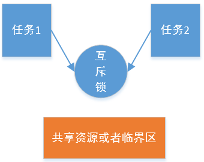
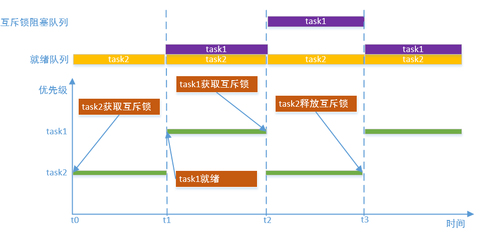
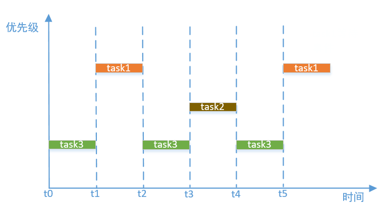
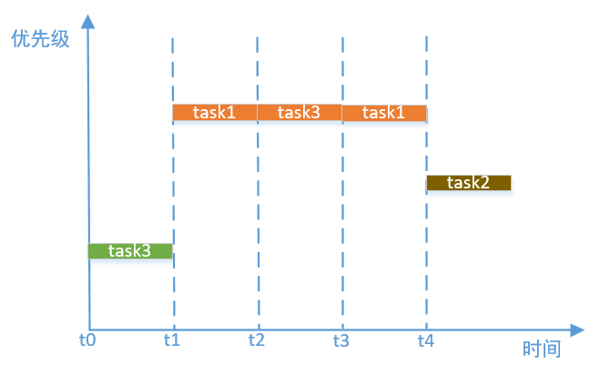
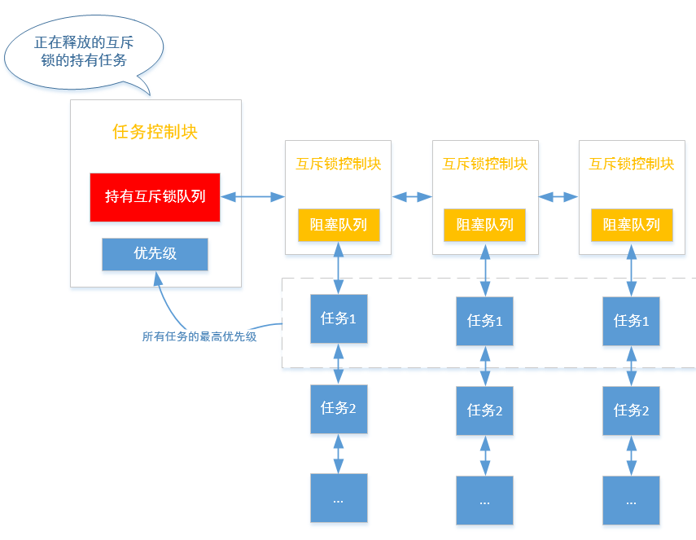

# 互斥锁

---

## 简介

介绍互斥锁之前，先想象一种场景，假如办公室只有一台打印机，员工A和员工B都要打印材料，如果A正在打印材料的时候，B也使用打印机打印，这样打印出来的文件很可能是错乱的，这就是两人同时使用打印机造成的，要解决这个问题，可以将打印机放在房间里，并且房间是带锁的，当A先使用打印机的时候，把门关上，不允许B进入，B想打印的时候发现门是锁着的，就在门外等待，只有A打印完开门后，B才能进去打印。在多任务操作系统中，打印机就类似共享资源或者临界区，而门锁就类似互斥锁。

互斥锁是一种任务间互斥的机制，一个任务占有了某个资源，就不允许别的任务去访问，直到占有资源的任务释放锁。即一个资源同时只允许一个访问者对其访问，具有唯一性和排他性，但互斥不会限制访问者对资源的访问顺序，即访问是无序的。如下图：



OneOs互斥锁支持非递归锁和递归锁两种形式。当互斥锁设置为非递归锁时，一旦该锁被某个任务获取，在释放之前不能被任何任务再次获取；当互斥锁设置为递归锁时，若锁被某个任务获取，那么该任务可以再次获取这个锁而不会被挂起。一般情况下，使用者在使用锁时，应该明确自己要保护的临界资源的范围，只在对临界资源访问时加锁，访问完成后立即解锁。对临界资源的访问，经过合理设计后，一般都可以使用非递归锁实现；递归锁在某些错综复杂的调用关系情况下，使用起来比较方便，但是容易隐藏代码中可能存在的问题。

互斥锁和信号量的区别有：每个互斥锁对应一个所有者，互斥锁必须由所有者释放，信号量可以由任何任务释放；互斥锁支持递归调用；互斥锁可以解决优先级翻转问题。鉴于互斥锁和信号量的异同点，互斥锁可以理解为一种特殊的二值信号量。

---

### 互斥锁实现原理

互斥锁是基于阻塞队列实现，互斥锁的初始计数值为0(代表此时互斥锁没有被获取)，任务成功获取互斥锁时，计数值加1(代表此时互斥锁已经被获取)，并且该任务成为锁的持有者，当另一个任务获取该互斥锁时，由于锁已经被获取，该任务被挂起放到阻塞队列，直到锁的持有者释放锁，被挂起的任务才被唤醒并放到就绪队列。如下图:



### 互斥锁解决优先级翻转

我们先想象一种场景，如下图，有3个任务按优先级排序，任务1>任务2>任务3，任务1优先级最高，假设任务3和任务1采用其他同步机制(例如信号量)进行同步，并且由于某种原因任务3最先启动运行并获取信号量，然后任务1就绪获取信号量失败被阻塞，再次切换到任务3运行，此时任务2就绪，任务2优先级比任务3更高，所以任务2运行，直到任务2运行结束再切换到任务3运行，任务3释放信号量后，任务1才能运行，从整个运行过程中看，任务2比任务1优先级低，但是任务2却能先于任务1运行，影响实时性，这就是优先级翻转现象。



互斥锁优先级继承机制可以解决优先级翻转问题，如下图，当任务1获取互斥锁失败被阻塞时，暂时提高互斥锁持有者任务3的优先级到和任务1一样，当任务2就绪时，由于此时任务3的优先级比任务2高，所以继续运行任务3，任务3释放锁后，任务1运行，直到任务1运行结束，任务2才能运行，这样就解决了优先级翻转问题。



上面提到的方法是解决优先级翻转的常见方法，Oneos针对任务持多个互斥锁的情况，在恢复优先级时做了优化，如下图，释放互斥锁的时候，不是直接恢复持有该互斥锁任务的原始优先级，而是遍历该任务的持有互斥锁队列，获取到队列上每个互斥锁阻塞队列上的第一个任务(这个任务在该队列上优先级最高)，然后取所有阻塞任务的最高优先级，将互斥锁任务恢复为该优先级。



---

## 重要定义及数据结构

### 互斥锁宏定义


```c
#define OS_MUTEX_WAKE_TYPE_PRIO             0x55
#define OS_MUTEX_WAKE_TYPE_FIFO             0xAA
```

| **互斥锁宏** | **说明** |
| :--- | :--- |
| OS_MUTEX_WAKE_TYPE_PRIO | 按优先级唤醒 |
| OS_MUTEX_WAKE_TYPE_FIFO | 按FIFO唤醒 |

### 互斥锁控制块结构体

```c
struct os_mutex
{
    os_list_node_t  task_list_head;         /* Block task list head */
    os_list_node_t  resource_node;          /* Node in resource list */
    os_list_node_t  hold_node;
    
    os_task_t      *owner;                  /* Mutex owner */

    os_uint32_t     lock_count;             /* Current lock count */
    os_bool_t       is_recursive;           /* Support recursive call. */

    os_uint8_t      object_inited;          /* If mutex object is inited, value is OS_KOBJ_INITED */
    os_uint8_t      object_alloc_type;      /* Indicates whether memory is allocated dynamically or statically,
                                               value is OS_KOBJ_ALLOC_TYPE_STATIC or OS_KOBJ_ALLOC_TYPE_DYNAMIC */
    os_uint8_t      wake_type;              /* The type to wake up blocking tasks, value is OS_MUTEX_WAKE_TYPE_PRIO
                                               or OS_MUTEX_WAKE_TYPE_FIFO */
    os_uint8_t      original_priority;
    
    char            name[OS_NAME_MAX + 1]; /* Mutex name */
};
```

| **互斥锁控制块成员变量** | **说明** |
| :--- | :--- |
| task\_list\_head | 任务阻塞队列头，任务获取互斥锁失败时将其阻塞在该队列上 |
| resource\_node | 资源管理节点，通过该节点将创建的互斥锁挂载到gs_os_mutex_resource_list_head上 |
| hold\_node | 锁定管理节点，通过该节点将被任务锁定的互斥锁挂在到对应的任务上 |
| owner | 锁定者，指向锁定互斥锁的任务 |
| lock\_count | 锁定次数，非递归互斥锁只能锁定1次，递归互斥锁可以被同一个任务锁定多次 |
| is\_recursive | 递归互斥锁标志，1表示为递归互斥锁，0表示非递归互斥锁 |
| object\_inited | 初始化状态，0x55表示已经初始化，0xAA表示已经去初始化，其他值为未初始化 |
| object\_alloc\_type | 互斥锁类型，0为静态互斥锁，1为动态互斥锁 |
| wake\_type | 阻塞任务唤醒方式，0x55表示按优先级唤醒，0xAA表示按FIFO唤醒。可以通过属性设置接口进行设置 |
| original\_priority | 任务原始优先级，保存任务获取到任务时的任务优先级 |
| name | 互斥锁名字，名字长度不能大于OS_NAME_MAX |

---

## API介绍

| **接口** | **说明** |
| :--- | :--- |
| os\_mutex\_init | 以静态方式初始化互斥锁，即互斥锁对象所使用的空间由使用者提供 |
| os\_mutex\_deinit | 该函数去初始化互斥锁，与os\_mutex\_init\(\)配合使用 |
| os\_mutex\_create | 以动态方式创建并初始化互斥锁，即互斥锁对象使用的内存空间通过动态申请获得 |
| os\_mutex\_destroy | 销毁互斥锁，并释放互斥锁对象所占用的内存空间 |
| os\_mutex\_lock | 获取（非递归）互斥锁，若暂时获取不到锁且设定了超时时间，则当前任务会阻塞 |
| os\_mutex\_unlock | 释放（非递归）互斥锁，与os\_mutex\_lock\(\)配合使用 |
| os\_mutex\_recursive\_lock | 获取（递归）互斥锁 |
| os\_mutex\_recursive\_unlock | 释放（递归）互斥锁，与os\_mutex\_recursive\_lock\(\)配套使用 |
| os\_mutex\_set\_wake\_type | 设置互斥锁阻塞任务的唤醒方式 |
| os\_mutex\_get\_owner | 返回持有互斥锁的任务控制块 |

### os\_mutex\_init

该函数以静态方式初始化互斥锁，即互斥锁对象所使用的空间由使用者提供，函数原型如下：

```c
os_err_t os_mutex_init(os_mutex_t *mutex, const char *name, os_bool_t recursive);
```

| **参数** | **说明** |
| :--- | :--- |
| mutex | 互斥锁控制块，由用户提供，并指向对应的互斥锁控制块内存地址 |
| name | 互斥锁名字，其最大长度由OS_NAME_MAX 宏指定，多余部分会被自动截掉 |
| recursive | 表明是否为递归锁。若为OS_FALSE，为非递归锁，若为OS_TRUE时，为递归锁 |
| **返回** | **说明** |
| OS\_EOK | 初始化互斥锁成功 |
| OS\_EINVAL | 初始化互斥锁失败，无效参数 |

### os\_mutex\_deinit

该函数去初始化互斥锁，与os\_mutex\_init\(\)配合使用，函数原型如下：

```c
os_err_t os_mutex_deinit(os_mutex_t *mutex);
```

| **参数** | **说明** |
| :--- | :--- |
| mutex | 互斥锁句柄 |
| **返回** | **说明** |
| OS\_EOK | 去初始化互斥锁成功 |

### os\_mutex\_create

该函数以动态方式创建并初始化互斥锁，即互斥锁对象使用的内存空间通过动态申请获得，函数原型如下：

```c
os_mutex_t *os_mutex_create(const char *name, os_bool_t recursive);
```

| **参数** | **说明** |
| :--- | :--- |
| name | 互斥锁名字，其最大长度由OS_NAME_MAX 宏指定，多余部分会被自动截掉 |
| recursive | 表明是否为递归锁。若为OS_FALSE，为非递归锁，若为OS_TRUE时，为递归锁 |
| **返回** | **说明** |
| 非OS\_NULL | 互斥锁创建成功 |
| OS\_NULL | 互斥锁创建失败 |

### os\_mutex\_destroy

该函数销毁互斥锁，并释放互斥锁对象所占用的内存空间，与os_mutex_create()配合使用，原型如下：

```c
os_err_t os_mutex_destroy(os_mutex_t *mutex);
```

| **参数** | **说明** |
| :--- | :--- |
| mutex | 互斥锁控制块 |
| **返回** | **说明** |
| OS\_EOK | 销毁互斥锁成功 |

### os\_mutex\_lock

该函数用于获取（非递归）互斥锁，若暂时获取不到锁且设定了超时时间，则当前任务会阻塞，函数原型如下：

```c
os_err_t os_mutex_lock(os_mutex_t *mutex, os_tick_t timeout);
```

| **参数** | **说明** |
| :--- | :--- |
| mutex | 互斥锁控制块 |
| timeout | 非递归锁暂时获取不到时的等待超时时间。若为OS_NO_WAIT，则等待时间为0；若为OS_WAIT_FOREVER，则永久等待直到获取到非递归锁；若为其它值，则等待timeout时间或者获取到非递归锁为止，并且其他值时timeout必须小于OS_TICK_MAX / 2 |
| **返回** | **说明** |
| OS\_EOK | 获取非递归锁成功 |
| OS\_EBUSY | 不等待且未获取到非递归锁 |
| OS\_ETIMEOUT | 等待超时未获取到非递归锁 |
| OS\_ERROR | 其它错误 |

### os\_mutex\_unlock

该函数用于释放（非递归）互斥锁，与os\_mutex\_lock\(\)配合使用，函数原型如下：

```c
os_err_t os_mutex_unlock(os_mutex_t *mutex);
```

| **参数** | **说明** |
| :--- | :--- |
| mutex | 互斥锁控制块 |
| **返回** | **说明** |
| OS\_EOK | 释放非递归锁成功 |

### os\_mutex\_recursive\_lock

该函数用于获取（递归）互斥锁，函数原型如下：

```c
os_err_t os_mutex_recursive_lock(os_mutex_t *mutex, os_tick_t timeout);
```

| **参数** | **说明** |
| :--- | :--- |
| mutex | 互斥锁控制块 |
| timeout | 递归锁暂时获取不到时的等待超时时间。若为OS_NO_WAIT，则等待时间为0；若为OS_WAIT_FOREVER，则永久等待直到获取到递归锁；若为其它值，则等待timeout时间或者获取到递归锁为止，并且其他值时timeout必须小于OS_TICK_MAX / 2 |
| **返回** | **说明** |
| OS\_EOK | 获取递归锁成功 |
| OS\_EBUSY | 不等待且未获取到递归锁 |
| OS\_ETIMEOUT | 等待超时未获取到递归锁 |
| OS\_ERROR | 其它错误 |

### os\_mutex\_recursive\_unlock

该函数用于释放（递归）互斥锁，与os\_mutex\_recursive\_lock\(\)配套使用，函数原型如下：

```c
os_err_t os_mutex_recursive_unlock(os_mutex_t *mutex);
```

| **参数** | **说明** |
| :--- | :--- |
| mutex | 互斥锁控制块 |
| **返回** | **说明** |
| OS\_EOK | 释放递归锁成功 |

### os\_mutex\_set\_wake\_type

该函数用于设置互斥锁阻塞任务的唤醒方式，函数原型如下：

```c
os_err_t os_mutex_set_wake_type(os_mutex_t *mutex, os_uint8_t wake_type);
```

| **参数** | **说明** |
| :--- | :--- |
| mutex | 互斥锁控制块 |
| wake_type | OS_MUTEX_WAKE_TYPE_PRIO为设置唤醒阻塞任务的类型为按优先级唤醒(互斥锁创建后默认为使用此方式)，OS_MUTEX_WAKE_TYPE_FIFO为设置唤醒阻塞任务的类型为先进先出唤醒 |
| **返回** | **说明** |
| OS\_EOK | 设置唤醒阻塞任务类型成功 |
| OS\_EBUSY | 设置唤醒阻塞任务类型失败 |

### os\_mutex\_get\_owner

该函数用于返回持有互斥锁的任务控制块，函数原型如下：

```c
os_task_t *os_mutex_get_owner(os_mutex_t *mutex);
```

| **参数** | **说明** |
| :--- | :--- |
| mutex | 互斥锁控制块 |
| **返回** | **说明** |
| 非OS\_NULL | 返回持有互斥锁的任务控制块 |
| OS\_NULL | 该互斥锁没有被获取 |

---

## 配置选项

OneOS在使用互斥锁时提供了功能裁剪的配置，具体配置如下所示:

```
(Top) → Kernel→ Inter-task communication and synchronization
                                              OneOS Configuration
-*- Enable mutex
[ ] Enable spinlock check
[*] Enable semaphore
[*] Enable event flag
[*] Enable message queue
[*] Enable mailbox
```

| **配置项** | **说明** |
| :--- | :--- |
| Enable mutex | 使能互斥锁功能，如果不使能该功能，互斥锁相关的源代码就不会编译，默认使能 |

---

## 应用示例

### 静态互斥锁应用示例

本例采用静态方式初始化了一个（非递归）互斥锁，并在两个任务里面都去访问两个全局变量，使用互斥锁对这两个全局变量进行保护

```c
#include <oneos_config.h>
#include <os_task.h>
#include <shell.h>
#include <os_mutex.h>
#include <dlog.h>

#define TEST_TAG        "TEST"
#define TASK_STACK_SIZE 1024
#define TASK1_PRIORITY  15
#define TASK2_PRIORITY  16

static os_uint32_t count1 = 0;
static os_uint32_t count2 = 0;
static os_mutex_t mutex_static;

void task1_entry(void *para)
{
    while (1)
    {
        if (OS_EOK == os_mutex_lock(&mutex_static, OS_WAIT_FOREVER))
        {
            LOG_W(TEST_TAG, "task1 mutex lock");
        }
        else
        {
            LOG_W(TEST_TAG, "task1 mutex lock err");
        }

        count1++;
        LOG_W(TEST_TAG, "task1 sleep");
        os_task_msleep(100);
        count2++;
        if (OS_EOK == os_mutex_unlock(&mutex_static))
        {
            LOG_W(TEST_TAG, "task1 mutex unlock");
        }
        else
        {
            LOG_W(TEST_TAG, "task1 mutex unlock err");
        }
        os_task_msleep(500);
    }
}

void task2_entry(void *para)
{
    while (1)
    {
        if (OS_EOK == os_mutex_lock(&mutex_static, OS_WAIT_FOREVER))
        {
            LOG_W(TEST_TAG, "task2 mutex lock");
        }
        else
        {
            LOG_W(TEST_TAG, "task2 mutex lock err");
        }

        LOG_W(TEST_TAG, "task2 count1:%d count2:%d", count1, count2);
        count1++;
        count2++;
        if (OS_EOK == os_mutex_unlock(&mutex_static))
        {
            LOG_W(TEST_TAG, "task2 mutex unlock");
        }
        else
        {
            LOG_W(TEST_TAG, "task2 mutex unlock err");
        }

        os_task_msleep(500);
    }
}

void mutex_static_sample(void)
{
    os_task_t *task1 = OS_NULL;
    os_task_t *task2 = OS_NULL;

    os_mutex_init(&mutex_static, "mutex_static", OS_FALSE);

    task1 = os_task_create("task1",
                           task1_entry,
                           OS_NULL,
                           TASK_STACK_SIZE,
                           TASK1_PRIORITY);
    if (task1)
    {
        os_task_startup(task1);
    }

    task2 = os_task_create("task2",
                           task2_entry,
                           OS_NULL,
                           TASK_STACK_SIZE,
                           TASK2_PRIORITY);
    if (task2)
    {
        os_task_startup(task2);
    }
}

SH_CMD_EXPORT(static_mutex, mutex_static_sample, "test staitc mutex");
```

运行结果如下：

```c
sh>static_mutex
W/TEST: task1 mutex lock
W/TEST: task1 sleep
W/TEST: task1 mutex unlock
W/TEST: task2 mutex lock
W/TEST: task2 count1:1 count2:1
W/TEST: task2 mutex unlock
W/TEST: task1 mutex lock
W/TEST: task1 sleep
W/TEST: task1 mutex unlock
W/TEST: task2 mutex lock
W/TEST: task2 count1:3 count2:3
W/TEST: task2 mutex unlock
W/TEST: task1 mutex lock
W/TEST: task1 sleep
W/TEST: task1 mutex unlock
W/TEST: task2 mutex lock
W/TEST: task2 count1:5 count2:5
W/TEST: task2 mutex unlock
W/TEST: task1 mutex lock
W/TEST: task1 sleep
W/TEST: task1 mutex unlock
W/TEST: task2 mutex lock
W/TEST: task2 count1:7 count2:7
W/TEST: task2 mutex unlock
W/TEST: task1 mutex lock
W/TEST: task1 sleep
```

### 动态互斥锁应用示例

本例采用动态方式创建并初始化了（递归）互斥锁，并在两个任务里面都去访问两个全局变量，使用互斥锁对这两个全局变量进行保护。本例中的递归互斥锁的使用没有实际意义，仅为演示递归锁的使用方法及效果

```c
#include <oneos_config.h>
#include <os_task.h>
#include <shell.h>
#include <os_mutex.h>
#include <dlog.h>

#define TEST_TAG        "TEST"
#define TASK_STACK_SIZE 1024
#define TASK1_PRIORITY  15
#define TASK2_PRIORITY  16

#define TEST_RECURSIVE_CNT 3

static os_uint32_t count1 = 0;
static os_uint32_t count2 = 0;
static os_mutex_t *mutex_dynamic = OS_NULL;

void task1_entry(void *para)
{
    os_uint32_t i = 0;

    while (1)
    {
        for (i = 0; i < TEST_RECURSIVE_CNT; i++)
        {
            if (OS_EOK == os_mutex_recursive_lock(mutex_dynamic, OS_WAIT_FOREVER))
            {
                LOG_W(TEST_TAG, "task1 mutex lock");
                count1++;
                LOG_W(TEST_TAG, "task1 sleep");
                os_task_msleep(100);
                count2++;
            }
            else
            {
                LOG_W(TEST_TAG, "task1 mutex lock err");
            }
        }

        for (i = 0; i < TEST_RECURSIVE_CNT; i++)
        {
            if (OS_EOK == os_mutex_recursive_unlock(mutex_dynamic))
            {
                LOG_W(TEST_TAG, "task1 mutex unlock");
            }
            else
            {
                LOG_W(TEST_TAG, "task1 mutex unlock err");
            }
        }
        os_task_msleep(500);
    }
}

void task2_entry(void *para)
{
    while (1)
    {
        if (OS_EOK == os_mutex_recursive_lock(mutex_dynamic, OS_WAIT_FOREVER))
        {
            LOG_W(TEST_TAG, "task2 mutex lock");
        }
        else
        {
            LOG_W(TEST_TAG, "task2 mutex lock err");
        }

        LOG_W(TEST_TAG, "task2 count1:%d count2:%d", count1, count2);
        count1++;
        count2++;
        if (OS_EOK == os_mutex_recursive_unlock(mutex_dynamic))
        {
            LOG_W(TEST_TAG, "task2 mutex unlock");
        }
        else
        {
            LOG_W(TEST_TAG, "task2 mutex unlock err");
        }

        os_task_msleep(500);
    }
}

void mutex_dynamic_sample(void)
{
    os_task_t *task1 = OS_NULL;
    os_task_t *task2 = OS_NULL;

    mutex_dynamic = os_mutex_create("mutex_dynamic", OS_TRUE);

    task1 = os_task_create("task1",
                           task1_entry,
                           OS_NULL,
                           TASK_STACK_SIZE,
                           TASK1_PRIORITY);
    if (task1)
    {
        os_task_startup(task1);
    }

    task2 = os_task_create("task2",
                           task2_entry,
                           OS_NULL,
                           TASK_STACK_SIZE,
                           TASK2_PRIORITY);
    if (task2)
    {
        os_task_startup(task2);
    }
}

SH_CMD_EXPORT(dynamic_mutex, mutex_dynamic_sample, "test dynamic mutex");
```

运行结果如下，可以看到task1获得递归互斥锁之后，仍然可以再次获得递归互斥锁，而task2必须等task1把递归互斥锁完全释放完之后才能获取到锁：

```c
sh>dynamic_mutex
W/TEST: task1 mutex lock
W/TEST: task1 sleep
W/TEST: task1 mutex lock
W/TEST: task1 sleep
W/TEST: task1 mutex lock
W/TEST: task1 sleep
W/TEST: task1 mutex unlock
W/TEST: task1 mutex unlock
W/TEST: task1 mutex unlock
W/TEST: task2 mutex lock
W/TEST: task2 count1:3 count2:3
W/TEST: task2 mutex unlock
W/TEST: task1 mutex lock
W/TEST: task1 sleep
W/TEST: task1 mutex lock
W/TEST: task1 sleep
W/TEST: task1 mutex lock
W/TEST: task1 sleep
W/TEST: task1 mutex unlock
W/TEST: task1 mutex unlock
W/TEST: task1 mutex unlock
W/TEST: task2 mutex lock
W/TEST: task2 count1:7 count2:7
W/TEST: task2 mutex unlock
W/TEST: task1 mutex lock
W/TEST: task1 sleep
W/TEST: task1 mutex lock
W/TEST: task1 sleep
W/TEST: task1 mutex lock
W/TEST: task1 sleep
W/TEST: task1 mutex unlock
W/TEST: task1 mutex unlock
W/TEST: task1 mutex unlock
W/TEST: task2 mutex lock
W/TEST: task2 count1:11 count2:11
W/TEST: task2 mutex unlock
W/TEST: task1 mutex lock
W/TEST: task1 sleep
W/TEST: task1 mutex lock
W/TEST: task1 sleep
W/TEST: task1 mutex lock
W/TEST: task1 sleep
W/TEST: task1 mutex unlock
W/TEST: task1 mutex unlock
W/TEST: task1 mutex unlock
W/TEST: task2 mutex lock
W/TEST: task2 count1:15 count2:15
W/TEST: task2 mutex unlock
W/TEST: task1 mutex lock
W/TEST: task1 sleep
W/TEST: task1 mutex lock
W/TEST: task1 sleep
```
