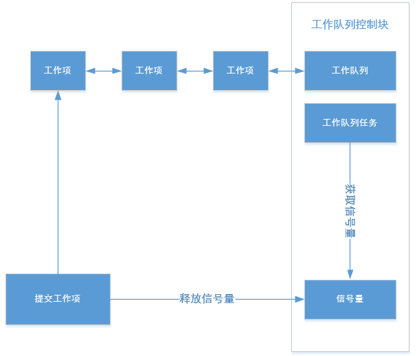

# 工作队列

---

## 简介

工作队列提供了执行某个用户工作的接口，如果用户想执行某个工作，可以向工作队列提交工作，并且可以设置延时执行和不延时执行。如果想执行某个简单的或者不需要循环处理的操作，选择工作队列比较合适，不需要创建单独的任务。内核提供的工作队列有两种接口，第一种接口，用户可以创建自己的工作队列，自行决定栈大小和任务优先级，然后把需要的工作项提交到工作队列上；另外一种接口，用户不用创建工作队列，而是直接把工作项提交到系统创建的工作队列上。工作队列是对任务封装的一种用于处理各种工作项的机制，由于处理的对象是用链表连接起来的一个个工作项，在封装的任务中被依次取出来一个个处理，就像队列依次处理一样，所以称为工作队列。另外工作队列是在任务环境中执行的，可以睡眠，所以针对中断触发的某些事情，也可以把其中某些对时间要求不高的部分放到工作队列里面去处理。

---

## 工作队列实现原理

工作队列基于队列和信号量实现，创建工作队列的时候，会创建一个对应的任务，当工作队列链表上没有工作项时，任务获取信号量就会阻塞，提交工作项时，会把工作项放到工作队列链表，并释放信号量，任务就会被唤醒，然后处理链表上的工作项的回调函数。如下图：



---

## 重要定义及数据结构

### 工作队列控制块结构体

```c
struct os_workqueue
{
    os_list_node_t  work_list_head;    
    os_work_t      *work_current;               /* Work in progress on workqueue. */
    os_task_t       worker_task;                /* Task on the workqueue to execute work. */

    os_spinlock_t   lock;                       /* Spin lock. */    
    os_sem_t        sem;                        /* Semaphore for synchronization. */    

    os_uint8_t      object_inited;              /* If os_workqueue is inited, value is OS_KOBJ_INITED */
};

```

| **工作队列控制块成员变量** | **说明** |
| :--- | :--- |
| work_list_head | 工作队列上工作挂在链表头节点 |
| work_current | 工作队列上正在执行的工作 |
| worker_task | 工作队列执行工作的任务 |
| lock | 用于访问控制的自旋锁 |
| sem | 用于同步的信号量 |
| object_inited | 初始化状态，0x55表示已经初始化，0xAA表示已经去初始化，其他值为未初始化 |

### 工作项控制块结构体

```c
struct os_work
{
    os_list_node_t   work_node;
    
    void           (*func)(void *data);         /* Callback function for work. */
    void            *data;                      /* Private data for callback function. */
    os_timer_t       timer;                     /* Using for delayed work. */

    struct os_workqueue * volatile workqueue;   /* Workqueue used to execute work. */

    os_uint8_t       flag;   
    os_uint8_t       object_inited;             /* If os_work is inited, value is OS_KOBJ_INITED */
};
```

| **工作项控制块成员变量** | **说明** |
| :--- | :--- |
| work_node | 工作挂载点，用于将工作挂载到工作队列上 |
| func | 工作处理函数 |
| data | 工作处理函数参数 |
| workqueue | 工作挂载的工作队列 |
| flag | 工作状态标志 |
| object_inited | 初始化状态，0x55表示已经初始化，0xAA表示已经去初始化，其他值为未初始化 |

---

## API介绍

| **接口** | **说明** |
| :--- | :--- |
| os\_workqueue\_init | 根据传入的参数初始化工作队列。工作队列控制块内存由用户提供 |
| os\_workqueue\_create | 创建工作队列，内部会创建一个对应的任务 |
| os\_work\_init | 初始化工作项 |
| os\_submit\_work\_to\_queue | 将工作提交到指定的工作队列 |
| os\_submit\_work | 将工作提交到系统工作队列 |
| os\_cancel\_work | 异步取消已经提交到工作队列的任务 |
| os\_cancel\_work\_sync | 同步取消已经提交到工作队列的任务 |

### os\_workqueue\_init

根据传入的参数初始化工作队列。工作队列控制块内存由用户提供，函数原型如下：

```c
os_err_t os_workqueue_init(os_workqueue_t *queue,
                           const char     *name, 
                           void           *stack_begin,
                           os_uint32_t     stack_size,
                           os_uint8_t      priority,
                           os_int32_t      cpu_index)
```

| **参数** | **说明** |
| :--- | :--- |
| queue | 工作队列控制块，由用户提供，并指向对应的工作队列控制块内存地址 |
| name | 工作队列名字，其最大长度由OS_NAME_MAX 宏指定，多余部分会被自动截掉 |
| stack\_begin | 栈起始地址 |
| stack\_size | 栈大小 |
| priority | 优先级 |
| cpu_index | CPU核号 |
| **返回** | **说明** |
| OS\_EOK | 用户工作队列初始化成功 |
| OS\_ERROR | 用户工作队列初始化失败 |

### os\_workqueue\_create

该函数用于创建工作队列，内部会创建一个对应的任务，函数原型如下：

```c
os_workqueue_t *os_workqueue_create(const char  *name,
                                    os_uint32_t  stack_size, 
                                    os_uint8_t   priority, 
                                    os_int32_t   cpu_index);
```

| **参数** | **说明** |
| :--- | :--- |
| name | 工作队列名字，其最大长度由OS_NAME_MAX 宏指定，多余部分会被自动截掉 |
| stack\_size | 栈大小 |
| priority | 优先级 |
| cpu_index | CPU核号 |
| **返回** | **说明** |
| 非OS\_NULL | 工作队列创建成功 |
| OS\_NULL | 工作队列创建失败 |

### os\_work\_init

该函数用于初始化工作项，函数原型如下：

```c
void os_work_init(os_work_t *work, void (*func)(void *data), void *data);
```

| **参数** | **说明** |
| :--- | :--- |
| work | 工作项控制块，由用户提供，并指向对应的工作项控制块内存地址 |
| func | 工作项函数 |
| data | 工作项函数的参数 |
| **返回** | **说明** |
| 无 | 无 |

### os\_submit\_work\_to\_queue

该函数将工作提交到指定的工作队列，函数原型如下：

```c
os_err_t os_submit_work_to_queue(os_workqueue_t *queue, os_work_t *work, os_tick_t delay_time);
```

| **参数** | **说明** |
| :--- | :--- |
| queue | 工作项控制块 |
| work | 工作项控制块 |
| delay_time | 提交工作项的延时时间，可取值范围(0,OS_TICK_MAX / 2) |
| **返回** | **说明** |
| OS\_EOK | 提交成功 |
| OS\_EBUSY | 该工作项之前已被提交，但还未执行完成 |
| OS\_ERROR | 同一个工作项提交到两个不同的工作队列 |

### os\_submit\_work

将工作提交到系统作队列，函数原型如下：

```c
os_err_t os_submit_work(os_work_t *work, os_tick_t delay_time);
```

| **参数** | **说明** |
| :--- | :--- |
| work | 工作项控制块 |
| delay_time | 提交工作项的延时时间，可取值范围(0,OS_TICK_MAX / 2) |
| **返回** | **说明** |
| OS\_EOK | 提交成功 |
| OS\_EBUSY | 该工作项之前已被提交，但还未执行完成 |
| OS\_ERROR | 同一个工作项提交到两个不同的工作队列 |

### os\_cancel\_work

异步取消已经提交到工作队列的任务，函数原型如下：

```c
os_err_t os_cancel_work(os_work_t *work);
```

| **参数** | **说明** |
| :--- | :--- |
| work | 工作项控制块 |
| **返回** | **说明** |
| OS\_EOK | 取消成功 |
| OS\_EBUSY | 取消失败，该工作项正在执行 |
| OS\_ERROR | 工作队列中没有已提交的工作项 |

### os\_cancel\_work\_sync

同步取消已经提交到工作队列的任务，函数原型如下：

```c
os_err_t os_cancel_work_sync(os_work_t *work);
```

| **参数** | **说明** |
| :--- | :--- |
| work | 工作项控制块 |
| **返回** | **说明** |
| OS\_EOK | 取消成功 |
| OS\_ERROR | 工作队列中没有已提交的工作项 |

---

## 配置选项

OneOS在使用工作队列时提供了功能选项和裁剪的配置，具体配置如下所示:

```c
(Top) → Kernel
                                              OneOS Configuration
    The max size of kernel object name (15)  --->
    The max level value of priority of task (32)  --->
(100) Tick frequency(Hz)
(10) Task time slice(unit: tick)
[ ] Using stack overflow checking
[ ] Using task hook
[ ] Enable global assert
[ ] Enable kernel lock check
[ ] Enable function safety mechanism
[ ] Enable kernel debug
(2048) The stack size of main task
(1024) The stack size of idle task
(512) The stack size of recycle task
[*] Enable software timer with a timer task
(512)   The stack size of timer task
[ ]     Software timers in each hash bucket are sorted
[*]     Enable workqueue
[*]         Enable system workqueue
(2048)          System workqueue task stack size
(8)             System workqueue task priority level
    Inter-task communication and synchronization  --->
    Memory management  --->
```

| **配置项** | **说明** |
| :--- | :--- |
| Enable workqueue | 使能工作队列功能，如果不使能该功能，工作队列相关的源代码就不会编译，默认使能 |
| Enable system workqueue | 使能系统工作队列 |
| System workqueue task stack size | 系统工作队列任务栈大小，以字节为单位，默认2048 |
| System workqueue task priority level | 系统工作队列任务优先级，默认8 |

---

## 应用示例

### 自己创建工作队列应用示例

本例创建了自己的工作队列，然后在任务1中周期性的提交工作项到该工作队列，在任务2中分别提交了一个需要延时的工作项和不需要延时的工作项到该工作队列

```c
#include <oneos_config.h>
#include <dlog.h>
#include <os_errno.h>
#include <os_task.h>
#include <shell.h>
#include <os_workqueue.h>

#define TEST_TAG            "TEST"
#define TASK_STACK_SIZE     1024
#define TASK1_PRIORITY      15
#define TASK2_PRIORITY      16
#define TASK_WQ_PRIORITY    10

static os_workqueue_t *workqueue_test;
static os_work_t work1;
static os_work_t work2;
static os_work_t work3;

void work1_func(void *data)
{
    LOG_W(TEST_TAG, "work1_func, data:%d", *(os_uint32_t *)data);
}

void work2_func(void *data)
{
    LOG_W(TEST_TAG, "work2_func");
}

void work3_func(void *data)
{
    LOG_W(TEST_TAG, "work3_func");
}

void task1_entry(void *para)
{
    os_uint32_t data = 0;

    os_work_init(&work1, work1_func, &data);
    while(1)
    {
        data++;
        LOG_W(TEST_TAG, "task1 submit work1");
        while(OS_EBUSY == os_submit_work_to_queue(workqueue_test, &work1, 0))
        {
            os_task_msleep(10);
        }
        os_task_msleep(500);
    }
}

void task2_entry(void *para)
{
    os_tick_t delay_time = 100;

    os_work_init(&work2, work2_func, OS_NULL);
    LOG_W(TEST_TAG, "task2 submit work2, delay_time:%d", delay_time);
    if(OS_EOK != os_submit_work_to_queue(workqueue_test, &work2, delay_time))
    {
        LOG_W(TEST_TAG, "task2 submit work2 ERR");
    }

    os_task_msleep(500);

    delay_time = 0;
    os_work_init(&work3, work3_func, OS_NULL);
    LOG_W(TEST_TAG, "task2 submit work3, delay_time:%d", delay_time);
    if(OS_EOK != os_submit_work_to_queue(workqueue_test, &work3, delay_time))
    {
        LOG_W(TEST_TAG, "task2 submit work3 ERR");
    }
}

void workqueue_sample(void)
{
    os_task_t *task1 = OS_NULL;
    os_task_t *task2 = OS_NULL;

    workqueue_test = os_workqueue_create("workqueue", TASK_STACK_SIZE, TASK_WQ_PRIORITY, 0);
    if (!workqueue_test)
    {
        LOG_W(TEST_TAG, "workqueue_sample workqueue create ERR");
        return;
    }

    task1 = os_task_create("task1",
                           task1_entry,
                           OS_NULL,
                           TASK_STACK_SIZE,
                           TASK1_PRIORITY);
    if (task1)
    {
        LOG_W(TEST_TAG, "workqueue_sample startup task1");
        os_task_startup(task1);
    }

    task2 = os_task_create("task2",
                           task2_entry,
                           OS_NULL,
                           TASK_STACK_SIZE,
                           TASK2_PRIORITY);
    if (task2)
    {
        LOG_W(TEST_TAG, "workqueue_sample startup task2");
        os_task_startup(task2);
    }
}

SH_CMD_EXPORT(test_workqueue, workqueue_sample, "test workqueue");
```

运行结果如下：

```c
sh>test_workqueue
W/TEST: workqueue_sample startup task1
W/TEST: task1 submit work1
W/TEST: work1_func, data:1
W/TEST: workqueue_sample startup task2
W/TEST: task2 submit work2, delay_time:100
sh>W/TEST: task1 submit work1
W/TEST: work1_func, data:2
W/TEST: task2 submit work3, delay_time:0
W/TEST: work3_func
[1350] I/TASK: Recycle task(task2) [_k_recycle_task_entry][120]
W/TEST: task1 submit work1
W/TEST: work1_func, data:3
W/TEST: work2_func
W/TEST: task1 submit work1
W/TEST: work1_func, data:4
W/TEST: task1 submit work1
W/TEST: work1_func, data:5
W/TEST: task1 submit work1
W/TEST: work1_func, data:6
W/TEST: task1 submit work1
W/TEST: work1_func, data:7
W/TEST: task1 submit work1
W/TEST: work1_func, data:8
W/TEST: task1 submit work1
W/TEST: work1_func, data:9
W/TEST: task1 submit work1
W/TEST: work1_func, data:10
```

### 系统工作队列应用示例

本例使用系统工作队列，不创建自己的工作队列，用另外一套接口，达到和上面示例中一样的效果，使用起来更简单方便

```c
#include <oneos_config.h>
#include <dlog.h>
#include <os_errno.h>
#include <os_task.h>
#include <shell.h>
#include <os_workqueue.h>

#define TEST_TAG            "TEST"
#define TASK_STACK_SIZE     1024
#define TASK1_PRIORITY      15
#define TASK2_PRIORITY      16

static os_work_t work1;
static os_work_t work2;
static os_work_t work3;

void work1_func(void *data)
{
    LOG_W(TEST_TAG, "work1_func, data:%d", *(os_uint32_t *)data);
}

void work2_func(void *data)
{
    LOG_W(TEST_TAG, "work2_func");
}

void work3_func(void *data)
{
    LOG_W(TEST_TAG, "work3_func");
}

void task1_entry(void *para)
{
    os_uint32_t data = 0;

    os_work_init(&work1, work1_func, &data);
    while(1)
    {
        data++;
        LOG_W(TEST_TAG, "task1 submit work1");
        while(OS_EBUSY == os_submit_work(&work1, 0))
        {
            os_task_msleep(10);
        }
        os_task_msleep(500);
    }
}

void task2_entry(void *para)
{
    os_tick_t delay_time = 100;

    os_work_init(&work2, work2_func, OS_NULL);
    LOG_W(TEST_TAG, "task2 submit work2, delay_time:%d", delay_time);
    if(OS_EOK != os_submit_work(&work2, delay_time))
    {
        LOG_W(TEST_TAG, "task2 submit work2 ERR");
    }

    os_task_msleep(500);

    delay_time = 0;
    os_work_init(&work3, work3_func, OS_NULL);
    LOG_W(TEST_TAG, "task2 submit work3, delay_time:%d", delay_time);
    if(OS_EOK != os_submit_work(&work3, delay_time))
    {
        LOG_W(TEST_TAG, "task2 submit work3 ERR");
    }
}

void sys_workqueue_sample(void)
{
    os_task_t *task1 = OS_NULL;
    os_task_t *task2 = OS_NULL;

    task1 = os_task_create("task1",
                           task1_entry,
                           OS_NULL,
                           TASK_STACK_SIZE,
                           TASK1_PRIORITY);
    if (task1)
    {
        LOG_W(TEST_TAG, "sys_workqueue_sample startup task1");
        os_task_startup(task1);
    }

    task2 = os_task_create("task2",
                           task2_entry,
                           OS_NULL,
                           TASK_STACK_SIZE,
                           TASK2_PRIORITY);
    if (task2)
    {
        LOG_W(TEST_TAG, "sys_workqueue_sample startup task2");
        os_task_startup(task2);
    }
}

SH_CMD_EXPORT(test_sys_workqueue, sys_workqueue_sample, "test system workqueue");
```

运行结果如下：

```c
sh>test_sys_workqueue
W/TEST: sys_workqueue_sample startup task1
W/TEST: task1 submit work1
W/TEST: work1_func, data:1
W/TEST: sys_workqueue_sample startup task2
W/TEST: task2 submit work2, delay_time:100
sh>W/TEST: task1 submit work1
W/TEST: work1_func, data:2
W/TEST: task2 submit work3, delay_time:0
W/TEST: work3_func
[566] I/TASK: Recycle task(task2) [_k_recycle_task_entry][120]
W/TEST: task1 submit work1
W/TEST: work1_func, data:3
W/TEST: work2_func
W/TEST: task1 submit work1
W/TEST: work1_func, data:4
W/TEST: task1 submit work1
W/TEST: work1_func, data:5
W/TEST: task1 submit work1
W/TEST: work1_func, data:6
W/TEST: task1 submit work1
W/TEST: work1_func, data:7
W/TEST: task1 submit work1
W/TEST: work1_func, data:8
W/TEST: task1 submit work1
W/TEST: work1_func, data:9
W/TEST: task1 submit work1
W/TEST: work1_func, data:10
```
