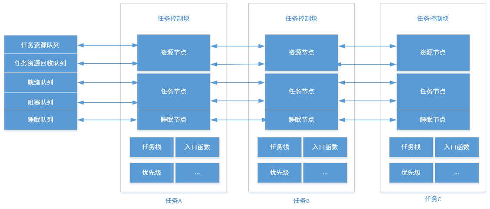
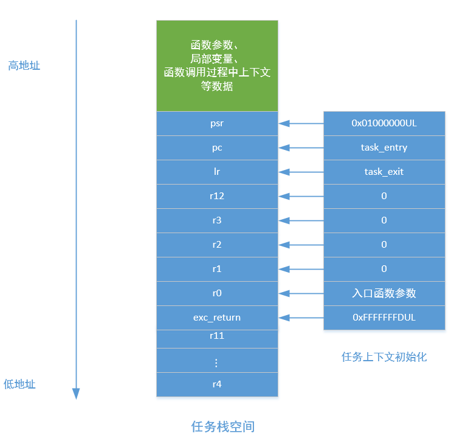
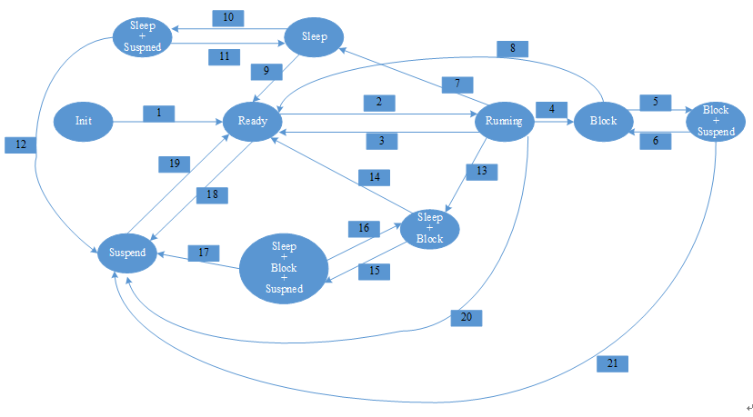
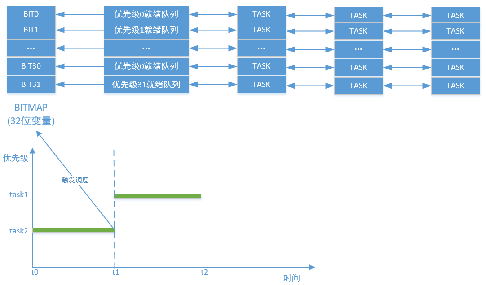
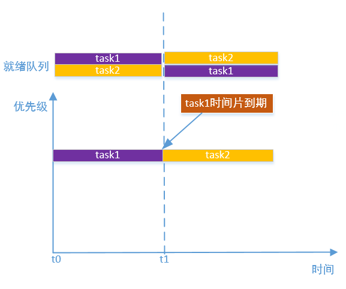

# 任务管理及调度

---

## 简介

介绍该模块之前，首先我们需要知道在操作系统的角度，任务是什么，比如在一个系统上，一部分程序负责收集数据，一部分程序负责处理数据，这两部分程序相互独立运行，并且会分时占用CPU交替运行，事实上，我们的系统会存在很多这样的程序片段，这些程序片段就可以被抽象为任务。任务是操作系统中最小的运行单位，也是最基本的调度单位，而系统把每个任务都抽象为任务控制块，通过任务控制块对任务进行管理。
任务调度就是如何选取任务投入运行的策略。OneOS支持基于优先级的抢占式调度；同时也支持多个具有相同优先级的任务时间片轮转调度。


## 任务管理的实现

任务管理就是实现对任务的各种操作。

- 任务创建时，设置任务控制块的各个成员变量，例如入口函数，栈地址，优先级等，初始化任务的栈空间，并且将任务插入到任务资源队列。
- 任务启动时，将任务插入到就绪队列。
- 任务销毁时，将任务从资源队列和就绪队列移除，释放任务占用的资源。
- 任务睡眠时，将任务插入到睡眠队列，如果睡眠时间到期，就从睡眠队列移除并且插入到就绪队列。
- 任务阻塞时，将任务插入等待资源相对应的阻塞队列，当存在超时时间等待时将任务插入到睡眠队列。
- 任务挂起时，设置任务状态，从就绪队列移除。
- 任务唤醒时，插入任务到就绪队列。

下图描述了任务管理的实现过程：



## 任务栈

每个任务都是独立运行的，所以都有自己的栈空间。任务的栈主要用处就是保存局部变量、任务上下文。任务上下文主要是指任务运行过程中的寄存器，所以任务上下文和CPU架构相关。任务切换时，会将任务上下文保存到栈空间，任务恢复时又会从栈空间读取上下文。
当任务第一次运行时，也需要用到上下文，所以必须在任务创建时初始化任务上下文，下图以armv6为例描述了任务栈的结构和初始化上下文过程。



## 任务的状态迁移

任务的生命周期内，会进行不同状态的变换，例如，当创建并启动时时，处于初始态和就绪态，任务运行时处于运行态，任务销毁时，处于关闭态。

任务有7种基础状态，如下表：

| **基础任务状态** | **说明** |
| :--- | :--- |
| 初始态 | 任务创建完成，被启动之前处于初始态 |
| 就绪态 | 初始态任务被启动之后，状态切换为就绪态，加入就绪队列，等待调度器调度运行 |
| 运行态 | 正在运行的任务处于运行态 |
| 睡眠态 | 正在运行的任务睡眠后会处于睡眠态，睡眠时间到后，会被唤醒 |
| 阻塞态 | 任务运行条件未满足需要等待时进入阻塞态，当运行条件满足后被唤醒 |
| 挂起态 | 任务被挂起后进入挂起态，不参与调度，直到被恢复 |
| 关闭态 | 任务被销毁 |

有些状态是可以组合的，如下表：

| **有效组合态** | **说明** |
| :--- | :--- |
| 阻塞态+挂起态 | 处在阻塞态的任务被挂起 |
| 阻塞态+睡眠态 | 任务有限时间等待某种条件满足时，此时被唤醒的方式有2种，超时或者条件满足 |
| 睡眠态+挂起态 | 处于睡眠态的任务被挂起 |
| 阻塞态+睡眠态+挂起态 | 	处于阻塞态+睡眠态的任务被挂起 |

下图描述了任务的状态转换关系和转换条件：



上图中，没有体现关闭态，主要是任何状态都可以转换为关闭态，而关闭态不能向其它任何状态转换，关系较为简单，为简化图，没有在图中体现。下面，对图中的状态转换进行描述。

图中1，创建的任务被启动，由初始态进入就绪态。

图中2，就绪态的任务被调度而运行。

图中3，正在运行的任务被抢占或是时间片用完。

图中4，正在运行的任务由于某种条件不满足而需要无限等待，此时会挂到阻塞队列。

图中5，处于阻塞状态的任务被挂起。

图中6，处于“阻塞态+挂起态”的任务被恢复。

图中7，正在运行的任务主动睡眠。

图中8，处于阻塞状态的任务所等待的条件被满足，任务可以参与调度。

图中9，任务睡眠时间已到。

图中10，睡眠的任务被挂起。

图中11，处于“睡眠态+挂起态”的任务被恢复，但由于睡眠时间未到，仍为睡眠态。

图中12，处于“睡眠态+挂起态”的睡眠时间已到，但由于挂起动作未被恢复，仍为挂起态。

图中13，正在运行的任务由于某种条件不满足而需要有限时间等待，此时任务会被同时挂在阻塞队列和睡眠队列。

图中14，“睡眠态+阻塞态”任务由于所需要的条件被满足或者等待超时，任务可以参与调度。

图中15，“睡眠态+阻塞态”任务被挂起。

图中16，“睡眠态+阻塞态+挂起态”任务挂起动作被恢复，变成“睡眠态+阻塞态”。

图中17，“睡眠态+阻塞态+挂起态”任务由于所需要的条件被满足或者等待超时，变成挂起态。

图中18，就绪态任务被挂起。

图中19，挂起态任务被解挂恢复，变成就绪态，可以参与任务调度。

图中20，正在运行的任务被挂起。

图中21，“阻塞态+挂起态”任务由于所需要的条件被满足，变成挂起态。

### 任务管理的涉及的队列

任务管理基于队列实现，如下表：

| **基础任务状态** | **说明** |
| :--- | :--- |
| 任务资源队列 | 用于管理任务资源，除关闭态的任务，其它状态下的任务都以资源的方式挂在此队列 |
| 任务资源回收队列 | 处于关闭态任务但资源没有回收的情况下，任务资源会挂到此队列上，待回收任务回收资源 |
| 就绪队列 | 就绪态的任务会挂在此队列上。为提高性能，处于运行态的任务也会挂在此队列上 |
| 睡眠队列 | 睡眠或者有限等待的阻塞任务会挂到此队列上 |
| 阻塞队列 | 任务在等待的特定条件未满足时，任务会被挂在此队列上。阻塞队列会分布在其它功能模块上，如互斥锁、信号量、消息队列等模块，各存在1个阻塞队列 |

### 系统任务

内核会创建一些系统任务，这些任务和用户创建的任务有所区别，系统任务主要是完成系统工作的，例如recycle task负责遍历任务资源回收队列，释放掉已关闭任务占用的资源(例如控制块内存和栈内存)。

| **系统任务** | **说明** |
| :--- | :--- |
| recycle task | 负责遍历任务资源回收队列，释放掉已关闭任务占用的资源(例如控制块内存和栈内存) |
| timer task | 负责处理到期的定时器 |
| main task | 负责调用第二阶段自动初始化接口和main函数，进入用户程序 |
| idle task | 负责处理系统空闲时的工作 |

### 任务调度的实现

任务调度支持是基于优先级的抢占式调度算法，即在系统中除了中断处理函数、调度器上锁部分的代码和禁止中断的代码是不可抢占的之外，系统的其他部分都是可以抢占的。可支持 256 个任务优先级（可通过配置文件更改为32个或8个优先级），0 优先级代表最高优先级，最低优先级留给空闲任务使用；同时它也支持创建多个具有相同优先级的任务，相同优先级的任务间采用时间片轮转进行调度。

内核对每个任务优先级都分配了就绪队列，相同优先级的就绪任务会连接在同一个队列上。基于优先级的抢占式调度基于bitmap实现，以32个优先级为例，每个优先级对应变量的一个BIT，BIT0对应优先级0，BIT1对应优先级1，当BIT位为1时，就代表对应的优先级有就绪任务，当BIT位为0时，就代表对应的优先级没有就绪任务，以此类推，当触发调度时（例如更高优先级任务就绪或者当前任务退出时），通过查询变量中为1的最低BIT位，就可以得到最高优先级的就绪任务，将该任务投入运行。bitmap此处不具体介绍。如下图：



优先级相同任务的时间片轮转调度，是基于时钟实现，如下图，先运行任务1，当任务1事件片到期后，将任务1放到就绪队列的尾部，然后选取下一个就绪任务(任务2)运行，以此类推。



---

## 重要定义及数据结构

### 任务状态宏定义

任务状态宏定义了任务的几种基础状态。

```c
#define OS_TASK_STATE_EMPTY                 0x0000U
#define OS_TASK_STATE_INIT                  0x0001U
#define OS_TASK_STATE_READY                 0x0002U
#define OS_TASK_STATE_RUNNING               0x0004U
#define OS_TASK_STATE_SLEEP                 0x0008U
#define OS_TASK_STATE_BLOCK                 0x0010U
#define OS_TASK_STATE_SUSPEND               0x0020U
#define OS_TASK_STATE_CLOSE                 0x8000U
#define OS_TASK_STATE_MASK                  0xFFFFU
```

| **任务状态宏** | **说明** |
| :--- | :--- |
| OS_TASK_STATE_EMPTY | 无效态 |
| OS_TASK_STATE_INIT | 初始态 |
| OS_TASK_STATE_READY | 就绪态 |
| OS_TASK_STATE_RUNNING | 运行态 |
| OS_TASK_STATE_SLEEP | 睡眠态 |
| OS_TASK_STATE_BLOCK | 阻塞态 |
| OS_TASK_STATE_SUSPEND | 挂起态 |
| OS_TASK_STATE_CLOSE | 关闭态 |
| OS_TASK_STATE_MASK | 状态掩码 |

### 任务控制块结构体

任务控制块包含了任务的一些重要信息，如任务优先级、状态、栈信息以及与其他任务或数据结构之间的关系等。其定义如下：

```c
struct os_task
{
    /* begin: The order, position and content cannot be changed */
    void           *stack_top;                  /* Point to SP */
    void           *stack_begin;                /* The begin address of task stack */
    void           *stack_end;                  /* The end address of task stack */

    os_uint16_t     state;                      /* Task state, refer to OS_TASK_STATE_INIT, OS_TASK_STATE_READY ... */
    /* end:   The order, position and content cannot be changed */

    os_uint8_t      current_priority;           /* Current priority. */
    os_uint8_t      backup_priority;            /* Backup priority. */

    os_err_t        err_code;                   /* Error code. */
    os_err_t        switch_retval;              /* Task switch return value, defined in os_errno.h*/

    os_uint8_t      object_inited;              /* If task object is inited, value is OS_KOBJ_INITED */ 
    os_uint8_t      object_alloc_type;          /* Indicates whether memory is allocated dynamically or statically, 
                                                   value is OS_KOBJ_ALLOC_TYPE_STATIC or OS_KOBJ_ALLOC_TYPE_DYNAMIC */
    os_uint8_t      pad[2];


    char            name[OS_NAME_MAX + 1];      /* Task name */

    os_list_node_t  resource_node;              /* Node in resource list */
    os_list_node_t  task_node;                  /* Node in ready queue or blocking queue */

    os_list_node_t  tick_node;                  /* Node in tick queue */
    os_tick_t       tick_timeout;               /* Timeout */
    os_tick_t       tick_absolute;              /* Absolute time of timeout */

    os_tick_t       time_slice;                 /* Task's slice time (unit: tick). */
    os_tick_t       remaining_time_slice;       /* Task's remaining slice time (unit: tick). */

    os_list_node_t *block_list_head;            /* Where the task is blocked at */
    os_bool_t       is_wake_prio;               /* The wake type to task at block_list_head, according to priority or not */

#if defined(OS_USING_EVENT)
    os_uint32_t     event_set;
    os_uint32_t     event_option;
#endif

#if defined(OS_USING_MUTEX)
    os_list_node_t  hold_mutex_list_head;   
#endif

    os_ubase_t      swap_data;

    void          (*cleanup)(void *user_data);  /* The cleanup function is provided by the user */
    void           *user_data;                  /* Private user data beyond this task. */
};
```

| **任务控制块成员变量** | **说明** |
| :--- | :--- |
| stack_top | 任务栈指针 |
| stack_begin | 任务栈起始地址 |
| stack_end | 任务栈结束地址 |
| state | 任务状态 |
| current\_priority | 任务当前优先级，某些情况下会动态调整任务的优先级 |
| name | 任务名字 |
| resource_node | 任务的资源链表节点 |
| task_node | 任务的任务链表节点 |
| tick_node | 任务的睡眠链表节点 |
| time_slice | 任务时间片 |
| remaining\_time\_slice | 任务的剩余时间片，用于在相同优先级任务间的时间片轮转调度算法 |
| cleanup | 任务清理函数，用于用户清理自己的私有资源 |
| user\_data | 任务清理函数参数 |

---

## API介绍

| **接口** | **说明** |
| :--- | :--- |
| os_task_init | 以静态方式初始化任务，任务控制块和栈空间内存由用户提供 |
| os_task_deinit | 任务去初始化，与os_task_init()匹配使用 |
| os_task_create | 以动态方式创建并初始化任务，系统会分配任务控制块和栈空间 |
| os\_task\_destroy | 销毁动态任务，与os\_task\_create\(\)匹配使用 |
| os\_task\_startup | 启动任务，让该任务进入就绪态 |
| os\_task\_suspend | 挂起任务，被挂起的任务会被暂停调度 |
| os\_task\_resume | 唤醒被挂起的任务 |
| os\_task\_yield | 任务让权，调用该接口任务会主动放弃CPU运行权 |
| os\_task\_set\_time\_slice | 设置任务的时间片 |
| os\_task\_get\_time\_slice | 获取任务的时间片 |
| os\_task\_set\_priority | 设置任务的优先级 |
| os\_task\_get\_priority | 获取任务的优先级 |
| os\_task\_self | 获取当前任务的控制块 |
| os_task_find | 根据任务名字获取任务控制块 |
| os_task_check_exist | 通过任务控制块地址查询特定任务是否已存在于系统 |
| os\_task\_name | 根据任务控制块获取任务的名字 |
| os\_task\_tsleep | 让当前任务进入睡眠状态，以节拍为单位，不可以在中断上下文使用 |
| os\_task\_msleep | 让当前任务进入睡眠状态，以ms为单位，不可以在中断上下文使用 |
| os\_task\_set\_cleanup_callback | 设置用户清理回调函数，当任务销毁时会调用回调函数 |
| os_task_get_state | 根据任务控制块获取任务的状态 |
| os\_task\_get\_total_count | 获取系统中已初始化且未被销毁的任务数量 |

### os\_task\_init

该函数用于以静态方式根据传入的参数初始化任务，任务控制块和栈空间内存由用户提供。任务控制块、任务运行栈一般都设置为全局变量，在编译时就被确定、被分配处理，内核不负责分配其内存空间。其函数原型如下:

```c
os_err_t os_task_init(os_task_t    *task,
                      const char   *name, 
                      void        (*entry)(void *arg),
                      void         *arg,
                      void         *stack_begin,
                      os_uint32_t   stack_size,
                      os_uint8_t    priority);
```

| **参数** | **说明** |
| :--- | :--- |
| task | 任务控制块，由用户提供，并指向对应的任务控制块内存地址 |
| name | 任务名称，其最大长度由 oneos\_config.h 中定义的OS\_NAME\_MAX 宏指定，多余部分会被自动截掉 |
| entry | 任务入口函数，可携带用户私有数据 |
| arg | 任务入口函数参数 |
| stack\_begin | 任务栈起始位置，如果地址不是八字节对齐，系统会强制进行八字节对齐，导致实际使用的栈空间小于想要申请的栈空间 |
| stack\_size | 任务栈大小，单位是字节 |
| priority | 任务的优先级。优先级范围根据系统配置情况（OS_TASK_PRIORITY_MAX宏定义）确定，如果支持的是256级优先级，那么范围是从0 ～ 255，数值越小优先级越高，0为最高优先级 |
| **返回** | **说明** |
| OS\_EOK | 初始化任务成功 |
| OS\_EINVAL | 无效参数 |

### os\_task\_deinit

该函数用于对静态任务去初始化，与os\_task\_init\(\)匹配使用，函数原型如下：

```c
os_err_t os_task_deinit(os_task_t *task);
```

| **参数** | **说明** |
| :--- | :--- |
| task | 要去初始化的任务控制块 |
| **返回** | **说明** |
| OS\_EOK | 去初始化任务成功 |
| OS\_ERROR | 去初始化任务失败 |

### os\_task\_create

该函数用于以动态方式创建并初始化任务，系统会从内存堆中分配一个任务控制块，按照参数中指定的栈大小从内存堆中分配相应的栈空间，然后初始化参数。函数原型如下：

```c
os_task_t *os_task_create(const char   *name, 
                          void        (*entry)(void *arg),
                          void         *arg,
                          os_uint32_t   stack_size,
                          os_uint8_t    priority);
```

| **参数** | **说明** |
| :--- | :--- |
| name | 任务名称，其最大长度由OS_NAME_MAX 宏指定，多余部分会被自动截掉 |
| entry | 任务入口函数 |
| arg | 任务入口函数参数，可携带用户私有数据 |
| stack\_size | 任务栈大小，单位是字节 |
| priority | 任务优先级。优先级范围根据系统配置情况（oneos\_config.h 中的 OS\_TASK\_PRIORITY\_MAX 宏定义）确定，如果支持的是256 级优先级，那么范围是从0~255，数值越小优先级越高，0为最高优先级 |
| **返回** | **说明** |
| 任务控制块地址 | 任务创建成功 |
| OS\_NULL | 任务创建失败 |

### os\_task\_destroy

该函数用于销毁动态任务，与os\_task\_create\(\)匹配使用，其函数原型如下：

```c
os_err_t os_task_destroy(os_task_t *task);
```

| **参数** | **说明** |
| :--- | :--- |
| task | 要销毁的任务控制块 |
| **返回** | **说明** |
| OS\_EOK | 销毁任务成功 |
| OS\_ERROR | 销毁任务失败 |

### os\_task\_startup

该函数可以在任务初始化或者创建成功后，让该任务进入就绪态，如果该任务优先级比当前运行的任务优先级高，会立即切换到该任务运行，否则等待调度，其函数原型如下：

```c
os_err_t os_task_startup(os_task_t *task);
```

| **参数** | **说明** |
| :--- | :--- |
| task | 要添加到就绪队列的任务控制块 |
| **返回** | **说明** |
| OS\_EOK | 任务启动成功 |

### os\_task\_suspend

该函数用于挂起任务，被挂起的任务会被暂停调度，直到被唤醒，其函数原型如下：

```c
os_err_t os_task_suspend(os_task_t *task);
```
| **参数** | **说明** |
| :--- | :--- |
| task | 要挂起的任务控制块 |
| **返回** | **说明** |
| OS\_EOK | 任务挂起成功 |
| OS\_ERROR | 任务挂起失败 |

### os\_task\_resume

该函数用于唤醒被挂起的任务，其函数原型如下：

```c
os_err_t os_task_resume(os_task_t *task);
```
| **参数** | **说明** |
| :--- | :--- |
| task | 要唤醒的任务控制块 |
| **返回** | **说明** |
| OS\_EOK | 任务唤醒成功 |
| OS\_ERROR | 任务唤醒失败 |

### os\_task\_yield

该函数用于任务让权，调用该接口任务会主动放弃CPU运行权，其函数原型如下：

```c
os_err_t os_task_yield(os_task_t *task);
```
| **参数** | **说明** |
| :--- | :--- |
| 无 | 无 |
| **返回** | **说明** |
| OS\_EOK | 任务让权成功 |

### os\_task\_set\_time\_slice

该函数用于设置任务的时间片，其函数原型如下：

```c
os_err_t os_task_set_time_slice(os_task_t *task, os_tick_t new_time_slice);
```
| **参数** | **说明** |
| :--- | :--- |
| task | 设置时间片的任务控制块 |
| new_time_slice | 时间片（以tick为单位）设置范围为不为0的正整数 |
| **返回** | **说明** |
| OS\_EOK | 时间片设置成功 |

### os\_task\_get\_time\_slice

该函数用于获取任务的时间片，其函数原型如下：

```c
os_err_t os_task_get_time_slice(os_task_t *task);
```
| **参数** | **说明** |
| :--- | :--- |
| task | 获取时间片的任务控制块 |
| **返回** | **说明** |
| os\_tick\_t | 任务的时间片 |

### os\_task\_set\_priority

该函数用于设置任务的优先级，其函数原型如下：

```c
os_err_t os_task_set_priority(os_task_t *task, os_uint8_t new_priority);
```
| **参数** | **说明** |
| :--- | :--- |
| task | 设置优先级的任务控制块 |
| task | 任务的优先级。优先级范围根据系统配置情况（OS_TASK_PRIORITY_MAX宏定义）确定，如果支持的是256级优先级，那么范围是从0 ～ 255，数值越小优先级越高，0为最高优先级 |
| **返回** | **说明** |
| OS\_EOK | 任务优先级设置成功 |

### os\_task\_get\_priority

该函数用于获取任务的优先级，其函数原型如下：

```c
os_err_t os_task_get_priority(os_task_t *task);
```
| **参数** | **说明** |
| :--- | :--- |
| task | 指定的任务控制块 |
| **返回** | **说明** |
| os\_uint8\_t | 指定任务的优先级 |

### os\_task\_self

在系统运行时，该函数用于获取当前任务的控制块，其函数原型如下：

```c
os_task_t *os_task_self(void);
```

| **参数** | **说明** |
| :--- | :--- |
| 无 | 无 |
| **返回** | **说明** |
| os\_task\_t \* | 任务的控制块 |

### os\_task\_find

该函数用于根据任务名字获取任务控制块，该函数原型如下：

```c
os_task_t *os_task_find(const char *name);
```

| **参数** | **说明** |
| :--- | :--- |
| name | 查找任务的名字 |
| **返回** | **说明** |
| os\_task\_t \* | 任务名字对应的任务控制块 |
<font color=red>注意事项: 当系统存在同名任务时,返回先创建的任务。</font>

### os\_task\_check\_exist

该函数用于通过任务控制块地址查询特定任务是否已存在于系统，该函数原型如下：

```c
os_bool_t os_task_check_exist(os_task_t *task);
```

| **参数** | **说明** |
| :--- | :--- |
| task | 任务控制块 |
| **返回** | **说明** |
| OS\_TRUE | 任务存在 |
| OS\_FALSE | 任务不存在 |

### os\_task\_name

该函数用于根据任务控制块获取任务的名字，其函数原型如下：

```c
char *os_task_name(os_task_t *task);
```

| **参数** | **说明** |
| :--- | :--- |
| task | 任务控制块 |
| **返回** | **说明** |
| char \* | 指定任务的名字 |

### os\_task\_tsleep

让当前任务进入睡眠状态，以节拍为单位，不可以在中断上下文使用，其函数原型如下：

```c
os_err_t os_task_sleep(os_tick_t tick);
```

| **参数** | **说明** |
| :--- | :--- |
| tick | 任务睡眠的时间，以tick为单位 |
| **返回** | **说明** |
| OS\_EOK | 执行成功 |

### os\_task\_msleep

让当前任务进入睡眠状态，以ms为单位，不可以在中断上下文使用。由于内核把ms转换为tick，然后调用os_task_sleep进行睡眠,因此此函数的睡眠精度为tick。其函数原型如下：

```c
os_err_t os_task_msleep(os_uint32_t ms);
```

| **参数** | **说明** |
| :--- | :--- |
| ms | 任务睡眠的时间，以ms为单位 |
| **返回** | **说明** |
| OS\_EOK | 执行成功 |

### os\_task\_set\_cleanup_callback

该函数用于设置用户清理回调函数，当任务销毁时会调用回调函数，其函数原型如下：

```c
void os_task_set_cleanup_callback(os_task_t *task, void (*cleanup)(void *user_data), void *user_data);
```

| **参数** | **说明** |
| :--- | :--- |
| task | 任务控制块 |
| cleanup | 回调函数 |
| user_data | 回调函数参数 |
| **返回** | **说明** |
| 无 | 无 |

### os\_task\_get\_state

该函数用于根据任务控制块获取任务的状态，其函数原型如下：

```c
os_uint16_t os_task_get_state(os_task_t *task);
```

| **参数** | **说明** |
| :--- | :--- |
| task | 任务控制块 |
| **返回** | **说明** |
| os\_uint16\_t | 任务状态 |

### os\_task\_get\_total_count

该函数用于获取系统中已初始化且未被销毁的任务数量，其函数原型如下：

```c
os_uint32_t os_task_get_total_count(void);
```

| **参数** | **说明** |
| :--- | :--- |
| 无 | 无 |
| **返回** | **说明** |
| os\_uint32\_t | 系统中已初始化且未被销毁的任务数量 |

---

## 配置选项

OneOS提供了一些配置选项用于配置任务相关的属性，例如支持的任务优先级最大值，系统任务(如recycle任务和idle任务)栈空间大小等，几个重要的配置如下所示:

```
(Top) → Kernel
                                              OneOS Configuration
    The max size of kernel object name (15)  --->
    The max level value of priority of task (32)  --->
(100) Tick frequency(Hz)
(10) Task time slice(unit: tick)
[ ] Using stack overflow checking
[ ] Using task hook
[ ] Enable global assert
[ ] Enable kernel lock check
[ ] Enable function safety mechanism
[ ] Enable kernel debug
(2048) The stack size of main task
(1024) The stack size of idle task
(512) The stack size of recycle task
[*] Enable software timer with a timer task
(512)   The stack size of timer task
[ ]     Software timers in each hash bucket are sorted
[*]     Enable workqueue
[*]         Enable system workqueue
(2048)          System workqueue task stack size
(8)             System workqueue task priority level
    Inter-task communication and synchronization  --->
    Memory management  --->
```

| **配置项** | **说明** |
| :--- | :--- |
| The max level value of priority of task | 系统支持的任务优先级最大值，默认为32 |
| Task time slice(unit: tick) | 创建任务时指定的默认时间片，以tick为单位，默认为10 |
| Using stack overflow checking | 栈溢出检查功能使能，使能该功能时，任务切换就会检查任务栈是否溢出，默认使能 |
| The stack size of main task | main任务的栈大小，以字节为单位，默认2048 |
| The stack size of idle task | idle任务的栈大小，以字节为单位，默认512 |
| The stack size of recycle task | recycle任务的栈大小，以字节为单位，默认512 |

---

## 应用示例

### 静态任务应用示例

本例会初始化静态任务并运行，之后再反初始化该任务

```c
#include <oneos_config.h>
#include <dlog.h>
#include <os_errno.h>
#include <os_task.h>
#include <shell.h>

#define TEST_TASK_TAG           "TEST_TASK"
#define TEST_TASK_STACK_SIZE    1024

static os_uint8_t task_static_stack[TEST_TASK_STACK_SIZE];
static os_task_t task_static;

void static_task_entry(void *para)
{
    os_uint8_t count = 0;

    while (1)
    {
        LOG_W(TEST_TASK_TAG, "static_task_entry is running, count:%d", count++);
        os_task_msleep(100);
    }
}

void staic_task_sample(void)
{
    os_err_t ret;

    ret = os_task_init(&task_static,
                       "task_static",
                       static_task_entry,
                       OS_NULL,
                       &task_static_stack[0],
                       TEST_TASK_STACK_SIZE,
                       15);
    if (OS_EOK != ret)
    {
        LOG_E(TEST_TASK_TAG, "os_task_init fail");
        return;
    }

    LOG_W(TEST_TASK_TAG, "staic_task_sample startup");
    os_task_startup(&task_static);
    os_task_msleep(500);

    LOG_W(TEST_TASK_TAG, "staic_task_sample deinit");
    os_task_deinit(&task_static);
}

SH_CMD_EXPORT(static_task, staic_task_sample, "test task init and deinit");
```

运行结果如下：

```c
sh>static_task
W/TEST_TASK: staic_task_sample startup
W/TEST_TASK: static_task_entry is running, count:0
W/TEST_TASK: static_task_entry is running, count:1
W/TEST_TASK: static_task_entry is running, count:2
W/TEST_TASK: static_task_entry is running, count:3
W/TEST_TASK: static_task_entry is running, count:4
W/TEST_TASK: static_task_entry is running, count:5
W/TEST_TASK: staic_task_sample deinit
```

### 动态任务应用示例

本例会动态创建任务并运行，之后再销毁该任务

```c
#include <oneos_config.h>
#include <dlog.h>
#include <os_errno.h>
#include <os_task.h>
#include <shell.h>

#define TEST_TASK_TAG           "TEST_TASK"
#define TEST_TASK_STACK_SIZE    1024

static os_task_t *task_dynamic = OS_NULL;

void dynamic_task_entry(void *para)
{
    os_uint8_t count = 0;

    while (1)
    {
        LOG_W(TEST_TASK_TAG, "dynamic_task_entry is running, count:%d", count++);
        os_task_msleep(100);
    }
}

void dynamic_task_sample(void)
{
    task_dynamic = os_task_create("task_dynamic",
                                  dynamic_task_entry,
                                  OS_NULL,
                                  TEST_TASK_STACK_SIZE,
                                  15);
    if (!task_dynamic)
    {
        LOG_E(TEST_TASK_TAG, "os_task_init fail");
        return;
    }

    LOG_W(TEST_TASK_TAG, "dynamic_task_sample startup");
    os_task_startup(task_dynamic);

    os_task_msleep(500);

    LOG_W(TEST_TASK_TAG, "dynamic_task_sample destroy");
    os_task_destroy(task_dynamic);
}

SH_CMD_EXPORT(dynamic_task, dynamic_task_sample, "test task create and destroy");
```

其运行结果如下：

```c
sh>dynamic_task
W/TEST_TASK: dynamic_task_sample startup
W/TEST_TASK: dynamic_task_entry is running, count:0
W/TEST_TASK: dynamic_task_entry is running, count:1
W/TEST_TASK: dynamic_task_entry is running, count:2
W/TEST_TASK: dynamic_task_entry is running, count:3
W/TEST_TASK: dynamic_task_entry is running, count:4
W/TEST_TASK: dynamic_task_entry is running, count:5
W/TEST_TASK: dynamic_task_sample destroy
```

### 任务挂起与唤醒

本例会动态创建任务并运行，之后挂起任务，然后再唤醒任务，最后销毁

```c
#include <oneos_config.h>
#include <dlog.h>
#include <os_errno.h>
#include <os_task.h>
#include <shell.h>

#define TEST_TASK_TAG           "TEST_TASK"
#define TEST_TASK_STACK_SIZE    1024

static os_task_t *task_dynamic = OS_NULL;

void dynamic_task_entry(void *para)
{
    os_uint8_t count = 0;

    while (1)
    {
        LOG_W(TEST_TASK_TAG, "dynamic_task_entry is running, count:%d", count++);
        os_task_msleep(100);
    }
}

void suspend_resume_task_sample(void)
{
    task_dynamic = os_task_create("task_dynamic",
                                  dynamic_task_entry,
                                  OS_NULL,
                                  TEST_TASK_STACK_SIZE,
                                  15);
    if (!task_dynamic)
    {
        LOG_E(TEST_TASK_TAG, "os_task_init fail");
        return;
    }

    LOG_W(TEST_TASK_TAG, "dynamic_task_sample startup");
    os_task_startup(task_dynamic);
    os_task_msleep(300);

    LOG_W(TEST_TASK_TAG, "dynamic task suspend");
    os_task_suspend(task_dynamic);
    os_task_msleep(300);


    LOG_W(TEST_TASK_TAG, "dynamic task resume");
    os_task_resume(task_dynamic);
    os_task_msleep(300);

    LOG_W(TEST_TASK_TAG, "dynamic_task_sample destroy");
    os_task_destroy(task_dynamic);
}

SH_CMD_EXPORT(suspend_resume_task, suspend_resume_task_sample, "test task suspend and resume");
```

其运行结果如下：

```c
sh>suspend_resume_task
W/TEST_TASK: dynamic_task_sample startup
W/TEST_TASK: dynamic_task_entry is running, count:0
W/TEST_TASK: dynamic_task_entry is running, count:1
W/TEST_TASK: dynamic_task_entry is running, count:2
W/TEST_TASK: dynamic_task_entry is running, count:3
W/TEST_TASK: dynamic task suspend
W/TEST_TASK: dynamic task resume
W/TEST_TASK: dynamic_task_entry is running, count:4
W/TEST_TASK: dynamic_task_entry is running, count:5
W/TEST_TASK: dynamic_task_entry is running, count:6
W/TEST_TASK: dynamic_task_entry is running, count:7
W/TEST_TASK: dynamic_task_sample destroy
```