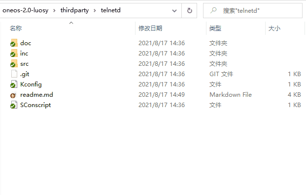
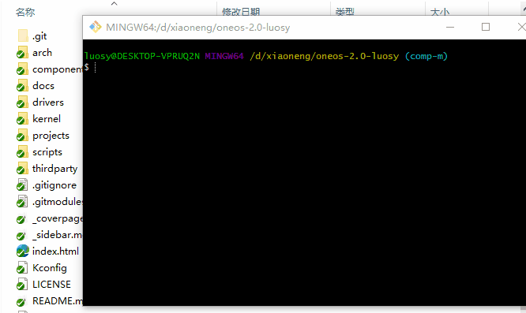
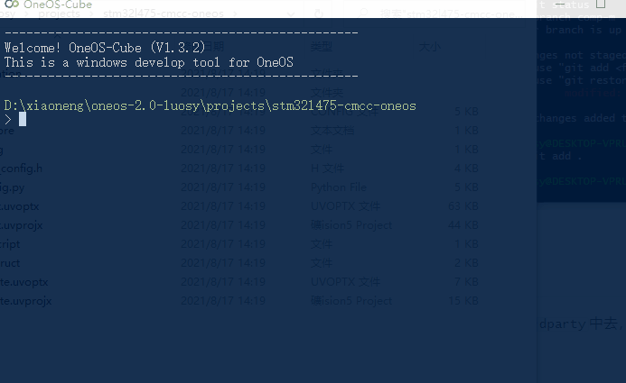

# 组件生态

## 简介

组件生态，是`OneOS Lite`非常重要的聚焦点。依托于原生组件，`OneOS Lite`提供基本的运行，联网，固件升级，测试等功能。而依托于组件生态，极大地丰富了组件的种类和使用场景。所有的开发者们，皆可以给`OneOS Lite`贡献组件代码，让大家一起欣赏你的成果。

在组件生态`thirdparty`中的组件，以子模块`submodule`的方式进行管理。这种使用`git submodule`管理子模块的方式，有它独有的优势。个人开发者，想使用某个组件很方便，不管是提交组件，使用组件，查阅组件，均通过git工具命令，无需学习新的命令。非常简单、快捷、高效！

接下来，我们会从以下几个方面，告知开发者，如何方便地使用组件生态：

1. 如何检索组件生态中的组件
2. 如何获取组件生态中的组件
3. 如何向组件生态贡献自己的组件
4. 如何把组件生态中的组件加入编译
5. 如何删除组件生态中的废弃组件

## 检索组件

该命令`git submodule`可以查看组件生态中，已有的贡献组件。

```
$ git submodule
-ba2c4170016ff14db298c5e87134704996c5aff5 thirdparty/cJSON
-e99c7b71349f74804eb215c59fa426bf5a357d8f thirdparty/telnetd
```

拿以上举例：

- `-`代表该子模块组件源码文件还未检入（空文件夹），没有`-`代表已检入；
- `e99c7b71349f74804eb215c59fa426bf5a357d8f`代表该子模块组件和`OneOS Lite`所关联的版本id；
- `thirdparty/telnetd`代表该子模块组件对应的目录和其组件名称。

## 获取组件

使用`git clone`是不会把子模块组件源码文件检入的，只会把拉取下来对应子模块组件的空文件夹。这时，如果需要使用某个子模块组件，可以使用以下命令：

```
git submodule init
git submodule update xxx(子模块组件名，可通过git submodule查看已有的贡献组件)
```

举个栗子：

```
$ git submodule init
Submodule 'thirdparty/cJSON' (git@10.12.3.198:luoshunyuan/cJSON.git) registered for path 'thirdparty/cJSON'
Submodule 'thirdparty/telnetd' (git@10.12.3.198:luoshunyuan/telnetd.git) registered for path 'thirdparty/telnetd'
```

```
$ git submodule update thirdparty/telnetd
Cloning into 'D:/xiaoneng/oneos-2.0-test/thirdparty/telnetd'...
Authorized users only. All activity may be monitored and reported.
Submodule path 'thirdparty/telnetd': checked out 'e99c7b71349f74804eb215c59fa426bf5a357d8f'
```

如果需要获取所有子模块组件，可以直接使用`git submodule update`。

## 贡献组件

通过项目根目录下的一个`.gitmodules`文件，可以发现已经贡献的组件，每添加一个子模块组件就会新增一条记录。内容如下：

```
[submodule "thirdparty/telnetd"]
	path = thirdparty/telnetd
	url = git@10.12.3.198:luoshunyuan/telnetd.git
[submodule "thirdparty/cJSON"]
	path = cJSON
	url = git@10.12.3.198:luoshunyuan/cJSON.git
```

继续贡献组件可以使用如下`git`命令，这里以`telnetd`为例：

```bash
git submodule add git@10.12.3.198:luoshunyuan/telnetd.git thirdparty/telnetd
```

如果需要更改组件，可先在对应的贡献组件目录中，打开`git`命令行，进入对应贡献组件的git仓库管理，并执行代码提交操作：



因为修改了子模块组件代码并提交了，但是主项目的指针依旧指向那个老的`commit id`，如果不提交这个修改的话，别人拉取主项目并且使用`git submodule update`更新子模块还是会拉取到修改前的代码。

因此，这时候需要把主项目进行提交更新。




## 组件配置

获取到的组件会被放到`thirdparty`中去，通过`menuconfig`和原生组件一样进行配置，并无任何差异。




## 删除废弃组件

当某些组件已废弃，需要删除的时候，`git`没有直接删除子模块的命令，所以只能逐步删除相关文件：

1. 在版本控制中删除子模块：

   `git rm -r thirdparty/cJSON`

2. 在编辑器中删除`.gitmodules`相关内容：

   ```
   [submodule "thirdparty/cJSON"]
   	path = thirdparty/cJSON
   	url = git@10.12.3.198:luoshunyuan/cJSON.git
   ```

3. 在编辑器中删除`.git/config`相关内容：

   ```
   [submodule "thirdparty/cJSON"]
   	url = git@10.12.3.198:luoshunyuan/cJSON.git
   	active = true
   ```

4. 删除`.git`下的缓存模块：

   ```
   rm -rf .git/modules/thirdparty/cJSON
   ```

5. 提交修改：

   ```
   git commit -am "delete submodule"
   git push
   ```

   

